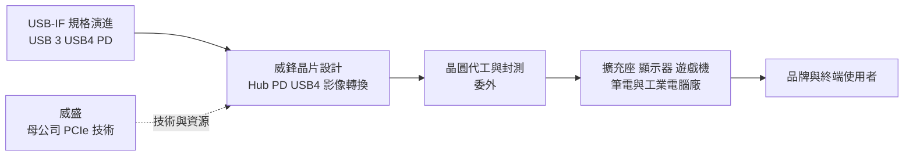
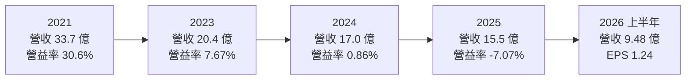
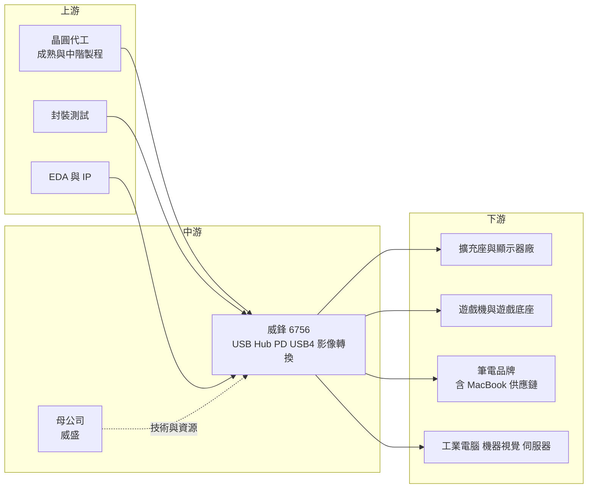

# 6756 威鋒電子

> 上市｜[[產業索引-半導體業|半導體業]]｜上市（櫃）日期 2020/12/24

# 第一章：企業模式與商業藍圖

> [!info] 撰寫說明
> 本文由 Claude 依公開資料整理，架構比照 [[2330台積電]] 的四章研究，資料截至 2026-10-08。財務數字來源：Goodinfo 年度經營績效頁、nStock 公司概況頁、Yahoo 股市公司基本資料、富果研究 2025 年 5 月法說會整理、工商時報 2026 年 5 月報導、中時旺得富 2026 年 3 月新品報導；產業描述為整理性內容，尚未逐條比對原始文件。#待校對

在評估單一個股的長期投資價值時，首要步驟是拆解企業的底層獲利邏輯。本章針對威鋒電子（股票代號：6756，以下簡稱威鋒）的商業模式進行定性分析，說明這家 [[2388威盛]] 旗下的 USB 介面晶片公司，如何靠 USB Type-C 普及與遊戲機訂單在 2021 年達到獲利高峰，又為什麼在之後幾年營收萎縮、本業轉為虧損。

## 一、核心定位：威盛集團的 USB 與 Type-C 介面晶片公司

威鋒成立於 2008 年 7 月，2019 年 12 月登錄興櫃，2020 年 12 月上市。依 nStock，母公司威盛電子持股約 55.73%，董事長為威盛董事長陳文琦，總經理為林志峰。威鋒是 [[Fabless]] 型態的 IC 設計公司，專注 USB 與 [[USB Type-C]] 系列控制晶片。

USB 是電腦與周邊之間最普遍的連接介面。當筆電越做越薄、連接埠越來越少，使用者需要擴充座（[[Docking Station]]）或集線器，把一個 Type-C 埠擴充成多個 USB、HDMI、網路埠；而 Type-C 同時承載資料傳輸、影像輸出與充電，需要控制晶片在背後協商。威鋒的產品就是這些擴充與協商功能背後的晶片，包括 [[USB Hub]] 集線器控制晶片、[[USB PD]] 快充控制晶片、影像轉換晶片，以及新一代 [[USB4]] 裝置端晶片。

威鋒的技術根基來自威盛。威盛過去是 PC 晶片組與處理器廠，在高速介面與 [[PCIe]] 有長期積累。工商時報報導指出，威鋒以 PCIe 為核心 IP 之一，產品支援 PCIe Gen4，並把這些能力應用在 USB4 與 PCIe 相關產品開發上。

## 二、終端應用／產品板塊

威鋒沒有公開完整的產品別營收比重，因此本文不畫營收圓餅圖。依法說會與媒體報導，主要板塊如下：

* **USB Type-C Hub：** 營收主力產品，應用於擴充座、顯示器、筆電與遊戲機底座。富果研究整理的 2025 年法說會提到，威鋒是任天堂第一代 Switch 的主要供應商，Switch 2 則預期以第二供應商身分、較小的份額供貨。這說明遊戲機曾是威鋒的重要營收來源，也說明單一大客戶的世代轉換會大幅影響營收。
* **USB4 晶片：** USB4 裝置端晶片已通過認證，2025 年第三季起隨大型筆電客戶量產，2025 年占營收個位數百分比，公司預期之後比重提高。依工商時報 2026 年 5 月報導，已有產品切入新一代 MacBook 相關供應鏈，需求優於原先預期。
* **影像與 PD 晶片：** [[DisplayPort]] Hub、DP 轉 HDMI 轉換晶片，以及 PD 控制晶片，常與 Hub 晶片組成擴充座或遊戲底座的參考設計，讓客戶一次採購整套方案。
* **[[工規]]產品：** 寬溫（攝氏 -40 至 85 度）的 USB 2.0、5Gbps 與 10Gbps 工規 Hub 已完成開發，2026 年起陸續送樣與量產，鎖定工業電腦、機器視覺、伺服器與智慧零售終端。

## 三、資本轉化邏輯：規格換代驅動的設計導入

威鋒的營運模式跟著 USB 規格換代走。每次 USB 規格升級（從 USB 3.x 到 USB4、PD 3.x 到新版快充），周邊廠就要重新設計產品並選擇晶片。威鋒若能在新規格初期取得認證與設計導入，就能在該規格的生命週期內持續出貨。

這個模式的好處是毛利率穩定。依 Goodinfo，威鋒近十年毛利率都在 45% 至 53% 之間，說明介面晶片的技術與認證門檻讓它有定價能力。壞處是營收波動大：當某一代規格成熟、價格下滑，或大客戶產品世代轉換時，營收會明顯下降，而研發費用是固定的。威鋒 2021 年營收 33.7 億元、營業利益率 30.6%，到 2025 年營收剩 15.5 億元、營業利益率 -7.07%，就是這種營運槓桿反向作用的結果。

## 四、企業長期藍圖：USB4、工規與新應用

* **USB4 與 PCIe：** USB4 整合了 PCIe 與 DisplayPort 通道，是 USB 規格的下一個大世代。威鋒憑藉威盛的 PCIe 技術，投入 USB4 與 PCIe 相關產品，切入 MacBook 等高階筆電供應鏈，是重建營收規模的核心。
* **工規市場：** 公司認為工業產品認證時間較長，但生命週期與毛利率優於消費性產品，是重要成長動能。工規 Hub 採腳位相容設計，可降低客戶的重新設計成本。
* **新應用：** 積極切入顯示器、機器人與無人機等應用，多項專案進行中，待客戶產品上市後逐步放量。
* **設計驗證與客製服務：** 公司把設計驗證標準由 98% 提高到 100%，以減少晶片改版與上市時間；也評估為海外公司提供客製晶片設計服務，以因應美中貿易摩擦下的供應鏈調整。

# 第二章：護城河深度與競爭優勢

在長期價值投資中，「護城河」指企業抵禦競爭、維持超額利潤的保護機制。本章分析威鋒的護城河構成、全球主要競爭對手，以及這些優勢能否撐住規格換代與客戶轉換。

## 一、護城河的核心組成要素

威鋒的護城河屬於「技術認證型窄護城河」，能維持毛利率，但無法保證營收規模。

* **1. 高速介面的技術積累：** USB4、PCIe 這類高速介面需要深厚的訊號完整性與協定設計能力。威鋒背靠威盛數十年的 PC 晶片經驗，在高速傳輸 IP 上有長期累積，這是新進者短期內難以複製的。
* **2. 規格認證與相容性：** USB 晶片要通過 USB-IF 認證，還要與各家主機、裝置互相相容。擴充座、遊戲機底座要連接成千上萬種周邊，相容性問題的處理經驗，是客戶選擇供應商的重要考量。
* **3. 整套方案銷售：** 威鋒同時提供 Hub、PD、影像轉換與 USB4 晶片，可以組成完整的擴充座參考設計，讓客戶減少整合與驗證時間。

## 二、全球主要競爭對手格局

| 對手 | 定位 | 對威鋒的威脅 |
|---|---|---|
| [[2379瑞昱]] | 台灣大型 IC 設計公司，介面、網通與影像晶片產品線完整 | 法說會點名的 DP Hub 競爭者，以規模與整合度搶擴充座市場 |
| [[6104創惟]] | 台灣 USB Hub 與讀卡機晶片業者 | USB Hub 市場最直接的競爭對手 |
| [[5269祥碩]] | 台灣高速介面晶片公司，USB4 與 PCIe 主機端晶片 | 在 USB4 與 PCIe 高階介面市場競爭 |
| [[4966譜瑞-KY]] | 台灣高速傳輸與顯示介面晶片公司 | 在 Type-C 影像、Re-driver 與擴充座晶片重疊 |
| 新思科技 [[SNPS新思科技]] | 高速介面 IP 供應商 | 法說會點名的 DP Hub 競爭者，以 IP 授權讓大廠自行整合 |
| 德州儀器、英飛凌（Cypress） | 國際 PD 與 Type-C 控制晶片大廠 | 在 PD 控制晶片市場具規模與品牌優勢 |

瑞昱與新思科技為法說會點名的競爭者，其餘為依產業結構整理的常見競爭者（推估）。

## 三、優勢轉化：守得住／守不住／觀察重點

* **守得住：** 需要高相容性、整套方案的擴充座與遊戲機底座，以及寬溫、長生命週期的工規 Hub。這些市場重視穩定與相容，威鋒的技術與方案能力可以維持四成五以上的毛利率。
* **守不住：** 大客戶的獨家地位。Switch 2 由主要供應商轉為第二供應商，顯示大客戶在新世代產品會引進更多供應商分散風險；成熟規格的 Hub 晶片也會面臨同業與中國業者的價格競爭。
* **觀察重點：** 第一，USB4 與 MacBook 相關產品能否讓營收回到 20 億元以上，使營業利益重新轉正；第二，工規產品在 2026 年下半年量產後的實際貢獻；第三，公司能否在晶圓與封測漲價下，把毛利率維持在 45% 至 48% 的目標區間。

# 第三章：財務體質與盈利規模

資料日期：2026-10-08。數字取自 Goodinfo 年度經營績效頁、nStock 公司概況頁與工商時報報導，表格是撰寫當時的快照；最新月營收、毛利率、累計 EPS 由自動排程寫在本筆記的屬性欄位（月營收、毛利率、累計EPS 等）。#待校對

財務報表是檢驗護城河是否真實存在的最終標準。本章用十年的三率、[[ROE]] 與資本報酬，檢視威鋒穩定的毛利率能否轉化為穩定的股東報酬。

## 一、獲利能力的基石：三率

| 年度 | 營收（新台幣） | [[毛利率]] | [[營業利益率]] | EPS（元） | [[ROE]] |
|---|---|---|---|---|---|
| 2016 | 8.27 億 | 52.5% | 4.37% | 0.08 | 1.05% |
| 2017 | 11.9 億 | 47.9% | 11.2% | 2.10 | 20.4% |
| 2018 | 12.0 億 | 49.1% | 10.6% | 2.07 | 18.9% |
| 2019 | 15.9 億 | 51.8% | 17.7% | 4.05 | 30.7% |
| 2020 | 19.7 億 | 48.8% | 19.6% | 5.29 | 18.3% |
| 2021 | 33.7 億 | 53.3% | 30.6% | 13.04 | 30.3% |
| 2022 | 29.5 億 | 52.3% | 24.0% | 10.56 | 22.7% |
| 2023 | 20.4 億 | 45.8% | 7.67% | 2.62 | 5.98% |
| 2024 | 17.0 億 | 50.0% | 0.86% | 2.26 | 5.29% |
| 2025 | 15.5 億 | 48.5% | -7.07% | 1.11 | 1.88% |
| 2026 上半年 | 9.48 億 | 44.3% | -3.54% | 1.24 | 4.83%（年化） |

威鋒的十年數據最值得注意的是「毛利率穩定、營業利益率劇烈波動」。毛利率始終在 45% 至 53% 之間，證明產品有技術價值；但營業利益率從 2021 年的 30.6% 一路降到 2025 年的 -7.07%，原因是營收從 33.7 億元縮小到 15.5 億元，研發費用卻沒有同比例下降。2026 年上半年營收 9.48 億元，年化約 19 億元，已較 2025 年回升，營業利益率虧損幅度縮小。

* **[[毛利率]]：** 長期中樞約 48% 至 50%，公司目標維持在 45% 至 48%。2025 年第一季曾因庫存評價回沖使毛利率偏高（約 54%），屬一次性因素。
* **[[營業利益率]]：** 2024 至 2025 年本業接近損益兩平或虧損，但 EPS 仍為正，推估來自帳上現金的利息收入等業外收益（推估）。評估威鋒本業時，應以營業利益為準。
* **長期指標：** 2020 至 2025 年營收年複合成長率約 -4.7%（推算），近五年（2021 至 2025）平均 ROE 約 13.2%（推算），但呈逐年下降。

## 二、[[ROE]]：資本效率

威鋒的 ROE 在 2017 至 2022 年長期維持在 18% 至 31%，2023 年起降到個位數，2025 年只有 1.88%。以 2025 年稅後淨利 0.78 億元、ROE 1.88% 回推，平均股東權益約 41.5 億元（推算）。股本自 2020 年上市後由 6 億元增加到約 7 億元，權益主要來自上市募資與過去幾年的獲利累積。ROE 下滑的主因是營收萎縮造成本業轉虧，而不是資本結構改變。

## 三、資本支出與自由現金流

威鋒屬於輕資產 IC 設計公司，資本支出主要是研發設備、光罩與 IP 授權，具體金額未查得。2021 至 2022 年的高獲利期間累積了相當的現金，[[自由現金流]]在多數年份推估為正（推估）；2025 年本業虧損，營業現金流推估轉弱（推估）。

股利方面，依 nStock，威鋒近五年平均現金股利約 4.64 元，但 2024 年度只配發 1.8 元，2025 年度配發 0.9 元。股利隨獲利大幅下降，屬於「好年配得多、壞年配得少」的類型，穩定度不高。

## 四、[[ROIC]] 與 [[WACC]]：價值創造利差

**ROIC 推算：** 2025 年營業虧損約 1.10 億元（15.5 億 × -7.07%），虧損不計稅，投入資本以平均股東權益約 41.5 億元計算，有息負債未查得、IC 設計公司通常不重大，視為零（推估），ROIC 約 -2.6%（推算）。對照 2022 年：營業利益約 7.08 億元（29.5 億 × 24.0%），稅後約 5.66 億元，權益約 31.9 億元（7.24 億 ÷ 22.7%），ROIC 約 17.8%（推算）。

**WACC 推算：** 權益成本以 CAPM 估計，假設台灣 10 年期公債殖利率 1.75%、市場風險溢酬 6%，β 未查得來源數字，採 PC 介面 IC 設計股常見值 1.1，權益成本約 8.35%。有息負債不重大，WACC 約 8.35%（推算）。

**結論：** 威鋒在 2017 至 2022 年的 ROIC 長期高於 WACC，是價值創造期；2023 年起利差轉負，2025 年約為負 11 個百分點（推算）。毛利率證明技術仍有價值，問題在於營收規模不足以攤提研發費用。威鋒要重新創造價值，關鍵在 USB4、MacBook 相關產品與工規 Hub 能否把營收拉回 20 億元以上，使營業利益率回到正的兩位數。

# 第四章：總體風險與地緣政治

任何企業都無法脫離宏觀環境獨立存在。本章分析威鋒未來必須面對的地緣政治、產業週期、營運與技術風險。

## 一、地緣政治

* **美國關稅與產地轉移：** 依 2025 年法說會，客戶銷往美國的比重低於 25%，客戶正把生產移往越南、墨西哥或美國。關稅本身對威鋒的直接影響推估有限，但客戶遷廠期間的訂單節奏可能變動。
* **中國周邊市場的本土化：** 擴充座、Hub 等周邊產品大量在中國生產，中國業者在政策鼓勵下可能改用本土 USB 晶片，壓縮中低階市場空間。
* **台灣生產集中：** 晶圓製造與封測依賴台灣，面臨與其他台灣半導體公司相同的兩岸風險。

## 二、產業週期與市場結構

* **PC 與周邊的景氣循環：** 威鋒的應用集中在筆電、擴充座、顯示器與遊戲機，與 PC 換機潮和庫存循環高度相關。2023 年以後的營收下滑，部分反映的就是疫情後 PC 需求反轉。
* **遊戲機世代週期：** 遊戲機訂單集中在新機推出前後，且大客戶可能在新世代調整供應商比重。Switch 2 由主要供應商轉為第二供應商，就是這種風險的實例。
* **[[長鞭效應]]：** 周邊產品通路長、品牌多，終端需求轉弱時，通路與 ODM 同時去庫存，傳到晶片端的訂單降幅被放大。

## 三、營運環境的隱性風險

* **晶圓與封測漲價：** 依工商時報報導，AI 需求排擠成熟製程產能，晶圓代工與封測報價上揚，PC 相關晶片供應也受擠壓。威鋒已表示部分產品將反映成本，但若轉嫁不順，毛利率會受壓。
* **母公司關係：** 威盛持股過半，威鋒的策略方向與資源分配受母公司影響。母子公司間的技術合作是優勢，但也可能出現關係人交易與少數股東權益的問題。
* **匯率：** 產品以美元計價，新台幣升值會影響營收與毛利。公司表示大部分成本也以美元計價，有部分自然避險效果。

## 四、科技或法規演進

* **主晶片整合 USB 功能：** 處理器與晶片組持續整合更多 USB 與 Thunderbolt 埠，可能減少外加 Hub 與控制晶片的需求，這是介面晶片產業長期存在的「被整合」風險。
* **USB4 普及速度：** USB4 的滲透率取決於主機端（處理器平台）與裝置端的同時普及。若普及慢於預期，威鋒在 USB4 的研發投入回收期會拉長。
* **歐盟統一充電口法規：** 歐盟要求電子產品統一採用 USB-C 接頭，長期有利於 Type-C 與 PD 晶片需求，但也吸引更多競爭者投入，可能壓低成熟產品的價格。

# 專有名詞解析

## 半導體

- **[[USB Hub]]**：USB 集線器控制晶片，把一個 USB 連接埠擴充成多個埠，用於擴充座、顯示器與主機板。
- **[[USB Type-C]]**：正反面皆可插的 USB 接頭規格，同時支援資料傳輸、影像輸出與充電，已成為主流介面。
- **[[USB PD]]**：USB Power Delivery 快充協定，讓裝置透過 Type-C 協商充電電壓與電流，需要專用控制晶片。
- **[[USB4]]**：新一代 USB 規格，傳輸速度可達 40Gbps 以上，並整合 PCIe 與 DisplayPort 通道。
- **[[PCIe]]**：PCI Express 高速匯流排標準，連接處理器與顯示卡、固態硬碟等元件。
- **[[DisplayPort]]**：數位影像傳輸介面標準，可透過 Type-C 線路輸出影像到外接螢幕。
- **[[Fabless]]**：只做晶片設計、把製造委外給晶圓代工廠的商業模式。

## 應用

- **[[Docking Station]]**：擴充座，透過一條 Type-C 線把筆電連接到多個螢幕、USB 裝置、網路與電源。
- **[[工規]]**：工業規格產品，需在寬溫、長時間運作等嚴苛條件下穩定工作，生命週期與毛利通常高於消費性產品。

## 金融

- **[[ROE]]**：股東權益報酬率，稅後淨利除以股東權益，衡量公司用股東的錢賺錢的效率。
- **[[ROIC]]**：投入資本報酬率，稅後營業利益除以股東權益加有息負債，衡量本業運用全部資本的效率。
- **[[WACC]]**：加權平均資金成本，股東與債權人要求報酬率的加權平均，ROIC 高於它才算創造價值。
- **[[自由現金流]]**：營業活動現金流減去資本支出，代表企業可自由用於配息、還債或併購的現金。
- **[[長鞭效應]]**：終端需求的小幅變動，沿供應鏈往上游傳遞時被逐級放大，造成上游庫存與訂單劇烈波動。

# 核心供應鏈

## 1. 上游：晶圓代工、封測與設計工具
- 晶圓代工與封測：具體合作對象未查得（公司表示晶圓代工與封測報價上漲）
- 設計工具與 IP：[[SNPS新思科技]]、[[CDNS益華電腦]]

## 2. 中游：威鋒本身與母公司
- 母公司：[[2388威盛]]（持股約 55.73%）

## 3. 下游：主要客戶與應用
- 遊戲機：任天堂（Switch 1 主要供應商、Switch 2 第二供應商，依 2025 年法說會）
- 筆電：大型筆電客戶的 USB4 產品，以及新一代 MacBook 相關供應鏈（[[AAPL蘋果]]，依 2026 年報導）
- 擴充座、顯示器、遊戲掌機周邊與工業電腦廠（個別客戶未揭露）

## 4. 同業與競爭者
- 台灣：[[2379瑞昱]]、[[6104創惟]]、[[5269祥碩]]、[[4966譜瑞-KY]]
- 國外：新思科技（IP）、德州儀器、英飛凌

## 最新新聞
<!-- news:start -->
<!-- news:end -->

## 相關連結
- [公開資訊觀測站](https://mopsov.twse.com.tw/mops/web/t05st03?step=1&firstin=1&co_id=6756)
- [Goodinfo](https://goodinfo.tw/tw/StockDetail.asp?STOCK_ID=6756)
- [Yahoo 股市](https://tw.stock.yahoo.com/quote/6756)
- [鉅亨網新聞](https://www.cnyes.com/twstock/6756/news)
