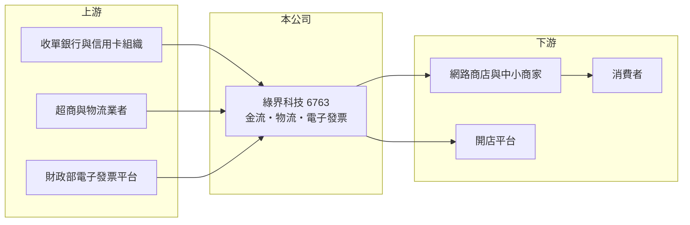

# 6763 綠界科技

> 上櫃｜[[產業索引-數位雲端|數位雲端]]｜上市（櫃）日期 2022/03/15

# 第一章：企業模式與商業藍圖

> [!info] 撰寫說明
> 精簡版，由 Claude 依公開資料整理，架構比照 [[2330台積電]]，資料截至 2026-10-08。來源：櫃買中心開放資料（基本資料、資產負債、綜合損益、本益比殖利率）、Goodinfo 年度經營績效、MoneyDJ 公司基本資料（營收比重、股利）、富果研究整理的騰雲法說內容（同業描述）。服務項目為整理性描述，尚未逐條比對原始文件。#待校對

本章說明綠界科技（6763）作為[[第三方支付]]業者的商業模式。

- **核心業務：** 綠界科技成立於 1996 年，2022 年 3 月上櫃，董事長兼總經理林雪慧，總部在台北南港。公司替網路商店與中小商家提供一站式的金流、物流與[[電子發票]]服務：消費者可以用信用卡、ATM 轉帳、超商代碼等方式付款，商家則透過綠界串接超商取貨與宅配，並自動開立電子發票。依 MoneyDJ 2025 年資料，全方位金物流服務占營收 94.6%。
- **營收結構：** 收入主要是依交易金額收取的手續費，以及物流與發票的單筆服務費。這種模式的營收和電商交易量直接連動，商家越多、交易越多，平台的固定成本就越能被攤薄。[[毛利率]]長期在 41% 至 44%。
- **資本結構：** 依櫃買中心資料，實收資本額約 1.84 億元，但每股淨值 16.2 元、權益約 29.8 億元，推算流通股數約 1.84 億股，推估每股面額已改為 1 元，因此 2024 年起的 EPS 與過去不能直接比較。
- **長期方向：** 台灣電商滲透率仍在提升，中小商家需要的是「一次串接就能收款、出貨、開發票」的工具，這是綠界的長期需求基礎。公司的課題是在電子支付法規與大型平台自建金流的壓力下，維持商家數量與交易量的成長。

# 第二章：護城河深度與競爭優勢

本章分析綠界科技的護城河。

- **競爭優勢：** 綠界最大的優勢是長期累積的商家數量與整合度。開店平台、購物車外掛與會計系統大多已預先串接綠界，商家導入成本很低；而商家一旦把金流、物流與發票都綁在同一個後台，更換服務商需要重新對帳與調整流程，轉換成本高。交易量大也讓綠界和銀行、超商談判時更有籌碼。
- **主要對手：** 第三方支付同業包括藍新、紅陽，以及 [[2412中華電]] 等業者的支付服務；開店平台 [[674191APP-KY]] 與 SHOPLINE 也提供自有金流；大型電商平台與行動支付（LINE Pay、街口）則在消費端競爭。
- **觀察重點：** 第一是營業利益率由 2021 至 2022 年的 28% 降到 2025 年的 22%，是否反映手續費率競爭。第二是代收款規模與利息收入的變化。第三是電子支付相關法規修改對業務範圍的影響。

# 第三章：財務體質與盈利規模

資料日期：2026-10-08，表格是撰寫當時的快照；最新月營收、毛利率、累計 EPS 由自動排程寫在本筆記的屬性欄位（月營收、毛利率、累計EPS 等）。#待校對

本章用多年度數字檢視綠界科技的成長與獲利品質。2024 年起 EPS 數字下降主要是股數變動，並非獲利大減。

| 年度 | 營收（新台幣） | [[毛利率]] | [[營業利益率]] | EPS（元） | [[ROE]] |
|---|---|---|---|---|---|
| 2021 | 14.1 億 | 43.3% | 28.3% | 21.42 | 75.9% |
| 2022 | 15.0 億 | 44.2% | 28.3% | 20.86 | 24.4% |
| 2023 | 15.5 億 | 42.2% | 27.1% | 21.66 | 14.9% |
| 2024 | 16.0 億 | 41.2% | 23.8% | 1.94 | 12.6% |
| 2025 | 17.4 億 | 41.7% | 22.3% | 4.21 | 25.7% |

- **營收規模：** 2020 年營收 10.2 億元，2020 至 2025 年營收年複合成長率約 11.3%。依櫃買中心資料，2026 年上半年營收約 9.3 億元、EPS 1.08 元。
- **獲利：** 近五年平均 ROE 約 30.7%，但 2021 年是上櫃前股本較小時的數字，2022 年上櫃增資後降到 15% 至 25%。2025 年 EPS 對應的淨利明顯高於本業營業利益，推估有一次性的業外收益（細節未查得）。
- **財務特色：** 2026 年第二季歸屬母公司權益約 29.8 億元；流動負債約 43.0 億元，推估大部分是替商家代收、尚未撥付的款項，不是借款。依 MoneyDJ，股利隨面額變動前後分別為每股 15 至 18 元與 1.6 至 3 元，換算後配息穩定。
- **[[ROIC]] 與 [[WACC]]：** 2025 年營業利益約 3.88 億元（17.4 億 × 22.3%），稅後約 3.10 億元；投入資本以股東權益 29.8 億元加上以非流動負債 0.9 億元近似的有息負債（代收款不計），約 30.7 億元，ROIC 約 10.1%（推算）。WACC 以 CAPM 推估：無風險利率 1.75%、市場風險溢酬 6%、β 用常見值 0.9，股東權益成本約 7.15%；幾乎無有息負債，WACC 約 7.0%（推算）。ROIC 高於 WACC，且股東權益中有大量現金，扣除後本業的資本報酬更高，屬於創造價值的商業模式。

# 第四章：總體風險與地緣政治

本章整理綠界科技長期必須面對的風險。

- **產業週期：** 營收和電商交易量連動，消費景氣轉弱或電商成長放緩時，手續費收入會同步減少。不過金流是電商的基礎設施，需求波動通常小於消費品本身。
- **營運風險：** 金流業者是詐騙與洗錢防制的前線，若被不法商家利用，可能面臨主管機關裁罰與銀行合作中斷。系統中斷或資安事件會直接影響數十萬商家的收款，對信譽傷害很大。
- **其他風險：** 電子支付與第三方支付法規持續修訂，代收款的管理、信託與資本要求可能提高營運成本；大型平台自建金流、行動支付普及，則可能壓縮手續費率。

# 專有名詞解析

## 應用

- **[[電子發票]]**：以電子方式開立與存證的統一發票，台灣電商普遍採用，常與金流服務整合。

## 金融

- **[[第三方支付]]**：在買家與賣家之間代收代付款項的服務，降低網路交易中雙方互不信任的風險。
- **[[ROIC]]**：投入資本報酬率，稅後營業利益除以投入資本，衡量本業運用資金創造報酬的能力。
- **[[WACC]]**：加權平均資金成本，股東與債權人要求報酬率的加權平均，ROIC 高於 WACC 才代表創造價值。

# 核心供應鏈

- 上游：收單銀行與信用卡組織、四大超商與宅配物流業者、財政部電子發票整合服務平台。
- 下游／客戶：網路商店、社群賣家、中小商家與開店平台。
- 同業：藍新、紅陽等第三方支付業者，以及 [[674191APP-KY]]、[[6870騰雲]]。

## 最新新聞
<!-- news:start -->
<!-- news:end -->

## 相關連結
- [公開資訊觀測站](https://mopsov.twse.com.tw/mops/web/t05st03?step=1&firstin=1&co_id=6763)
- [Goodinfo](https://goodinfo.tw/tw/StockDetail.asp?STOCK_ID=6763)
- [Yahoo 股市](https://tw.stock.yahoo.com/quote/6763)
- [鉅亨網新聞](https://www.cnyes.com/twstock/6763/news)
