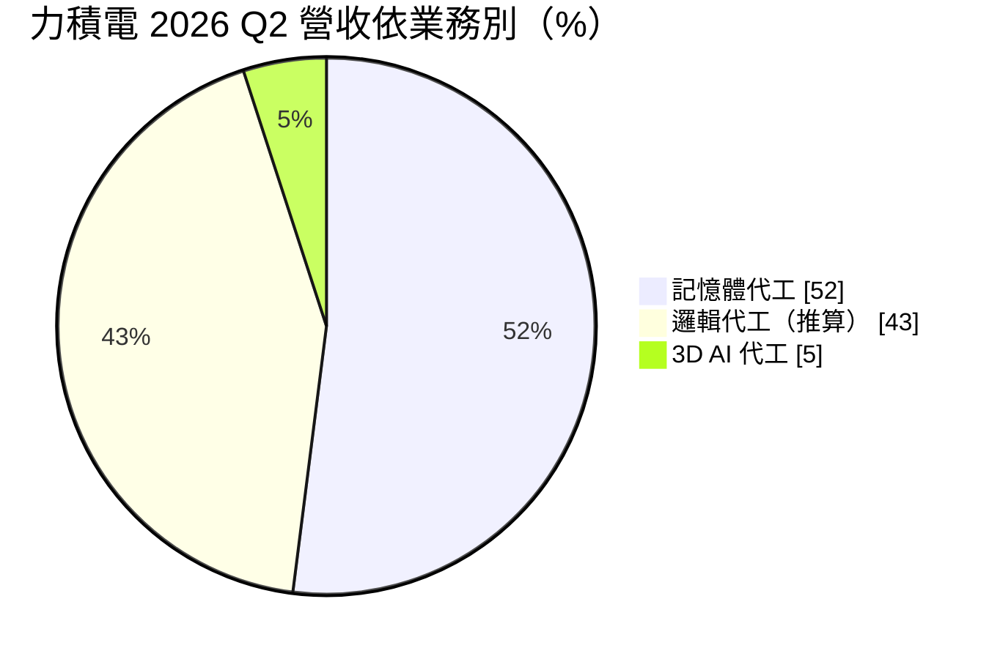
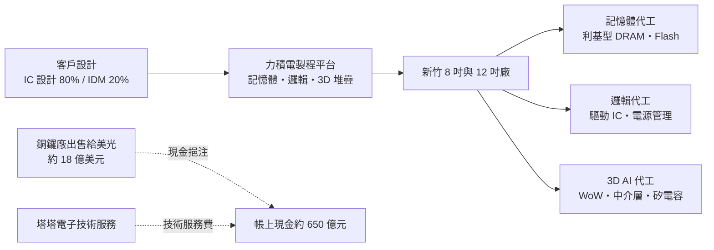
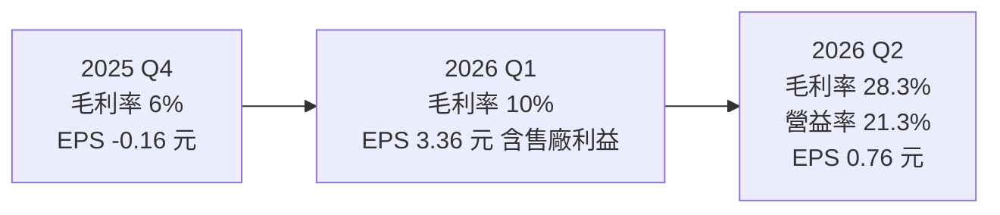
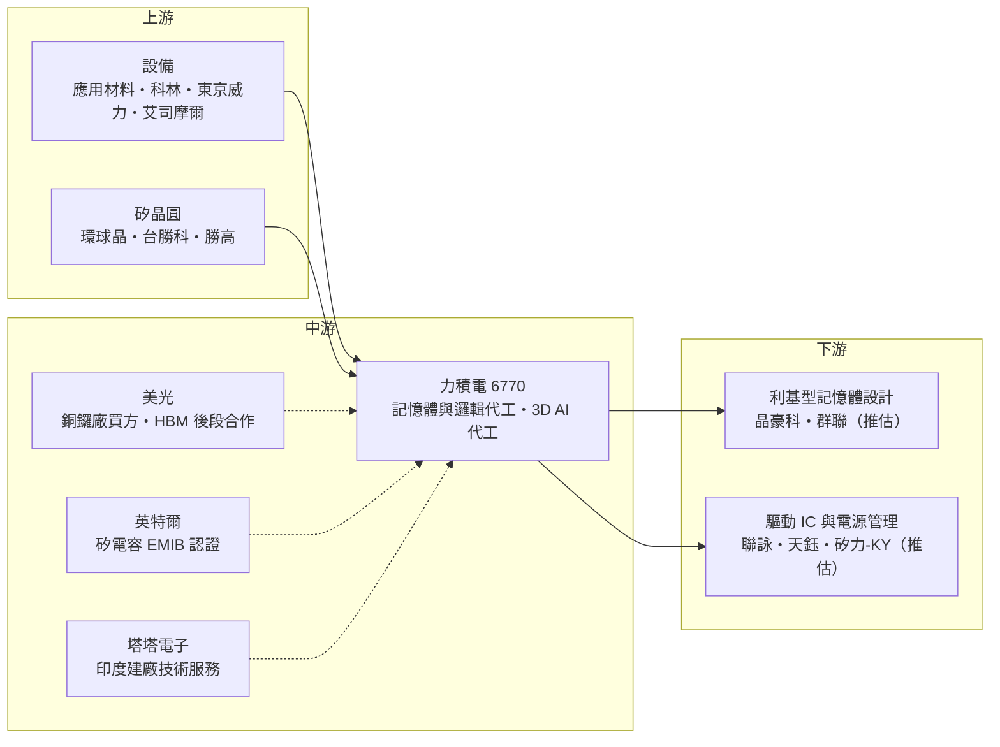

# 6770 力積電

> 上市｜[[產業索引-半導體業|半導體業]]｜上市（櫃）日期 2021/12/06

# 第一章：企業模式與商業藍圖

> [!info] 撰寫說明
> 本文由 Claude 依公開資料整理，架構比照 [[2330台積電]] 的四章研究，資料截至 2026-10-07。財務數字來源：力積電 2025 年第四季、2026 年第一季與第二季法說會報導（股感、優分析、工商時報／旺得富、科技新報）、5 月營收快訊（科技新報）；產業描述為整理性內容，尚未逐條比對原始文件。#待校對

在評估單一個股的長期投資價值時，首要步驟是拆解企業的底層獲利邏輯。本章針對力晶積成電子製造（股票代號：6770，以下簡稱力積電）的商業模式進行定性分析，說明它為何同時代工記憶體與邏輯晶片、銅鑼廠出售如何改變財務體質，以及「3D AI 代工」轉型的商業意義。

## 一、核心定位：記憶體加邏輯的「雙棲」晶圓代工廠

力積電承接力晶集團的晶圓製造業務，董事長為黃崇仁，2021 年在台灣證交所上市。力積電與一般[[晶圓代工]]廠最大的不同，是同時代工 [[DRAM]]／Flash 等記憶體與邏輯晶片，也就是「記憶體代工加邏輯代工」雙軌並行。這源自力晶早年經營 DRAM 的背景，讓力積電擁有記憶體製程能力，能替沒有自有晶圓廠的[[利基型 DRAM]]設計公司生產。

依 2025 年第四季法說會資料，力積電客戶結構為 IC 設計公司約占 80%、[[IDM]] 廠約占 20%。這個定位有兩個商業意義：

* **獲利跟著記憶體報價擺盪：** 記憶體代工的價格與 DRAM 市場報價連動，景氣好時可以大幅漲價，景氣差時也會首當其衝。
* **邏輯代工是同質性較高的[[成熟製程]]：** 驅動 IC、電源管理等產品與中國同業高度重疊，價格競爭激烈，這是 2024 至 2025 年虧損的重要原因。

## 二、產品板塊：記憶體報價翻揚帶動結構改變

2026 年第二季的營收結構如下（邏輯代工比重由其餘兩項推算）：

* **記憶體代工：** 利基型 DRAM 與 Flash，客戶包括台灣的利基型記憶體設計公司。2026 年第二季因 DRAM 平均售價大幅提升，記憶體產品占營收比重從前一季約 33% 躍升至 52%。公司在 7 月將 DRAM 代工報價調漲約 45%。
* **邏輯代工：** 8 吋與 12 吋成熟製程，產品包括面板驅動 IC（[[DDI]]）、電源管理 IC、影像感測器與功率元件。2026 年 3 月起全面調漲 8 吋與 12 吋代工價格，7 月再調漲邏輯代工報價約 10% 至 15%。
* **3D AI 代工：** 這是力積電近年最重要的轉型方向，包括晶圓堆疊（[[WoW]]）、矽中介層（[[Interposer]]）與[[矽電容]]。2026 年第二季 3D AI 代工占營收比重由 3.2% 升至 5%，公司目標三年內提高到 20%。其中 12 吋高密度矽電容已通過 [[INTC英特爾]] [[EMIB]] 先進封裝認證並穩定出貨，計畫在 2027 年擴充到每月 1 萬片以上。

## 三、資本轉化邏輯：從新廠折舊拖累到現金充裕

力積電的產能集中在新竹科學園區（8 吋與 12 吋廠）與苗栗銅鑼。銅鑼新廠（P5）原本是力積電最大的擴產計畫，但投產後碰上成熟製程景氣下滑與中國同業低價競爭，新廠折舊成為 2024 年至 2025 年虧損的主因（2025 年第四季[[毛利率]] 6%，若排除 P5 廠則為 17%）。

2026 年初，力積電把銅鑼廠房分階段轉讓給美光（Micron），總價約 18 億美元，其中 13.6 億美元已於 2026 年 3 月入帳，尾款 4.4 億美元預計 2027 年底前到位。這筆交易一次性挹注 2026 年第一季獲利，也讓力積電從「新廠折舊拖累」轉為「現金充裕」，截至 2026 年第二季帳上現金約 650 億元。

## 四、企業長期藍圖：成為以 AI 為核心的專業代工廠

* **美光合作：** 除了出售廠房，力積電也協助美光開發 [[HBM]] 後段晶圓製造（PWF）代工，試產線預計 2026 年底完成、2027 年第四季量產；1P DRAM 製程設備合作預計 2027 年第一季啟動、2028 年中量產。
* **印度塔塔電子：** 力積電提供塔塔電子在印度建廠的技術服務，依 2025 年第四季法說會資料，技術服務費已累計入帳 1.43 億美元，採「先收款後執行」模式。
* **3D AI Foundry：** 聚焦晶圓堆疊、矽中介層、矽電容與功率元件，目標三年內占營收 20%。董事長黃崇仁形容這是力積電的「第四次轉型」。

# 第二章：護城河深度與競爭優勢

在長期價值投資中，「護城河」指企業抵禦競爭、維持超額利潤的保護機制。本章分析力積電的護城河構成、在記憶體與成熟邏輯代工兩個市場的主要對手，以及哪些業務能擺脫價格戰。

## 一、護城河的核心組成要素

力積電的護城河屬於「窄」，但近年正在建立新的差異化：

* **1. 記憶體製程能力：** 能同時代工 DRAM 與邏輯的晶圓廠不多，這讓力積電能服務利基型記憶體設計公司，並與美光合作 HBM 後段與 1P DRAM 製程。
* **2. 3D 堆疊與矽電容技術：** 12 吋矽電容通過英特爾 EMIB 認證，是力積電在[[先進封裝]]供應鏈的切入點；WoW 晶圓堆疊結合記憶體與邏輯，能做出高頻寬的 AI 記憶體方案。
* **3. 與國際大廠的合作綁定：** 美光（廠房收購、HBM 後段、1P DRAM）、英特爾（矽電容認證）、塔塔電子（技術服務）三項合作，讓力積電的收入來源不再只依賴成熟製程代工報價。

## 二、全球主要競爭對手格局

| 對手 | 定位 | 對力積電的威脅 |
|---|---|---|
| 中芯國際、華虹半導體、晶合集成 | 中國成熟製程代工，政策扶植擴產 | 在驅動 IC、電源管理以低價搶單 |
| [[2303聯電]]、[[5347世界先進]] | 台灣成熟製程同業 | 8 吋與 12 吋邏輯代工重疊 |
| [[2330台積電]] | 矽中介層與 [[CoWoS]] 絕對領先 | 力積電中介層業務只能補足台積電以外需求 |
| [[2344華邦電]]、[[2408南亞科]]、中國記憶體廠 | 自有晶圓廠的記憶體公司 | 影響利基型 DRAM 代工需求 |

## 三、優勢轉化：哪些市場守得住、哪些守不住

* **守得住：** 記憶體代工與 3D AI 代工的技術門檻較高，且有美光、英特爾等大廠背書。2026 年 DRAM 報價大漲讓記憶體代工成為獲利主力。
* **守不住：** 一般邏輯代工（驅動 IC、電源管理）同質性高，仍容易受中國同業價格戰影響。2025 年全年毛利率為負 3%，顯示在景氣低迷時力積電的成本結構缺乏防禦力。
* **觀察重點：** DRAM 報價能否在 2027 年維持高檔、3D AI 代工占比能否如期提升到 20%、美光 HBM 後段試產線能否在 2026 年底完成，以及失去銅鑼廠後的整體產能規劃。

# 第三章：財務體質與盈利規模

資料日期：2026-10-07。數字取自公司法說會與財經媒體整理（股感、優分析、工商時報／旺得富），表格是撰寫當時的快照；最新月營收、毛利率、累計 EPS 由自動排程寫在本筆記的屬性欄位（月營收、毛利率、累計EPS 等）。#待校對

財務報表是檢驗護城河是否真實存在的最終標準。本章用三率、ROE、現金流與資本報酬，檢視力積電從連續虧損到轉盈的過程，並區分一次性售廠利益與本業常態獲利。

## 一、獲利能力的基石：三率

| 項目 | 2025 全年 | 2025 Q4 | 2026 Q1 | 2026 Q2 |
|---|---|---|---|---|
| 營收（新台幣） | 467.3 億 | 124.95 億 | 135.72 億 | 172.9 億 |
| [[毛利率]] | -3% | 6% | 10% | 28.3% |
| [[營業利益率]] | 未查得 | 未查得 | 未查得（含售廠利益） | 21.3% |
| 稅後淨利 | 未查得 | -6.54 億 | 142.31 億 | 32.91 億 |
| EPS（元） | -1.86 | -0.16 | 3.36 | 0.76 |

* **2025 年：** 營收年增 4%，但毛利率轉為負 3%，全年每股虧損 1.86 元，主因是銅鑼新廠折舊與成熟製程報價疲弱。
* **2026 年第一季：** EPS 3.36 元，終結連續 10 季虧損，但大部分來自出售銅鑼廠的一次性利益；本業毛利率回升到 10%，[[產能利用率]] 88%。
* **2026 年第二季：** 營收季增 27.4%、年增 53.3%，毛利率 28.3%、營業利益率 21.3%，皆為近三年多新高，這才是真正反映本業改善的一季，主要來自 DRAM 報價大漲與邏輯代工漲價。
* **上半年：** 營收 308.62 億元，年增 37.8%，EPS 4.08 元。上半年營業利益率高達 58%，是因為售廠利益被計入營業項目，不代表本業常態。5 月單月營收 57.7 億元，連續兩個月站穩 50 億元以上。

## 二、[[ROE]]：資本效率

力積電在 2024 年至 2025 年連續虧損，ROE 為負值。2026 年因售廠利益與本業轉盈，ROE 會大幅轉正，但要區分一次性與常態性獲利。ROE 精確值本次未查得。出售銅鑼廠後資產規模縮小、現金增加，若本業獲利能維持第二季水準，資本效率會明顯改善（推估）。

## 三、資本支出與自由現金流

* **[[CapEx]]：** 2025 年第四季法說會提出 2026 年資本支出預算約 3 億美元，第二季報導則估約 4.88 億美元，遠低於銅鑼廠建廠期間。
* **[[自由現金流]]：** 銅鑼廠出售款 13.6 億美元已入帳，尾款 4.4 億美元預計 2027 年底前收到，帳上現金約 650 億元，財務結構大幅改善；資本支出降低後，本業現金流也較能轉為自由現金流（推估）。
* **股利：** 力積電因連年虧損，近年未配發股利。公司在 2026 年第二季法說會表示，預期 2027 年可望恢復配發股利，但仍須董事會決議，目前屬於公司預期，不宜視為確定。

## 四、[[ROIC]] 與 [[WACC]]：價值創造利差

銅鑼廠建廠期間，大量資本投入卻遇上報價下滑，ROIC 明顯低於 WACC，是典型的價值毀損期。出售廠房等於把低報酬資產變現，投入資本基數縮小；2026 年第二季本業營業利益率回到兩成以上，利差有機會轉正（推估，具體數值未查得）。後續關鍵是記憶體報價回落時，ROIC 能否仍維持在資金成本之上。

# 第四章：總體風險與地緣政治

任何企業都無法脫離宏觀環境獨立存在。本章分析力積電未來必須面對的地緣政治、記憶體與成熟製程週期、營運與技術風險。

## 一、地緣政治

* **中國成熟製程擴產：** 中國以政策支持大舉擴充成熟製程產能，是力積電邏輯代工最大的價格壓力來源。
* **美國供應鏈重組：** 與美光的合作讓力積電納入美系記憶體供應鏈，美國對中國記憶體與半導體的管制，可能增加力積電的合作機會。
* **印度布局：** 塔塔電子在印度的建廠計畫若延後或生變，技術服務收入會受影響。
* **台灣集中風險：** 主要產能都在台灣，面臨兩岸情勢、供電與用水等風險。

## 二、產業週期與市場結構

* **記憶體週期：** 2026 年第二季記憶體占營收 52%，獲利高度依賴 DRAM 報價。記憶體價格的波動遠大於邏輯代工，一旦 DRAM 報價反轉，力積電的毛利率會快速下滑。
* **成熟製程報價：** 邏輯代工漲價能否持續，取決於產能利用率與中國同業的報價策略。
* **[[長鞭效應]]：** 驅動 IC 與電源管理屬消費性應用，終端庫存調整會放大反映在代工投片。
* **匯率：** 以美元計價的營收與售廠款項受新台幣匯率影響。

## 三、營運環境的隱性風險

* **獲利品質：** 2026 年獲利有相當比重來自一次性售廠利益，2027 年起若無類似收益，EPS 會明顯回落。
* **合作執行風險：** 美光 HBM 後段與 1P DRAM 的時程分別在 2027 年與 2028 年，執行若延後，轉型效益會遞延。
* **產能規劃：** 出售銅鑼廠後，若 3D AI 代工與記憶體需求持續成長，力積電需要重新規劃擴產。

## 四、科技或法規演進

力積電的邏輯製程以成熟節點為主，3D 堆疊與矽中介層雖是新方向，但台積電、英特爾、三星在先進封裝上的投入規模遠大於力積電。力積電需要在利基市場（矽電容、記憶體與邏輯堆疊）找到不被大廠取代的定位，才能讓 3D AI 代工成為長期獲利來源。

# 專有名詞解析

## 半導體

- **[[DRAM]]**：動態隨機存取記憶體，電腦與手機的主記憶體，斷電後資料消失，價格隨供需大幅波動。
- **[[利基型 DRAM]]**：容量較小、規格較舊但生命週期長的 DRAM，用於電視、網通、車用與工控，非三大原廠主力。
- **[[晶圓代工]]**：替其他公司製造晶片、本身不賣自有品牌晶片的商業模式，代表廠商為台積電、聯電。
- **[[成熟製程]]**：一般指 28 奈米及更大線寬的製程，技術成熟、設備多已折舊，主要用於電源、驅動、車用與物聯網晶片。
- **[[DDI]]**：顯示驅動 IC，負責控制面板每個像素的電壓，需要高壓製程，聯詠、奇景為主要設計公司。
- **[[WoW]]**：晶圓對晶圓堆疊，把兩片晶圓直接垂直接合，可把記憶體疊在邏輯晶片上以提高頻寬。
- **[[Interposer]]**：中介層，放在晶片與載板之間、內含細微線路的矽片，用來連接並排的多顆晶片。
- **[[矽電容]]**：用半導體製程在矽晶圓上做出的電容，體積小、可整合進先進封裝，放在 AI 晶片旁穩定供電。
- **[[EMIB]]**：英特爾的嵌入式多晶片互連橋接封裝技術，以嵌在基板中的小矽橋連接多顆晶片。
- **[[HBM]]**：高頻寬記憶體，把多顆 DRAM 垂直堆疊並與 GPU 封裝在一起，提供 AI 運算所需的大頻寬。
- **[[先進封裝]]**：把多顆晶片以中介層、混合鍵合等方式高密度整合的封裝技術，例如 CoWoS、SoIC。
- **[[IDM]]**：整合元件製造商，自己設計、製造並銷售晶片的公司，例如英特爾、德州儀器。

## 金融

- **[[產能利用率]]**：實際投片量占總產能的比例，晶圓代工廠的毛利率高度取決於此數字。
- **[[長鞭效應]]**：終端需求的小幅變動，沿供應鏈往上游傳遞時被逐級放大，造成上游庫存與訂單劇烈波動。

# 核心供應鏈

## 1. 上游：設備、材料與矽晶圓
- 半導體設備：[[AMAT應用材料]]、[[LRCX科林研發]]、[[8035東京威力科創]]、[[ASML艾司摩爾]]
- 矽晶圓：[[6488環球晶]]、[[3532台勝科]]、[[3436勝高]]

## 2. 中游：力積電本身與合作夥伴
- 銅鑼廠買方與 HBM 後段、1P DRAM 合作：美光（Micron）
- 矽電容認證客戶：[[INTC英特爾]]
- 印度建廠技術服務：塔塔電子（Tata Electronics）

## 3. 下游：主要客戶（推估，依產業報導整理）
- 利基型記憶體設計：[[3006晶豪科]]、[[8299群聯]]
- 驅動 IC：[[3034聯詠]]、[[4961天鈺]]
- 電源管理與功率元件：[[6415矽力-KY]]

## 4. 同業與競爭者
- 國內：[[2303聯電]]、[[5347世界先進]]
- 國外：中芯國際、華虹半導體、晶合集成

## 最新新聞
<!-- news:start（自動產生，請勿手動編輯此範圍） -->
- 2026-10-08 📰 媒體 19:51｜營收速報 - 力積電(6770)9月營收76.65億元年增率高達93.95％｜[鉅亨網](https://news.cnyes.com/news/id/6625905)

完整紀錄：[[6770力積電 新聞]]
<!-- news:end -->

## 相關連結
- [公開資訊觀測站](https://mopsov.twse.com.tw/mops/web/t05st03?step=1&firstin=1&co_id=6770)
- [Goodinfo](https://goodinfo.tw/tw/StockDetail.asp?STOCK_ID=6770)
- [Yahoo 股市](https://tw.stock.yahoo.com/quote/6770)
- [鉅亨網新聞](https://www.cnyes.com/twstock/6770/news)
