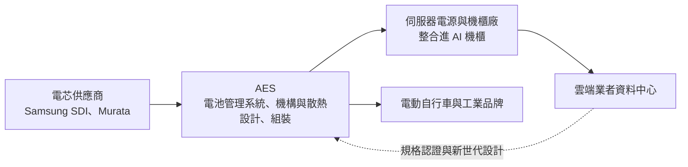
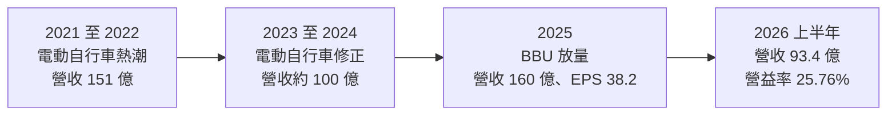
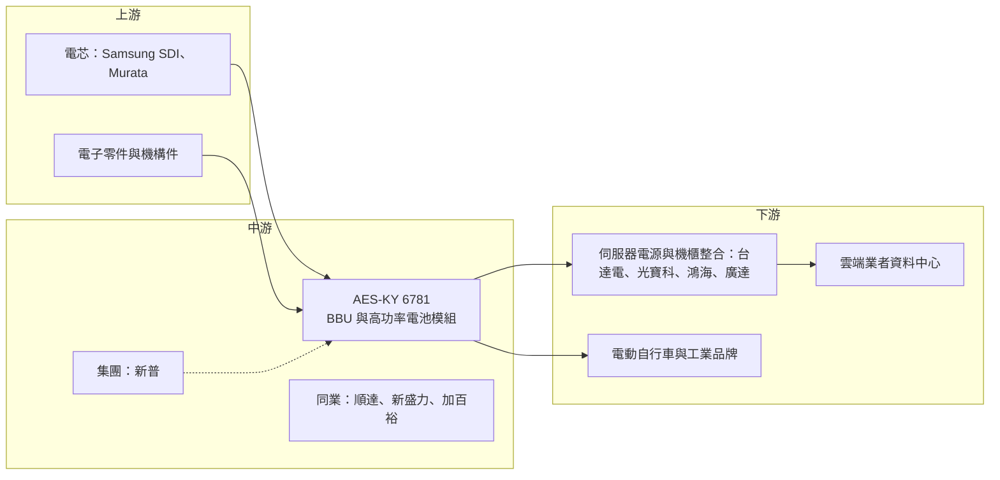

# 6781 AES-KY

> 上市｜[[產業索引-電子零組件業|電子零組件業]]｜上市（櫃）日期 2021/03/22

# 第一章：企業模式與商業藍圖

> [!info] 撰寫說明
> 本文由 Claude 依公開資料整理，架構比照 [[2330台積電]] 的四章研究，資料截至 2026-10-08。財務數字來源：Goodinfo 年度經營績效頁、證交所開放資料（基本資料、綜合損益、資產負債、營益分析、股利、本益比殖利率）、富果研究個股分析、優分析、財訊、經濟日報報導；產業描述為整理性內容，尚未逐條比對原始文件。#待校對

理解一家電池模組公司的價值，關鍵在於它把電芯組裝成什麼樣的產品、賣給誰，以及這些產品在客戶系統中有多重要。本章針對 AES-KY（股票代號：6781，以下簡稱 AES）的商業模式進行定性分析，說明它如何從輕型電動車電池起家，轉型為 AI 資料中心備援電池的主要供應商。

## 一、核心定位：高功率客製化電池模組供應商

AES 於 2020 年成立、2021 年在台灣上市，是筆電電池大廠 [[6121新普]] 集團旗下的電池模組公司，董事長宋福祥同時擔任新普董事長。AES 不生產電芯，而是向 Samsung SDI、Murata 等電芯廠採購[[鋰電池]]電芯，再設計成包含電池管理系統（[[BMS]]）、機構與散熱設計的電池模組，賣給系統廠與品牌客戶。

財訊報導將 AES 定位為「高功率客製化電池模組供應商」。所謂高功率，是指產品需要在短時間內輸出大電流，例如資料中心斷電時的備援、電動自行車的加速，或電動工具的瞬間扭力；所謂客製化，是指每個客戶、每一代產品的電池模組都要重新設計，無法像消費性電池一樣標準化量產。這兩個特性決定了 AES 的生意本質：它賣的不是電池本身，而是讓電池在特定系統中安全、穩定運作的工程能力。

這個定位有兩層商業意義：

* **與母公司分工，聚焦非筆電市場：** 新普以筆電與手機電池為主，AES 則承接輕型電動車、資料中心備援與工業用電池等中大型模組。分拆後兩家公司各自專注，AES 的成長不受筆電市場的成熟所限。
* **把資料中心當作主要成長引擎：** AI 伺服器機櫃普遍配置[[BBU]]（備援電池模組），AES 已打入美國主要雲端業者（[[CSP]]）的供應鏈，富果研究指出公司已切入 Amazon、Google、Microsoft、Meta 四大雲端業者。這讓 AES 從一家受電動自行車景氣左右的公司，轉為與 AI 資料中心建置連動的公司。

## 二、終端應用板塊：BBU 為主、輕型電動車與工業為輔

AES 沒有在本文查得的公開資料中揭露完整的產品營收比重，因此這裡不畫圓餅圖，改以文字說明各板塊的相對位置。

* **資料中心備援電池（BBU）：** 優分析引述資料指出，2022 至 2023 年營收高峰時 BBU 占比約 21% 至 39%；法人預估 2025 年占比可達 65%，富果研究則預估 2027 年 BBU 營收占比升至 76%（均為法人預估，非公司公布數字）。BBU 安裝在伺服器機櫃中，市電中斷時在數十秒到數分鐘內提供電力，讓系統有時間切換到發電機或完成安全關機。
* **輕型電動車：** 主要是歐美市場的電動自行車電池。這曾是 AES 的主要業務，2021 至 2022 年疫情期間需求暴增，之後隨庫存調整大幅下滑。報導指出 AES 未切入中國電動自行車市場。
* **工業與儲能：** 包括 5G 基地台備援電池、工業用[[儲能]]系統等。經濟日報引述宋福祥的看法，指出部分基地台正把鉛酸電池換成鋰電池，資料中心與基地台建設都在帶動中大型工業備援電池的需求。

## 三、資本轉化邏輯：輕資產組裝加上高附加價值設計

AES 的資本轉化邏輯可以從三個面向理解：

* **輕資產的組裝模式：** 電池模組的主要成本是電芯，AES 自身的工廠以組裝、測試與品管為主，不需要像電芯廠那樣投入大量資本支出。2026 年第二季底，AES 的非流動資產只有約 34.7 億元，而流動資產約 238 億元（證交所資料），顯示公司的資產以現金、應收帳款與存貨為主，固定資產很輕。
* **設計能力決定毛利：** 電芯是採購來的，AES 的附加價值在於電池管理系統、安全設計與客戶認證。BBU 必須通過雲端業者嚴格的安全與可靠度測試，一旦被採用，在該伺服器世代中具有黏著度。這是 AES 毛利率能長期維持在 35% 以上的原因，遠高於一般電子組裝業。
* **跟著平台升級：** AI 伺服器機櫃功率不斷提高，BBU 也從低功率走向高容量、高功率密度，並隨供電架構轉向 [[HVDC]] 而推出高壓版本。每一代規格升級都會提高單價與技術門檻。

## 四、企業長期藍圖：從單一應用走向資料中心電力平台

AES 的長期藍圖可以歸納為三點。第一，鞏固在雲端業者 BBU 供應鏈的位置，並跟隨 GPU 機櫃與自研晶片機櫃的世代更新推出新產品。第二，擴大到資料中心其他備援電力應用，例如機房層級的不斷電系統（[[UPS]]）電池與 HVDC 架構下的高壓電池模組。第三，以工業、基地台與儲能等應用分散客戶結構，降低對單一市場的依賴。報導指出公司預期未來新業務營收比重可達三分之一。

從資本配置的角度，AES 長期維持幾乎無負債、現金充足的財務結構，股利發放比例約五成，其餘盈餘保留作為營運資金與新產品開發，這與輕資產、高成長的事業特性相符。

# 第二章：護城河深度與競爭優勢

護城河分析的核心問題是：這家公司的優勢能否在十年後依然存在？本章針對 AES 的競爭優勢進行拆解，並與國內外電池模組與電源同業比較，評估它在 BBU 市場的位置。

## 一、護城河的核心組成要素

* **雲端業者認證與先行者地位：** BBU 涉及機櫃安全，雲端業者對供應商的認證非常嚴格，包括電芯來源、電池管理系統演算法、熱失控防護與長期可靠度。AES 較早打入美國主要雲端業者，累積了多個世代的出貨紀錄，這是新進者最難跨越的門檻。
* **集團的電池工程經驗與採購規模：** 新普集團是全球最大的筆電電池模組廠之一，在電芯採購、電池管理系統與安全設計上有數十年經驗。AES 能借用集團的電芯採購議價力與工程人才，這是獨立的小型電池模組廠難以複製的。
* **客製化設計能力：** 每個雲端業者、每一代機櫃的 BBU 規格都不同，供應商必須能快速完成客製設計並通過驗證。這種能力需要大量工程人力與經驗累積，屬於知識型的護城河。
* **財務實力：** 幾乎無有息負債與充足的現金，讓 AES 能承受客戶要求的備貨與帳期，也能在需求低谷時維持研發投入。

## 二、全球主要競爭對手格局

| 公司 | 所在地 | 定位與強項 | 與 AES 的關係 |
|---|---|---|---|
| [[2308台達電]] | 台灣 | 全球資料中心電源龍頭，提供電源、BBU 與整體電力方案 | 可提供電源加電池的整合方案，是最具威脅的競爭者 |
| [[2301光寶科]] | 台灣 | 伺服器電源大廠，布局 BBU 與機櫃電力 | 電源廠向電池延伸的競爭者 |
| [[3211順達]] | 台灣 | 筆電電池模組廠，積極切入 BBU | BBU 市場的直接競爭者 |
| [[4931新盛力]] | 台灣 | 高功率鋰電池模組，BBU 與 UPS 為主要成長動能 | BBU 與 UPS 電池的直接競爭者 |
| [[3323加百裕]] | 台灣 | 電池模組廠 | 中小型電池模組的競爭者 |
| LG Energy Solution 等電芯廠 | 韓國 | 電芯與模組垂直整合 | 可能直接供應模組的潛在競爭者 |

從格局來看，AES 在 BBU 市場屬於早期進入、市占領先的供應商之一，但電源大廠如台達電可以把電源供應器、BBU 與機櫃電力一起打包銷售，長期具有整合優勢。AES 的勝負關鍵在於能否以電池專業與設計速度維持差異化。

## 三、優勢轉化：守得住、守不住與觀察重點

* **守得住：** 已認證雲端業者平台的 BBU 份額。只要 AES 持續通過新世代機櫃的認證，客戶換供應商的成本與風險都很高，這部分業務具有相當的黏著度。
* **守不住：** 輕型電動車電池的需求波動。電動自行車市場在 2021 至 2022 年暴增後大幅修正，AES 營收從 2022 年的 151 億元降到 2023 年的 100 億元，說明這個市場的週期性很強，AES 無法控制。
* **觀察重點：** 第一，BBU 在下一代 AI 機櫃與 HVDC 架構中的規格演變，以及 AES 能否維持主要供應商地位；第二，電源大廠以整合方案搶市的進度；第三，非 BBU 業務（工業、基地台、儲能）能否成長到足以分散客戶集中風險。

# 第三章：財務體質與盈利規模

資料日期：2026-10-08。數字取自 Goodinfo 年度經營績效頁與證交所開放資料，表格是撰寫當時的快照；最新月營收、毛利率、累計 EPS 由自動排程寫在本筆記的屬性欄位（月營收、毛利率、累計EPS 等）。#待校對

財務報表是檢驗護城河是否真實存在的最終標準。本章用多年度的三率、ROE 與資本報酬，檢視 AES 從電動自行車週期轉向資料中心的獲利品質。

## 一、獲利能力的基石：三率

| 年度 | 營收（新台幣） | [[毛利率]] | [[營業利益率]] | EPS（元） | [[ROE]] |
|---|---|---|---|---|---|
| 2018 | 46.8 億 | 21.5% | 10.7% | 7.45 | 18.9% |
| 2019 | 48.6 億 | 27.0% | 14.9% | 9.41 | 23.9% |
| 2020 | 63.1 億 | 32.0% | 19.4% | 14.17 | 28.5% |
| 2021 | 115 億 | 36.2% | 26.2% | 30.18 | 34.9% |
| 2022 | 151 億 | 37.0% | 26.2% | 37.67 | 27.9% |
| 2023 | 100 億 | 37.5% | 21.8% | 23.04 | 15.4% |
| 2024 | 100 億 | 39.4% | 23.7% | 25.39 | 15.7% |
| 2025 | 160 億 | 35.9% | 24.2% | 38.2 | 20.7% |
| 2026 上半年 | 93.4 億 | 37.63% | 25.76% | 23.45 | 未查得 |

註：2018 至 2025 年取自 Goodinfo（2020 年公司成立前的數字應為重組前的追溯資料，待校對）；2026 上半年取自證交所綜合損益與營益分析開放資料。

* **[[毛利率]]：** AES 的毛利率從 2018 年的 21.5% 逐年提升到 2024 年的 39.4%，之後維持在 36% 至 38% 左右。對一家不生產電芯的模組廠來說，這樣的毛利率相當高，反映 BBU 等高附加價值產品的定價能力。
* **[[營業利益率]]：** 2021 年起長期維持在 22% 至 26%，即使 2023 年營收衰退三成，營業利益率仍有 21.8%，顯示費用控制良好，產品組合改善抵銷了部分規模下滑的影響。
* **營收趨勢：** 2020 年至 2025 年營收從 63.1 億元成長到 160 億元，年複合成長率約 20.5%（推算），但過程中經歷 2023 年大幅衰退，營收的穩定度不如毛利率。

## 二、[[ROE]]：資本效率

2021 至 2025 年平均 ROE 約 22.9%（推算），即使在 2023 年的低谷也有 15.4%。AES 的 ROE 幾乎完全來自本業獲利，而不是財務槓桿：2026 年第二季底總負債約 95.9 億元，主要是應付帳款等營運負債，權益總計約 177 億元，每股淨值 207.19 元（證交所資料）。ROE 在 2023 至 2024 年降到 15% 左右，除了營收下滑，也因為累積的保留盈餘讓權益基礎變大。

## 三、資本支出、自由現金流與股利

AES 屬於輕資產模式，2026 年第二季底非流動資產只有約 34.7 億元，資本支出占營收的比例低（具體金額未查得）。在此結構下，獲利大部分可以轉為現金，自由現金流長期為正的可能性高（推估）。

股利方面，2025 年度配發現金股利 19.1 元，以 EPS 38.2 元計算配發率約 50%（推算，證交所股利資料）。Goodinfo 統計歷年一般平均現金股利約 13.75 元。公司章程規定可分配盈餘至少 10% 須分派，現金股利比例不低於 10%，實際配發率長期在五成左右，保留的盈餘主要用於營運資金與新產品開發。

## 四、[[ROIC]] 與 [[WACC]]：價值創造利差

**ROIC 推算：** 2025 年營收 160 億元乘以營業利益率 24.2%，營業利益約 38.7 億元，扣除 20% 稅率後約 31.0 億元。2026 年第二季底權益總計約 177 億元，總負債約 95.9 億元，其中大多為應付帳款等營運負債，假設有息負債約 10 億元（推估），投入資本約 187 億元，ROIC 約 16.6%（推算）。若再扣除公司持有的大量現金，實際營運資本報酬率會明顯更高。以 2026 年上半年營業利益 24.1 億元年化計算，ROIC 約 20.6%（推算）。

**WACC 推算：** 假設台灣 10 年期公債殖利率 1.75%、市場風險溢酬 6%、β 取電池模組與電源股常見值 1.1，股東權益成本約 8.35%。由於有息負債極少，權益占資本結構約 95%，WACC 約 8.0%（推算）。

**結論：** AES 的 ROIC 在 2020 年以後長期明顯高於 WACC，即使在 2023 年電動自行車需求修正期間，以帳面資本計算的 ROIC 仍約在 12% 至 15%（推算），高於資金成本。這代表 AES 屬於持續創造價值的公司，價值來源是輕資產模式與高毛利的設計能力。未來需要觀察的是，當 BBU 市場吸引更多競爭者加入時，毛利率能否維持在 35% 以上。

# 第四章：總體風險與地緣政治

任何企業都無法脫離宏觀環境獨立存在。本章分析 AES 未來必須面對的地緣政治、產業週期、營運與技術風險。

## 一、地緣政治

* **電芯供應來源：** AES 的電芯主要來自日韓廠商，若美國對特定國家的電池或電芯加徵關稅，或要求資料中心設備使用特定來源的電芯，AES 需要調整供應鏈。這是電池產業最主要的地緣政治變數。
* **生產據點與關稅：** AES 為開曼註冊的控股公司，實際生產據點與各地產能比重本文未查得，若主要產能位於中國，面對美國關稅與供應鏈去中國化的壓力會較大（待校對）。
* **客戶集中於美國：** 主要成長動能來自美國雲端業者，美國的產業政策、出口管制與資料中心投資節奏都會直接影響 AES 的訂單。

## 二、產業週期與市場結構

* **AI 資本支出週期：** BBU 需求與雲端業者的 AI 資本支出高度連動。若 AI 投資在某個時點放緩，BBU 訂單可能在短時間內大幅減少，就像電動自行車需求在 2023 年的急速修正一樣。
* **輕型電動車的高度週期性：** 電動自行車市場在疫情期間暴增後大幅修正，AES 營收在 2023 年衰退約三成。這部分業務的需求波動是 AES 過去最大的風險，未來仍可能拖累整體成長。
* **競爭者增加：** BBU 的高毛利吸引電源大廠與其他電池模組廠加入，長期可能壓縮價格與毛利率。

## 三、營運環境的隱性風險

* **電池安全：** 鋰電池在資料中心內發生熱失控，可能造成重大損失與商譽傷害。任何一次安全事故都可能讓客戶重新評估供應商，這是電池模組廠最需要管理的營運風險。
* **電芯供應與價格：** 高功率電芯的供應集中在少數日韓廠商，若供應吃緊或價格上漲，AES 可能面臨缺料或毛利壓縮。
* **匯率：** 營收主要以美元計價，新台幣升值會壓縮以台幣計算的營收與獲利。

## 四、科技演進風險

資料中心的供電架構正在改變，從傳統交流電轉向 [[HVDC]] 高壓直流，BBU 也必須跟著改為高壓設計。此外，超級電容、鈉離子電池或固態電池等新技術，未來可能在部分備援應用中取代現有的鋰離子電池。另一個變數是雲端業者可能把備援電力從機櫃層級移回機房層級的大型 UPS 或儲能系統。AES 能否在這些架構轉變中維持設計領先，決定它十年後是否仍是資料中心備援電力的核心供應商。

# 專有名詞解析

## 應用

- **[[BBU]]**：備援電池模組，裝在伺服器機櫃中，市電中斷時短時間供電，讓系統切換電源或安全關機。
- **[[CSP]]**：雲端服務供應商，例如 AWS、Microsoft、Google、Meta，是資料中心設備的最大買家。
- **[[AI伺服器]]**：搭載 GPU 或 AI 加速晶片的伺服器，耗電與功率密度遠高於一般伺服器，需要更強的備援電力。

## 金融

- **[[ROIC]]**：投入資本報酬率，衡量公司每投入一元營運資本能賺回多少稅後營業利益。
- **[[WACC]]**：加權平均資金成本，股東與債權人要求報酬的加權平均，ROIC 高於 WACC 才代表創造價值。

## 產業

- **[[鋰電池]]**：以鋰離子在正負極之間移動來充放電的電池，能量密度高，廣泛用於筆電、電動車與儲能。
- **[[BMS]]**：電池管理系統，監控每顆電芯的電壓、溫度與電量，避免過充、過放與熱失控。
- **[[電芯]]**：電池的最小單元，多顆電芯串並聯後加上管理系統與外殼，才組成電池模組。
- **[[熱失控]]**：電池內部溫度失控上升引發連鎖反應，可能導致起火或爆炸，是鋰電池最主要的安全風險。
- **[[HVDC]]**：高壓直流供電，AI 資料中心為提高機櫃功率與效率，逐步由交流改為高壓直流供電架構。
- **[[UPS]]**：不斷電系統，在市電中斷時立即以電池供電，保護資料中心與工廠設備。
- **[[儲能]]**：以電池等設備儲存電力，在用電尖峰或停電時放電，用於電網調度與企業備援。
- **[[輕型電動車]]**：電動自行車、電動滑板車等低速電動交通工具，電池模組需求受消費景氣影響大。

# 核心供應鏈

## 1. 上游：電芯與零組件
- 電芯：Samsung SDI、Murata（村田製作所）
- 電池管理晶片與電子零件：國際類比晶片廠（具體供應商未查得）

## 2. 中游：AES 本身與同業
- 母集團：[[6121新普]]
- 電池模組同業：[[3211順達]]、[[4931新盛力]]、[[3323加百裕]]

## 3. 下游：機櫃整合與電源廠
- 電源與機櫃電力：[[2308台達電]]、[[2301光寶科]]
- 伺服器組裝：[[2317鴻海]]、[[2382廣達]]（推估，透過機櫃整合導入，待校對）

## 4. 下游：終端客戶
- 雲端業者：[[AMZN亞馬遜]]、[[GOOGL谷歌]]、[[MSFT微軟]]、[[META臉書]]
- 電動自行車與工業品牌：歐美品牌（具體客戶未查得）

## 最新新聞
<!-- news:start -->
<!-- news:end -->

## 相關連結
- [公開資訊觀測站](https://mopsov.twse.com.tw/mops/web/t05st03?step=1&firstin=1&co_id=6781)
- [Goodinfo](https://goodinfo.tw/tw/StockDetail.asp?STOCK_ID=6781)
- [Yahoo 股市](https://tw.stock.yahoo.com/quote/6781)
- [鉅亨網新聞](https://www.cnyes.com/twstock/6781/news)
