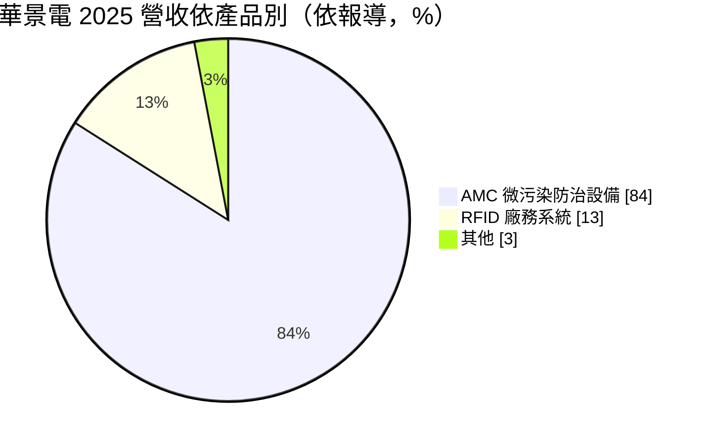
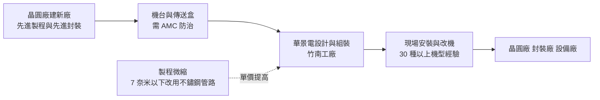
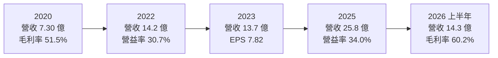
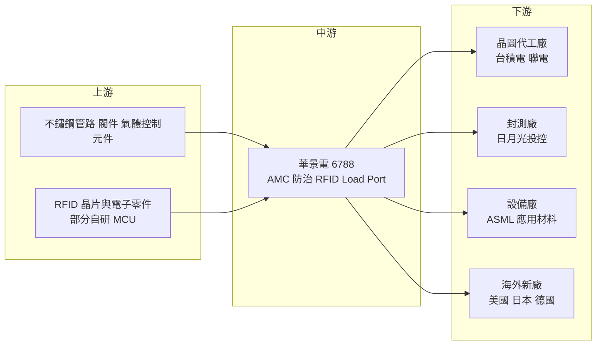

# 6788 華景電

> 上櫃｜[[產業索引-半導體業|半導體業]]｜上市（櫃）日期 2021/09/29

# 第一章：企業模式與商業藍圖

> [!info] 撰寫說明
> 本文由 Claude 依公開資料整理，架構比照 [[2330台積電]] 的四章研究，資料截至 2026-10-08。財務數字來源：Goodinfo 年度經營績效頁、nStock 公司概況頁、Yahoo 股市公司基本資料、富果研究 2025 年 12 月法說會整理、聯合新聞網轉載萬寶週刊 2025 年 12 月報導；產業描述為整理性內容，尚未逐條比對原始文件。#待校對

在評估單一個股的長期投資價值時，首要步驟是拆解企業的底層獲利邏輯。本章針對華景電通（股票代號：6788，以下簡稱華景電）的商業模式進行定性分析，說明一家從晶圓廠 RFID 派工系統起家的設備公司，如何搭上先進製程對潔淨度越來越嚴苛的趨勢，把毛利率做到接近六成，並隨著晶圓廠全球擴張走向海外。

## 一、核心定位：先進製程的晶圓微污染防治設備商

華景電成立於 2000 年 9 月，董事長為陳榮華、總經理為古震維，總部與主要工廠位於苗栗竹南。公司的兩大產品線是晶圓製程的氣態分子污染（[[AMC]]）防治設備，以及晶圓廠的 [[RFID]] 整合派工系統。

AMC 防治是理解華景電的關鍵。晶圓在不同機台之間搬運與等待時，會放在密閉的晶圓傳送盒（[[FOUP]]）裡。製程越先進，電路線寬越細，空氣中的水氣、氧氣與微量化學分子就越容易在晶圓表面造成氧化或缺陷，直接影響[[良率]]。華景電的設備透過對傳送盒持續充入潔淨氣體（[[Purge]]）與在開口處形成氣簾（Air Curtain），讓晶圓在運送、儲存與等待時都維持在低濕度、低氧的環境。依富果研究整理的法說會，這類設備主要用於 22 奈米以下的製程。

RFID 系統則是華景電成立以來的本業，用於 8 吋與 12 吋晶圓廠的在製品追蹤與自動派工，讓每一盒晶圓的位置與製程狀態都能被即時掌握。

## 二、終端應用／產品板塊

依萬寶週刊 2025 年 12 月報導，華景電的營收結構如下：

* **AMC 微污染防治設備：** 約占營收 84%，是主要營收與成長來源。應用範圍從前段晶圓製程延伸到[[先進封裝]]。法說會指出，先進封裝（如 [[CoWoS]]、CoPoS）的使用量約為前段的 5% 至 10%，但規格要求接近 5 奈米水準；公司也在開發 SoIC 與 CoWoS 用的載具，並已與客戶初步討論面板級封裝的規格。
* **RFID 廠務系統：** 約占 13%，是穩定的基本盤。公司投入超過 3,000 萬元在台北研發中心自行開發 RFID 的 MCU 晶片，以降低成本並掌握關鍵元件。
* **其他：** 包括晶圓廠機台的火災偵測與工程安裝服務，以及開發中的自有晶圓裝載埠（[[Load Port]]）。

客戶方面，依法說會整理，前段客戶包括 [[2330台積電]] 與 [[2303聯電]]，後段封裝客戶包括 [[3711日月光投控]]，設備廠客戶包括 [[ASML艾司摩爾]] 與 [[AMAT應用材料]]。設備廠客戶代表華景電的產品可以整合進其他廠商的機台中出貨。

## 三、資本轉化邏輯：跟著晶圓廠建廠與製程微縮成長

華景電的成長有兩個引擎。第一是晶圓廠的建廠數量：每座新的先進製程廠或先進封裝廠，都需要大量的 AMC 防治設備，因此營收與客戶的資本支出高度連動。第二是製程微縮帶來的單價提升：法說會提到，7 奈米以下製程的管路由塑膠改為不鏽鋼，成本與售價都提高。也就是說，即使建廠數量不變，製程越先進，每座廠的設備價值也越高。

這個模式的營運特性是「接單生產、現場安裝」。設備在竹南工廠組裝後，由工程團隊到客戶廠區安裝與調校，並需要針對不同廠牌、不同機型做改機。依法說會，華景電有 30 種以上機型的改機經驗，工程團隊平均年資超過 3 年。這種現場服務能力不容易被複製，也讓客戶在擴廠時傾向延用同一供應商。

## 四、企業長期藍圖：跟著客戶走向全球、從單點設備走向整體方案

* **海外布局：** 華景電在中國上海與美國亞利桑那設有子公司。萬寶週刊報導提到，日本熊本二期、美國亞利桑那二期預計 2026 年完成，德國德勒斯登廠正在興建。法說會指出，海外客戶建廠計畫已確認，設備安裝預計 2026 年下半年起陸續進行，美國據點因為要覆蓋在地成本，報價較高、毛利率預期略高。
* **產能擴充：** 依報導，2025 年產能幾乎倍增、利用率 97% 至 99%。公司規劃擴充竹南工廠，並在高雄設立工程、倉儲與物流據點服務南部客戶。2026 年資本支出約 2 億元，以自有資金支應，不計畫增資或發行可轉債。
* **Load Port 整體方案：** 開發自有的晶圓裝載埠，結合 AMC 技術形成「Total Solution」，已與客戶設備整合並取得訂單。從單一防污設備延伸到晶圓進出機台的關鍵介面，可提高每座廠的設備價值。
* **先進封裝：** 從前段製程延伸到 CoWoS、SoIC 與面板級封裝，跟上 AI 晶片封裝產能擴張。

# 第二章：護城河深度與競爭優勢

在長期價值投資中，「護城河」指企業抵禦競爭、維持超額利潤的保護機制。本章分析華景電的護城河構成、主要競爭對手，以及這些優勢能否在晶圓廠全球擴張中延續。

## 一、護城河的核心組成要素

華景電的護城河屬於「客戶綁定型中等護城河」，來自先進製程認證、現場服務與長期客戶關係。

* **1. 先進製程的認證與良率責任：** AMC 防治設備直接影響晶圓良率，晶圓廠在導入新供應商時非常謹慎，需要長時間的驗證。華景電已打入台積電、聯電等前段客戶，以及設備大廠的供應鏈，這些認證是新進者最難跨越的門檻。
* **2. 現場改機與工程服務能力：** 晶圓廠機台種類繁多，AMC 設備必須針對不同機型客製安裝。華景電累積了 30 種以上機型的改機經驗與專職工程團隊，這種經驗只能靠長年在客戶廠內施工累積。
* **3. 跟著客戶全球建廠：** 主要客戶到美國、日本、德國建廠時，傾向帶著已驗證的台灣供應商一起出海。華景電在亞利桑那與上海設有據點，並跟著客戶到熊本與德勒斯登，客戶的全球化等於替華景電擴大了市場。

## 二、全球主要競爭對手格局

| 對手 | 定位 | 對華景電的威脅 |
|---|---|---|
| 主要競爭對手（公司未點名） | AMC 防治設備同業 | 法說會表示過去與主要對手市占約各半，2025 年華景電市占提升 |
| [[3680家登]] | 台灣晶圓傳送盒與光罩盒大廠 | 在晶圓載具與先進封裝載具領域有重疊與合作空間 |
| 日本與歐美廠務自動化設備商 | 晶圓搬運、裝載埠與自動化系統供應商 | 在 Load Port 與海外廠的整體方案上競爭 |

華景電法說會未點名主要競爭對手；家登與國外自動化設備商為依產業結構整理的相關業者，彼此可能同時存在競爭與合作關係（推估）。

## 三、優勢轉化：守得住／守不住／觀察重點

* **守得住：** 台積電等主要客戶的先進製程新廠，以及已建立施工經驗的海外廠。這些訂單看重良率表現、交期與現場服務，價格不是首要考量，華景電接近六成的毛利率可以延續。
* **守不住：** 相對成熟製程或中國市場。成熟製程對 AMC 防治的需求較低，中國市場則受美中科技管制與在地化影響，公司對中國的展望偏保守。
* **觀察重點：** 第一，海外客戶新廠在 2026 年下半年後的設備安裝能否如期進行；第二，Load Port 整體方案與先進封裝載具的營收貢獻；第三，產能擴充後能否在維持品質與服務的前提下承接更多訂單。

# 第三章：財務體質與盈利規模

資料日期：2026-10-08。數字取自 Goodinfo 年度經營績效頁、nStock 公司概況頁與 2025 年 12 月法說會整理，表格是撰寫當時的快照；最新月營收、毛利率、累計 EPS 由自動排程寫在本筆記的屬性欄位（月營收、毛利率、累計EPS 等）。#待校對

財務報表是檢驗護城河是否真實存在的最終標準。本章用近九年的三率、[[ROE]] 與資本報酬，檢視華景電在晶圓廠擴產週期中的獲利品質。

## 一、獲利能力的基石：三率

| 年度 | 營收（新台幣） | [[毛利率]] | [[營業利益率]] | EPS（元） | [[ROE]] |
|---|---|---|---|---|---|
| 2017 | 5.95 億 | 57.6% | 29.6% | 5.59 | 27.6% |
| 2018 | 4.43 億 | 55.9% | 18.6% | 2.43 | 12.5% |
| 2019 | 6.95 億 | 51.1% | 24.5% | 4.90 | 23.9% |
| 2020 | 7.30 億 | 51.5% | 27.6% | 5.19 | 22.9% |
| 2021 | 10.9 億 | 50.8% | 27.0% | 7.08 | 21.3% |
| 2022 | 14.2 億 | 51.8% | 30.7% | 10.08 | 23.3% |
| 2023 | 13.7 億 | 53.7% | 26.4% | 7.82 | 16.8% |
| 2024 | 21.5 億 | 59.1% | 31.4% | 14.34 | 24.5% |
| 2025 | 25.8 億 | 58.3% | 34.0% | 17.36 | 25.1% |
| 2026 上半年 | 14.3 億 | 60.2% | 34.9% | 9.79 | 27.6%（年化） |

華景電是本次整理的公司中財務表現最穩定的一家。近九年毛利率都在 50% 以上，營業利益率除 2018 年外都在 24% 至 35% 之間，每年都有獲利。2023 年半導體產業景氣下修，營收只小幅下滑 3.5%，EPS 仍有 7.82 元；2024 至 2025 年隨先進製程與先進封裝擴產，營收從 13.7 億元成長到 25.8 億元。

* **[[毛利率]]：** 從 2019 至 2022 年的約 51%，提升到 2024 年以後的 58% 至 60%。推估原因是先進製程設備比重提高（7 奈米以下改用不鏽鋼管路、單價較高），以及產能滿載下的規模經濟（推估）。
* **[[營業利益率]]：** 2025 年達 34.0%，2026 年上半年 34.9%，營收成長帶來明顯的營運槓桿。
* **長期指標：** 2020 至 2025 年營收年複合成長率約 28.7%（推算），近五年（2021 至 2025）平均 ROE 約 22.2%（推算），且五年都在 16% 以上。

## 二、[[ROE]]：資本效率

華景電近五年平均 ROE 約 22.2%（推算），2026 年上半年年化達 27.6%。以 2025 年稅後淨利 6.73 億元、ROE 25.1% 回推，平均股東權益約 26.8 億元（推算）。股本由 2017 年的 2.63 億元增加到 2024 年的 3.87 億元，之後維持不變。在營收成長近三倍的同時，ROE 不降反升，代表新增的資本被有效運用在擴產與營運上。

## 三、資本支出與自由現金流

依法說會，華景電 2026 年資本支出（[[CapEx]]）約 2 億元，用於竹南工廠擴充與高雄據點，以自有資金支應，不計畫增資或發行可轉債。相對於 2025 年稅後淨利 6.73 億元，資本支出約為淨利的三成，屬於輕資本支出的設備業者。在接單成長期間，應收帳款與存貨會隨營收增加而占用營運資金，但整體而言 [[自由現金流]]推估長期為正（推估）。

股利方面，依 nStock，華景電近五年平均現金股利約 8.8 元，2024 年度配發 10 元，2025 年度配發 15 元，[[配發率]]約 86%（推算，15 ÷ 17.36）。股利隨獲利成長而增加，在高成長期間仍維持高配發率，顯示公司的現金創造能力足以同時支應擴產與配息。

## 四、[[ROIC]] 與 [[WACC]]：價值創造利差

**ROIC 推算：** 2025 年營業利益約 8.77 億元（25.8 億 × 34.0%），以稅率 20% 計算，稅後營業利益約 7.02 億元。投入資本以平均股東權益約 26.8 億元計算，有息負債未查得、視為不重大（推估），ROIC 約 26%（推算）。在景氣較差的 2023 年，營業利益約 3.62 億元（13.7 億 × 26.4%），稅後約 2.89 億元，權益約 16.2 億元（2.72 億 ÷ 16.8%），ROIC 約 18%（推算）。

**WACC 推算：** 權益成本以 CAPM 估計，假設台灣 10 年期公債殖利率 1.75%、市場風險溢酬 6%，β 未查得來源數字，採半導體設備股常見值 1.2，權益成本約 8.95%。有息負債不重大，WACC 約 9%（推算）。

**結論：** 華景電的 ROIC 即使在 2023 年景氣低點也約 18%，2025 年約 26%，長期穩定高於約 9% 的 WACC，利差約 9 至 17 個百分點（推算）。這代表華景電是一家長期創造經濟價值的公司，而且在營收規模擴大的過程中，資本報酬沒有被稀釋。只要先進製程與先進封裝的全球擴產持續，這個利差有機會延續；主要的不確定性在於客戶資本支出的週期性。

# 第四章：總體風險與地緣政治

任何企業都無法脫離宏觀環境獨立存在。本章分析華景電未來必須面對的地緣政治、產業週期、營運與技術風險。

## 一、地緣政治

* **美中科技管制：** 華景電在上海設有子公司，但法說會表示因美中貿易緊張與地緣政治不確定性，對中國市場的展望保守。美國對中國先進製程設備的出口管制，可能限制華景電在中國先進製程的發展空間。
* **客戶海外建廠：** 主要客戶在美國、日本、德國建廠，是華景電的成長機會，但海外施工成本高、人力取得不易、法規與工安標準不同，執行風險高於台灣。
* **台灣集中：** 主要工廠與多數客戶仍在台灣，面臨與其他台灣半導體供應鏈相同的兩岸風險。

## 二、產業週期與市場結構

* **客戶資本支出週期：** 設備業者的營收直接取決於晶圓廠的資本支出。半導體景氣下行時，客戶會延後建廠與機台採購，設備訂單隨之減少。華景電在 2023 年的營收下滑幅度不大，但若遇到更劇烈的產業衰退，訂單仍可能明顯縮減。
* **客戶集中：** 先進製程的擴產集中在少數晶圓廠，主要客戶的擴產節奏變化，會直接影響華景電的訂單能見度。依法說會，訂單能見度約到 2026 年第二季，下半年成長主要取決於海外建廠時程。
* **市場規模：** AMC 防治設備屬於利基市場，總市場規模受限於全球先進製程廠的數量，長期成長需要靠先進封裝、Load Port 等新產品擴大可服務市場。

## 三、營運環境的隱性風險

* **產能與人力：** 生產線利用率接近滿載，現場安裝也需要大量有經驗的工程人員。若訂單成長快於產能與人力擴充，可能出現交期延誤或施工品質問題。
* **海外據點的成本與管理：** 美國、日本、德國的工程與人力成本高，雖然報價較高，但管理難度與風險也較大。
* **零組件與供應鏈：** 不鏽鋼管路、閥件與控制元件的取得與成本，會影響交期與毛利率。

## 四、科技或法規演進

* **製程微縮推升需求：** 製程走向 3 奈米、2 奈米與埃米世代，對潔淨度的要求越來越高，AMC 防治的重要性與設備單價同步提升，這是華景電最主要的長期順風。
* **先進封裝規格升級：** CoWoS、SoIC 與面板級封裝的規格越來越接近前段製程，帶動後段封裝廠對 AMC 防治的需求。但面板級封裝的規格仍在討論中，短期貢獻有限。
* **自動化標準演進：** 晶圓廠自動化與裝載埠的介面標準若改變，華景電需要持續調整產品，以維持與客戶機台的相容性。

# 專有名詞解析

## 半導體

- **[[AMC]]**：氣態分子污染，空氣中的水氣、氧氣與微量化學分子，會在晶圓表面造成氧化或缺陷，影響良率。
- **[[FOUP]]**：前開式晶圓傳送盒，12 吋晶圓廠用來在機台間搬運與存放晶圓的密閉容器。
- **[[Purge]]**：充氣淨化，對晶圓傳送盒持續充入氮氣或潔淨乾空氣，排除水氣與氧氣。
- **[[Load Port]]**：晶圓裝載埠，機台與晶圓傳送盒之間的介面設備，負責開關傳送盒並讓晶圓進出機台。
- **[[良率]]**：一片晶圓上合格晶片所占的比例，是晶圓廠獲利的關鍵指標。
- **[[先進封裝]]**：把多顆晶片以中介層、混合鍵合等方式高密度整合的封裝技術，例如 CoWoS、SoIC。
- **[[CoWoS]]**：台積電的 2.5D 先進封裝技術，把運算晶片與高頻寬記憶體並排放在中介層上，是 AI 晶片的主流封裝。

## 應用

- **[[RFID]]**：無線射頻辨識，以無線方式讀取標籤資訊，晶圓廠用來追蹤每一盒晶圓的位置與製程狀態。

## 金融

- **[[ROE]]**：股東權益報酬率，稅後淨利除以股東權益，衡量公司用股東的錢賺錢的效率。
- **[[ROIC]]**：投入資本報酬率，稅後營業利益除以股東權益加有息負債，衡量本業運用全部資本的效率。
- **[[WACC]]**：加權平均資金成本，股東與債權人要求報酬率的加權平均，ROIC 高於它才算創造價值。
- **[[CapEx]]**：資本支出，企業購買或擴充廠房、設備等長期資產的支出。
- **[[配發率]]**：現金股利占每股盈餘的比例，反映公司把多少獲利以現金發還股東。
- **[[自由現金流]]**：營業活動現金流減去資本支出，代表企業可自由用於配息、還債或併購的現金。

# 核心供應鏈

## 1. 上游：零組件與材料
- 不鏽鋼管路、閥件、氣體控制與電子零組件（具體供應商未查得）
- RFID 用 MCU 晶片：公司在台北研發中心自行開發

## 2. 中游：華景電本身
- 竹南總部與工廠、高雄工程與物流據點、上海與亞利桑那子公司

## 3. 下游：主要客戶
- 晶圓代工（前段）：[[2330台積電]]、[[2303聯電]]
- 封裝測試（後段）：[[3711日月光投控]]
- 設備廠：[[ASML艾司摩爾]]、[[AMAT應用材料]]

## 4. 相關業者
- 晶圓與光罩載具：[[3680家登]]

延伸閱讀：[[台積電供應鏈]]

## 最新新聞
<!-- news:start -->
<!-- news:end -->

## 相關連結
- [公開資訊觀測站](https://mopsov.twse.com.tw/mops/web/t05st03?step=1&firstin=1&co_id=6788)
- [Goodinfo](https://goodinfo.tw/tw/StockDetail.asp?STOCK_ID=6788)
- [Yahoo 股市](https://tw.stock.yahoo.com/quote/6788)
- [鉅亨網新聞](https://www.cnyes.com/twstock/6788/news)
