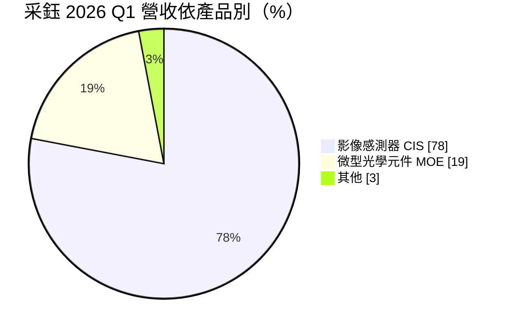
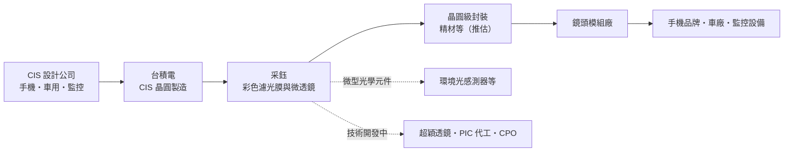
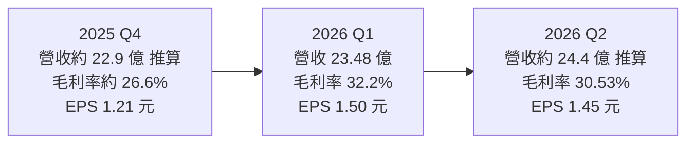
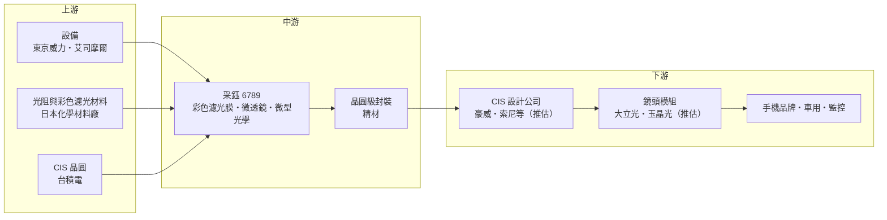

# 6789 采鈺

> 上市｜[[產業索引-半導體業|半導體業]]｜上市（櫃）日期 2022/06/30

# 第一章：企業模式與商業藍圖

> [!info] 撰寫說明
> 本文由 Claude 依公開資料整理，架構比照 [[2330台積電]] 的四章研究，資料截至 2026-10-07。財務數字來源：采鈺 2025 年財報與股利報導（聯合新聞網）、2026 年第一季法說報導與股價新聞（旺得富／中時新聞網）、nstock 公司概況、Yahoo 股市公司基本資料、winvest 營收快訊；產業描述為整理性內容，尚未逐條比對原始文件。#待校對

在評估單一個股的長期投資價值時，首要步驟是拆解企業的底層獲利邏輯。本章針對采鈺科技（股票代號：6789，英文 VisEra，以下簡稱采鈺）的商業模式進行定性分析，說明它在影像感測器製程中扮演的角色、與台積電的關係，以及從手機鏡頭走向新型光學與光通訊的長期方向。

## 一、核心定位：台積電集團內的「影像感測器後段光學加工廠」

采鈺於 2003 年 12 月 1 日設立，2022 年 6 月 30 日掛牌，董事長為關欣，屬於 [[2330台積電]] 集團，台積電為主要股東。依 Yahoo 股市公司資料，采鈺主要業務為[[彩色濾光膜]]與[[微透鏡]]的研發、設計、製造與銷售，以及影像感測與微型光學元件相關產品與模組。

影像感測器（[[CIS]]）的晶片在晶圓廠完成電路後，還需要在每個畫素上方塗佈紅、綠、藍彩色濾光膜，並製作微透鏡把光線聚焦到感光區，這段製程決定了感測器的色彩表現、感光度與畫素縮小的極限。采鈺就是專門承接這段「光學後段製程」的公司，屬於晶圓級的專業代工，而不是傳統的封裝測試。這個定位有兩個商業意義：

* **綁定台積電 CIS 投片：** 客戶在台積電完成 CIS 晶圓後，直接交給采鈺做光學加工，形成一條龍服務，采鈺的訂單與台積電 CIS 投片量高度連動。
* **技術難度隨畫素縮小而提高：** 畫素越小，濾光膜對位與膜厚控制越難，高階手機的規格升級會直接提高采鈺的加工價值。

## 二、產品板塊：影像感測器為主、微型光學為輔

依旺得富對 2026 年第一季法說的報導，營收結構如下：

* **影像感測器（CIS）：** 占營收 78%，為彩色濾光膜與微透鏡加工，是采鈺的主體業務。
* **微型光學元件（[[MOE]]）：** 占 19%，包括環境光感測器等光學元件。
* **其他：** 3%。

依終端應用，智慧型手機約占 80%，車用與監控各約 10%。聯合新聞網報導 2025 年第四季的結構為影像感測器 79%、微型光學元件 19%、其他 2%，並提到公司持續布局 2 億畫素手機鏡頭與車用應用。

## 三、資本轉化邏輯：晶圓級光學加工

* **產能與據點：** 采鈺主要產能位於新竹科學園區，並在桃園龍潭建置二期廠房。
* **資本支出：** 依旺得富報導，2025 年資本支出約 6,000 萬美元，其中約九成投入生產與研發設備；2026 年編列 7,000 萬美元，用於購置 CIS 設備解決產能瓶頸，並持續興建龍潭二期。
* **營運槓桿：** 光學加工廠固定成本高，[[產能利用率]]回升時毛利率會快速改善，2026 年第一季就是例子。

## 四、企業長期藍圖：從手機鏡頭走向光通訊與新型光學

* **高畫素與車用 CIS：** 手機感測器朝 2 億畫素、更小畫素發展，彩色濾光膜與微透鏡的精度要求越來越高；車用 [[ToF]] 與 [[ADAS]] 鏡頭是第二成長來源。
* **[[超穎透鏡]]與奈米光學結構：** 采鈺發展奈米結構光學技術，可應用於 AR 眼鏡、車用 ToF 等新型光學元件。
* **[[矽光子]]與 [[CPO]]：** 依旺得富報導，采鈺提供光學被動元件與 [[PIC]] 晶圓代工服務，切入矽光子與光收發模組；但公司表示 2026 年光通訊營收仍不具重要性，重點在技術開發。

# 第二章：護城河深度與競爭優勢

在長期價值投資中，「護城河」指企業抵禦競爭、維持超額利潤的保護機制。本章分析采鈺的護城河構成、在 CIS 光學加工與新型光學元件市場的主要競爭者，以及這些優勢能否抵擋 CIS 大廠內製與中國國產化。

## 一、護城河的核心組成要素

采鈺的護城河屬於「中等」，由三個要素組成：

* **1. 與台積電 CIS 製程的緊密整合：** 采鈺的彩色濾光膜與微透鏡製程直接接在台積電的 CIS 晶圓之後，兩者的製程參數、[[良率]]數據與客戶專案高度整合。客戶在台積電投片 CIS，後段光學加工自然交給采鈺，形成一條龍的服務。
* **2. 製程精度與經驗：** 畫素越做越小，彩色濾光膜的對位與膜厚控制要求極高，需要長期累積的製程經驗與晶圓級設備，新進者難以短期追上。
* **3. 少數具規模的獨立業者：** 多數 CIS 大廠在自家晶圓廠內完成這段製程，獨立的專業代工業者不多，采鈺是其中規模最大者之一。

## 二、全球主要競爭對手格局

| 對手 | 定位 | 對采鈺的威脅 |
|---|---|---|
| [[SONY索尼]]、[[005930三星電子]] | CIS 大廠，內部完成濾光膜與微透鏡 | 限制采鈺可服務的市場規模 |
| [[2303聯電]]、[[6770力積電]] | 晶圓代工廠的 CIS 相關製程 | 爭取非台積電投片的 CIS 客戶 |
| 中國晶圓廠與光學加工業者 | 受益 CIS 國產化政策 | 承接中國 CIS 設計公司的後段加工 |
| [[3008大立光]]、[[3406玉晶光]] 與國際光學業者 | 光學鏡頭與元件 | 在超穎透鏡、光學元件領域可能競爭 |

## 三、優勢轉化：哪些市場守得住、哪些守不住

* **守得住：** 在台積電投片的 CIS 客戶，尤其是高畫素、小畫素的高階產品，轉換成本高。
* **守不住：** 手機 CIS 規格停滯或中低階機種占比提高時，價格與產能利用率都會受壓；中國 CIS 客戶若轉向中國本土供應鏈，采鈺會失去部分訂單。
* **觀察重點：** 2026 年 CIS 設備擴充後的產能利用率與毛利率、車用與新型光學元件的貢獻，以及 CPO 與 PIC 代工何時從技術開發轉為實際營收。

# 第三章：財務體質與盈利規模

資料日期：2026-10-07。數字取自采鈺財報公告的媒體整理（聯合新聞網、旺得富、nstock、Yahoo 股市、winvest），表格是撰寫當時的快照；最新月營收、毛利率、累計 EPS 由自動排程寫在本筆記的屬性欄位（月營收、毛利率、累計EPS 等）。#待校對

財務報表是檢驗護城河是否真實存在的最終標準。本章用三率、ROE、現金流與資本報酬，檢視采鈺在手機季節性與產能利用率波動下的獲利品質。

## 一、獲利能力的基石：三率

| 項目 | 2025 全年 | 2025 Q4 | 2026 Q1 | 2026 Q2 |
|---|---|---|---|---|
| 營收（新台幣） | 89.38 億 | 約 22.9 億（推算） | 23.48 億 | 約 24.4 億（推算） |
| [[毛利率]] | 未查得 | 約 26.6%（推算） | 32.2% | 30.53% |
| [[營業利益率]] | 未查得 | 未查得 | 22.83% | 19.32% |
| EPS（元） | 4.01 | 1.21 | 1.50 | 1.45 |

* **推算說明：** 2025 年第四季營收與毛利率依第一季「營收季增 2.57%、毛利率季增 5.64 個百分點」回推；2026 年第二季營收以 1 至 8 月累計 66.24 億元，扣除 7 月 9.15 億元、8 月 9.19 億元與第一季營收推算。
* **數據不一致：** 第二季營業利益率 Yahoo 股市資料為 19.32%，nstock 標示為 14.84%，兩者不一致，待以公開資訊觀測站財報確認。
* **2025 年：** 稅後純益 12.74 億元，年減 26.7%，EPS 由 2024 年的 5.49 元降至 4.01 元。
* **2026 年第一季：** 稅後淨利 4.75 億元，年增 76.9%，EPS 1.50 元為五季新高。
* **下半年展望：** 公司在第一季法說表示，第二季受中階手機機種影響，毛利率可能季減；下半年旗艦機種推出後，營收與獲利可望逐季改善。2026 年 8 月營收 9.19 億元，年增 17.99%。

## 二、[[ROE]]：資本效率

采鈺營業費用率不高，毛利率三成左右時，營業利益率可達兩成上下，獲利對產能利用率相當敏感：2025 年利用率偏低時毛利率一度降到 26% 左右，2026 年第一季回升後毛利率即跳升到 32%。ROE 具體數值本次未查得。

## 三、資本支出與自由現金流

* **[[CapEx]]：** 2025 年約 6,000 萬美元，2026 年提高到 7,000 萬美元，主要投入 CIS 設備與龍潭二期。
* **[[自由現金流]]：** 相對營收規模，資本支出屬中等，營業現金流可以支應，並維持穩定配息（推估）。
* **股利：** 依聯合新聞網報導，采鈺 2025 年度配發每股現金股利 3 元，配發率近 75%。nstock 整理近五年平均現金股利約 2.17 元。

## 四、[[ROIC]] 與 [[WACC]]：價值創造利差

采鈺的投入資本以晶圓級光學設備與廠房為主，營業利益率兩成上下時，ROIC 推估高於 WACC；但 2025 年獲利下滑期間利差明顯縮小（推估，具體數值未查得）。2026 年擴充設備與龍潭二期會擴大資本基數，新產能能否維持高利用率，是利差能否擴大的關鍵。

# 第四章：總體風險與地緣政治

任何企業都無法脫離宏觀環境獨立存在。本章分析采鈺未來必須面對的地緣政治、手機週期、營運與技術演進風險。

## 一、地緣政治

* **台灣集中：** 產能集中在新竹與龍潭，面臨與台積電相同的兩岸與供應鏈集中風險。
* **中國客戶與國產化：** 中國手機與 CIS 設計公司是重要需求來源，中國推動 CIS 供應鏈國產化，可能把後段光學加工轉向中國本土業者。
* **美中科技管制：** 若管制範圍擴大到消費性影像感測器或相關設備，可能影響部分客戶的投片。

## 二、產業週期與市場結構

* **手機依賴度高：** 智慧型手機占應用約八成，手機出貨量、鏡頭顆數與畫素規格的變化會直接影響訂單。
* **產品組合季節性：** 上半年以中階機種為主、下半年旗艦機種推出，毛利率呈現明顯的季節波動。
* **[[長鞭效應]]：** 手機品牌庫存調整會沿 CIS 供應鏈放大，反映在采鈺的產能利用率上。

## 三、營運環境的隱性風險

* **產能利用率敏感：** 固定成本高，利用率下滑時毛利率會快速下降，2025 年就是例子。
* **擴產時機：** 2026 年擴充 CIS 設備與龍潭二期，若需求不如預期，折舊將壓縮獲利。
* **匯率：** 營收以美元計價比重高，新台幣升值會影響以台幣計算的營收與毛利率；過去法說也曾提到匯率是營收的拖累因素。

## 四、科技或法規演進

CIS 架構演進（例如[[堆疊式感測器]]、新型濾光結構）可能改變後段光學製程的需求，若 CIS 大廠把更多製程留在自家晶圓廠內完成，采鈺的市場會縮小。CPO、超穎透鏡等新業務仍在技術開發階段，商業化時程與規模都有不確定性。

# 專有名詞解析

## 半導體

- **[[CIS]]**：CMOS 影像感測器，把光線轉成電子訊號的晶片，是手機、車用與監控鏡頭的核心元件。
- **[[彩色濾光膜]]**：塗佈在影像感測器每個畫素上的紅、綠、藍濾光層，讓感測器能分辨顏色。
- **[[微透鏡]]**：製作在每個畫素上方的微小透鏡，把光線聚焦到感光區以提高感光度。
- **[[堆疊式感測器]]**：把感光層與邏輯電路分成兩片晶圓再堆疊接合的 CIS 架構，可提升速度與畫質。
- **[[PIC]]**：光子積體電路，在晶片上整合光波導、調變器等光學元件，是矽光子模組的核心。
- **[[矽光子]]**：在矽晶片上製作光學元件，以光取代電傳輸資料，可降低 AI 資料中心的傳輸耗電。
- **[[CPO]]**：共同封裝光學，把光收發元件與交換器或運算晶片封裝在一起，縮短電訊號距離、降低功耗。

## 應用

- **[[MOE]]**：微型光學元件，如環境光感測器、繞射光學元件等，以晶圓級製程生產的小型光學零件。
- **[[超穎透鏡]]**：以奈米級結構取代傳統曲面鏡片來控制光線的平面透鏡，可大幅縮小光學模組體積。
- **[[ToF]]**：飛時測距，發射光線並量測反射回來的時間來計算距離，用於 3D 感測與車用感測。
- **[[ADAS]]**：先進駕駛輔助系統，例如自動緊急煞車、車道維持，需要大量鏡頭與感測器。

## 金融

- **[[產能利用率]]**：實際投片量占總產能的比例，晶圓廠與光學加工廠的毛利率高度取決於此數字。
- **[[長鞭效應]]**：終端需求的小幅變動，沿供應鏈往上游傳遞時被逐級放大，造成上游庫存與訂單劇烈波動。

# 核心供應鏈

## 1. 上游：設備與材料
- 微影與塗佈設備：[[8035東京威力科創]]、[[ASML艾司摩爾]]
- 光阻與彩色濾光材料：日本化學材料廠（如 JSR、富士軟片）

## 2. 中游：采鈺本身與集團
- 主要股東與 CIS 晶圓來源：[[2330台積電]]
- 同集團晶圓級封裝夥伴：[[3374精材]]

## 3. 下游：客戶
- 影像感測器設計公司：豪威（OmniVision）、[[SONY索尼]] 等 CIS 業者（推估，公司未揭露名稱）
- 手機品牌與鏡頭模組廠：[[3008大立光]]、[[3406玉晶光]]（推估）
- 車用與監控鏡頭客戶

## 4. 同業
- CIS 大廠自有產線：[[SONY索尼]]、[[005930三星電子]]
- 晶圓代工 CIS 製程：[[2303聯電]]、[[6770力積電]]

延伸閱讀：[[台積電供應鏈]]

## 供應鏈關係
- [[2330台積電]] 子公司：晶圓級彩色濾光片與微透鏡（台積電供應鏈 › 中游：台積電子公司 (生態系延伸)）

## 最新新聞
<!-- news:start（自動產生，請勿手動編輯此範圍） -->
- 2026-10-08 📰 媒體 14:46｜營收：采鈺(6789)9月營收8億7741萬元，月增率-4.49%，年增率18.03%｜[富聯網](https://news.google.com/rss/articles/CBMiiAFBVV95cUxQVXRRTk5zRDJPd2k2WXJFdFFYRWkyYkhwS0hJVkVCTXhHNm9hMkhGcUxNZF9oQlBvVzB0ZkpXNXNEVm1BTDgteGNrZHpQLXhHLWxFaHM1cVM0X0VtSW9vdjVVNG9MNWhQeTVQQW9TaFpwZzl5WFhnNVhOYVhJVGJUR3NlMnpmSWNu?oc=5)

完整紀錄：[[6789采鈺 新聞]]
<!-- news:end -->

## 相關連結
- [公開資訊觀測站](https://mopsov.twse.com.tw/mops/web/t05st03?step=1&firstin=1&co_id=6789)
- [Goodinfo](https://goodinfo.tw/tw/StockDetail.asp?STOCK_ID=6789)
- [Yahoo 股市](https://tw.stock.yahoo.com/quote/6789)
- [鉅亨網新聞](https://www.cnyes.com/twstock/6789/news)
