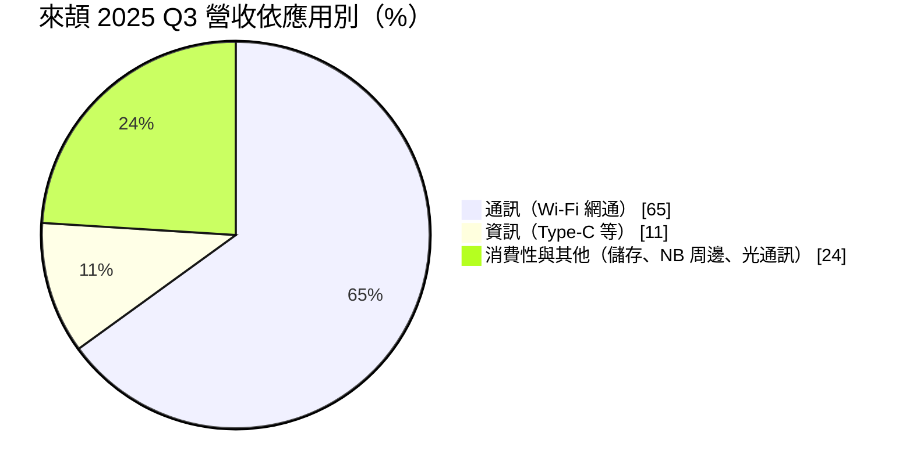
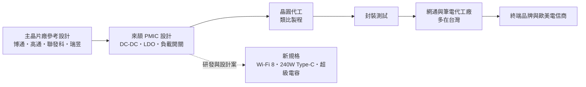
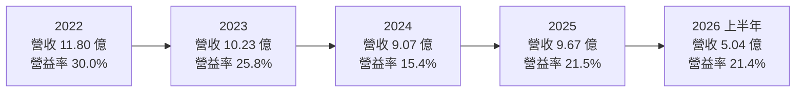
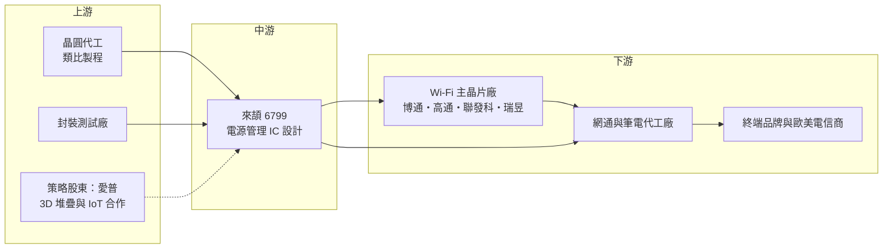

# 6799 來頡

> 上市｜[[產業索引-半導體業|半導體業]]｜上市（櫃）日期 2022/05/12

# 第一章：企業模式與商業藍圖

> [!info] 撰寫說明
> 本文由 Claude 依公開資料整理，架構比照 [[2330台積電]] 的四章研究，資料截至 2026-10-08。財務數字來源：證交所開放資料（基本資料、2026 年第二季綜合損益與資產負債、股利）、HiStock 嗨投資歷年季度損益表與每股盈餘、富果研究 2025 年 11 月法說會整理、CMoney 產業筆記；產業描述為整理性內容，尚未逐條比對原始文件。#待校對

在評估一家 IC 設計公司的長期價值時，第一步是弄清楚它靠什麼賺錢、客戶為什麼找它，以及這種模式能否在十年後依然成立。本章針對來頡科技（股票代號：6799，以下簡稱來頡）的商業模式進行定性分析，說明一家專做電源管理晶片的小型設計公司，如何在網通設備這個利基市場裡站穩位置，又為什麼要持續往新應用延伸。

## 一、核心定位：網通設備的電源管理晶片專家

來頡成立於 2010 年，總部位於台北內湖，2022 年 5 月在證交所上市，實收資本額約 4.37 億元。它是一家 [[Fabless]] 的類比與混合訊號 IC 設計公司，自己不擁有晶圓廠，產品交給晶圓代工廠生產，再由封測廠完成後出貨給客戶。公司的英文簡稱為 M3TEK。股權上，[[6531愛普]] 是主要法人股東，依 CMoney 整理的券商報告，愛普以約 5 億元取得約 9.5% 股權，目前董事長也由愛普指派的法人代表擔任；市場也常把來頡歸類為與聯電集團有淵源的設計公司。

來頡的產品是 [[PMIC]]（電源管理 IC），包括 DC-DC 轉換器、低壓差穩壓器（LDO）、負載開關、電池管理與過電壓保護晶片。這類晶片的工作很單純：把電源供應器或電池的電壓，轉換成主晶片、記憶體與射頻元件需要的各種精準電壓。單顆價格不高，但每一台路由器、筆電或 SSD 都需要好幾顆，而且只要供電不穩，整台設備就會當機或燒毀，所以客戶非常重視可靠度與長期供貨。

來頡最重要的定位，是成為 Wi-Fi 主晶片廠的「參考設計夥伴」。依 CMoney 整理，來頡是 [[AVGO博通]] Wi-Fi 5 電源管理晶片供應鏈的一員，並配合博通開發 [[Wi-Fi 7]] 平台，也與 [[QCOM高通]]、[[2454聯發科]]、[[2379瑞昱]] 合作。網通設備廠在設計新產品時，通常直接採用主晶片廠提供的參考設計，參考設計裡指定的電源晶片因此容易被整批採用，這是來頡營收的主要來源。

## 二、終端應用／產品板塊：網通占三分之二

依富果研究整理的 2025 年 11 月法說會資料，來頡 2025 年第三季的營收結構如下：

* **通訊（Wi-Fi 網通）：** 約占 65%，是最大板塊。產品用在 Wi-Fi 6/6E/7 路由器、家用閘道器、Cable Modem 與光纖終端設備。公司在法說會表示 Wi-Fi 7 自 2025 年第一季導入後出貨持續增加，並預估 2026 年成為主流；為 Wi-Fi 8 主控晶片開發的電源方案，預計 2027 年下半年進入設計導入階段。網通設備的規格每三到四年換一代，每一代都需要重新設計電源，這給了來頡持續爭取新設計案的機會。
* **資訊（Type-C）：** 約占 11%。產品是筆電與周邊的 [[USB PD]] 高功率電源晶片，公司已開發 140W 的高耐壓產品並導入應用，目標是 240W 規格。功率愈高，晶片要承受的電壓與熱就愈大，技術門檻與單價也愈高。
* **消費性與其他：** 約占 24%，包括 SSD 的過電壓保護晶片、筆電周邊與光通訊的新案。另一個值得注意的方向是[[超級電容]]電源管理晶片，已在高階無線電腦周邊放量出貨，未來鎖定電子貨架標籤（[[ESL]]）、智慧電表等低功耗 [[IoT]] 裝置。

依 CMoney 整理的較早期資料，來頡的地區別營收以台灣占約 79% 為主，這反映的是出貨對象多為台灣的網通代工廠，而真正的終端客戶多是歐美電信商。

## 三、資本轉化邏輯（營運模式）：輕資產、靠設計案滾動

* **輕資產模式：** 來頡不擁有晶圓廠與封測廠，主要資產是工程師、電路設計與客戶關係。依富果整理，2025 年第三季末現金、約當現金及金融資產合計約 12.7 億元，占總資產 72%，負債比率只有 10%。這代表公司不需要大量借錢擴產，獲利大部分可以保留下來或發放股利。
* **設計案驅動營收：** 一顆電源晶片從爭取設計案、送樣、通過客戶驗證，到正式量產，通常要一年以上；但一旦被寫進主晶片廠的參考設計，量產後往往會延續好幾年。所以來頡今天的營收，反映的是兩三年前爭取到的設計案；今天投入的研發，則決定兩三年後的營收。
* **毛利率長期穩定在 46% 至 50%：** 依 HiStock 季度損益表推算，2021 至 2025 年來頡的年度[[毛利率]]都落在 46% 至 50% 之間。即使 2024 年營收衰退，毛利率也沒有明顯下滑，代表產品定價權與客戶黏著度相對穩定，真正影響獲利的是營收規模與營業費用的比例。

## 四、企業長期藍圖：從網通走向 AI 與 IoT 電源

* **鞏固網通，延伸到 Wi-Fi 8：** 公司策略的第一順位是守住網通市場，替下一代 Wi-Fi 提供完整電源方案。網通是來頡最了解、客戶關係最深的市場，只要主晶片廠的參考設計繼續採用來頡，這塊營收就有延續性。
* **往高功率與 [[HPC]] 電源發展：** 依 CMoney 整理，來頡目前產品最大電流約 20A，目標是進入 100A 以上的市場，以因應 AI 運算晶片低電壓、高電流的需求。這是門檻很高、由國際大廠主導的市場，若能切入，將明顯拉高產品單價與成長空間，但時程與成功率都有不確定性（推估）。
* **與愛普的技術結合：** 雙方已共同開發 ESL 系統的超低功耗電源管理技術，並探討把來頡的電源技術與愛普的 3D 堆疊技術結合，應用在 IoT 或 HPC 的電源整合。這是來頡最有想像空間、但也最早期的長期題目。
* **低功耗 IoT：** 超級電容與能量採集的電源晶片，鎖定智慧電表、智慧家電、電子貨架標籤。這類產品單價低、量大、生命週期長，適合作為分散網通集中度的第二支柱。

# 第二章：護城河深度與競爭優勢

護城河指的是一家公司能長期擋住對手、維持超額利潤的結構性優勢。本章分析來頡在電源管理晶片市場的護城河組成、國內外主要競爭對手，以及這些優勢在價格競爭中能守住多少。

## 一、護城河的核心組成要素

來頡的護城河屬於「窄護城河」，主要建立在客戶關係與應用專精，而不是規模或成本優勢。

* **1. 參考設計的轉換成本：** 當一顆電源晶片被寫進 Wi-Fi 主晶片廠的參考設計，下游的網通代工廠就會整批照用，因為換料需要重新驗證整台設備的穩定度與認證。這讓來頡在單一世代的產品週期內有相當的黏著度。不過每次規格換代時，這個優勢都要重新爭取一次。
* **2. 網通應用的專精：** 網通設備對電源雜訊、散熱與長時間運作的穩定度要求高，來頡長年專注在這個領域，累積了與主晶片廠共同調校的經驗。這種「懂應用」的能力，是通用型電源晶片廠不一定願意花時間經營的利基。
* **3. 穩定的毛利率結構：** 2021 至 2025 年毛利率都在 46% 至 50% 之間，代表來頡沒有靠殺價搶單。對小型 IC 設計公司而言，能在景氣下行時維持毛利率，本身就是有定價能力的證據。
* **4. 低負債與高現金比重：** 現金與金融資產占總資產七成以上，讓公司在景氣低谷時仍能維持研發投入，不必為了現金流接低價訂單。

## 二、全球主要競爭對手格局

| 對手 | 定位 | 對來頡的影響 |
|---|---|---|
| 德州儀器（TI）、亞德諾（ADI） | 全球類比 IC 龍頭，產品線最完整，自有晶圓廠 | 成本與產品廣度占優，在高階與車用市場難以撼動 |
| 芯源系統（MPS） | 高效能電源模組與 AI 伺服器電源的領導者 | 在 100A 以上的 HPC 電源市場是主要門檻 |
| 立錡（聯發科旗下） | 台灣最大電源管理 IC 廠，與聯發科平台緊密綁定 | 在聯發科平台的網通與手機電源有天然優勢 |
| [[6138茂達]]、[[8081致新]] | 台灣電源管理與類比 IC 設計同業 | 在筆電、消費性電源直接競爭 |
| 中國電源 IC 設計公司 | 政策支持、價格低 | 在中國市場殺價，但來頡主力市場在歐美與印度，影響相對有限（依 CMoney 整理） |

## 三、優勢轉化：守得住／守不住／觀察重點

* **守得住：** 已進入主晶片廠參考設計的網通電源，尤其是高階 Wi-Fi 7 路由器與電信商閘道器。這類產品認證週期長、出貨穩定，客戶不會為了小幅價差更換電源供應商，因此來頡在這個區塊的毛利率可以維持。
* **守不住：** 規格簡單、通用性高的電源晶片。這類產品任何類比設計公司都做得出來，中國廠商會以低價競爭，來頡在這裡沒有明顯優勢。2024 年營收衰退約 11%、營業利益率由 2023 年的 25.8% 掉到 15.4%，顯示營收規模一縮小，固定的研發費用就會明顯侵蝕獲利。
* **觀察重點：** 第一是 Wi-Fi 8 的設計導入能否延續與博通、高通的合作；第二是 140W 以上 Type-C 與 HPC 高電流產品能否真正量產；第三是超級電容與 ESL 等 IoT 新應用能否成長到占營收一成以上。這三點決定來頡能否從「單一網通利基」轉為「多應用的電源平台」。

# 第三章：財務體質與盈利規模

資料日期：2026-10-08。數字取自證交所開放資料與 HiStock 嗨投資歷年季度損益表（年度數字由四季加總推算），表格是撰寫當時的快照；最新月營收、毛利率、累計 EPS 由自動排程寫在本筆記的屬性欄位（月營收、毛利率、累計EPS 等）。#待校對

財務報表是檢驗護城河是否真實存在的最終標準。本章用三率、[[ROE]]、現金流與資本報酬，檢視來頡在網通景氣循環中的獲利品質。

## 一、獲利能力的基石：三率

| 年度 | 營收（億元） | [[毛利率]] | [[營業利益率]] | EPS（元） | [[ROE]] |
|---|---|---|---|---|---|
| 2021 | 10.55 | 50.2% | 33.1% | 7.51 | 約 40%（期末權益推算） |
| 2022 | 11.80 | 48.2% | 30.0% | 7.58 | 30.3%（推算） |
| 2023 | 10.23 | 46.1% | 25.8% | 5.42 | 16.5%（推算） |
| 2024 | 9.07 | 47.1% | 15.4% | 2.94 | 8.3%（推算） |
| 2025 | 9.67 | 48.2% | 21.5% | 3.70 | 9.8%（推算） |
| 2026 上半年 | 5.04 | 46.2% | 21.4% | 2.41 | 年化約 12.6%（推算） |

註：營收、毛利率、營業利益率由 HiStock 季度損益表加總計算；2026 上半年營收、毛利率與 EPS 與證交所開放資料一致。ROE 以稅後淨利除以期初與期末股東權益平均推算。2022 年股東權益大幅增加，主要來自上市前後的現金增資，因此 2021 年 ROE 偏高、不具可比性。

* **[[毛利率]]相當穩定：** 五年都在 46% 至 50% 之間，代表產品組合與定價沒有因景氣下行而崩壞。這是 IC 設計公司最重要的品質指標之一，因為毛利率反映的是客戶願意為產品價值付多少錢。
* **[[營業利益率]]隨營收規模大幅波動：** 研發人員薪資與設計費用屬於固定成本，營收從 2022 年的 11.8 億元降到 2024 年的 9.07 億元，營業利益率就從 30% 掉到 15.4%。2025 年營收回升約 6.6%，營業利益率就回到 21.5%，這就是 IC 設計公司典型的營運槓桿。
* **業外與匯率影響明顯：** 來頡持有大量外幣現金與金融資產，2025 年第二季因匯兌損失使單季淨利轉為虧損，第三季又因匯兌利益使淨利率高於營業利益率。評估本業應以營業利益為準，不宜只看 EPS。

## 二、[[ROE]]：資本效率

來頡的 ROE 從上市前後的 30% 以上，一路降到 2024 至 2025 年的 8% 至 10%（推算）。下滑有兩個原因：一是營收與營業利益率同步下滑，二是上市募資與保留盈餘讓股東權益從 2021 年底的 6.8 億元增加到 2025 年底的 16.5 億元，但其中大部分以現金與金融資產形式存在，並沒有投入高報酬的營運。以 2021 至 2025 年計算，近五年平均 ROE 約 21%（推算，2021 年用期末權益），但近三年平均只有約 11.5%。換句話說，來頡的本業報酬率不低，但帳上大量閒置現金拉低了整體資本效率。

## 三、資本支出與[[自由現金流]]

* **[[CapEx]] 很低：** 作為 Fabless 設計公司，來頡的資本支出主要是測試設備、光罩與辦公設備，金額遠低於營業現金流（具體數字未查得）。這讓公司在多數年度都能產生正的自由現金流（推估，依輕資產模式與帳上現金持續累積判斷）。
* **股利政策：** 依證交所股利資料，來頡最近一次盈餘分配的現金股利為每股 2.5 元；以 2025 年 EPS 3.70 元計算，配息率約 68%（推算）。高配息率加上低資本支出，代表公司的現金主要回饋給股東，而非用於擴張。
* **營收年複合成長率：** 2021 至 2025 年營收由 10.55 億元變為 9.67 億元，年複合成長率約 -2.2%（推算），顯示公司仍處於等待下一波網通換代與新應用放量的階段。

## 四、[[ROIC]] 與 [[WACC]]：價值創造利差

* **ROIC（推算）：** 以 2025 年營業利益 2.07 億元乘以（1－20% 稅率），得到稅後營業利益約 1.66 億元；投入資本以 2025 年底股東權益 16.54 億元加上非流動負債約 0.02 億元（來頡幾乎沒有有息負債，以非流動負債作為上限近似）計算，約 16.56 億元。ROIC 約為 1.66 ÷ 16.56 ≈ 10.0%。以 2026 年上半年營業利益 1.08 億元年化計算，ROIC 約 10.5%（推算）。若扣除帳上大量現金只看營運資產，實際的營運資本報酬率會明顯更高。
* **WACC（推算）：** 用資本資產定價模型（CAPM）推估。無風險利率取台灣 10 年期公債約 1.75%，市場風險溢酬取 6%，β 值取中小型 IC 設計股常見的 1.2（假設值，未查得來頡的官方 β），股東權益成本約為 1.75% + 1.2 × 6% = 8.95%。由於來頡幾乎沒有有息負債，WACC 約等於股東權益成本，約 9%。
* **價值創造判斷：** 2025 年 ROIC 約 10% 略高於 WACC 約 9%，利差只有 1 個百分點左右；但在 2021 至 2023 年營益率 25% 以上的時期，ROIC 遠高於 WACC（推估）。這代表來頡的本業具備創造價值的能力，但要長期維持明顯的正利差，需要營收重回 11 億元以上的規模，或更有效率地運用帳上現金。

# 第四章：總體風險與地緣政治

任何企業都無法脫離宏觀環境獨立存在。本章分析來頡在地緣政治、產業週期、營運集中度與技術演進上面臨的長期風險。

## 一、地緣政治

* **美中科技戰與供應鏈重組：** 來頡的出貨對象多是台灣網通代工廠，但終端市場在歐美電信商與印度。美國對中國通訊設備的限制，反而讓歐美電信商更傾向使用非中國的晶片與電源方案，這對來頡是相對有利的結構。不過公司在法說會也把地緣政治與美中科技戰列為主要風險，因為關稅與出口管制一旦擴大，網通設備的生產地與採購決策都可能改變。
* **生產集中在亞洲：** 來頡的晶圓代工與封測都在亞洲完成，台海情勢若升溫，客戶可能要求第二供應來源或不同地區的生產，增加營運成本。

## 二、產業週期與市場結構

* **網通設備的換代週期：** 網通營收占六成以上，Wi-Fi 規格大約每三到四年換一代。換代初期出貨強勁，換代尾聲則容易出現庫存調整。2023 至 2024 年的營收下滑，就是 Wi-Fi 6 世代成熟加上終端庫存去化的結果。
* **[[長鞭效應]]：** 電信商與網通品牌的庫存調整，會沿著代工廠、模組廠一路放大到上游晶片。2025 年第四季公司曾表示，DDR4 記憶體缺貨導致網通客戶出貨延遲，影響電源晶片拉貨，這說明來頡的營收不只受自己的產品影響，也受其他零組件供應的牽動。
* **匯率：** 營收與資產以美元為主，新台幣升值會造成匯兌損失。2025 年第二季的單季淨損，就是匯率波動對業外的直接衝擊。

## 三、營運環境的隱性風險

* **客戶與應用集中：** 網通單一應用占三分之二，主晶片廠又集中在少數幾家。若主要主晶片廠在新一代平台改用其他電源供應商，或自行整合電源功能，來頡的營收會受到明顯衝擊。
* **規模偏小：** 年營收約 10 億元，研發資源遠少於國際類比大廠。要同時經營 Wi-Fi 8、高功率 Type-C、HPC 電源與 IoT 超級電容，資源分配是長期挑戰。
* **大股東變動：** 愛普改派法人代表擔任董事長，公司表示對營運方向無影響，但大股東策略的變化，仍是投資人需要追蹤的治理因素。

## 四、科技或法規演進

* **電源整合趨勢：** 主晶片廠有把部分電源功能整合進系統單晶片或封裝內的趨勢，若外掛電源晶片的數量減少，來頡的出貨顆數會被壓縮。反過來說，愛普的 3D 堆疊與電源整合技術，也可能讓來頡參與這個整合趨勢。
* **AI 帶來的高功率需求：** AI 伺服器與 AI PC 需要更高電流、更高效率的電源，這是成長機會，但市場由國際大廠主導，來頡能否在 100A 以上市場取得實質營收，仍需觀察。
* **能源效率法規：** 各國對電子產品待機耗電與充電器效率的規範愈來愈嚴，有利於高效率電源晶片的需求，也提高產品設計的門檻。

# 專有名詞解析

## 半導體

- **[[PMIC]]**：電源管理 IC，負責把電源轉換成晶片需要的各種精準電壓，幾乎所有電子產品都需要多顆。
- **[[Fabless]]**：只做晶片設計、把製造交給晶圓代工廠的商業模式，資產輕、研發占成本大宗。

## 應用

- **[[Wi-Fi 7]]**：IEEE 802.11be 無線網路標準，傳輸速度與頻寬大幅提升，帶動路由器與終端設備換機。
- **[[USB PD]]**：USB Power Delivery 快充協定，透過 Type-C 介面提供最高 240W 的供電，筆電與周邊大量採用。
- **[[超級電容]]**：可快速充放電、壽命很長的儲能元件，適合能量採集與低功耗 IoT 裝置的備援電源。
- **[[ESL]]**：電子貨架標籤，以電子紙顯示商品價格，耗電極低、數量龐大，需要超低功耗電源管理。
- **[[IoT]]**：物聯網，把感測器與連網功能放進家電、電表、工業設備等各種裝置。
- **[[HPC]]**：高效能運算，包括 AI 伺服器與資料中心晶片，需要低電壓、大電流的電源供應。

## 金融

- **[[毛利率]]**：營業毛利占營收的比例，反映產品定價能力與成本結構。
- **[[營業利益率]]**：營業利益占營收的比例，扣除研發與管銷費用後的本業獲利能力。
- **[[ROE]]**：股東權益報酬率，稅後淨利除以股東權益，衡量股東資金的使用效率。
- **[[ROIC]]**：投入資本報酬率，稅後營業利益除以股東權益加有息負債，衡量本業創造報酬的能力。
- **[[WACC]]**：加權平均資金成本，股東權益成本與負債成本依資本結構加權，ROIC 高於它才代表創造價值。
- **[[長鞭效應]]**：終端需求的小幅變動，沿供應鏈往上游傳遞時被逐級放大，造成上游庫存與訂單劇烈波動。

# 核心供應鏈

## 1. 上游：晶圓代工、封測與策略股東
- 主要法人股東與技術合作：[[6531愛普]]（ESL 超低功耗電源、3D 堆疊電源整合）
- 晶圓代工與封測：類比製程代工廠與封測廠（具體廠商未查得）

## 2. 中游：電源管理 IC 設計同業
- 台灣同業：[[6138茂達]]、[[8081致新]]、立錡（聯發科旗下）
- 國際大廠：德州儀器、亞德諾、芯源系統

## 3. 下游：主晶片平台夥伴
- Wi-Fi 與網通主晶片：[[AVGO博通]]、[[QCOM高通]]、[[2454聯發科]]、[[2379瑞昱]]
- 嵌入式控制器搭配：[[3014聯陽]]

## 4. 下游：終端應用
- Wi-Fi 6/6E/7 路由器、家用閘道器、Cable Modem、光纖終端設備
- 筆電 Type-C 電源、SSD、無線電腦周邊、電子貨架標籤

延伸閱讀：[[聯發科供應鏈]]

## 最新新聞
<!-- news:start -->
<!-- news:end -->

## 相關連結
- [公開資訊觀測站](https://mopsov.twse.com.tw/mops/web/t05st03?step=1&firstin=1&co_id=6799)
- [Goodinfo](https://goodinfo.tw/tw/StockDetail.asp?STOCK_ID=6799)
- [Yahoo 股市](https://tw.stock.yahoo.com/quote/6799)
- [鉅亨網新聞](https://www.cnyes.com/twstock/6799/news)
