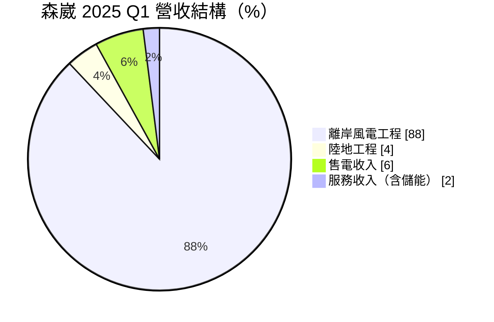
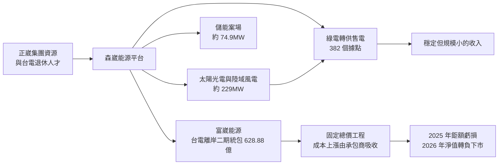
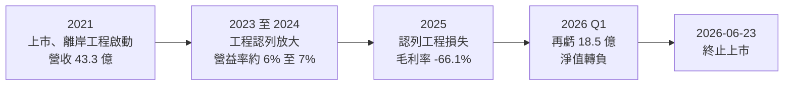
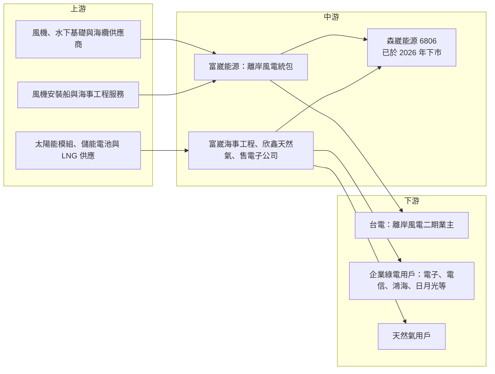

# 6806 森崴能源

> 上市｜[[產業索引-綠能環保|綠能環保]]｜上市（櫃）日期 2021/11/15

# 第一章：企業模式與商業藍圖

> [!info] 撰寫說明
> 本文由 Claude 依公開資料整理，架構比照 [[2330台積電]] 的四章研究，資料截至 2026-10-08。財務數字來源：Goodinfo 年度經營績效頁與基本資料頁、富果研究 2025 年 6 月法說會整理、Inside（2026 年下市報導）、科技新報（2021 年公司介紹、2026 年 4 月調解報導）、ETtoday 財經（2026 年報導）；森崴能源已於 2026 年 6 月 23 日終止上市，證交所開放資料快照中已無其紀錄。產業描述為整理性內容，尚未逐條比對原始文件。#待校對

森崴能源（股票代號：6806，以下簡稱森崴）從 2021 年掛牌到 2026 年下市，只有短短不到五年。它的興衰是台灣能源轉型過程中最具代表性的案例之一：一家以綠電售電與工程起家的公司，承接了遠超過自身資本規模的離岸風電統包工程，最終因工程虧損使淨值轉負而下市。本章以「事後檢討」的角度分析森崴的商業模式，重點在於這個模式原本的設計，以及它在哪裡出了問題。

## 一、核心定位：正崴集團旗下的綜合能源平台

森崴成立於 2007 年，是連接器大廠 [[2392正崴]] 集團投資的子公司，董事長為正崴集團負責人郭台強，2021 年 11 月在證交所上市（科技新報，2021 年 12 月轉載商業周刊報導；Goodinfo 基本資料）。報導指出，郭台強在能源領域布局約 14 年，集團每展開一項新能源事業，就在森崴之下設立子公司，管理層中有多位台電退休人員。公司提出的策略是打造「光、風、水、氣」的綜合能源平台：

* **綠電開發與售電：** 興建並經營太陽光電與陸域風電場，透過[[綠電]]轉供把電力賣給企業用戶。截至 2025 年中，已轉供 382 個據點、供電量約 4.8 億度，太陽光電與陸域風電裝置容量合計約 229.2MW，客戶包括電子業、電信業與鴻海、日月光等集團（富果研究，2025 年 6 月法說）。
* **能源工程（[[EPC]]）：** 替電廠進行設計、採購與施工的[[統包工程]]，最大案件是子公司富崴能源承攬的台電離岸風力發電第二期計畫。
* **儲能：** 經營 5 個[[儲能]]案場，合計約 74.9MW（富果研究）。
* **天然氣：** 子公司欣鑫天然氣於 2019 年取得液化天然氣進口執照，報導指出是中油以外唯一可進口 LNG 的民間公司（科技新報，2021 年；富果研究）。

## 二、終端應用／產品板塊：工程收入主導營收

依富果研究整理的 2025 年 6 月法說，2025 年第一季森崴合併營收約 56.94 億元，結構如下：

註：工程業務合計 92%，其中離岸風電 88%、彰濱陸地工程約 3%，其餘工程約 1% 併入陸地工程。

這張圖說明了森崴最大的結構問題：原本被視為核心的綠電售電與儲能，合計只占營收約 8%，營收的九成來自單一離岸風電統包案。這代表森崴的財務表現，幾乎完全取決於這一個工程案的成敗。

## 三、資本轉化邏輯（營運模式）：從穩定售電到高風險統包

* **售電與儲能：收入穩定、規模有限。** 綠電轉供與儲能服務屬於長期合約型收入，現金流穩定，但需要先投入大量資本建置電廠，且收入成長受限於案場開發速度。
* **離岸風電統包：營收龐大、風險集中。** 富崴能源於 2020 年得標台電離岸風電二期統包工程，合約金額約 628.88 億元（含約 63 億元的五年維運），裝置容量 300MW、需安裝 31 座風機基礎（富果研究）。報導指出此案過去曾流標八次（科技新報，2021 年），得標當時也有競爭者提醒報價偏低、財務風險高（ETtoday，2026 年）。
* **固定總價合約的陷阱：** 統包工程多採固定總價，履約期間的成本上漲原則上由承包商吸收。施工期間遇上新冠疫情、俄烏戰爭推升通膨、燃油與船舶租金，加上風機安裝船供不應求，工程成本大幅墊高，富崴實際支付給上游廠商的金額明顯超過台電已支付的工程款，媒體估計整個專案累積虧損近 200 億元（Inside，2026 年）。

## 四、企業長期藍圖與結局

* **原本的藍圖：** 森崴希望透過台電二期工程，成為唯一具備離岸風場 EPC 能力的本土業者（科技新報，2021 年），並在 2025 年 5 月完成另一個 700MW 新案場的行政契約，預計 2029 年完工併網（富果研究）。同時成立富崴海事工程，切入[[海事工程]]服務。
* **實際結局：** 2025 年全年虧損約 159 億元、每股虧損約 60 元，會計師對繼續經營能力出具重大不確定性意見，銀行團累計收回授信逾 35 億元；2026 年第一季再虧約 18.5 億元，淨值轉負，證交所公告於 2026 年 6 月 23 日終止上市，影響逾 3 萬名股東（Inside，2026 年）。董事會原通過約 30 億元的[[私募增資]]但引資不順，郭台強在股東會上向股東致歉。
* **與台電的調解：** 2026 年 4 月，富崴經公共工程委員會調解，取得台電同意追加約 55.57 億元工程款（科技新報，2026 年 4 月），但這筆款項需專款專用於風機安裝，無法挪用來彌補母公司的虧損（Inside）。

# 第二章：護城河深度與競爭優勢

在長期價值投資中，「護城河」指企業抵禦競爭、維持超額利潤的保護機制。森崴的案例提醒投資人：看似獨特的地位與政策支持，不一定等於護城河，反而可能是風險的來源。本章分析森崴當初被認為擁有的優勢，以及這些優勢為何沒有保護住股東。

## 一、森崴當初被認為具備的優勢

* **1. 綜合能源平台的稀缺性：** 同時擁有售電、綠電開發、儲能、天然氣進口與工程能力，在台灣民間能源業者中相當少見。
* **2. 本土離岸風電統包資格：** 承接台電二期統包，使森崴成為少數具離岸風電工程經驗的本土業者，符合政府離岸風電國產化政策。
* **3. 集團與人才背景：** 正崴集團的資源，以及熟悉電力工程與執照程序的台電退休人員。

## 二、全球主要競爭對手格局

| 對手 | 定位 | 與森崴的比較 |
|---|---|---|
| 國際離岸風電統包與海事工程商 | 歐洲大型海事工程與風機安裝公司 | 擁有自有安裝船與長期經驗，能更準確估算成本與風險 |
| 台灣綠電開發商與售電業者 | 例如 [[6869雲豹能源]] 等 | 專注太陽光電與售電，不承接大型海上工程，風險較低 |
| 台灣電力工程與重電廠 | [[1513中興電]]、[[1519華城]]、[[1503士電]] 等 | 提供電力設備與工程，但以設備銷售為主，不承擔整個風場統包 |
| 離岸風電零組件國產化廠商 | [[9958世紀鋼]] 等 | 專注水下基礎等單一環節，風險邊界較清楚 |

## 三、優勢轉化：為何守不住

* **稀缺性不等於定價權：** 台電二期案流標多次後由森崴得標，代表在當時的價格條件下，經驗豐富的國際廠商不願承接。森崴得到的不是護城河，而是別人不願承擔的風險。
* **集中度過高：** 營收約九成來自單一工程案，任何成本失控都會直接衝擊整家公司。穩定的售電與儲能業務規模太小，無法吸收工程虧損。
* **資本規模不足：** 森崴股本約 27 億元，卻承接金額超過 600 億元的固定總價工程。當成本超支達到上百億元時，股東權益很快就被侵蝕殆盡。
* **給投資人的啟示：** 評估工程與專案型公司時，應特別留意單一案件占營收的比重、合約是否為固定總價、是否有物價調整條款，以及案件金額相對於公司淨值的倍數。這些指標在森崴上市初期就已經可以觀察到。

# 第三章：財務體質與盈利規模

資料日期：2026-10-08。數字取自 Goodinfo 年度經營績效頁與財經媒體報導，森崴已於 2026 年 6 月 23 日終止上市，表格是撰寫當時的快照；下市後自動排程可能不再更新本筆記的屬性欄位。#待校對

財務報表是檢驗護城河是否真實存在的最終標準。森崴的財務數字完整呈現了一家專案型公司從快速成長到崩潰的過程，本章用多年度的三率、ROE 與資本報酬加以檢視。

## 一、獲利能力的基石：三率

| 年度 | 營收（新台幣） | [[毛利率]] | [[營業利益率]] | EPS（元） | [[ROE]] |
|---|---|---|---|---|---|
| 2019 | 4.43 億 | 17.3% | 4.37% | 1.39 | 3.76% |
| 2020 | 5.24 億 | 27.9% | 2.12% | 2.86 | 24.4% |
| 2021 | 43.3 億 | 19.4% | 14.0% | 3.78 | 12.2% |
| 2022 | 43 億 | 12.7% | 5.87% | 1.14 | 2.89% |
| 2023 | 112 億 | 10.4% | 7.02% | 2.94 | 5.45% |
| 2024 | 196 億 | 10.2% | 5.91% | 3.58 | 5.08% |
| 2025 | 261 億 | -66.1% | -70.3% | -60 | -301% |
| 2026 第一季 | 未查得 | 未查得 | 未查得 | 未查得 | 淨值轉負 |

註：2019 至 2025 年取自 Goodinfo 年度經營績效；2025 年營收另見科技新報 260.64 億元，全年虧損約 159 億元見 Inside 報導；2026 年第一季虧損約 18.5 億元（Inside）。

* **[[毛利率]]：** 隨著離岸風電工程占比提高，毛利率從 2021 年的 19.4% 降到 2023 至 2024 年的約 10%。工程統包的毛利率本來就低，加上成本持續上升，利潤空間愈來愈薄；2025 年認列工程損失後，毛利率變成 -66.1%。
* **營收與獲利脫鉤：** 2021 至 2024 年營收成長約 4.5 倍，但 EPS 只從 3.78 元變成 3.58 元。營收快速成長而獲利沒有跟上，是工程案成本壓力的早期警訊。
* **工程收入的認列方式：** 統包工程通常依完工進度認列營收與成本，若後期發現總成本將超過合約價，必須一次認列預估損失。這就是 2025 年虧損集中爆發的原因。

## 二、[[ROE]]：資本效率

2021 至 2024 年的平均 ROE 約 6.4%（推算），對一家掛牌時被視為成長股的公司而言並不高。2025 年 ROE 為 -301%，一年內幾乎把歷年累積的股東權益全部虧光。這說明 ROE 的長期平均必須和最壞情境一起看：專案型公司可能連續幾年賺取平穩的低報酬，再在一年內虧掉多年的累積。

## 三、資本支出、自由現金流與股利

森崴同時需要投入電廠建置的資本支出，以及墊付離岸風電工程的營運資金。報導指出富崴實付上游廠商的金額明顯超過台電已付工程款（Inside），代表工程案長期處於現金流出狀態；加上 2025 年銀行團收回授信逾 35 億元，[[自由現金流]]在 2025 年應為大幅負值（推估，具體金額未查得）。股利紀錄未查得，下市後已無配息可能。

## 四、[[ROIC]] 與 [[WACC]]：價值創造利差

**ROIC 推算：** 2024 年營業利益約 11.6 億元（營收 196 億元 × 營業利益率 5.91%），扣除 20% 稅率後約 9.3 億元。由於下市後資產負債資料已不在官方開放資料中，投入資本未查得；以 2023 至 2024 年 ROE 約 5% 與當時使用銀行借款的情況推估，ROIC 約 3% 至 5%（推估）。2025 年營業虧損約 183 億元（營收 261 億元 × 營業利益率 -70.3%，推算），ROIC 為大幅負值。

**WACC 推算：** 假設台灣 10 年期公債殖利率 1.75%、市場風險溢酬 6%、β 取能源工程業常見值 1.0（假設值），股東權益成本約 7.75%。負債成本假設 3%、稅後約 2.4%，假設權益與負債各半，WACC 約 5.1%（推算）。

**結論：** 即使在 2023 至 2024 年營運看似正常時，森崴的 ROIC 也只與 WACC 大致打平，並未創造明顯的超額價值；2025 年的工程損失則讓多年的股東資本一次蒸發。這是「高風險、低報酬」的典型組合：承擔了遠超過資本規模的風險，卻只換來接近資金成本的報酬。

# 第四章：總體風險與地緣政治

任何企業都無法脫離宏觀環境獨立存在。本章整理森崴所面對的總體風險，作為分析其他能源與工程類公司的參考。

## 一、地緣政治

* **俄烏戰爭與全球通膨：** 公司在調解申請中表示，俄烏戰爭與新冠疫情推升通膨與利率，使工程成本顯著增加（科技新報，2026 年 4 月）。離岸風電工程高度依賴進口設備、鋼材與國際安裝船，國際情勢的變化會直接反映在成本上。
* **能源政策的政治性：** 離岸風電是政府能源轉型的重要政策，森崴下市後也引發政治討論。經濟部表示這屬個別企業的財務與風險控管問題，不影響整體離岸風電招商信心（Inside）。能源類公司的經營環境，容易受到政策方向與政治氛圍影響。

## 二、產業週期與市場結構

* **離岸風電供應鏈瓶頸：** 全球離岸風電同時擴張，風機安裝船、海事工程人力與關鍵零組件供不應求，承包商在議價上處於弱勢。
* **綠電市場的長期需求：** 企業為達成 RE100 等減碳目標，對綠電的需求長期成長，這是森崴售電業務的基礎；但這類業務需要長期累積案場，短期無法撐起大規模營收。

## 三、營運環境的隱性風險

* **固定總價合約風險：** 合約價格在得標時就已確定，若缺乏充分的物價調整條款，所有成本上漲都由承包商吸收。這是森崴虧損的根本原因。
* **母子公司結構與專款專用：** 工程合約的簽約對象是子公司富崴，台電追加的工程款需專款專用（Inside），母公司無法用來改善整體財務狀況。投資人分析集團型公司時，需要留意資金在各子公司之間能否自由流動。
* **融資依賴：** 工程墊款仰賴銀行融資，一旦財務出現警訊，銀行收回授信會使流動性問題迅速惡化。

## 四、科技或法規演進

* **離岸風電技術與規模放大：** 風機單機容量愈來愈大，施工技術與安裝船規格也隨之升級，本土業者若缺乏自有船隊與經驗，成本估算的難度更高。
* **政府採購調解機制：** 富崴依政府採購法申請調解並取得追加款，顯示公共工程的爭議處理機制可以部分彌補承包商損失，但時程漫長、金額有限，無法替代事前的風險控管。

# 專有名詞解析

## 金融

- **[[私募增資]]**：公司以非公開方式向特定投資人發行新股籌資，股票通常有閉鎖期，常用於財務困難或引進策略投資人。
- **[[ROE]]**：股東權益報酬率，稅後淨利除以股東權益，衡量公司運用股東資金賺錢的效率。
- **[[ROIC]]**：投入資本報酬率，稅後營業利益除以股東權益加有息負債，衡量本業運用全部資本的效率。
- **[[WACC]]**：加權平均資金成本，股東權益成本與負債成本依資本結構加權的平均值，是投資報酬的最低門檻。
- **[[自由現金流]]**：營業活動現金流減去資本支出，代表企業可自由用於配息、還債或併購的現金。

## 產業

- **[[EPC]]**：設計、採購與施工一次包辦的工程承攬模式，承包商負責交付完整可運轉的設施。
- **[[統包工程]]**：由單一承包商負責整個工程從設計到完工的承攬方式，通常採固定總價，成本超支風險由承包商承擔。
- **[[綠電]]**：以太陽能、風力、水力等再生能源產生的電力，可透過轉供或憑證交易提供給企業使用。
- **[[儲能]]**：以電池等設備儲存電力並在需要時釋放，可平衡再生能源發電的不穩定，並提供電網輔助服務。
- **[[海事工程]]**：在海上進行的施工與運輸作業，例如離岸風電的基礎安裝、海纜鋪設與船舶支援。
- **[[離岸風電]]**：在海上興建的風力發電場，風況較陸地穩定，但施工與維護成本高、技術門檻高。
- **[[RE100]]**：企業承諾 100% 使用再生能源電力的國際倡議，帶動企業對綠電的長期需求。

# 核心供應鏈

## 1. 上游：設備與工程服務
- 離岸風電設備：風機、水下基礎、海纜供應商（未逐一查證）
- 台灣離岸風電零組件廠：[[9958世紀鋼]]（未查證與森崴的直接交易）
- 海事工程：國際風機安裝船與海事工程商

## 2. 中游：森崴本身與集團
- 母公司：[[2392正崴]]
- 子公司：富崴能源（離岸風電統包）、富崴海事工程、欣鑫天然氣、售電與儲能子公司

## 3. 下游：業主與用電戶
- 離岸風電二期業主：台電
- 企業綠電用戶：電子業、電信業、鴻海、日月光集團等
- 同業參考：[[6869雲豹能源]]、[[1513中興電]]、[[1519華城]]

## 最新新聞
<!-- news:start -->
<!-- news:end -->

## 相關連結
- [公開資訊觀測站](https://mopsov.twse.com.tw/mops/web/t05st03?step=1&firstin=1&co_id=6806)
- [Goodinfo](https://goodinfo.tw/tw/StockDetail.asp?STOCK_ID=6806)
- [Yahoo 股市](https://tw.stock.yahoo.com/quote/6806)
- [鉅亨網新聞](https://www.cnyes.com/twstock/6806/news)
