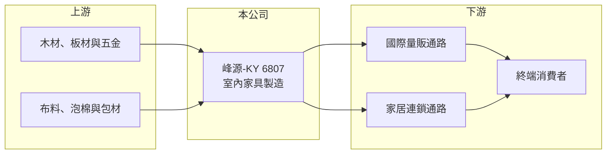

# 6807 峰源-KY

> 上市｜[[產業索引-居家生活|居家生活]]｜上市（櫃）日期 2022/04/25

# 第一章：企業模式與商業藍圖

> [!info] 撰寫說明
> 精簡版，由 Claude 依公開資料整理，架構比照 [[2330台積電]]，資料截至 2026-10-08。來源：MoneyDJ 理財網財務比率年表（2021 至 2025 年）與個股基本資料（2025 年營收比重）、證交所公開資料彙整的 2026 年第二季財報與股利資料、科技新報與 Yahoo 股市 2022 年報導標題。公開資料有限，客戶與生產據點細節未逐條查證。#待校對

峰源-KY 是以開曼控股公司來台上市的室內家具製造商，2025 年營收全部來自室內家具，商業模式是替海外大型量販與家居通路生產家具。

- **核心業務：** 峰源集團 2019 年在開曼群島設立控股公司，2022 年 4 月在台灣上市，屬於 [[KY股]]。公司替國際零售通路生產室內家具，產品掛客戶或通路的品牌銷售，本質上是家具的 [[OEM]]／[[ODM]] 製造商。這類公司的價值在於能否用穩定的品質與交期，長期留在大型通路的供應商名單中。
- **營收結構：** 依 MoneyDJ 資料，2025 年室內家具占營收 100%，產品線高度集中。好處是管理單純、規模經濟明確，缺點是營收完全跟著歐美家具消費與通路補貨週期起伏，沒有其他事業可以分散。
- **營運據點：** 公司對外聯絡窗口在台北，註冊地在開曼群島；實際生產據點本次未查得細節，依家具外銷產業慣例推估以東南亞為主。投資人閱讀時應注意 KY 公司的主要資產與營運多在海外。
- **長期方向：** 2022 年媒體以「好市多、IKEA 都找他」形容峰源，代表公司長期經營的是全球大型量販與家居通路客戶。長期成長取決於能否在這些通路擴大品項、拿到新的產品線，以及在美國關稅與供應鏈移轉中維持成本競爭力。

# 第二章：護城河深度與競爭優勢

峰源的優勢不是品牌，而是被大型通路長期採用的製造與交期能力，護城河偏窄但有一定黏著度。

- **競爭優勢：** 大型量販通路對供應商的品質稽核、包裝規格與交期要求嚴格，新廠商要通過驗證並建立信任需要多年。峰源在疫情期間仍維持獲利、2024 年營收創新高，顯示它在既有客戶中具備一定的供貨地位。
- **主要對手：** 同業包括越南、中國與馬來西亞的大量家具代工廠，台股中可對照 [[8482商億-KY]]、[[8066來思達]] 等外銷家具業者。家具製造進入門檻不高，通路客戶隨時可以比價轉單，因此毛利率長期只有 16% 至 20%。
- **觀察重點：** 長期要看客戶集中度是否下降、產品是否往單價較高的品項移動，以及毛利率能否維持在 18% 以上。2026 年上半年毛利率約 15.9%、營業利益率僅 1.7%，顯示需求轉弱時獲利會被快速壓縮。

# 第三章：財務體質與盈利規模

資料日期：2026-10-08，表格是撰寫當時的快照；最新月營收、毛利率、累計 EPS 由自動排程寫在本筆記的屬性欄位（月營收、毛利率、累計EPS 等）。#待校對

峰源的營收在 40 億元上下波動，獲利隨通路補貨週期起伏，2024 年是近五年高峰。

| 年度 | 營收（億元） | [[毛利率]] | [[營業利益率]] | EPS（元） | [[ROE]] |
|---|---|---|---|---|---|
| 2021 | 約 41.8（推算） | 19.55% | 5.55% | 4.71 | 14.29% |
| 2022 | 約 42.1（推算） | 16.13% | 1.87% | 3.28 | 9.60% |
| 2023 | 約 37.5（推算） | 18.34% | 6.06% | 4.41 | 11.65% |
| 2024 | 約 50.0（推算） | 18.49% | 9.50% | 8.88 | 20.49% |
| 2025 | 約 42.6（推算） | 18.53% | 7.26% | 4.69 | 9.77% |

註：2025 年營收以每股營業額 78.95 元乘以 5,400 萬股推算，其他年度依 MoneyDJ 營收成長率回推。

- **長期指標：** 2021 至 2025 年營收年複合成長率約 0.5%（推算），近 5 年平均 ROE 約 13.2%（推算）。2025 年度配發現金股利 2.5 元，約占當年 EPS 的 53%，配息政策屬中等水準。自由現金流資料本次未查得。
- **[[ROIC]] 與 [[WACC]]：** 2025 年稅後營業利益約 2.5 億元（營收約 42.6 億元 × 營業利益率 7.26% × 0.8），投入資本約 29.7 億元（2026 年第二季股東權益約 25.1 億元，加上以總負債約 9.2 億元的一半推估的有息負債約 4.6 億元），ROIC 約 8.3%（推算）；2024 年高峰時約 12.8%（推算）。WACC 約 6.4%（推算：無風險利率 1.75%、市場風險溢酬 6%、β 取家具製造同業常見值 0.9，股東權益成本 7.15%；稅前負債成本 2.5%、稅率 20%；權益比重約 85%）。ROIC 多數年度略高於 WACC，代表本業有小幅創造價值，但利差不大，獲利一轉弱就可能跌破資金成本。
- **財務特色：** 負債比率從 2021 年的 49% 降到 2025 年的 29%，每股淨值由 33.84 元升到 48.28 元，財務結構保守。缺點是營業利益率只有個位數，營收波動 10% 至 15% 就會讓 EPS 大幅變動，這是代工製造的[[營運槓桿]]特性。

# 第四章：總體風險與地緣政治

峰源的風險集中在歐美家具消費週期、通路客戶的議價力與貿易政策。

- **產業週期：** 家具屬於非必需的耐久財，需求跟著美國房市成交、利率與消費信心走。零售通路在景氣轉弱時會先去化庫存、減少下單，形成[[長鞭效應]]，讓上游代工廠的營收波動大於終端銷售。
- **營運風險：** 客戶多為大型量販與家居通路，議價力強，原物料與運費上漲時代工廠不一定能轉嫁。客戶集中度高也代表失去單一大客戶就會對營收造成明顯衝擊。
- **其他風險：** 美國對亞洲家具進口的關稅與原產地規定會影響生產布局與成本；營收以美元計價為主，新台幣升值會壓縮換算後的獲利。作為 KY 公司，海外資產的資訊透明度與跨境監理也是投資人需要留意的面向。

# 專有名詞解析

## 金融

- **[[KY股]]**：在開曼群島等境外註冊、來台上市櫃的公司，營運據點多在海外，資訊揭露與法規環境與本國公司不同。
- **[[營運槓桿]]**：固定成本占比高時，營收小幅變動會讓營業利益大幅變動的現象。
- **[[長鞭效應]]**：終端需求的小幅變動，沿供應鏈往上游傳遞時被逐級放大，造成上游庫存與訂單劇烈波動。
- **[[ROIC]]**：投入資本報酬率，稅後營業利益除以股東權益加有息負債，衡量本業運用資本的效率。
- **[[WACC]]**：加權平均資金成本，股東與債權人要求報酬率的加權平均，是 ROIC 要超越的門檻。

## 產業

- **[[OEM]]**：原廠委託製造，代工廠依品牌客戶的設計與規格生產，產品掛品牌商的商標。
- **[[ODM]]**：原廠委託設計製造，代工廠負責產品設計與生產，產品掛品牌客戶的名稱銷售。

# 核心供應鏈

- 上游：木材、板材、五金配件、布料與包材供應商（供應商名稱未查得）。
- 下游／客戶：歐美大型量販與家居通路，2022 年媒體報導提及好市多與 IKEA（客戶比重未查得）。
- 同業：[[8482商億-KY]]、[[8066來思達]]、[[6195詩肯]]，以及越南、中國、馬來西亞的家具代工廠。

## 最新新聞
<!-- news:start -->
<!-- news:end -->

## 相關連結
- [公開資訊觀測站](https://mopsov.twse.com.tw/mops/web/t05st03?step=1&firstin=1&co_id=6807)
- [Goodinfo](https://goodinfo.tw/tw/StockDetail.asp?STOCK_ID=6807)
- [Yahoo 股市](https://tw.stock.yahoo.com/quote/6807)
- [鉅亨網新聞](https://www.cnyes.com/twstock/6807/news)
