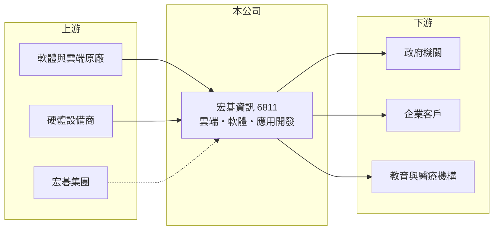

# 6811 宏碁資訊

> 上櫃｜[[產業索引-數位雲端|數位雲端]]｜上市（櫃）日期 2022/08/09

# 第一章：企業模式與商業藍圖

> [!info] 撰寫說明
> 精簡版，由 Claude 依公開資料整理，架構比照 [[2330台積電]]，資料截至 2026-10-08。來源：櫃買中心開放資料（基本資料、資產負債、綜合損益、本益比殖利率）、Goodinfo 年度經營績效、MoneyDJ 公司基本資料（營收比重、股利）。合作原廠與客戶結構為整理性描述，尚未逐條比對原始文件。#待校對

本章說明宏碁資訊（6811）以雲端與軟體服務為主的商業模式。

- **核心業務：** 宏碁資訊成立於 2012 年，2022 年 8 月上櫃，是 [[2353宏碁]] 集團的資訊服務子公司，董事長由宏碁董事長陳俊聖兼任，總部在台北南港。公司替政府與企業提供雲端服務、軟體授權、系統開發與維運，扮演企業與軟體原廠之間的整合者。
- **營收結構：** 依 MoneyDJ 2025 年資料，雲端及軟體服務占 66.7%、應用開發及其他軟體服務占 18.8%、加值型產品占 14.5%。雲端與軟體服務以代理原廠授權與訂閱為主，金額大但毛利率較低；應用開發則依專案收費，附加價值較高。整體[[毛利率]]約 12% 至 14%。
- **營運模式：** 軟體授權與雲端訂閱多為年約，客戶每年續約，收入具有持續性。公司在原廠授權之外加上導入、教育訓練與維運服務，讓客戶不只是買授權，而是把整個 IT 環境交給宏碁資訊管理。
- **長期方向：** 企業與政府上雲、生成式 AI 工具導入、資安要求提高，都會擴大軟體與雲端支出。宏碁資訊的課題是在原廠直售與價格競爭下，持續提高顧問與開發服務的比重。

# 第二章：護城河深度與競爭優勢

本章分析宏碁資訊的護城河。

- **競爭優勢：** 軟體原廠對經銷夥伴有分級制度，大型夥伴可取得較好的折扣與獎勵，並承接原廠轉介的大型客戶。宏碁資訊依附宏碁集團的品牌與客戶網路，在公部門與大型企業有長期合作基礎。最明顯的證據是 ROE 長期維持在 26% 以上，在資訊服務業中屬於高水準。
- **主要對手：** 軟體代理與雲端服務同業包括 [[6214精誠]]、[[6689伊雲谷]]、[[2412中華電]]、[[5410國眾]]；政府系統開發則與 [[6614資拓宏宇]]、[[2468華經]]、[[2453凌群]] 等競爭。
- **觀察重點：** 第一是營業利益率能否維持在 7% 以上。第二是原廠授權制度變化（例如訂閱價格調整、夥伴獎勵縮減）對毛利的影響。第三是 AI 相關服務能否成為新的成長來源。

# 第三章：財務體質與盈利規模

資料日期：2026-10-08，表格是撰寫當時的快照；最新月營收、毛利率、累計 EPS 由自動排程寫在本筆記的屬性欄位（月營收、毛利率、累計EPS 等）。#待校對

本章用多年度數字檢視宏碁資訊的成長與資本效率。

| 年度 | 營收（新台幣） | [[毛利率]] | [[營業利益率]] | EPS（元） | [[ROE]] |
|---|---|---|---|---|---|
| 2021 | 62.0 億 | 12.1% | 5.84% | 7.79 | 34.8% |
| 2022 | 71.9 億 | 13.4% | 7.21% | 11.35 | 32.8% |
| 2023 | 75.5 億 | 13.7% | 8.04% | 12.10 | 26.8% |
| 2024 | 86.9 億 | 12.9% | 7.54% | 13.00 | 26.2% |
| 2025 | 96.6 億 | 12.4% | 7.67% | 14.36 | 26.4% |

- **營收規模：** 2020 年營收 54.3 億元，2020 至 2025 年營收年複合成長率約 12.2%，EPS 由 6.35 元成長到 14.36 元，成長穩定。依櫃買中心資料，2026 年上半年營收約 59.2 億元、EPS 9.49 元。
- **獲利：** 營業利益率由 2020 年的 5.6% 提升到 7% 至 8%，近五年平均 ROE 約 29.4%。毛利率不高，但營業費用控制佳，加上資本需求低，是高 ROE 的來源。
- **財務特色：** 2026 年第二季歸屬母公司權益約 23.2 億元，每股淨值 56.06 元；流動負債約 47.7 億元，推估多為應付原廠款項與預收款，非流動負債僅約 1.3 億元。依 MoneyDJ，現金股利由 3.5 元逐年提高到最近一年的 10.5 元，配息率約七成以上且逐年成長。
- **[[ROIC]] 與 [[WACC]]：** 2025 年營業利益約 7.41 億元（96.6 億 × 7.67%），稅後約 5.93 億元；投入資本以股東權益 23.2 億元加上以非流動負債 1.3 億元近似的有息負債，約 24.5 億元，ROIC 約 24%（推算）。WACC 以 CAPM 推估：無風險利率 1.75%、市場風險溢酬 6%、β 用資訊服務業常見值 0.8，股東權益成本約 6.55%；負債成本 2.5%、稅後 2.0%；股權權重約 95%，WACC 約 6.3%（推算）。ROIC 遠高於 WACC，是長期創造價值的輕資產模式。

# 第四章：總體風險與地緣政治

本章整理宏碁資訊長期必須面對的風險。

- **產業週期：** 企業 IT 預算與景氣相關，經濟轉弱時新專案會延後，但軟體授權與雲端訂閱多為必要支出，續約率通常較高，使營收波動小於硬體產業。
- **營運風險：** 收入高度依賴少數軟體原廠，原廠調整授權模式、價格或夥伴政策，會直接影響營收與毛利。應付原廠款項規模大，客戶付款延遲時需要以營運資金墊付。
- **其他風險：** 原廠代理多以美元計價，匯率變動影響成本；公部門專案受預算與採購法規影響；與集團母公司的交易關係與資源分配，也是治理上需要留意的面向。

# 專有名詞解析

## 應用

- **[[系統整合]]**：把軟體、硬體與網路整合成符合客戶需求的完整資訊系統，並負責建置與維運的服務。
- **[[軟體授權]]**：企業向軟體原廠購買使用權利，近年多改為按年或按月付費的訂閱制。

## 金融

- **[[ROIC]]**：投入資本報酬率，稅後營業利益除以投入資本，衡量本業運用資金創造報酬的能力。
- **[[WACC]]**：加權平均資金成本，股東與債權人要求報酬率的加權平均，ROIC 高於 WACC 才代表創造價值。

# 核心供應鏈

- 上游：軟體與雲端原廠如 [[MSFT微軟]]、[[GOOGL谷歌]]、[[AMZN亞馬遜]]（實際代理清單請校對），以及硬體設備商與 [[2353宏碁]] 集團資源。
- 下游／客戶：中央與地方政府、企業、教育與醫療機構（實際比重未查得）。
- 同業：[[6214精誠]]、[[6689伊雲谷]]、[[6614資拓宏宇]]、[[5410國眾]]、[[2468華經]]。

## 最新新聞
<!-- news:start -->
<!-- news:end -->

## 相關連結
- [公開資訊觀測站](https://mopsov.twse.com.tw/mops/web/t05st03?step=1&firstin=1&co_id=6811)
- [Goodinfo](https://goodinfo.tw/tw/StockDetail.asp?STOCK_ID=6811)
- [Yahoo 股市](https://tw.stock.yahoo.com/quote/6811)
- [鉅亨網新聞](https://www.cnyes.com/twstock/6811/news)
