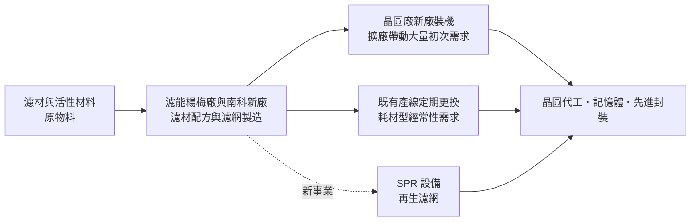
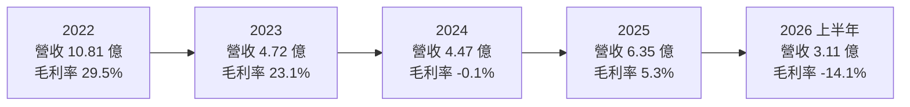
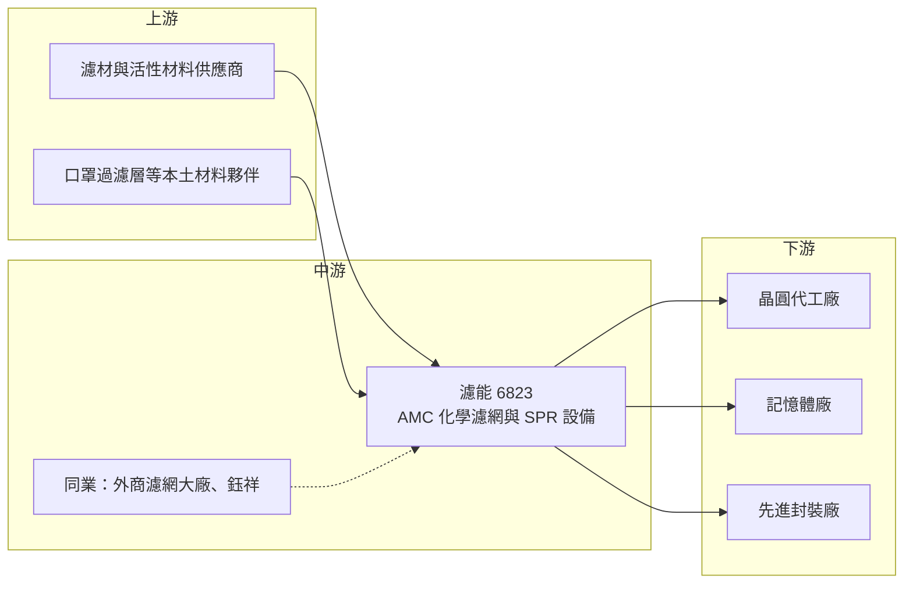

# 6823 濾能

> 上櫃｜[[產業索引-半導體業|半導體業]]｜上市（櫃）日期 2022/06/30

# 第一章：企業模式與商業藍圖

> [!info] 撰寫說明
> 本文由 Claude 依公開資料整理，架構比照 [[2330台積電]] 的四章研究，資料截至 2026-10-08。財務數字來源：櫃買中心開放資料（基本資料、2026 年第二季綜合損益與資產負債）、HiStock 嗨投資歷年季度損益表與每股盈餘、工商時報 2026 年 3 月報導、優分析、數位時代專訪；產業描述為整理性內容，尚未逐條比對原始文件。#待校對

半導體製程愈先進，對空氣中看不見的化學分子就愈敏感。本章針對濾能股份有限公司（股票代號：6823，以下簡稱濾能）的商業模式進行定性分析，說明一家專做晶圓廠化學濾網的公司，如何在外商主導的市場中取得位置，以及它為何在 2023 年之後陷入連續虧損。

## 一、核心定位：晶圓廠的 AMC 防治耗材供應商

濾能成立於 2014 年，總部與原廠位於桃園楊梅，2022 年 6 月在櫃買中心上櫃，實收資本額約 3.32 億元（含私募股）。它的業務是 [[AMC]]（氣體分子污染物）防治，主力產品是裝在晶圓廠無塵室與設備上的化學濾網，用來吸附酸、鹼、有機物等會傷害晶圓的氣體分子。

依數位時代的專訪，創辦人暨董事長黃銘文是中山大學化學碩士，曾任職台積電分析部門，也曾在瑞典濾網大廠康法（Camfil）工作。他在創業時判斷，製程不斷微縮後，無塵室對污染防治的要求會愈來愈高，這個市場將來可能爆發。這個判斷後來部分得到驗證：濾能 2022 年營收首度突破 10 億元，抽取式濾網在國內先進製程市占約五成（依數位時代報導）。

化學濾網的商業本質是「耗材」。濾網吸附到飽和就必須更換，只要晶圓廠持續運轉，就會持續產生需求；而晶圓廠每擴建一座新廠，又會帶來一次大量的初次裝機需求。因此濾能的營收由兩部分組成：跟著既有產能運轉的更換需求，以及跟著客戶擴廠進度的新廠需求。後者波動很大，是濾能營收劇烈起伏的主要原因。

## 二、終端應用／產品板塊：濾網為主，設備與再生為新動能

濾能未公開各產品的營收比重（未查得），因此不繪製營收結構圓餅圖。依工商時報 2026 年 3 月報導與優分析整理，產品可分為三大類：

* **AMC 化學濾網：** 目前主要營收來源，客戶為國內知名晶圓廠與美、台系記憶體大廠。濾能的特色是「抽取式濾網」，單片重量不到 1 公斤，更換時只需抽出替換；傳統濾網多是一體成型模組，一組約 25 至 30 公斤。抽取式設計讓客戶更換更快、廢棄物更少，這是濾能打進先進製程的關鍵差異。
* **SPR 表面反應單元模組：** 結合自有專利濾網的 AMC 控制設備。原訂 2025 年第四季出貨，因客戶裝機與測試時程調整，延到 2026 年驗收認列。這是濾能從「賣耗材」跨到「賣設備加耗材」的嘗試，若成功，可提高單一客戶的貢獻與綁定程度。
* **再生 AMC 濾網：** 以物理方式恢復濾網吸附效能、重複使用，可降低客戶採購成本，並減少逾九成濾網廢棄物（依工商時報）。目前與半導體大廠進行終端驗證。再生濾網符合晶圓廠的減碳與廢棄物減量目標，但也可能取代部分新濾網的銷售，對營收是雙面效果。

## 三、資本轉化邏輯（營運模式）：產能先行、靠客戶擴廠放量

* **產能擴張先於需求：** 依數位時代報導，濾能原有月產能約 6 萬片，2021 年啟動南科建廠，規劃初期月產 5 萬片、之後擴充到 10 萬片以上。新廠的目的是貼近南部科學園區的先進製程客戶，但新廠投產後折舊與人力成本立即增加，若良率與訂單沒有同步到位，毛利率就會被嚴重壓縮。
* **營收跟著客戶擴廠節奏起伏：** 2022 年客戶大舉擴廠時，濾能營收達 10.81 億元；2023 至 2024 年客戶放緩擴廠，營收掉到 4.5 億元左右；2025 年全年營收回升到 6.35 億元、年增 42%，濾網出貨量年增 105%（依工商時報），但 2026 年初又因客戶建廠進度調整出貨而轉弱。
* **固定成本高、規模敏感：** 濾網製造需要無塵產線與穩定的人力，產能利用率不足時，單位成本會大幅上升。2024 年起毛利率在零附近甚至轉負，就是南科新廠固定成本加上出貨不足的結果。

## 四、企業長期藍圖：從濾網商轉型為 AMC 解決方案商

* **雙軌布局：** 公司策略是 AMC 濾網與 SPR 設備並進，以提高在客戶廠內的滲透率。若設備能成功銷售，後續搭配的濾網更換就會成為綁定的經常性收入。
* **擴大客戶類型：** 公司表示將持續拓展半導體代工、[[先進封裝]]與記憶體製造客戶。先進封裝廠近年擴產快速，同樣需要 AMC 控制，這是降低對單一晶圓代工客戶依賴的方向。
* **循環經濟：** 再生濾網與廢濾材轉製燃料棒，讓濾能可以用環保與減碳訴求爭取客戶，這在晶圓廠愈來愈重視 ESG 的環境下，是有利的長期定位。
* **核心課題：南科新廠良率：** 公司在 2025 年的說明中坦承南科新廠生產良率不如預期，現階段重點是製程優化、加快學習曲線。南科廠能否穩定量產，是濾能能否回到獲利的前提。

# 第二章：護城河深度與競爭優勢

護城河指的是一家公司能長期擋住對手、維持超額利潤的結構性優勢。本章分析濾能的護城河組成、國內外主要競爭對手，以及這些優勢為何在 2023 年後沒有轉化為穩定獲利。

## 一、護城河的核心組成要素

* **1. 晶圓廠驗證與替代外商的位置：** 晶圓廠更換任何會接觸製程環境的耗材，都需要經過嚴格測試。濾能已通過國內先進製程與記憶體大廠的驗證，依數位時代報導，在一家台系利基型記憶體廠的 A/B 測試後，濾能占該廠用量約八成。一旦成為合格供應商，後續的更換需求就有一定黏著度。
* **2. 抽取式濾網的產品設計：** 輕量、可局部更換的設計，降低客戶的更換時間與廢棄物，這是相對於傳統一體成型模組的差異化。濾能強調技術重點在濾材配方而非密封結構，這種材料能力需要長時間累積。
* **3. 在地服務與快速反應：** 作為本土供應商，濾能能就近配合客戶新廠的建置時程與客製化需求，這是外商在台灣市場較難完全複製的優勢。
* **4. 循環經濟的附加價值：** 再生濾網與廢棄物減量，能幫助客戶達成減碳目標，若通過驗證，將成為新的差異化。

## 二、全球主要競爭對手格局

| 對手 | 定位 | 對濾能的影響 |
|---|---|---|
| 康法（Camfil）等歐系濾網大廠 | 全球空氣過濾龍頭，產品線完整 | 品牌與全球服務網占優，是濾能主要要取代的對象 |
| 英特格（Entegris）等美系材料商 | 半導體材料與過濾解決方案大廠 | 與晶圓廠有長期合作，產品組合廣 |
| 日系化學濾網廠 | 長期供應日本與台灣晶圓廠 | 在部分製程與設備端有既有份額 |
| 鈺祥等台灣同業 | 本土濾網與再生濾網業者 | 在再生濾網與成本上直接競爭 |

註：上表外商名單依產業常見供應商整理，濾能未公開具體競爭對手與市占，屬整理性內容。

## 三、優勢轉化：守得住／守不住／觀察重點

* **守得住：** 已通過驗證、正在運轉的產線所產生的更換需求。這類需求和晶圓廠的產能利用率連動，只要客戶不更換供應商，就會持續存在，是濾能最穩定的收入基礎。
* **守不住：** 新廠裝機需求的時程與價格。客戶擴廠的節奏完全由客戶決定，延後一季就會讓濾能的營收與產能利用率明顯下滑。此外，原物料價格上漲時，濾能在與大客戶議價時不一定能轉嫁，2025 年第四季毛利率下滑就與原物料上漲有關。
* **觀察重點：** 第一是南科新廠良率能否改善、毛利率能否重回正值並穩定在 20% 以上；第二是 SPR 設備能否在 2026 年完成驗收並取得第二、第三個客戶；第三是再生濾網能否通過大廠驗證並量產。這三點決定濾能的「在地替代」優勢能否真正轉化為獲利。

# 第三章：財務體質與盈利規模

資料日期：2026-10-08。數字取自櫃買中心開放資料與 HiStock 嗨投資歷年季度損益表（年度數字由四季加總推算），表格是撰寫當時的快照；最新月營收、毛利率、累計 EPS 由自動排程寫在本筆記的屬性欄位（月營收、毛利率、累計EPS 等）。#待校對

財務報表是檢驗護城河是否真實存在的最終標準。本章用三率、[[ROE]]、資本支出與資本報酬，檢視濾能從高成長轉為連續虧損的過程。

## 一、獲利能力的基石：三率

| 年度 | 營收（億元） | [[毛利率]] | [[營業利益率]] | EPS（元） | [[ROE]] |
|---|---|---|---|---|---|
| 2021 | 8.29 | 28.7% | 14.6% | 5.17 | 約 24%（期末權益推算） |
| 2022 | 10.81 | 29.5% | 12.0% | 5.13 | 19.8%（推算） |
| 2023 | 4.72 | 23.1% | -6.9% | -1.09 | -4.0%（推算） |
| 2024 | 4.47 | -0.1% | -41.3% | -7.30 | -31.3%（推算） |
| 2025 | 6.35 | 5.3% | -24.7% | -7.92 | -46.1%（推算） |
| 2026 上半年 | 3.11 | -14.1% | -46.5% | -4.73 | 年化約 -57%（推算） |

註：營收與三率由 HiStock 季度損益表加總計算，2025 年營收 6.35 億元與工商時報報導一致；2026 上半年數字與櫃買中心開放資料一致。ROE 以稅後淨利（含非控制權益）除以期初與期末權益平均推算。

* **[[毛利率]]由近 30% 跌到負值：** 2021 至 2022 年毛利率約 29%，2023 年起隨營收腰斬而下滑，2024 年後在零附近甚至轉負。主因是南科新廠投產帶來的折舊與人力成本，在營收不足時無法攤提，加上新廠良率不如預期、原物料上漲。
* **[[營業利益率]]長期為負：** 營業費用約維持在每年 1.6 至 2 億元的規模（推估，依損益表毛利與營業利益差額），營收不到 7 億元時無法覆蓋，造成 2023 年以來連年營業虧損。
* **一次性減損：** 2025 年第四季提列設備及軟體減損（依工商時報），讓單季虧損擴大，2025 年全年每股虧損 7.92 元、創新低。

## 二、[[ROE]]：資本效率

濾能 2021 至 2022 年的 ROE 約 20% 以上，是典型的高成長小型耗材股；但 2023 年起轉為負值，2025 年 ROE 約 -46%（推算）。以 2021 至 2025 年計算，近五年平均 ROE 約 -7.5%（推算）。連續虧損已使保留盈餘轉為負數，2026 年第二季末每股淨值約 16.24 元（櫃買中心資料），股東權益約 4.98 億元，與 2022 年底的 6.91 億元相比明顯縮水。

## 三、資本支出與[[自由現金流]]

* **[[CapEx]]：** 南科新廠是濾能上市後最大的資本投入。依櫃買中心資料，2026 年第二季末非流動資產約 7.49 億元，高於流動資產 4.69 億元，顯示公司資產結構已從輕資產的耗材商，轉為以廠房設備為主（具體歷年資本支出金額未查得）。
* **負債上升：** 2026 年第二季末負債總計約 7.20 億元，高於股東權益 4.98 億元，其中非流動負債約 2.71 億元。虧損期間的資金需求，主要靠負債與增資支應（推估）。
* **股利：** 依櫃買中心資料，濾能目前無配發現金股利，在恢復獲利前也不具配息條件。
* **自由現金流：** 連續營業虧損加上新廠投資，2023 年以來自由現金流應為負值（推估，具體數字未查得）。
* **營收年複合成長率：** 2021 至 2025 年營收由 8.29 億元變為 6.35 億元，年複合成長率約 -6.4%（推算）。

## 四、[[ROIC]] 與 [[WACC]]：價值創造利差

* **ROIC（推算）：** 2025 年營業損失 1.57 億元，稅後營業利益約為 -1.25 億元（以 20% 稅率簡化計算）；投入資本以 2025 年底權益 4.99 億元加上非流動負債 2.97 億元（作為有息負債的近似值，實際借款金額未查得）計算，約 7.96 億元。ROIC 約為 -15.7%。以 2026 年上半年年化計算，ROIC 約 -29%（推算）。
* **WACC（推算）：** 無風險利率取台灣 10 年期公債約 1.75%，市場風險溢酬 6%，β 值考量公司虧損與規模，取 1.3（假設值，高於一般半導體同業常見的 1.0 至 1.2），股東權益成本約 1.75% + 1.3 × 6% = 9.55%。負債成本假設 3%，稅後約 2.4%；資本結構以權益 63%、負債 37% 計算，WACC 約 0.63 × 9.55% + 0.37 × 2.4% ≈ 6.9%。
* **價值創造判斷：** ROIC 遠低於 WACC，代表濾能目前正在毀損股東價值。2021 至 2022 年獲利期間 ROIC 應高於 WACC（推估），顯示商業模式本身並非不可行；問題在於新廠擴產的時機與執行。只有在南科廠良率改善、營收回到 10 億元左右的規模後，ROIC 才有機會回到 WACC 之上。

# 第四章：總體風險與地緣政治

任何企業都無法脫離宏觀環境獨立存在。本章分析濾能在地緣政治、半導體擴廠週期、營運執行與技術法規上面臨的長期風險。

## 一、地緣政治

* **客戶海外擴廠的雙面效果：** 台灣晶圓廠在美國、日本、德國設廠，代表 AMC 濾網的總需求增加；但濾能的產能都在台灣，海外新廠是否沿用台灣供應商、是否要求在地生產，會影響濾能能分到多少。若要跟隨客戶出海，又需要新的資本支出，對財務體質偏弱的濾能是一大考驗。
* **台灣集中風險：** 主要客戶與產能都在台灣，兩岸情勢若升溫，濾能沒有其他地區的營收可以分散。

## 二、產業週期與市場結構

* **擴廠週期的高波動：** 濾能的營收有相當部分來自客戶新廠裝機，而晶圓廠擴廠有明顯的週期。2022 年擴廠高峰時營收突破 10 億元，2023 至 2024 年客戶放緩後營收腰斬，這種波動未來仍會反覆出現。
* **[[長鞭效應]]：** 晶圓廠調整資本支出時，對耗材與廠務供應商的拉貨會先行縮減，濾能這類上游供應商承受的波動，往往比晶圓廠本身更大。
* **客戶集中：** 營收高度集中在少數晶圓代工與記憶體大廠，單一客戶的擴廠時程變動，就足以影響全年營收。

## 三、營運環境的隱性風險

* **新廠良率與成本控制：** 南科新廠良率不如預期是公司自己承認的問題。製造業的學習曲線若拖太久，會持續消耗現金。
* **財務結構轉弱：** 連續虧損讓保留盈餘轉負、負債高於權益。若虧損持續，公司可能需要再增資或借款，稀釋既有股東。
* **原物料價格：** 濾材與化學品價格上漲時，若無法即時轉嫁給大客戶，毛利率會直接受壓。

## 四、科技或法規演進

* **先進製程提高 AMC 要求：** 製程從 3 奈米走向 2 奈米及更先進節點，極少量的氣體分子就可能影響良率，對 AMC 控制的要求只會更嚴格。這是濾能長期需求的根本支撐。
* **再生與減碳法規：** 晶圓廠的 ESG 目標推動再生濾網與廢棄物減量，有利於濾能的再生業務；但若再生比例大幅提高，新濾網的銷售量可能下降，公司需要在兩者之間取得平衡。
* **設備端整合趨勢：** 若半導體設備商把 AMC 控制直接整合進設備或晶圓傳送系統，獨立濾網供應商的角色可能被壓縮，這也是濾能發展 SPR 設備、往系統端延伸的原因。

# 專有名詞解析

## 半導體

- **[[先進封裝]]**：把多顆晶片以中介層、混合鍵合等方式高密度整合的封裝技術，例如 CoWoS、SoIC。
- **[[良率]]**：合格產品占總生產量的比例，新廠初期良率偏低會推高單位成本。

## 金融

- **[[毛利率]]**：營業毛利占營收的比例，反映產品定價能力與成本結構。
- **[[營業利益率]]**：營業利益占營收的比例，扣除研發與管銷費用後的本業獲利能力。
- **[[ROE]]**：股東權益報酬率，稅後淨利除以股東權益，衡量股東資金的使用效率。
- **[[ROIC]]**：投入資本報酬率，稅後營業利益除以股東權益加有息負債，衡量本業創造報酬的能力。
- **[[WACC]]**：加權平均資金成本，股東權益成本與負債成本依資本結構加權，ROIC 高於它才代表創造價值。
- **[[CapEx]]**：資本支出，用於購置廠房與設備的投資，會在未來數年以折舊方式轉為成本。
- **[[自由現金流]]**：營業活動現金流減去資本支出，代表企業可自由用於配息、還債或併購的現金。
- **[[長鞭效應]]**：終端需求的小幅變動，沿供應鏈往上游傳遞時被逐級放大，造成上游庫存與訂單劇烈波動。

## 產業

- **[[AMC]]**：氣體分子污染物，指無塵室中的酸、鹼、有機物等微量化學分子，會造成晶圓缺陷或腐蝕。
- **[[化學濾網]]**：以活性碳或化學吸附材料去除空氣中特定氣體分子的濾網，屬晶圓廠的消耗性耗材。
- **[[再生濾網]]**：把吸附飽和的濾網以物理或化學方式恢復效能後重複使用，可降低成本並減少廢棄物。
- **[[SPR]]**：濾能的表面反應單元模組，結合自有濾網的 AMC 控制設備，用來提升特定區域的污染控制效率。

# 核心供應鏈

## 1. 上游：濾材與原物料
- 活性碳、化學吸附材料與濾材基材供應商（具體廠商未查得）
- 依數位時代報導，濾能曾策略投資口罩過濾層工廠，以培養本土濾材供應商

## 2. 中游：AMC 防治同業
- 外商：康法（Camfil）、英特格（Entegris）等過濾與材料大廠
- 本土：鈺祥（再生濾網）
- 相關的 AMC 監測設備廠：[[6909創控]]（監測污染，與濾能的防治屬互補關係）

## 3. 下游：半導體製造客戶
- 晶圓代工：國內知名晶圓廠（依數位時代報導，未具名）
- 記憶體：美系與台系記憶體大廠（未具名）
- 先進封裝：公司表示持續拓展中

## 最新新聞
<!-- news:start -->
<!-- news:end -->

## 相關連結
- [公開資訊觀測站](https://mopsov.twse.com.tw/mops/web/t05st03?step=1&firstin=1&co_id=6823)
- [Goodinfo](https://goodinfo.tw/tw/StockDetail.asp?STOCK_ID=6823)
- [Yahoo 股市](https://tw.stock.yahoo.com/quote/6823)
- [鉅亨網新聞](https://www.cnyes.com/twstock/6823/news)
