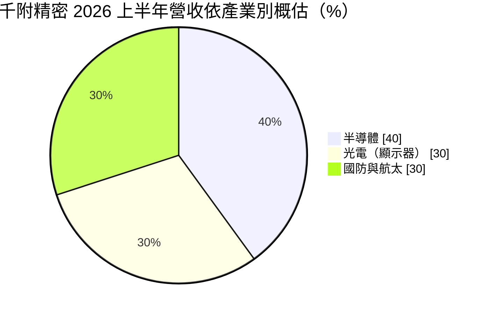
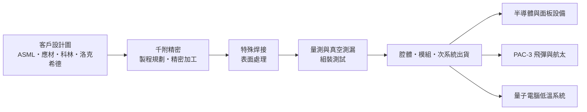
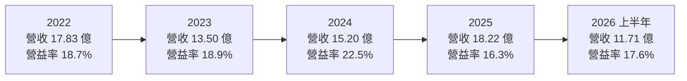
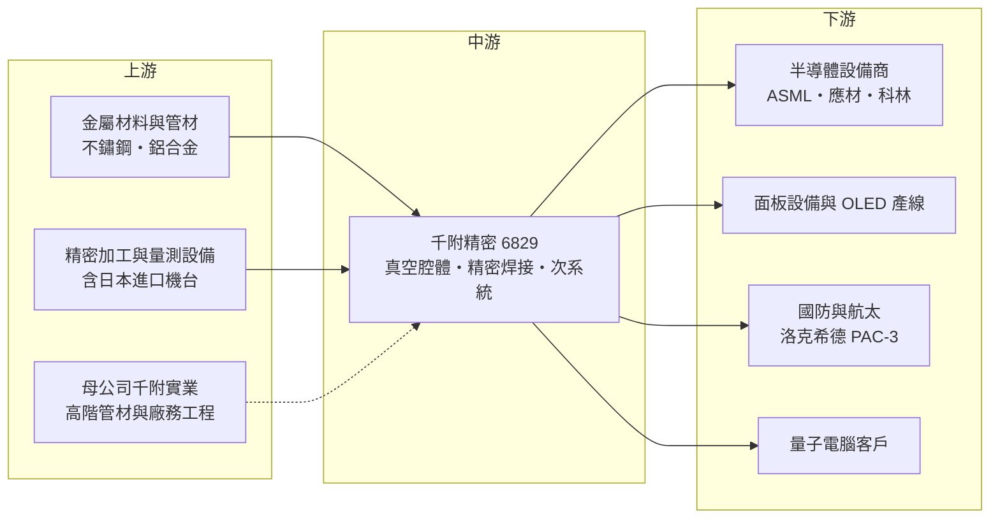

# 6829 千附精密

> 上櫃｜[[產業索引-半導體業|半導體業]]｜上市（櫃）日期 2022/03/11

# 第一章：企業模式與商業藍圖

> [!info] 撰寫說明
> 本文由 Claude 依公開資料整理，架構比照 [[2330台積電]] 的四章研究，資料截至 2026-10-08。財務數字來源：櫃買中心開放資料（基本資料、2026 年第二季綜合損益與資產負債、本益比殖利率）、HiStock 嗨投資歷年季度損益表與每股盈餘、富果研究 2026 年 8 月法說會整理、聯合新聞網 2026 年 7 月報導；產業描述為整理性內容，尚未逐條比對原始文件。#待校對

半導體設備的核心，是一個能維持高真空、承受高溫與化學氣體的腔體，晶圓就在裡面完成沉積、蝕刻等製程。本章針對千附精密股份有限公司（股票代號：6829，以下簡稱千附精密）的商業模式進行定性分析，說明一家從國防航太精密加工起家的公司，如何成為國際半導體設備大廠的腔體供應商，並把同一套能力延伸到[[量子電腦]]。

## 一、核心定位：國際設備大廠的真空腔體代工夥伴

千附精密的前身是 [[8383千附]]（千附實業）的精密機械事業，2020 年 7 月分割成立為獨立公司，2022 年 3 月在櫃買中心上櫃，實收資本額約 5.92 億元，總部位於台中。母公司千附實業在 2022 年處分水資源事業後，營運聚焦於半導體廠務系統工程、機械事業與子公司千附精密（依聯合新聞網報導）。

千附精密的核心技術是 [[真空腔體]]（用於 [[PVD]]、[[CVD]] 等設備）的精密加工與特殊焊接。這不是一般的金屬加工：腔體必須在極高真空下不漏氣、內壁不能釋出微粒、焊道要能承受反覆的溫度與壓力變化，任何瑕疵都會讓整台數千萬元的設備無法使用。依富果研究整理的 2026 年 8 月法說會資料，千附精密的半導體客戶包括全球前三大設備商：[[ASML艾司摩爾]]、[[AMAT應用材料]] 與 [[LRCX科林研發]]；國防客戶則是洛克希德・馬丁（Lockheed Martin），產品為 PAC-3 飛彈相關零組件。

這種客戶組合說明了千附精密的定位：它是國際設備大廠與國防大廠的「[[委外製造]]」夥伴，自己不設計設備，而是把客戶的設計圖做成高精度、可量產、可通過認證的實體零組件與次系統。

## 二、終端應用／產品板塊：半導體為主，國防航太為輔

依富果研究整理，千附精密 2026 年上半年的營收結構概估如下（公司以區間說明，此處取概略值）：

* **半導體（約四成）：** 設備大廠的真空腔體與關鍵零組件，是最大且成長最快的業務。管理層認為半導體占比在 2027 年有機會超過五成，主要客戶預估至 2030 年市場需求維持雙位數年成長。半導體設備需求跟著晶圓廠資本支出走，長期受 AI、先進製程與先進封裝帶動。
* **光電（約 25% 至 30%）：** 顯示器製程設備的腔體，受惠 [[OLED]] 應用從手機擴展到筆電與桌機。面板設備的投資週期與半導體不同，可以部分分散營收波動。
* **國防（約 15%）：** PAC-3 飛彈相關零組件。依法說會資料，在地緣政治緊張下，PAC-3 庫存已低於 50%，客戶希望把 2029 年的產量目標提前到 2027 年，但實際出貨受尋標器、脈衝引擎等上游瓶頸限制。
* **航太（低於一成）：** 國際航太客戶的零組件，業務穩定，但公司策略重心已轉向半導體與國防。
* **量子電腦：** 2026 年 3 月完成首套超低溫真空腔體交付，8 月出貨第二套。客戶目標 2029 年前備妥設備系統、2030 年開始提供量子算力服務，並希望千附精密未來每年供應 400 至 800 套，遠超現有產能（依富果整理）。目前金額仍小，但這是用同一套真空與焊接技術打開的全新市場。

## 三、資本轉化邏輯（營運模式）：認證門檻換長期訂單

* **一站式製造能力：** 千附精密提供從製程規劃、精密加工、焊接、表面處理到組裝測試的完整服務，並能從單一零件延伸到模組與次系統。客戶只要交給一家供應商，就能拿到可直接上機的成品，這降低了客戶的管理成本，也提高了更換供應商的難度。
* **認證與獎項累積信任：** 2024 年獲 ASML 年度供應商貢獻獎，2025 年獲洛克希德・馬丁最佳供應商獎（依富果整理為海外唯一獲獎廠商），並已通過美國國防供應鏈的 [[CMMC]] 2.0 資安要求。這些認證需要多年累積，是新進者難以短期取得的門檻。
* **產能是成長的瓶頸：** 管理層在法說會表示公司面臨一定程度的產能瓶頸。嘉義新廠預計 2026 年第四季取得使用執照，2026 年底另有日本進口的關鍵設備到位，用於高階半導體產品。擴產完成前，營收成長受限於現有產能。

## 四、企業長期藍圖：半導體過半、國防加速、量子起步

* **半導體占比過半：** 公司長期目標是讓半導體營收占比持續提升，2027 年有機會超過五成。這代表千附精密的獲利會愈來愈跟著全球半導體設備週期走，也意味著毛利結構將逐漸以半導體產品為主。
* **國防需求結構性上升：** 全球地緣政治緊張推升防空飛彈需求，國防業務雖然出貨受上游瓶頸限制，但需求能見度長。國防訂單的特點是週期與半導體不同、合約期間長，可以降低整體營收的波動。
* **量子電腦的長期選擇權：** 量子電腦需要極低溫、高真空的腔體，正是千附精密的專長。若客戶如期在 2030 年商轉，每年數百套的需求會成為新的成長曲線；但技術路線與時程都高度不確定，目前應視為長期選擇權，而非確定的營收來源。

# 第二章：護城河深度與競爭優勢

護城河指的是一家公司能長期擋住對手、維持超額利潤的結構性優勢。本章分析千附精密的護城河組成、國內外主要競爭對手，以及這些優勢能否轉化為穩定的獲利。

## 一、護城河的核心組成要素

* **1. 設備大廠的認證與共同開發：** 半導體設備商對腔體供應商的認證非常嚴格，一旦某個腔體由千附精密量產，設備商若要換供應商，必須重新驗證焊接品質、真空度與微粒表現，時間與風險都很高。千附精密同時服務 ASML、應材、科林三大廠，代表其製程能力已被多家頂尖客戶驗證。
* **2. 特殊焊接與真空技術：** 多位焊接人員取得美國銲接協會（AWS）證照，並自主開發三次元量測程式（依聯合新聞網報導）。高真空焊接是靠人員經驗與製程參數累積的技術，難以單靠購買機台複製。
* **3. 國防資格的稀缺性：** 能進入美國國防大廠供應鏈、通過 CMMC 資安要求並取得最佳供應商獎的台灣廠商很少。國防訂單看重的是可靠度與資格，而非價格，這讓千附精密在國防業務有較高的議價空間。
* **4. 多產業共用核心能力：** 半導體、光電、國防、航太與量子電腦都需要高精度加工與高真空技術，同一套能力可以在不同產業間轉換產能，降低單一產業景氣下行的衝擊。

## 二、全球主要競爭對手格局

| 對手 | 定位 | 對千附精密的影響 |
|---|---|---|
| [[3413京鼎]] | 應材體系的設備模組與零組件製造商 | 在應材供應鏈直接競爭，與客戶關係緊密 |
| Ultra Clean、Ichor 等美系委外製造商 | 設備大廠的氣體與流體次系統主要供應商 | 規模大、全球據點多，承接美系客戶大量委外 |
| [[6196帆宣]]、[[3178公準]] 等台灣精密製造同業 | 設備零組件與次系統代工 | 爭取 ASML 與台灣在地化採購訂單 |
| 日本與歐洲腔體加工廠 | 在地服務日系、歐系設備商 | 在當地客戶具地緣優勢 |

註：上表對手依產業常見的設備零組件供應商整理，千附精密未公開具體競爭對手，屬整理性內容。

## 三、優勢轉化：守得住／守不住／觀察重點

* **守得住：** 已量產、認證完成的高階腔體與國防零組件。這類產品客戶換供應商的成本極高，訂單在產品生命週期內相對穩定。2024 年千附精密營業利益率達 22.5%，就是高階產品比重提高時的獲利水準。
* **守不住：** 產品組合帶來的毛利率波動。2025 年營收創新高至 18.22 億元，但毛利率從 35.2% 降到 27.2%，2026 年上半年毛利率 26.9%，公司解釋主因是產品組合。代工型企業的毛利率很大程度取決於當期接到的產品類型，無法完全由自己掌握。
* **觀察重點：** 第一是嘉義新廠能否在 2026 年底後順利投產、解除產能瓶頸；第二是半導體營收占比能否如管理層預期在 2027 年超過五成，同時讓毛利率回到 30% 以上；第三是國防訂單在上游瓶頸解除後能否加速出貨；第四是量子電腦客戶能否進入量產階段。

# 第三章：財務體質與盈利規模

資料日期：2026-10-08。數字取自櫃買中心開放資料與 HiStock 嗨投資歷年季度損益表（年度數字由四季加總推算），表格是撰寫當時的快照；最新月營收、毛利率、累計 EPS 由自動排程寫在本筆記的屬性欄位（月營收、毛利率、累計EPS 等）。#待校對

財務報表是檢驗護城河是否真實存在的最終標準。本章用三率、[[ROE]]、資本支出與資本報酬，檢視千附精密在擴產期的獲利品質。

## 一、獲利能力的基石：三率

| 年度 | 營收（億元） | [[毛利率]] | [[營業利益率]] | EPS（元） | [[ROE]] |
|---|---|---|---|---|---|
| 2021 | 17.09 | 28.7% | 18.3% | 4.90 | 約 18%（期末權益推算） |
| 2022 | 17.83 | 32.0% | 18.7% | 6.11 | 21.1%（推算） |
| 2023 | 13.50 | 30.5% | 18.9% | 3.51 | 10.9%（推算） |
| 2024 | 15.20 | 35.2% | 22.5% | 5.66 | 17.4%（推算） |
| 2025 | 18.22 | 27.2% | 16.3% | 3.95 | 11.9%（推算） |
| 2026 上半年 | 11.71 | 26.9% | 17.6% | 2.99 | 年化約 18%（推算） |

註：營收與三率由 HiStock 季度損益表加總計算；2026 年第二季由櫃買中心上半年數字減去第一季推算，上半年合計與富果整理的法說會數字（營收 11.71 億元、毛利率 26.9%、營益率 17.6%、EPS 2.99 元）一致。ROE 以稅後淨利除以期初與期末權益平均推算。

* **[[毛利率]]在 27% 至 35% 之間：** 屬於精密製造業中偏高的水準，反映高真空腔體與國防零件的技術門檻。但毛利率隨產品組合波動，2024 年高階產品比重高時達 35.2%，2025 年則降到 27.2%。
* **[[營業利益率]]相對穩定：** 五年都在 16% 至 23% 之間。營業費用占營收比例不高（2026 年上半年營業費用約 1.09 億元，約占營收 9%），所以毛利率的變化幾乎直接反映在營業利益率上。
* **業外匯兌影響：** 千附精密以外銷為主，匯率變動會造成業外損益波動。2025 年第二季淨利明顯低於營業利益，2026 年上半年淨利則因業外由匯損轉為匯兌利益而成長 86%（依富果整理）。

## 二、[[ROE]]：資本效率

千附精密 2021 至 2025 年的 ROE 落在 11% 至 21% 之間（推算），近五年平均約 16%（推算，2021 年用期末權益）。ROE 的波動主要來自營業利益率與匯兌損益，股東權益本身變化不大，約維持在 18 至 20 億元。2026 年上半年年化 ROE 約 18%（推算），回到較高水準。對一家需要持續投資機台與廠房的製造業者而言，長期維持 15% 左右的 ROE，代表本業有一定的獲利能力。

## 三、資本支出與[[自由現金流]]

* **[[CapEx]] 進入擴張期：** 嘉義新廠與日本進口的關鍵設備，是 2025 至 2026 年的主要投資。依櫃買中心資料，2026 年第二季末非流動資產約 23.22 億元、非流動負債約 7.27 億元，相較 2023 年底非流動負債約 1.24 億元（HiStock 資料）明顯上升，顯示擴產主要以長期借款支應（推估）。
* **自由現金流：** 擴產期間資本支出偏高，自由現金流可能轉弱甚至短期為負（推估，具體數字未查得）。新廠投產後若產能利用率順利拉高，現金流才會回升。
* **股利：** 依櫃買中心資料，最近一年度現金股利為每股 3.5 元。以 2025 年 EPS 3.95 元計算，配息率約 89%（推算）。在擴產期仍維持高配息，代表公司重視股東回饋，但也增加了對外部資金的依賴。
* **營收年複合成長率：** 2021 至 2025 年營收由 17.09 億元成長到 18.22 億元，年複合成長率約 1.6%（推算）；但 2026 年上半年營收年增 43%，成長動能明顯加速。

## 四、[[ROIC]] 與 [[WACC]]：價值創造利差

* **ROIC（推算）：** 2025 年營業利益 2.97 億元，以 20% 稅率計算稅後營業利益約 2.37 億元；投入資本以 2025 年底權益 19.40 億元加上非流動負債 3.48 億元（作為有息負債的近似值，實際借款金額未查得）計算，約 22.88 億元。ROIC 約為 10.4%。以 2026 年上半年營業利益 2.06 億元年化，並用 2026 年第二季末權益 19.11 億元加非流動負債 7.27 億元計算，ROIC 約 14.6%（推算）。
* **WACC（推算）：** 無風險利率取台灣 10 年期公債約 1.75%，市場風險溢酬 6%，β 值取半導體設備零組件股常見的 1.2（假設值），股東權益成本約 8.95%。負債成本假設 2.5%，稅後約 2.0%；以 2025 年底權益約 85%、負債約 15% 的資本結構計算，WACC 約 0.85 × 8.95% + 0.15 × 2.0% ≈ 7.9%。
* **價值創造判斷：** ROIC 約 10% 至 15%，高於 WACC 約 8%，利差約 2 至 7 個百分點，代表千附精密在多數年度能為股東創造價值。擴產期間投入資本增加，若新產能利用率不足，ROIC 會暫時下滑；嘉義新廠投產後的產能利用率，是利差能否擴大的關鍵。

# 第四章：總體風險與地緣政治

任何企業都無法脫離宏觀環境獨立存在。本章分析千附精密在地緣政治、設備週期、營運執行與技術演進上面臨的長期風險。

## 一、地緣政治

* **國防需求的結構性受惠：** 全球地緣政治緊張推升防空飛彈需求，這對千附精密的國防業務是長期利多。但國防訂單也受各國國防預算、出口管制與美國政府採購政策影響，政策變化可能改變出貨節奏。
* **美國對供應鏈的資安與在地化要求：** 千附精密已通過 CMMC 2.0 資安要求，這是進入美國國防供應鏈的門票；未來若要求更高比例的美國本土生產，台灣廠商的角色可能受限。
* **半導體設備出口管制：** 美國對中國的設備出口管制，會影響設備大廠的出貨地區與總量，間接影響腔體訂單。

## 二、產業週期與市場結構

* **半導體設備週期：** 半導體營收占比愈高，千附精密就愈受全球晶圓廠資本支出週期影響。2023 年營收下滑約 24%，就反映了設備需求的循環。
* **客戶集中：** 前三大設備商與單一國防大廠占了營收的大部分，任何一家客戶調整委外策略或轉單，都會明顯影響營收。
* **面板設備的投資週期：** 光電業務跟著 OLED 面板投資走，面板廠擴產週期比半導體更不規律。

## 三、營運環境的隱性風險

* **產能瓶頸與新廠執行：** 公司已承認產能不足，嘉義新廠的時程、設備到位與人員培訓都可能延誤。擴產若延遲，客戶可能把訂單轉給其他供應商。
* **產品組合與毛利率：** 代工型業務的毛利率取決於每期接到的產品類型，公司難以完全掌握。
* **國防上游瓶頸：** 國防出貨受尋標器、脈衝引擎、原物料與新供應商產能爬升限制，即使訂單充足，也可能無法如期認列。
* **匯率：** 外銷比重高，新台幣升值會同時壓縮毛利率與造成業外匯損。
* **技術人才：** 高真空焊接仰賴資深技術人員，人才流失或培育不及，會限制擴產速度。

## 四、科技或法規演進

* **先進製程推升腔體規格：** 製程走向更先進節點與先進封裝，設備對腔體潔淨度、真空度與材料的要求持續提高，有利於具備高階能力的供應商，但也要求持續投資更精密的加工與量測設備。
* **量子電腦技術路線：** 依法說會資料，千附精密的量子客戶採用與 Google、IBM 不同的技術路線。量子電腦目前有多種技術路線並行，若客戶路線未能勝出，這項新業務的長期價值會大打折扣。
* **國防與出口法規：** 國防零組件涉及美國的出口管制與資安規範，法規趨嚴雖提高門檻、保護既有供應商，但也增加合規成本。

# 專有名詞解析

## 半導體

- **[[真空腔體]]**：半導體設備中維持高真空、讓晶圓完成沉積或蝕刻的反應室，對焊接品質與潔淨度要求極高。
- **[[PVD]]**：物理氣相沉積，以濺鍍等物理方式把金屬薄膜鍍到晶圓上，是金屬導線與阻障層的主要製程。
- **[[CVD]]**：化學氣相沉積，讓氣體在晶圓表面起化學反應形成薄膜，廣泛用於絕緣層與導電層。

## 金融

- **[[毛利率]]**：營業毛利占營收的比例，反映產品定價能力與成本結構。
- **[[營業利益率]]**：營業利益占營收的比例，扣除研發與管銷費用後的本業獲利能力。
- **[[ROE]]**：股東權益報酬率，稅後淨利除以股東權益，衡量股東資金的使用效率。
- **[[ROIC]]**：投入資本報酬率，稅後營業利益除以股東權益加有息負債，衡量本業創造報酬的能力。
- **[[WACC]]**：加權平均資金成本，股東權益成本與負債成本依資本結構加權，ROIC 高於它才代表創造價值。
- **[[CapEx]]**：資本支出，用於購置廠房與設備的投資，會在未來數年以折舊方式轉為成本。
- **[[自由現金流]]**：營業活動現金流減去資本支出，代表企業可自由用於配息、還債或併購的現金。

## 產業

- **[[委外製造]]**：設備大廠把零組件、模組或次系統交給專業代工廠生產，自己專注於設計與系統整合。
- **[[OLED]]**：有機發光二極體顯示技術，每個像素可自行發光，由手機擴展到筆電、桌機與電視。
- **[[CMMC]]**：美國國防部的網路安全成熟度認證，國防供應鏈廠商必須通過才能承接相關訂單。
- **[[量子電腦]]**：利用量子位元運算的新型電腦，部分技術路線需要接近絕對零度的超低溫真空環境。

# 核心供應鏈

## 1. 上游：材料、設備與母公司
- 母公司：[[8383千附]]（半導體廠務系統工程、高階管材製造）
- 金屬材料、焊材與精密加工設備供應商（具體廠商未查得）

## 2. 中游：設備零組件製造同業
- 台灣：[[3413京鼎]]、[[6196帆宣]]、[[3178公準]]
- 國際：Ultra Clean、Ichor 等美系委外製造商

## 3. 下游：半導體設備大廠
- [[ASML艾司摩爾]]、[[AMAT應用材料]]、[[LRCX科林研發]]
- 最終使用者為晶圓代工與記憶體廠，例如 [[2330台積電]]

## 4. 下游：國防、航太與量子
- 國防：洛克希德・馬丁（PAC-3 飛彈相關零組件）
- 航太：國際航太客戶（未具名）
- 量子電腦：保密協議未揭露的客戶

延伸閱讀：[[台積電供應鏈]]

## 供應鏈關係
- 供應給 [[2330台積電]]：真空腔體與精密零組件（台積電供應鏈 › 上游：在地設備零組件與代工）

## 最新新聞
<!-- news:start（自動產生，請勿手動編輯此範圍） -->
- 2026-10-08 📰 媒體 21:29｜千附實業、千附精密前三季營收齊創高 AI 半導體需求續強｜[UDN](https://news.google.com/rss/articles/CBMiVkFVX3lxTFA1YURyanhRWEtkRXByc2NoazJqdVBJUVNYZzB1akMxdDRUcnlERzNZOTU0azdXNFNsWmZLajJnWDdOSTFVQTlKTUE2U0hJUEN2UTl4d2930gFWQVVfeXFMUDVhRHJqeFFYS2RFcHJzY2hrMmp1UElRU1hnMHVqQzF0NFRyeURHM1k5NTRrN1c0U2xaZktqMmdYN05JMVVBOUpNQTZTSElQQ3ZROXh3b3c?oc=5)
- 2026-10-08 📰 媒體 16:28｜《業績-半導體》千附精密9月營收為2.15億元，年增44.10%｜[富聯網](https://news.google.com/rss/articles/CBMiiAFBVV95cUxNdkx3MG9SX3QxSDB6VnVwc250YUdKSHhsXzRvNkVkM0pfa0E4aUZjMTFxdG5HNUthRkg1Mzc2dWFCVjY3bzFaNFItVHZfdUhZRnAyVFlpb0JSci1wcDl0WXktQkx2V1E2RXg0R3hua2dTMV9oR0pQOVFBN280cVgyQ1A2MnpsS294?oc=5)

完整紀錄：[[6829千附精密 新聞]]
<!-- news:end -->

## 相關連結
- [公開資訊觀測站](https://mopsov.twse.com.tw/mops/web/t05st03?step=1&firstin=1&co_id=6829)
- [Goodinfo](https://goodinfo.tw/tw/StockDetail.asp?STOCK_ID=6829)
- [Yahoo 股市](https://tw.stock.yahoo.com/quote/6829)
- [鉅亨網新聞](https://www.cnyes.com/twstock/6829/news)
