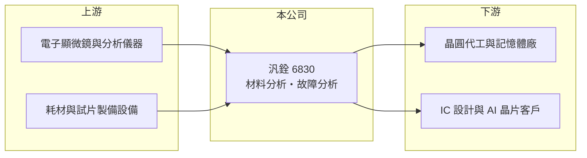

# 6830 汎銓

> 上市｜[[產業索引-其他電子業|其他電子業]]｜上市（櫃）日期 2022/08/31

# 第一章：企業模式與商業藍圖

> [!info] 撰寫說明
> 精簡版，由 Claude 依公開資料整理，架構比照 [[2330台積電]]，資料截至 2026-10-08。來源：MoneyDJ 理財網（富邦證券站）汎銓年度損益表、財務比率與基本資料；經濟日報 2026 年 5 月汎銓財報報導；證交所 2026 年第二季資產負債資料。營收依客戶別比重與海外據點明細未查到。#待校對

汎銓是半導體的「醫學檢驗中心」：替晶圓廠與 IC 設計公司做[[材料分析]]與[[故障分析]]，製程越先進、研發越密集，它的生意就越多。

- **核心業務：** 汎銓 2005 年成立於新竹，2022 年 8 月上市，營收 100% 來自分析服務。它用穿透式電子顯微鏡（[[TEM]]）等昂貴儀器，把晶片切成極薄的樣品，觀察原子等級的結構與成分，協助客戶找出製程缺陷或晶片失效原因。
- **營收結構：** 依經濟日報報導，成長動能主要來自先進製程的材料分析與 AI 晶片分析委案。材料分析偏向晶圓廠研發新製程時的需求，故障分析則偏向 IC 設計公司量產前後的除錯，兩者都與半導體研發強度高度相關。
- **營運據點：** 總部與主要實驗室在新竹，貼近晶圓廠與 IC 設計聚落；公司近年擴展海外據點，2026 年起海外營收開始貢獻。分析服務講求快速交件，實驗室必須設在客戶附近，因此擴點就是擴產。
- **長期方向：** 公司提出三條主軸：埃米級先進製程材料分析、深化 AI 客戶合作，以及[[矽光子]]檢測設備。前兩者延續原有服務，第三項是從服務跨入設備銷售，若成功將改變營收結構。

# 第二章：護城河深度與競爭優勢

汎銓的護城河來自專業人才、昂貴儀器與客戶信任的累積，但同業同樣具備這些條件，競爭仍然激烈。

- **競爭優勢：** 先進製程研發階段的分析樣品數量多、交期緊，分析結果直接影響客戶研發進度。長期合作後，客戶熟悉汎銓的分析品質與流程，加上委案內容涉及機密製程，轉換供應商有一定成本（推估）。
- **主要對手：** 台灣主要同業為 [[3587閎康]] 與 [[3289宜特]]，另外大型晶圓廠也有自己的內部實驗室。三家台灣業者都在擴充先進分析產能，價格與交期競爭是常態。
- **觀察重點：** 2021 至 2023 年汎銓的營業利益率約 18% 至 22%，2024 年後擴產帶來的折舊與人力成本讓利益率降到個位數。長期要看新產能能否被需求填滿、利益率能否回到過去水準，以及矽光子設備能否成為新的營收來源。

# 第三章：財務體質與盈利規模

資料日期：2026-10-08，表格是撰寫當時的快照；最新月營收、毛利率、累計 EPS 由自動排程寫在本筆記的屬性欄位（月營收、毛利率、累計EPS 等）。#待校對

汎銓營收連年成長，但 2024 年起擴產成本上升，獲利率明顯下滑，2025 年轉為小幅虧損。

| 年度 | 營收（億元） | [[毛利率]] | [[營業利益率]] | EPS（元） | [[ROE]] |
|---|---|---|---|---|---|
| 2021 | 14.70 | 37.77% | 20.12% | 6.21 | 14.63% |
| 2022 | 17.26 | 40.25% | 21.86% | 6.67 | 12.93% |
| 2023 | 18.81 | 37.06% | 18.30% | 5.59 | 10.17% |
| 2024 | 19.67 | 26.66% | 6.85% | 1.34 | 2.27% |
| 2025 | 21.79 | 23.70% | 2.57% | -0.71 | -1.19% |

- **營收與獲利趨勢：** 2020 至 2025 年營收年複合成長率約 14.4%（推算），但毛利率由四成降到兩成出頭。這反映分析服務的成本結構：儀器折舊與工程師薪資是固定成本，新產能剛開出時[[產能利用率]]不足，獲利就被壓縮。
- **財務特色：** 每股營業現金流量每年維持在 14 至 15 元，遠高於 EPS，代表大量折舊雖壓低帳面獲利，但現金流仍穩定流入。負債比率由 2022 年約 33% 升到 2025 年約 51%，擴產資金部分來自借款。現金股利由 2023 年度以前的 4.5 至 5.5 元，降到 2024、2025 年度各 1 元。
- **[[ROIC]] 與 [[WACC]]：** 以 2025 年營業利益 0.56 億元乘以（1－20%）得稅後營業利益約 0.45 億元，除以 2026 年第二季股東權益約 33.95 億元加非流動負債約 18.24 億元（作為有息負債的近似），ROIC 不到 1%（推算）。WACC 以 CAPM 推估：無風險利率 1.75%、市場風險溢酬 6%、β 取 MoneyDJ 的 0.95，股權成本約 7.4%；稅後負債成本約 2%，權益與負債約 65 比 35，WACC 約 5.5%（推算）。2021 至 2023 年 ROIC 推估高於 WACC，2024 年後轉為低於 WACC，目前處於擴產後尚未創造價值的階段，要等產能利用率回升才能翻轉。

# 第四章：總體風險與地緣政治

汎銓的風險在於高固定成本與半導體研發支出的循環。

- **產業週期：** 分析需求跟隨晶圓廠與 IC 設計公司的研發預算，半導體景氣下修時，客戶會縮減委外分析或延後新製程開發。由於成本多為固定，營收只要小幅下滑，獲利就會大幅波動。
- **營運風險：** 高階電子顯微鏡等設備昂貴，擴產後的折舊會壓在損益表上好幾年，若新據點與新業務的營收爬坡慢於預期，虧損可能延續。分析工程師培養期長，人才流動也會影響服務品質。
- **其他風險：** 同業同時擴產可能引發價格競爭；海外據點則面臨當地法規、匯率與地緣政治風險。矽光子設備屬新業務，技術標準與市場規模仍不確定。

# 專有名詞解析

## 半導體

- **[[材料分析]]**：分析晶片各層材料的成分、厚度與結構，協助晶圓廠開發與調校新製程。
- **[[故障分析]]**：找出晶片失效的位置與原因，協助設計或製程修正。
- **[[TEM]]**：穿透式電子顯微鏡，以電子束穿透極薄樣品觀察原子等級結構，是先進製程分析的關鍵設備。
- **[[矽光子]]**：在矽晶片上製作光學元件，以光取代電傳輸資料，可降低 AI 資料中心的傳輸耗電。

## 金融

- **[[產能利用率]]**：實際投片量占總產能的比例，晶圓代工廠的毛利率高度取決於此數字。

# 核心供應鏈

- 上游：電子顯微鏡等分析儀器與耗材供應商（推估）
- 下游／客戶：晶圓代工廠、記憶體廠、IC 設計與 AI 晶片公司（名稱未查到）
- 同業：[[3587閎康]]、[[3289宜特]]

## 供應鏈關係
- 供應給 [[2330台積電]]：高階半導體材料分析 (MA)（台積電供應鏈 › 下游：高階檢測與分析服務）

## 最新新聞
<!-- news:start（自動產生，請勿手動編輯此範圍） -->
- 2026-10-07 📰 媒體 02:01｜9月營收年增36% 汎銓連三月寫新高！｜[鏡週刊Mirror Media](https://news.google.com/rss/articles/CBMiYkFVX3lxTE1fWlAybkZRSjg2WTJwbEhCR3JReS16aDNrbS15c2VELWx2R3FSc1ZZVmNzcXlwRk5Rb0pWQXF3eGVhSlRiWFZPWDJzOUltcE1CdjF0aG5hcHd6M1k1d0FXeXZB0gFiQVVfeXFMTV9aUDJuRlFKODZZMnBsSEJHclF5LXpoM2ttLXlzZUQtbHZHcVJzVllWY3NxeXBGTlFvSlZBcXd4ZWFKVGJYVk9YMnM5SW1wTUJ2MXRobmFwd3ozWTV3QVd5dkE?oc=5)
- 2026-10-06 📰 媒體 11:31｜個股：汎銓(6830)115年現金增資股款催繳期間訂10/6-11/9｜[富聯網](https://news.google.com/rss/articles/CBMiiAFBVV95cUxQN0lGT2Zsa3B1WGNaVjBTY1hFdTNTdDFKTXFjMzhqUzIyMzR3OGRrTkRwdE1NUXpJYjVxU21hdElpb2Z4TElSWHJOWmVnck5iUTRjMFloLThoaUNkcm1KRGtsWjJlMmRaMzU5ZEpuZ0g4TWxZRHBHcWdyQVNZb2xJMjJGWm9TNjZ3?oc=5)
- 2026-10-06 🏛️ 重訊 11:27｜本公司115年現金增資催繳公告｜[觀測站](https://mops.twse.com.tw/mops/#/web/t05st01)
- 2026-10-05 📰 媒體 17:30｜汎銓(6830)9月營收再創高、股價卻離高點逾3成！矽光子設備一台最高3億元，第一張訂單何時來？｜[鉅亨網](https://news.cnyes.com/news/id/6621807)
- 2026-10-05 📰 媒體 17:00｜汎銓(6830)營收連3月創高、股價卻離高點逾3成！矽光子設備一台最高3億元，第一張訂單何時來？｜[鉅亨網](https://news.cnyes.com/news/id/6621789)

完整紀錄：[[6830汎銓 新聞]]
<!-- news:end -->

## 相關連結
- [公開資訊觀測站](https://mopsov.twse.com.tw/mops/web/t05st03?step=1&firstin=1&co_id=6830)
- [Goodinfo](https://goodinfo.tw/tw/StockDetail.asp?STOCK_ID=6830)
- [Yahoo 股市](https://tw.stock.yahoo.com/quote/6830)
- [鉅亨網新聞](https://www.cnyes.com/twstock/6830/news)
