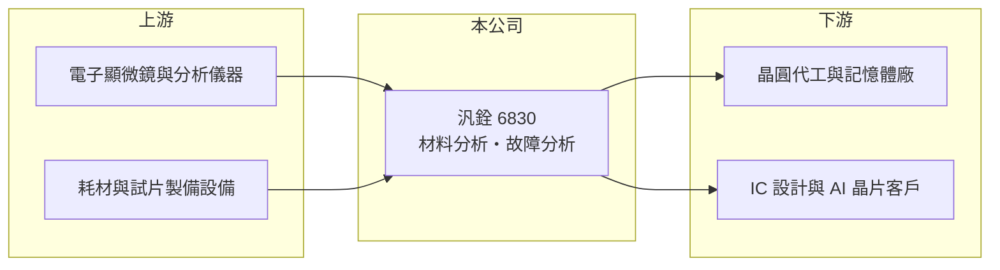

# 6830 汎銓

> 上市｜[[產業索引-其他電子業|其他電子業]]｜上市（櫃）日期 2022/08/31

# 第一章：企業模式與商業藍圖

> [!info] 撰寫說明
> 精簡版，由 Claude 依公開資料整理，架構比照 [[2330台積電]]，資料截至 2026-10-07。來源：經濟日報 2026 年 5 月汎銓首季財報報導、winvest 營收快訊（2026 年 8 月）。公開資料有限，營收比重與客戶名稱未查到。#待校對

汎銓是半導體實驗室分析服務商，替晶圓廠與 IC 設計公司做[[材料分析]]與[[故障分析]]，營收創新高但仍在擴張期虧損。

- **核心業務：** 汎銓 2005 年成立，2022 年 8 月上市，以技術分析服務為主，用穿透式電子顯微鏡（[[TEM]]）等設備協助客戶找出製程與晶片問題。
- **營收結構：** 本次未查到業務別比重；依經濟日報，成長主要來自材料分析與 AI 晶片分析委案。
- **營運據點：** 以台灣實驗室為主，海外據點營收已開始貢獻（據點明細本次未查到）。
- **長期方向：** 公司提出三條成長主軸：埃米級先進製程材料分析、深化 AI 客戶合作，以及[[矽光子]]檢測設備。

# 第二章：護城河深度與競爭優勢

汎銓的價值在於跟著先進製程研發走，製程越微縮，分析需求越多。

- **競爭優勢：** 先進製程研發階段需要大量 TEM 材料分析，分析能力與交期直接影響客戶研發進度，長期合作後轉換成本高（推估）。
- **主要對手：** [[3587閎康]]、[[3289宜特]]，以及客戶自有實驗室。
- **觀察重點：** 營收創高能否帶動轉盈、海外據點與矽光子設備的新業務進度，以及擴產折舊的消化速度。

# 第三章：財務體質與盈利規模

資料日期：2026-10-07，以下數字是撰寫當時的快照；最新月營收、毛利率、累計 EPS 由自動排程寫在本筆記的屬性欄位（月營收、毛利率、累計EPS 等）。#待校對

汎銓 2026 年營收成長兩成以上，第二季單季轉盈。

- **營收規模：** 2026 年第一季營收 5.79 億元、年增 24.54%；8 月營收 2.54 億元、年增 31.95%；1 至 8 月累計 17.09 億元，年增 22.67%。
- **獲利：** 2025 年 EPS -0.71 元；2026 年第一季 EPS -0.61 元，[[毛利率]] 21.58%、年增 8.43 個百分點；第二季 EPS 0.36 元，上半年累計 -0.25 元。
- **財務特色：** 資本額約 5.44 億元、市值約 325 億元，市場評價明顯反映先進製程與矽光子題材，而非目前獲利。

# 第四章：總體風險與地緣政治

汎銓的風險在於高固定成本與獲利尚未穩定。

- **產業週期：** 分析需求跟隨晶圓廠與 IC 設計公司的研發投入，半導體景氣下修時委案量可能減少。
- **營運風險：** 分析設備昂貴、折舊與人力成本高，營收成長若不如預期就容易虧損；新設據點與新業務需要時間才能攤平成本。
- **其他風險：** 評價高、股價波動大；同業擴產帶來價格競爭，以及海外據點的地緣政治與匯率風險。

# 專有名詞解析

## 半導體

- **[[材料分析]]**：分析晶片各層材料的成分、厚度與結構，協助晶圓廠開發與調校新製程。
- **[[故障分析]]**：找出晶片失效的位置與原因，協助設計或製程修正。
- **[[TEM]]**：穿透式電子顯微鏡，以電子束穿透極薄樣品觀察原子等級結構，是先進製程分析的關鍵設備。
- **[[矽光子]]**：在矽晶片上製作光學元件，以光取代電傳輸資料，可降低 AI 資料中心的傳輸耗電。

## 金融

- **[[毛利率]]**：營收扣除銷貨成本後的毛利占營收比例，反映產品本身的獲利能力。

# 核心供應鏈

- 上游：電子顯微鏡等分析儀器與耗材供應商（推估）
- 下游／客戶：晶圓代工廠、記憶體廠、IC 設計與 AI 晶片公司（名稱未查到）
- 同業：[[3587閎康]]、[[3289宜特]]

## 供應鏈關係
- 供應給 [[2330台積電]]：高階半導體材料分析 (MA)（台積電供應鏈 › 下游：高階檢測與分析服務）

## 最新新聞
<!-- news:start（自動產生，請勿手動編輯此範圍） -->
- 2026-10-07 📰 媒體 02:01｜9月營收年增36% 汎銓連三月寫新高！｜[鏡週刊Mirror Media](https://news.google.com/rss/articles/CBMiYkFVX3lxTE1fWlAybkZRSjg2WTJwbEhCR3JReS16aDNrbS15c2VELWx2R3FSc1ZZVmNzcXlwRk5Rb0pWQXF3eGVhSlRiWFZPWDJzOUltcE1CdjF0aG5hcHd6M1k1d0FXeXZB0gFiQVVfeXFMTV9aUDJuRlFKODZZMnBsSEJHclF5LXpoM2ttLXlzZUQtbHZHcVJzVllWY3NxeXBGTlFvSlZBcXd4ZWFKVGJYVk9YMnM5SW1wTUJ2MXRobmFwd3ozWTV3QVd5dkE?oc=5)
- 2026-10-06 📰 媒體 11:31｜個股：汎銓(6830)115年現金增資股款催繳期間訂10/6-11/9｜[富聯網](https://news.google.com/rss/articles/CBMiiAFBVV95cUxQN0lGT2Zsa3B1WGNaVjBTY1hFdTNTdDFKTXFjMzhqUzIyMzR3OGRrTkRwdE1NUXpJYjVxU21hdElpb2Z4TElSWHJOWmVnck5iUTRjMFloLThoaUNkcm1KRGtsWjJlMmRaMzU5ZEpuZ0g4TWxZRHBHcWdyQVNZb2xJMjJGWm9TNjZ3?oc=5)
- 2026-10-06 🏛️ 重訊 11:27｜本公司115年現金增資催繳公告｜[觀測站](https://mops.twse.com.tw/mops/#/web/t05st01)
- 2026-10-05 📰 媒體 17:30｜汎銓(6830)9月營收再創高、股價卻離高點逾3成！矽光子設備一台最高3億元，第一張訂單何時來？｜[鉅亨網](https://news.cnyes.com/news/id/6621807)
- 2026-10-05 📰 媒體 17:00｜汎銓(6830)營收連3月創高、股價卻離高點逾3成！矽光子設備一台最高3億元，第一張訂單何時來？｜[鉅亨網](https://news.cnyes.com/news/id/6621789)

完整紀錄：[[6830汎銓 新聞]]
<!-- news:end -->

## 相關連結
- [公開資訊觀測站](https://mopsov.twse.com.tw/mops/web/t05st03?step=1&firstin=1&co_id=6830)
- [Goodinfo](https://goodinfo.tw/tw/StockDetail.asp?STOCK_ID=6830)
- [Yahoo 股市](https://tw.stock.yahoo.com/quote/6830)
- [鉅亨網新聞](https://www.cnyes.com/twstock/6830/news)
