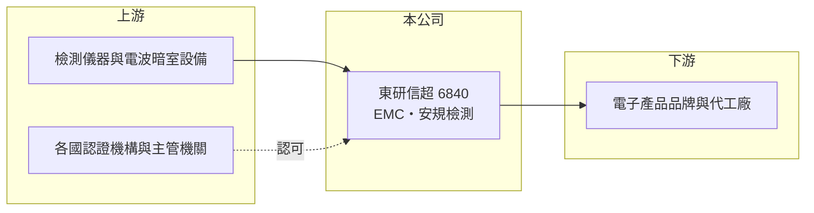

# 6840 東研信超

> 上櫃｜[[產業索引-其他電子業|其他電子業]]｜上市（櫃）日期 2023/03/24

# 第一章：企業模式與商業藍圖

> [!info] 撰寫說明
> 精簡版，由 Claude 依公開資料整理，架構比照 [[2330台積電]]，資料截至 2026-10-07。來源：winvest 營收快訊（2026 年 4、6、7、8 月）。公開資料有限，服務別營收比重、客戶與實驗室據點未查到。#待校對

東研信超是電子產品的檢測驗證實驗室，提供[[EMC]]與[[安規驗證]]服務，營收穩定成長。

- **核心業務：** 公司 1987 年成立，2023 年 3 月上櫃，主要業務為電子產品的電磁相容認證及安規檢測，協助客戶產品取得各國上市許可。
- **營收結構：** 本次未查到 EMC、安規或其他檢測的營收比重。
- **營運據點：** 實驗室據點本次未查到，以台灣為主（推估）。
- **長期方向：** 隨著電子產品功能增加、各國法規趨嚴，檢測項目與送測量可望增加，公司營收維持一成以上成長。

# 第二章：護城河深度與競爭優勢

檢測驗證屬於法規驅動的服務，認可資格與實驗室設備是進入門檻。

- **競爭優勢：** 實驗室需取得各國主管機關與認證機構的認可，客戶長期送測後熟悉流程，轉換意願較低（推估）。
- **主要對手：** [[6146耕興]]，以及 SGS、UL、TÜV 等國際檢測機構。
- **觀察重點：** 營收成長能否持續一成以上、獲利率能否維持在第二季的水準，以及新檢測項目的擴充。

# 第三章：財務體質與盈利規模

資料日期：2026-10-07，以下數字是撰寫當時的快照；最新月營收、毛利率、累計 EPS 由自動排程寫在本筆記的屬性欄位（月營收、毛利率、累計EPS 等）。#待校對

東研信超 2026 年營收成長約一成，第二季獲利大幅提升。

- **營收規模：** 2026 年 4 月營收 8,766 萬元、6 月 9,812 萬元、7 月 9,074 萬元、8 月 8,450 萬元（年增 10.8%）；1 至 8 月累計 6.64 億元，年增 12.57%。
- **獲利：** 2025 年全年 [[EPS]] 1.58 元；2026 年第一季 EPS 約 0.12 元（推算），第二季 0.94 元，上半年累計 1.06 元、年增 126%。
- **財務特色：** 資本額約 3.08 億元、市值約 27 億元，規模小；毛利率本次未查到，第一季獲利偏低可能與季節性或費用認列有關（推估）。

# 第四章：總體風險與地緣政治

東研信超的風險主要來自電子產品開發節奏與同業競爭。

- **產業週期：** 送測量跟隨客戶新產品開發，電子業景氣轉弱或新品延後時，檢測營收會受影響。
- **營運風險：** 實驗室設備與人力屬固定成本，送測量下降時獲利率會明顯波動；各季獲利差距大。
- **其他風險：** 各國法規變動可能帶來新需求，也可能要求新設備投資；國際檢測機構的價格競爭。

# 專有名詞解析

## 金融

- **[[EPS]]**：每股盈餘，稅後淨利除以流通股數，代表每一股分到的獲利。

## 產業

- **[[EMC]]**：電磁相容，電子產品不干擾其他設備、也不易被干擾的能力，多數國家要求上市前檢測。
- **[[安規驗證]]**：檢查電子產品的電氣安全、防火與防觸電設計，符合各國安全法規才能上市。

# 核心供應鏈

- 上游：檢測儀器、電波暗室設備供應商，以及各國認證機構（推估）
- 下游／客戶：電子產品品牌與代工廠（名稱未查到）
- 同業：[[6146耕興]]、SGS、UL、TÜV

## 最新新聞
<!-- news:start -->
<!-- news:end -->

## 相關連結
- [公開資訊觀測站](https://mopsov.twse.com.tw/mops/web/t05st03?step=1&firstin=1&co_id=6840)
- [Goodinfo](https://goodinfo.tw/tw/StockDetail.asp?STOCK_ID=6840)
- [Yahoo 股市](https://tw.stock.yahoo.com/quote/6840)
- [鉅亨網新聞](https://www.cnyes.com/twstock/6840/news)
