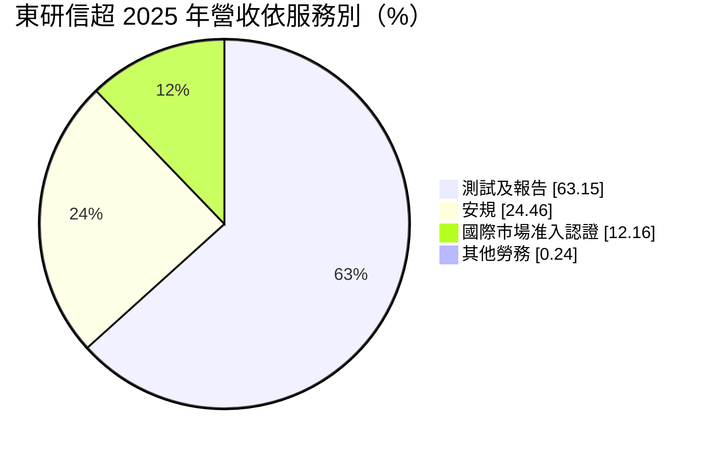
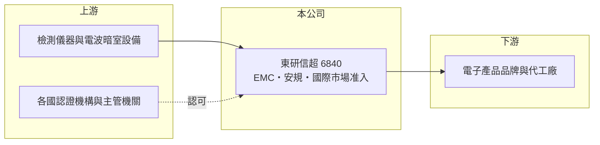

# 6840 東研信超

> 上櫃｜[[產業索引-其他電子業|其他電子業]]｜上市（櫃）日期 2023/03/24

# 第一章：企業模式與商業藍圖

> [!info] 撰寫說明
> 精簡版，由 Claude 依公開資料整理，架構比照 [[2330台積電]]，資料截至 2026-10-08。來源：MoneyDJ 理財網（富邦證券站）東研信超年度損益表、財務比率與基本資料；winvest 公司簡介；櫃買中心 2026 年第二季資產負債資料。公開資料有限，實驗室據點與主要客戶未查到。#待校對

東研信超是電子產品的檢測驗證實驗室，幫客戶確認產品符合各國法規、取得上市許可，屬於「法規強制、每款新品都要做」的服務業。

- **核心業務：** 公司 1987 年成立，2023 年 3 月上櫃，總部在台北內湖，主要提供電子產品的[[EMC]]與[[安規驗證]]檢測服務。任何電子產品要在美國、歐盟、日本等市場銷售，都必須通過當地的電磁相容與安全規範測試，東研信超替客戶完成測試、出具報告並協助取得證書。
- **營收結構：** 依 MoneyDJ 2025 年資料，測試及報告占 63.15%、安規 24.46%、國際市場准入認證 12.16%。國際市場准入是協助客戶一次處理多國認證文件，屬於附加價值較高的顧問型服務。
- **營運據點：** 實驗室明細本次未查到，以台灣為主（推估）。檢測需要電波暗室等大型設施，屬重資產服務，2026 年第二季非流動資產約 12.3 億元，占總資產三分之二。
- **長期方向：** 電子產品的無線功能越多、各國法規越嚴，送測項目就越多。車用電子、醫療與綠能產品的法規要求也持續增加，這是檢測驗證產業長期成長的基本動力。

# 第二章：護城河深度與競爭優勢

檢測驗證的門檻在於主管機關的認可資格與大型測試設施，但台灣同業多，價格競爭不小。

- **競爭優勢：** 實驗室必須取得各國主管機關與認證機構的授權，報告才會被承認，資格取得與維持都需要時間與成本。客戶長期送測後熟悉流程與窗口，加上新品開發時程緊迫，通常不會輕易更換實驗室（推估）。
- **主要對手：** 國內同業 [[6146耕興]]，以及 SGS、UL、TÜV 等國際檢測機構。國際機構品牌力強、全球據點多，本土實驗室則以價格、速度與在地服務競爭。
- **觀察重點：** 2023 年東研信超營收年減約 21%、營業利益率降到約 -11%，顯示電子業庫存調整時送測量會明顯縮減。長期要看能否透過國際市場准入等高附加價值服務，把營業利益率拉回 2021 至 2022 年約 14% 至 19% 的水準。

# 第三章：財務體質與盈利規模

資料日期：2026-10-08，表格是撰寫當時的快照；最新月營收、毛利率、累計 EPS 由自動排程寫在本筆記的屬性欄位（月營收、毛利率、累計EPS 等）。#待校對

東研信超營收規模約九億元，2023 年曾轉虧，2024 年後逐步恢復獲利，但尚未回到疫情期間的高峰。

| 年度 | 營收（億元） | [[毛利率]] | [[營業利益率]] | [[EPS]]（元） | [[ROE]] |
|---|---|---|---|---|---|
| 2021 | 8.25 | 53.07% | 19.16% | 5.62 | 20.90% |
| 2022 | 8.88 | 49.42% | 13.94% | 5.87 | 18.91% |
| 2023 | 7.03 | 32.73% | -10.79% | -2.16 | -6.84% |
| 2024 | 8.38 | 37.64% | -1.41% | 0.54 | 1.71% |
| 2025 | 9.09 | 41.19% | 6.65% | 1.58 | 4.66% |

- **營收與獲利趨勢：** 2020 至 2025 年營收年複合成長率約 6.5%（推算），近五年平均 ROE 約 7.9%（推算）。毛利率由五成以上掉到三成多再回升到四成，說明實驗室的固定成本高，送測量一減少，獲利就大幅下滑。
- **財務特色：** 每股營業現金流量長期為正，2023 年虧損時仍有 1.34 元，2025 年回升到 5.63 元，折舊大於帳面獲利的特性與分析實驗室相似。現金股利不穩定，2021、2022 年度分別配 2.6 元與 2.73 元，2023 年度改配股票股利 1 元，2024、2025 年度分別為 0.3 元與 1 元。
- **[[ROIC]] 與 [[WACC]]：** 以 2025 年營業利益 0.60 億元乘以（1－20%）得稅後營業利益約 0.48 億元，除以 2026 年第二季股東權益約 10.80 億元加非流動負債約 2.50 億元，ROIC 約 3.6%（推算）。WACC 以 CAPM 推估：無風險利率 1.75%、市場風險溢酬 6%、β 取 MoneyDJ 的 0.56，股權成本約 5.1%；稅後負債成本約 2%，權益與負債約 81 比 19，WACC 約 4.5%（推算）。目前 ROIC 略低於 WACC，尚未創造超額價值；若營業利益率回到一成以上，ROIC 才會明顯超過資金成本。

# 第四章：總體風險與地緣政治

東研信超的風險主要來自電子產品開發節奏、高固定成本與同業競爭。

- **產業週期：** 送測量取決於客戶推出新產品的速度，電子業景氣轉弱或品牌延後新品時，檢測營收會直接下降。2023 年的虧損就是庫存調整期送測量縮減的結果。
- **營運風險：** 電波暗室、測試儀器與專業人員都是固定成本，營收下降時無法同步縮減，獲利波動因此很大。各國法規更新時，實驗室需要投資新設備與重新取得認可，否則會失去部分業務。
- **其他風險：** 國際檢測機構的價格與品牌競爭，以及主要客戶生產與研發外移，都可能讓台灣本地送測量減少。法規變動既是新需求來源，也可能帶來額外投資壓力。

# 專有名詞解析

## 金融

- **[[EPS]]**：每股盈餘，稅後淨利除以流通股數，代表每一股分到的獲利。

## 產業

- **[[EMC]]**：電磁相容，電子產品不干擾其他設備、也不易被干擾的能力，多數國家要求上市前檢測。
- **[[安規驗證]]**：檢查電子產品的電氣安全、防火與防觸電設計，符合各國安全法規才能上市。

# 核心供應鏈

- 上游：檢測儀器、電波暗室設備供應商，以及各國認證機構（推估）
- 下游／客戶：電子產品品牌與代工廠（名稱未查到）
- 同業：[[6146耕興]]、SGS、UL、TÜV

## 最新新聞
<!-- news:start -->
<!-- news:end -->

## 相關連結
- [公開資訊觀測站](https://mopsov.twse.com.tw/mops/web/t05st03?step=1&firstin=1&co_id=6840)
- [Goodinfo](https://goodinfo.tw/tw/StockDetail.asp?STOCK_ID=6840)
- [Yahoo 股市](https://tw.stock.yahoo.com/quote/6840)
- [鉅亨網新聞](https://www.cnyes.com/twstock/6840/news)
