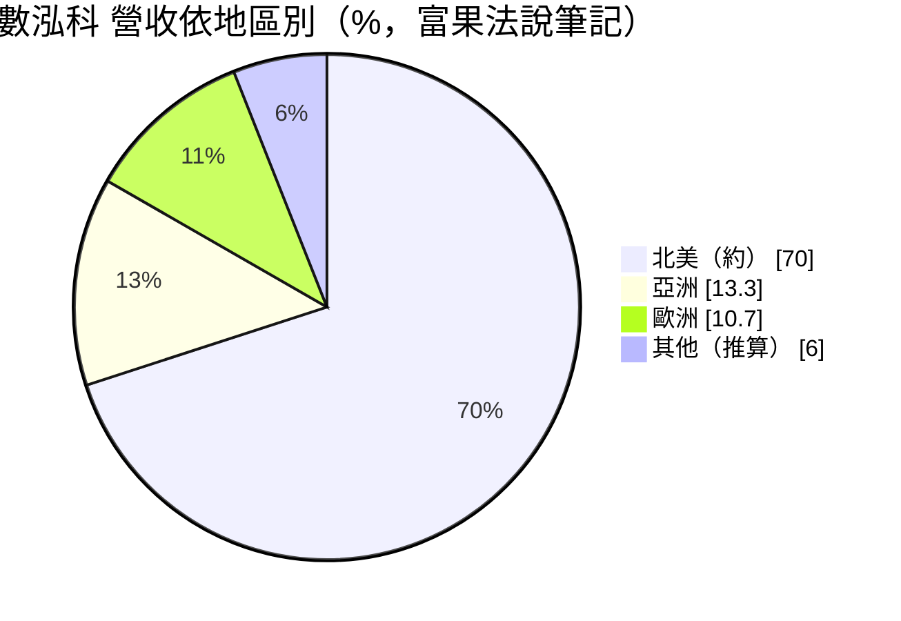
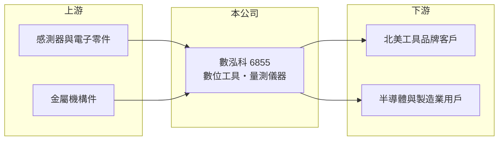

# 6855 數泓科

> 上櫃｜[[產業索引-其他電子業|其他電子業]]｜上市（櫃）日期 2022/10/06

# 第一章：企業模式與商業藍圖

> [!info] 撰寫說明
> 精簡版，由 Claude 依公開資料整理，架構比照 [[2330台積電]]，資料截至 2026-10-07。來源：富果研究數泓科 2026 年 5 月法說會筆記、winvest 營收快訊（2026 年 8 月）。客戶名稱未查到。#待校對

數泓科是以[[ODM]]為主的數位工具與量測儀器廠，產品主要銷往北美，毛利率接近五成。

- **核心業務：** 公司 2006 年成立，2022 年 10 月上櫃，研發製造智慧製造生產系統、數位工具與量測儀器，營業項目也涵蓋智慧醫療。
- **營收結構：** 依富果法說筆記，ODM 約占 97%、自有品牌約 3%；2026 年專業產品占 52.6%。地區別以北美約七成為主，亞洲 13.3%、歐洲 10.7%。
- **營運據點：** 總部與研發在台灣，生產據點本次未查到。
- **長期方向：** 公司把量測技術延伸到半導體 AI 應用，預計 2026 年下半年小量出貨，新產品毛利率目標 70% 至 90%。

# 第二章：護城河深度與競爭優勢

數泓科的競爭力在於把感測與數位量測整合進手工具，形成高毛利的利基產品。

- **競爭優勢：** 公司表示在技術上沒有直接競爭對手，既有產品毛利率約 48% 至 50%，顯示產品具差異化。
- **主要對手：** 國際工具品牌 Snap-on 為主要競爭者；部分品牌客戶也可能自行開發數位工具（推估）。
- **觀察重點：** 半導體 AI 應用首張訂單（公司預估約 800 萬元上下 200 萬元）能否如期出貨，以及全年營收成長 15% 至 25% 的目標能否達成。

# 第三章：財務體質與盈利規模

資料日期：2026-10-07，以下數字是撰寫當時的快照；最新月營收、毛利率、累計 EPS 由自動排程寫在本筆記的屬性欄位（月營收、毛利率、累計EPS 等）。#待校對

數泓科營收規模小但獲利率高，2026 年上半年 EPS 年增近一倍。

- **營收規模：** 2026 年第一季營收 1.33 億元、年減 21.4%；8 月營收 6,262 萬元、年增 64.66%；1 至 8 月累計 4.47 億元，年增 2.8%。
- **獲利：** 2025 年全年 EPS 7.85 元；2026 年第一季 EPS 2.03 元，[[毛利率]] 48.75%、[[營業利益率]] 29.46%；第二季 EPS 2.12 元，上半年累計 4.15 元。
- **財務特色：** 資本額約 2.32 億元、市值約 27.6 億元，股本小、獲利率高；公司目標全年毛利率超過 50%。

# 第四章：總體風險與地緣政治

數泓科的風險集中在北美市場與少數 ODM 客戶。

- **產業週期：** 數位工具需求跟隨北美汽車維修、工業製造景氣，客戶庫存調整時訂單起伏大，2026 年第一季營收即年減兩成。
- **營運風險：** ODM 占 97%，營收高度依賴少數品牌客戶（推估），客戶自製或轉單會直接衝擊營收。
- **其他風險：** 北美占營收七成，美國關稅與新台幣升值會影響價格競爭力與毛利率。

# 專有名詞解析

## 金融

- **[[毛利率]]**：營收扣除銷貨成本後的毛利占營收比例，反映產品本身的獲利能力。
- **[[營業利益率]]**：營業利益占營收的比率，反映扣除營業費用後本業的獲利能力。

## 產業

- **[[ODM]]**：原廠委託設計製造，代工廠負責產品設計與生產，產品掛品牌客戶的名稱銷售。
- **[[智慧製造]]**：結合設備資料、軟體分析與 AI，讓工廠能即時調整製程、提高良率與效率。

# 核心供應鏈

- 上游：感測器、電子零件與金屬機構件供應商（推估）
- 下游／客戶：北美為主的工具品牌（名稱未查到）、半導體與製造業用戶
- 同業：Snap-on 等國際工具品牌

## 最新新聞
<!-- news:start -->
<!-- news:end -->

## 相關連結
- [公開資訊觀測站](https://mopsov.twse.com.tw/mops/web/t05st03?step=1&firstin=1&co_id=6855)
- [Goodinfo](https://goodinfo.tw/tw/StockDetail.asp?STOCK_ID=6855)
- [Yahoo 股市](https://tw.stock.yahoo.com/quote/6855)
- [鉅亨網新聞](https://www.cnyes.com/twstock/6855/news)
