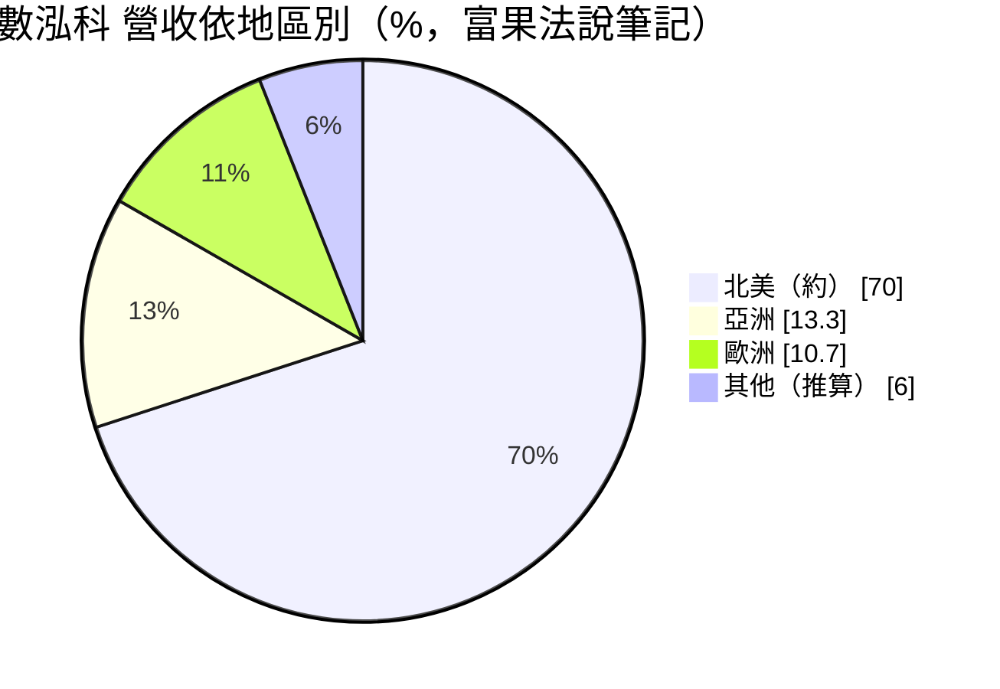
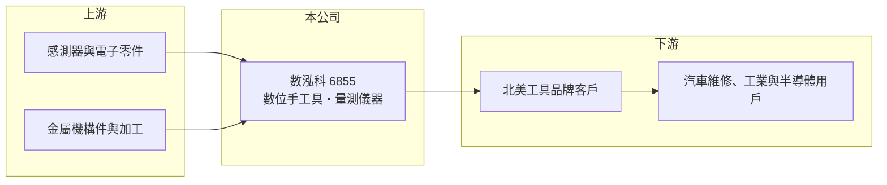

# 6855 數泓科

> 上櫃｜[[產業索引-其他電子業|其他電子業]]｜上市（櫃）日期 2022/10/06

# 第一章：企業模式與商業藍圖

> [!info] 撰寫說明
> 精簡版，由 Claude 依公開資料整理，架構比照 [[2330台積電]]，資料截至 2026-10-08。來源：MoneyDJ 理財網（富邦證券站）數泓科年度損益表、財務比率與基本資料；富果研究數泓科 2026 年 5 月法說會筆記；winvest 公司簡介；櫃買中心 2026 年第二季資產負債資料。客戶名稱未公開。#待校對

數泓科是台中的數位手工具設計製造商，把感測與電子量測做進扳手等工具裡，以 [[ODM]] 方式賣給北美工具品牌，長年維持近五成的毛利率。

- **核心業務：** 公司 2006 年成立，2022 年 10 月上櫃，總部在台中潭子。依 MoneyDJ 2025 年資料，數位手工具及零組件占營收 99.71%。這類產品例如能顯示並記錄扭力的數位扭力扳手，用於汽車維修、工業組裝等需要精準鎖固的場合，屬於[[智慧製造]]中的量測工具。
- **營收結構：** 依富果法說筆記，ODM 約占 97%、自有品牌約 3%；地區別以北美約七成為主，亞洲約 13.3%、歐洲約 10.7%。高度集中在北美 ODM 客戶，代表數泓科的成長與北美工具品牌的產品策略緊密相連。
- **營運據點：** 研發與生產以台中為主，員工約一百人（2025 年），屬於人少、技術密集的小型公司。台中是全球手工具產業聚落，零件與加工協力廠取得方便。
- **長期方向：** 公司正把量測技術延伸到半導體 AI 應用，法說會提到這類新產品毛利率目標可達 70% 至 90%。若能成功，數泓科將從工具供應商跨入半導體製程設備周邊，營收結構會更分散。

# 第二章：護城河深度與競爭優勢

數泓科的護城河在於「把電子量測做進手工具」的跨領域整合能力，以及與北美品牌多年共同開發的關係。

- **競爭優勢：** 數位工具需要同時懂機構設計、感測器、韌體與量測校正，傳統手工具廠不容易跨入。公司表示技術上沒有直接競爭對手，近七年毛利率穩定在 45% 至 50%，顯示產品具差異化與定價能力。
- **主要對手：** 國際工具品牌 Snap-on 是主要競爭者，部分品牌客戶也可能自行開發數位工具（推估）。對 ODM 廠來說，最大的威脅往往不是同業，而是客戶把設計收回自己做。
- **觀察重點：** 長期要看自有品牌與半導體新應用能否提高比重，降低對少數 ODM 客戶的依賴；以及在北美市場之外能否開發更多地區的客戶。

# 第三章：財務體質與盈利規模

資料日期：2026-10-08，表格是撰寫當時的快照；最新月營收、毛利率、累計 EPS 由自動排程寫在本筆記的屬性欄位（月營收、毛利率、累計EPS 等）。#待校對

數泓科營收規模約六億元，但營業利益率長期在三成上下，是獲利品質很穩定的小型公司。

| 年度 | 營收（億元） | [[毛利率]] | [[營業利益率]] | EPS（元） | [[ROE]] |
|---|---|---|---|---|---|
| 2021 | 4.44 | 46.38% | 30.25% | 5.34 | 23.31% |
| 2022 | 4.49 | 46.49% | 27.29% | 6.46 | 21.67% |
| 2023 | 4.80 | 47.73% | 30.68% | 6.29 | 18.71% |
| 2024 | 6.22 | 49.35% | 31.75% | 9.20 | 26.73% |
| 2025 | 6.26 | 49.51% | 35.13% | 7.85 | 20.48% |

- **營收與獲利趨勢：** 2020 至 2025 年營收年複合成長率約 13.9%（推算），近五年平均 ROE 約 22.2%（推算）。營收成長不算快，但毛利率與營業利益率逐年小幅提升，代表產品組合持續往高附加價值移動。
- **財務特色：** 負債比率約三成，流動比率長期在 270% 以上，幾乎沒有財務壓力。現金股利穩定，2021 至 2025 年度依序為 4.0、4.5、3.5、6.0、5.5 元，配息率約六至七成（推算）。每股營業現金流量除 2021 年外皆為正值。
- **[[ROIC]] 與 [[WACC]]：** 以 2025 年營業利益 2.20 億元乘以（1－20%）得稅後營業利益約 1.76 億元，除以 2026 年第二季股東權益約 8.83 億元（非流動負債僅約 0.04 億元），ROIC 約 20%（推算）。WACC 以 CAPM 推估：無風險利率 1.75%、市場風險溢酬 6%，MoneyDJ 的 β 僅 0.27，直接套用得股權成本約 3.4%，明顯偏低；考量小型股流動性，改以 β 1.0 估算股權成本約 7.75%，公司幾乎無負債，WACC 約 7.5% 至 8%（推算）。ROIC 長期約為 WACC 的兩倍以上，是持續創造價值的公司。

# 第四章：總體風險與地緣政治

數泓科的風險集中在單一市場與少數 ODM 客戶。

- **產業週期：** 數位工具需求跟隨北美汽車維修與工業製造景氣，客戶調整庫存時訂單會明顯波動。2026 年第一季營收曾年減約兩成，就是客戶拉貨節奏改變的例子。
- **營運風險：** ODM 占營收約 97%，客戶集中度高（推估），任何一家主要客戶轉單或自製，都會直接衝擊營收。公司規模小、員工約百人，關鍵研發人員流失的影響也比大公司明顯。
- **其他風險：** 北美占營收約七成，美國關稅政策與新台幣匯率會影響價格競爭力與毛利率。半導體新應用仍在起步階段，技術驗證與量產時程都有不確定性。

# 專有名詞解析

## 金融

- **[[毛利率]]**：營收扣除銷貨成本後的毛利占營收比例，反映產品本身的獲利能力。
- **[[ROIC]]**：投入資本報酬率，稅後營業利益除以股東權益加有息負債，衡量本業運用資本的效率。

## 產業

- **[[ODM]]**：原廠委託設計製造，代工廠負責產品設計與生產，產品掛品牌客戶的名稱銷售。
- **[[智慧製造]]**：結合設備資料、軟體分析與 AI，讓工廠能即時調整製程、提高良率與效率。

# 核心供應鏈

- 上游：感測器、電子零件與台中手工具聚落的金屬加工協力廠（推估）
- 下游／客戶：北美為主的工具品牌（名稱未公開），終端為汽車維修、工業與半導體用戶
- 同業：Snap-on 等國際工具品牌

## 最新新聞
<!-- news:start -->
<!-- news:end -->

## 相關連結
- [公開資訊觀測站](https://mopsov.twse.com.tw/mops/web/t05st03?step=1&firstin=1&co_id=6855)
- [Goodinfo](https://goodinfo.tw/tw/StockDetail.asp?STOCK_ID=6855)
- [Yahoo 股市](https://tw.stock.yahoo.com/quote/6855)
- [鉅亨網新聞](https://www.cnyes.com/twstock/6855/news)
