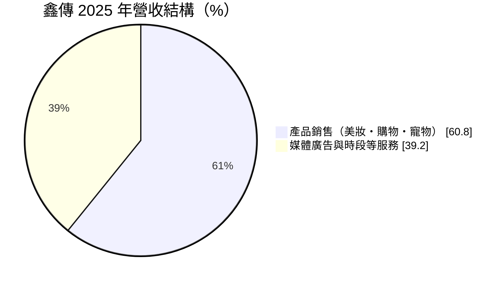
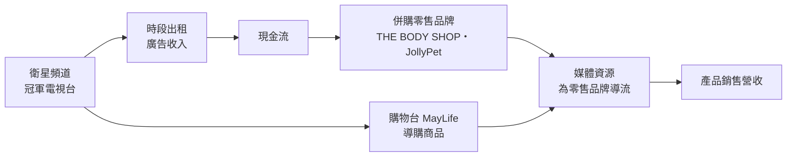
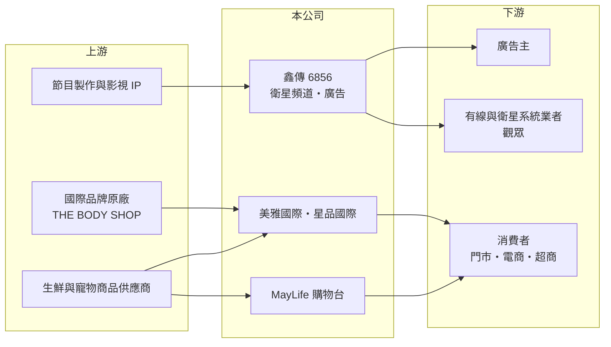

# 6856 鑫傳

> 上櫃｜[[產業索引-文化創意業|文化創意業]]｜上市（櫃）日期 2023/10/27

# 第一章：企業模式與商業藍圖

> [!info] 撰寫說明
> 精簡版，由 Claude 依公開資料整理，架構比照 [[2330台積電]] 的四章研究，資料截至 2026-10-08。來源：富果 2026 年 5 月 15 日法說會摘要、櫃買中心開放資料（2026 年第二季綜合損益與資產負債、基本資料、每月營收、本益比殖利率）、財經媒體標題；法說會摘要為 AI 整理，數字待對照公司簡報。Goodinfo 年度資料本次未能取得，多年度表格多為「未查得」。#待校對

鑫傳（股票代號：6856）是一家以衛星電視頻道起家，再透過併購延伸到美妝與寵物零售的媒體集團。本章說明它的四大事業，以及從廣告媒體轉向「媒體加零售」的結構變化。

## 一、核心定位：媒體內容加零售通路的整合集團

依櫃買中心資料，鑫傳成立於 1997 年，2023 年 10 月上櫃，董事長為廖紫岑，實收資本額約 2.82 億元。依富果整理的法說會摘要，公司的事業可分為四大塊：

* **內容產業：** 在地新聞與節目製作，並投資影視 IP。2025 年與 LINE TV 合作投資的影視劇《黑盒子》在 Netflix 與 LINE TV 上架。
* **衛星電視：** 經營「冠軍電視台」與「冠軍夢想台」，收入來自時段出租與歌唱節目。
* **廣告銷售：** 整合有線、衛星與數位平台（LINE TV、LINE OA、TikTok、YouTube）提供整合行銷服務。
* **[[電視購物]]與零售：** 「MayLife 美麗人生」購物台與電商，主力為生鮮食品（約占六成）；子公司美雅國際經營 THE BODY SHOP 台灣區；星品國際經營寵物品牌 JollyPet。

## 二、營收結構

依法說會摘要，產品銷售占營收的比重從 2023 年的 28.1% 升到 2025 年的 60.8%，主要是 2024 年併購 THE BODY SHOP 台灣區代理商美雅國際所致；2026 年第一季產品銷售占比約 56.1%。

主要子公司與持股（法說會摘要）：美雅國際 58.48%、星品國際 86.39%（2026 年增持後納為子公司）、人誠文創（信傳媒）68.47%、鑫隆多媒體 100%（節目製作與 IP 開發）、鑫祺多媒體 100%（MayLife 購物台與電商），另持有巧克公司（LINE TV）26.72%，為單一最大股東。

## 三、資本轉化邏輯

鑫傳的策略是用媒體事業的現金流併購消費品牌，再用自家頻道與數位廣告資源替品牌導流。這讓營收規模擴大，但也改變了獲利結構：媒體廣告的利潤率高，零售業務的利潤率低。

## 四、企業長期藍圖

公司表示會專注整合四大核心事業，追求長期穩健成長。管理層認為寵物新品線與通路效益會成為重要獲利來源：星品營收從第一年約 875 萬元成長到第二年約 2,800 萬元，並規劃推出與獸醫合作的保健產品線與訂閱制服務；美妝業務則希望借助媒體資源擴大；影視 IP 變現也是成長方向。這些新事業能否達到足夠規模並轉為獲利，將決定鑫傳未來十年的樣貌。

# 第二章：護城河深度與競爭優勢

在長期價值投資中，「護城河」指企業抵禦競爭、維持超額利潤的保護機制。本章分析鑫傳的媒體與零售整合能否形成持久優勢。

## 一、鑫傳護城河的核心組成要素

* **1. 頻道與時段資源：** 衛星電視頻道需要執照與系統業者上架，數量有限。鑫傳擁有自有頻道，可以出租時段、播出歌唱節目並經營購物台，這是新進者不易取得的資源。
* **2. 媒體導流能力：** 自有頻道、新聞平台與數位廣告整合能力，讓集團內的零售品牌可以用較低成本取得曝光，這是一般零售商沒有的優勢。
* **3. 國際品牌代理：** THE BODY SHOP 是國際知名的美妝保養品牌，取得台灣區經營權本身就有品牌價值。

不過電視媒體產業整體在衰退，零售業又高度競爭，鑫傳的優勢比較接近「資源整合」，而不是難以複製的護城河。

## 二、主要競爭對手格局

| 對手 | 定位 | 對鑫傳的威脅 |
|---|---|---|
| [[2614東森]]（東森購物） | 台灣最大的電視購物集團 | 在電視購物與電商直接競爭 |
| [[8454富邦媒]]（momo） | 台灣最大的電商平台，源自電視購物 | 電商流量與價格優勢遠大於鑫傳 |
| 三立、年代等電視台 | 新聞與綜藝頻道 | 爭奪廣告預算與收視 |
| 美妝與寵物零售品牌 | 開架美妝、寵物連鎖通路 | 在零售市場以規模與價格競爭 |

## 三、優勢轉化：哪些守得住、哪些守不住

* **守得住：** 頻道時段出租與歌唱節目的穩定收入，以及媒體為零售導流的協同效果。
* **守不住：** 營業利益率。法說會指出，營業利益率從 2023 年約 30% 降到 2025 年約 15%，原因是零售業務的毛利率與利益率低於傳統媒體廣告。
* **觀察重點：** 第一，零售業務的利益率能否提升；第二，寵物事業何時轉為獲利（法說會時尚未獲利）；第三，影視 IP 投資的回收情況。

# 第三章：財務體質與盈利規模

資料日期：2026-10-08，表格是撰寫當時的快照；最新月營收、毛利率、累計 EPS 由自動排程寫在本筆記的屬性欄位（月營收、毛利率、累計EPS 等）。#待校對

財務報表是檢驗護城河是否真實存在的最終標準。鑫傳 2024 年併購美雅國際後，財務結構出現明顯轉變。

## 一、多年度經營績效

| 年度 | 營收（新台幣） | [[毛利率]] | [[營業利益率]] | EPS（元） | [[ROE]] |
|---|---|---|---|---|---|
| 2023 | 未查得 | 未查得 | 約 30%（法說會摘要） | 未查得 | 未查得 |
| 2024 | 未查得 | 未查得 | 未查得 | 未查得 | 未查得 |
| 2025 | 未查得 | 未查得 | 約 15%（法說會摘要） | 約 2.86（推算） | 未查得 |
| 2026 第一季 | 1.71 億 | 約 68% | 約 12.7%（推算） | 0.56 | 不適用（單季） |
| 2026 上半年 | 3.48 億 | 68.9% | 15.1% | 1.25 | 不適用（半年） |

資料來源：2026 上半年為櫃買中心開放資料；2026 第一季與 2023、2025 年營業利益率取自富果法說會摘要；2025 年 EPS 以每股股利 3.0 元除以法說會所稱約 105% 的發放率推算。

* **毛利率高、利益率下降：** 2026 年上半年毛利率仍有約 69%，代表媒體與品牌商品的毛利仍高；但零售門市的人事、租金等費用較高，使營業利益率降到 15% 左右。
* **2026 年第一季：** 營收年增約 3%，營業利益年增約 5%，獲利成長略快於營收，是利益率止跌的初步跡象。
* **長期指標：** 公司 2023 年才上櫃，又在 2024 年進行大型併購，可比較的年度資料有限，近 5 年平均 ROE 與營收年複合成長率未查得。

## 二、資產負債與股利

依櫃買中心資料，2026 年第二季底總資產約 10.56 億元，負債約 2.97 億元，權益總計約 7.60 億元（歸屬母公司約 7.18 億元），財務結構穩健。2025 年度擬配發每股現金股利 3.0 元，其中 2.75 元來自未分配盈餘、0.25 元來自資本公積（法說會摘要），發放率約 105%，略高於當年獲利。

## 三、[[ROIC]] 與 [[WACC]]

**ROIC 推算：** 2026 年上半年營業利益約 0.53 億元，年化約 1.05 億元，稅後約 0.84 億元；投入資本以權益總計約 7.60 億元，加上假設有息與租賃負債約 0.5 億元（推估，門市租約可能形成租賃負債），合計約 8.1 億元，年化 ROIC 約 10.4%（推算）。

**WACC 推算：** 假設台灣 10 年期公債殖利率 1.75%、市場風險溢酬 6%、β 取媒體同業常見值 1.0（假設），權益成本約 7.75%；負債成本稅後約 2.0%，以權益約 94%、負債約 6% 計算，WACC 約 7.4%（推算）。

**結論：** 以目前的獲利水準，鑫傳的 ROIC 略高於 WACC，仍在創造價值，但利差不大。併購後利益率由 30% 降到 15%，代表新增的零售資本報酬率較低；若寵物與美妝事業不能提升獲利，整體 ROIC 可能逐步接近資金成本。

# 第四章：總體風險與地緣政治

任何企業都無法脫離宏觀環境獨立存在。本章分析鑫傳長期必須面對的媒體產業、零售與營運風險。

## 一、產業結構

* **電視媒體衰退：** 觀眾持續從[[有線電視]]與衛星電視轉向 [[OTT]] 串流平台與社群媒體，電視廣告預算長期下滑，時段出租與廣告收入的成長空間有限。
* **零售競爭：** 美妝與寵物用品市場競爭激烈，電商平台價格透明，品牌商必須持續投入行銷才能維持銷售。

## 二、營運風險

* **併購整合：** 短期內併入美妝、寵物與新聞媒體等不同事業，管理難度提高，綜效需要時間驗證。
* **品牌代理風險：** THE BODY SHOP 屬國際品牌，台灣區經營權受品牌母公司策略與合約條件影響。
* **新事業虧損：** 寵物事業法說會時尚未獲利，影視 IP 投資回收也有不確定性。
* **股利來源：** 2025 年度股利發放率超過 100%，並動用資本公積，長期配息能力取決於獲利改善。

## 三、法規與其他風險

* **媒體法規：** 衛星電視頻道受國家通訊傳播委員會監理，執照換發與節目內容規範會影響頻道經營。
* **進口與匯率：** 美妝品牌商品多為進口，新台幣貶值會提高成本。

# 專有名詞解析

## 應用

- **[[有線電視]]**：透過纜線傳送電視頻道的付費收視服務，在台灣採分區經營。

## 金融

- **[[ROIC]]**：投入資本報酬率，稅後營業利益除以股東權益與有息負債的合計，衡量本業對所有資金提供者的報酬。
- **[[WACC]]**：加權平均資金成本，依股東權益與負債的比重加權計算的資金成本，ROIC 高於它才代表創造價值。

## 產業

- **[[電視購物]]**：透過電視頻道展示與銷售商品，消費者以電話或網路下單，常與電商平台整合經營。
- **[[OTT]]**：透過網際網路直接提供影音或通訊服務的業者，例如串流平台與通訊軟體，會替代傳統電視與語音。

# 核心供應鏈

## 1. 上游
- 節目製作與影視 IP 合作：LINE TV（巧克公司）
- 品牌與商品來源：THE BODY SHOP 原廠、生鮮與寵物商品供應商

## 2. 本公司
- 鑫傳：冠軍電視台、冠軍夢想台、廣告銷售
- 子公司：鑫祺多媒體（MayLife）、美雅國際、星品國際、人誠文創（信傳媒）、鑫隆多媒體

## 3. 下游
- 有線與衛星系統業者、廣告主、消費者
- 零售通路：[[2912統一超]]（7-Eleven）等

## 4. 同業
- [[2614東森]]、[[8454富邦媒]]、三立與年代等電視台

## 最新新聞
<!-- news:start -->
<!-- news:end -->

## 相關連結
- [公開資訊觀測站](https://mopsov.twse.com.tw/mops/web/t05st03?step=1&firstin=1&co_id=6856)
- [Goodinfo](https://goodinfo.tw/tw/StockDetail.asp?STOCK_ID=6856)
- [Yahoo 股市](https://tw.stock.yahoo.com/quote/6856)
- [鉅亨網新聞](https://www.cnyes.com/twstock/6856/news)
