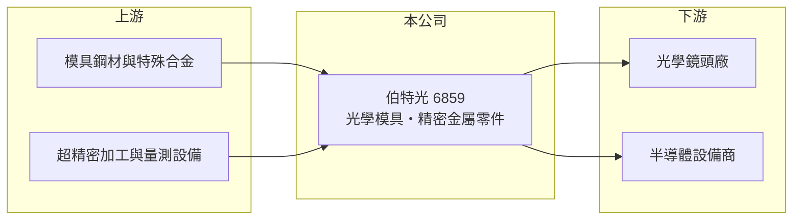

# 6859 伯特光

> 上櫃｜[[產業索引-光電業|光電業]]｜上市（櫃）日期 2022/11/28

# 第一章：企業模式與商業藍圖

> [!info] 撰寫說明
> 精簡版，由 Claude 依公開資料整理，架構比照 [[2330台積電]]，資料截至 2026-10-07。來源：旺得富（中時）2025 年 12 月伯特光報導、winvest 營收快訊。#待校對

伯特光以精密光學鏡片模具起家，近年跨入半導體設備精密金屬零件。

- **核心業務：** 生產光學鏡片用的[[精密模具]]與金屬零件，應用於手機、VR／AR、車用與生醫等光學鏡片製造。
- **營收結構：** 本次未查到各應用別營收比重；手機鏡頭推估為主要應用。
- **營運據點：** 生產據點明細本次未查到。
- **長期方向：** 2024 年起切入半導體設備精密金屬零件，部分產品預計 2026 年下半年出貨；另看好 [[AI眼鏡]]帶來的新需求。

# 第二章：護城河深度與競爭優勢

伯特光的核心是奈米級精密加工與量測能力，這也是它能從光學模具延伸到半導體零件的基礎。

- **競爭優勢：** 公司強調以精密製造與量測為核心，結合多種加工技術與奈米級精密設備；鏡片模具精度直接決定鏡頭廠的良率，認證後不易更換（推估）。
- **主要對手：** 鏡頭廠自有的模具部門，例如 [[3008大立光]] 內製模具（推估），以及日本精密模具廠；半導體零件領域則需面對國內外眾多精密金屬加工廠。
- **觀察重點：** 半導體零件能否如期在 2026 年下半年出貨，以及手機換機與 AI 眼鏡對模具需求的帶動。

# 第三章：財務體質與盈利規模

資料日期：2026-10-07，以下數字是撰寫當時的快照；最新月營收、毛利率、累計 EPS 由自動排程寫在本筆記的屬性欄位（月營收、毛利率、累計EPS 等）。#待校對

伯特光 2025 年營收與獲利成長，但 2026 年月營收較去年同期下滑。

- **營收規模：** 2025 年 1 至 11 月營收 8.57 億元，年增 39.91%；2026 年 5 月營收 5,136.9 萬元（年減 55.49%）、8 月 5,297.2 萬元（年減 10.46%）。
- **獲利：** 2025 年前三季稅後淨利 7,364 萬元，EPS 1.78 元；2026 年 EPS 本次未查到。
- **財務特色：** 模具業務屬接單生產，月營收隨客戶新機開案時點波動大。

# 第四章：總體風險與地緣政治

伯特光的風險來自手機鏡頭開案週期與新事業的驗證時程。

- **產業週期：** 模具需求集中在客戶新機型開發期，手機規格升級放緩時訂單會明顯下滑，並有[[長鞭效應]]。
- **營運風險：** 2026 年月營收年減幅度大，董事長原先期望 2026 年優於 2025 年，需觀察下半年能否追上。
- **其他風險：** 半導體設備零件需通過設備商長時間驗證；另有匯率與特殊鋼材價格風險。

# 專有名詞解析

## 應用

- **[[AI眼鏡]]**：內建相機、麥克風與 AI 助理的智慧眼鏡，需要小型化的光學鏡片與顯示模組。

## 金融

- **[[長鞭效應]]**：終端需求的小幅變動沿供應鏈往上游傳遞時被逐級放大，造成上游庫存與訂單劇烈波動。

## 產業

- **[[精密模具]]**：製作鏡片、塑膠件或金屬件所用的高精度模具，決定產品的尺寸精度與良率。
- **[[光學鏡頭]]**：由多片鏡片組成、把影像聚焦到感測器上的元件。

# 核心供應鏈

- 上游：模具鋼材、特殊合金與超精密加工設備供應商（推估）
- 下游／客戶：[[光學鏡頭]]廠如 [[3406玉晶光]]（推估），以及半導體設備商
- 同業：日本精密模具廠、國內精密金屬加工廠

## 最新新聞
<!-- news:start -->
<!-- news:end -->

## 相關連結
- [公開資訊觀測站](https://mopsov.twse.com.tw/mops/web/t05st03?step=1&firstin=1&co_id=6859)
- [Goodinfo](https://goodinfo.tw/tw/StockDetail.asp?STOCK_ID=6859)
- [Yahoo 股市](https://tw.stock.yahoo.com/quote/6859)
- [鉅亨網新聞](https://www.cnyes.com/twstock/6859/news)
