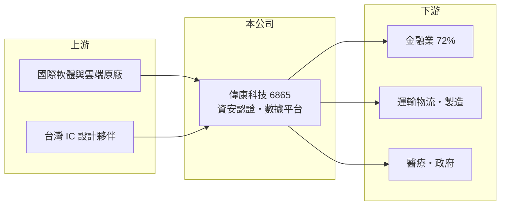

# 6865 偉康科技

> 上櫃｜[[產業索引-數位雲端|數位雲端]]｜上市（櫃）日期 2023/01/11

# 第一章：企業模式與商業藍圖

> [!info] 撰寫說明
> 精簡版，由 Claude 依公開資料整理，架構比照 [[2330台積電]]，資料截至 2026-10-08。來源：櫃買中心開放資料（基本資料、資產負債、綜合損益、本益比殖利率）、Goodinfo 年度經營績效、富果研究 2026 年 3 月法說會摘要（營收組成、客戶產業、策略）。#待校對

本章說明偉康科技（6865）從金融業專案服務轉向自有產品訂閱的商業模式。

- **核心業務：** 偉康科技成立於 1998 年，2023 年 1 月上櫃，總部在台北松山區，董事長連泓鈞。公司定位為數位轉型服務商，核心技術是資安、AI、大數據與雲端，產品分為兩條線：「盾」是智慧資安，包括 [[FIDO]] 身分認證與[[零信任]]平台；「矛」是智能決策，包括數據洞察與數據治理平台。
- **營收結構：** 依富果整理的法說會內容，2025 年勞務收入占 51%（2023 年為 73%），授權收入占 10%（2023 年為 6%）；授權加維護的持續性收入占 51%，首次超過一次性收入。這代表公司正從按人天計費的專案，轉向可重複銷售的產品與訂閱。
- **客戶結構：** 2025 年客戶產業以金融業為主，占 72%，其次是運輸物流 11%、製造 9%、醫療 7%、政府 6%。金融業對身分認證與資安的法規要求最嚴格，是偉康長期累積經驗的基礎。
- **長期方向：** 公司提出「品牌化、規模化、國際化」三大目標，海外以東南亞為第一站，並把資安產品轉為訂閱服務。管理層目標是自有產品營收每年雙位數成長，勞務收入降到一定比例後維持穩定。

# 第二章：護城河深度與競爭優勢

本章分析偉康科技的護城河。

- **競爭優勢：** 金融業導入身分認證與數據平台時，系統必須通過內部稽核與主管機關要求，導入後很少更換，轉換成本高。偉康長期服務金融業，熟悉法規與作業流程，這是新進者不容易複製的實績。另與台灣 IC 設計公司合作開發指紋加密晶片，把軟體認證延伸到硬體。
- **主要對手：** 金融資訊服務與資安同業包括 [[6214精誠]]、[[5410國眾]]、[[6690安碁資訊]]，以及國際身分認證與數據平台廠商。金融業大型專案也常由大型系統整合商承接。
- **觀察重點：** 第一是持續性收入占比能否繼續提升。第二是 2025 年營收下滑 17%、2026 年上半年轉為虧損，是否只是轉型期的陣痛。第三是東南亞市場的實際落地成果。

# 第三章：財務體質與盈利規模

資料日期：2026-10-08，表格是撰寫當時的快照；最新月營收、毛利率、累計 EPS 由自動排程寫在本筆記的屬性欄位（月營收、毛利率、累計EPS 等）。#待校對

本章用多年度數字檢視偉康科技轉型期的財務變化。

| 年度 | 營收（新台幣） | [[毛利率]] | [[營業利益率]] | EPS（元） | [[ROE]] |
|---|---|---|---|---|---|
| 2021 | 4.40 億 | 36.5% | 16.2% | 5.54 | 35.9% |
| 2022 | 5.07 億 | 36.7% | 12.8% | 4.03 | 18.9% |
| 2023 | 5.17 億 | 31.8% | 4.07% | 1.96 | 8.54% |
| 2024 | 5.18 億 | 36.5% | 6.57% | 2.15 | 8.29% |
| 2025 | 4.28 億 | 42.3% | 5.57% | 1.52 | 6.13% |

- **營收規模：** 2020 年營收 2.9 億元，2020 至 2025 年營收年複合成長率約 8.1%，但 2025 年因勞務專案減少而衰退。依櫃買中心資料，2026 年上半年營收約 1.16 億元，營業損失約 0.23 億元，每股虧損 1.50 元。
- **獲利：** 毛利率由 2023 年的 32% 升到 2025 年的 42%，反映產品收入比重提高；但營業利益率由 2021 年的 16% 降到 5% 至 6%，近五年平均 ROE 約 15.6%，呈明顯下滑趨勢，上櫃增資擴大股本也稀釋了 ROE。
- **財務特色：** 依櫃買中心資料，2026 年第二季每股淨值 21.94 元，以實收資本額 1.58 億元推算股東權益約 3.5 億元；流動負債約 0.9 億元、非流動負債約 0.3 億元，負債很低。2025 年度現金股利 1.4 元，配發率約 92%。
- **[[ROIC]] 與 [[WACC]]：** 2025 年營業利益約 0.24 億元（4.28 億 × 5.57%），稅後約 0.19 億元；投入資本以股東權益約 3.5 億元加上以非流動負債 0.3 億元近似的有息負債，約 3.8 億元，ROIC 約 5%（推算）。WACC 以 CAPM 推估：無風險利率 1.75%、市場風險溢酬 6%、β 用軟體業常見值 1.0，股東權益成本約 7.75%；負債成本 2.5%、稅後 2.0%；股權權重約 92%，WACC 約 7.3%（推算）。目前 ROIC 低於 WACC，轉型能否讓產品收入規模化，是重新創造價值的關鍵。

# 第四章：總體風險與地緣政治

本章整理偉康科技長期必須面對的風險。

- **產業週期：** 金融業 IT 支出與金融機構獲利及法規時程相關，景氣好時資本支出增加，法規導入期過後需求可能放緩。客戶高度集中在金融業，產業單一化放大了週期影響。
- **營運風險：** 轉型期勞務收入下降、產品收入尚未補上，營收與獲利容易出現空窗。公司規模小，少數大客戶或大型專案的變化就會明顯影響全年營運；研發與海外拓展的費用也會先於收入發生。
- **其他風險：** 資安與身分認證產品若出現漏洞，對商譽傷害很大；國際大廠的同類產品以雲端訂閱方式進入台灣，可能壓縮定價空間。東南亞市場的法規、語言與通路建立都需要時間。

# 專有名詞解析

## 應用

- **[[FIDO]]**：線上快速身分識別聯盟制定的無密碼認證標準，以指紋、臉部或安全金鑰取代密碼登入。
- **[[零信任]]**：預設不信任任何使用者與裝置、每次存取都要重新驗證的資安架構。

## 金融

- **[[ROIC]]**：投入資本報酬率，稅後營業利益除以投入資本，衡量本業運用資金創造報酬的能力。
- **[[WACC]]**：加權平均資金成本，股東與債權人要求報酬率的加權平均，ROIC 高於 WACC 才代表創造價值。

# 核心供應鏈

- 上游：國際軟體與雲端原廠、合作開發指紋加密晶片的台灣 IC 設計公司（名稱未查得），以及經銷夥伴。
- 下游／客戶：銀行、證券、保險等金融機構為主，另有運輸物流、製造、醫療與政府客戶。
- 同業：[[6214精誠]]、[[5410國眾]]、[[6690安碁資訊]]。

## 最新新聞
<!-- news:start -->
<!-- news:end -->

## 相關連結
- [公開資訊觀測站](https://mopsov.twse.com.tw/mops/web/t05st03?step=1&firstin=1&co_id=6865)
- [Goodinfo](https://goodinfo.tw/tw/StockDetail.asp?STOCK_ID=6865)
- [Yahoo 股市](https://tw.stock.yahoo.com/quote/6865)
- [鉅亨網新聞](https://www.cnyes.com/twstock/6865/news)
