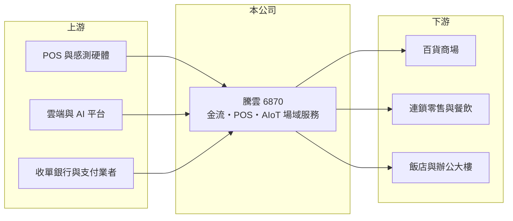

# 6870 騰雲

> 上櫃｜[[產業索引-數位雲端|數位雲端]]｜上市（櫃）日期 2023/09/14

# 第一章：企業模式與商業藍圖

> [!info] 撰寫說明
> 精簡版，由 Claude 依公開資料整理，架構比照 [[2330台積電]]，資料截至 2026-10-08。來源：櫃買中心開放資料（基本資料、資產負債、綜合損益、本益比殖利率）、Goodinfo 年度經營績效、優分析 2025 年 9 月公司報導。營收產品別比重與主要股東未查得。#待校對

本章說明騰雲（6870）從零售金流平台走向智慧場域服務的商業模式。

- **核心業務：** 騰雲科技服務成立於 2016 年，2023 年 9 月上櫃，董事長兼總經理梁基文，總部在新北汐止。公司替百貨商場與大型連鎖零售提供一站式的軟硬體整合，涵蓋客流、商流、金流與能源管理，例如商場專櫃的收銀與[[POS]]、支付整合，以及場域數據分析。客戶包括百貨商場與連鎖餐飲品牌。
- **營收結構：** 收入分為一次性與持續性兩類：一次性收入是顧問、軟體授權與硬體銷售；持續性收入是雲端維運、數據分析與 AI 應用服務（兩者比例未查得）。合約通常為 5 至 7 年的長約，續約率約 95%，讓營收具有相當的可預測性。[[毛利率]]長期在 67% 至 72%，屬於軟體服務的毛利結構。
- **新服務模式：** 公司近年主打 [[AIoT]] as a Service，也就是由騰雲負責 AI 模型、邊緣運算、資料平台與現場設備，客戶以訂閱方式付費。這種模式需要公司先投入設備，但換來長期穩定的收入。
- **長期方向：** 2025 年 8 月設立泰國子公司，鎖定大型零售、飯店、餐飲與辦公大樓，管理層目標是海外營收占比達到五成。騰雲希望從「台灣金流平台」轉型為「海外智慧場域服務商」，能否把台灣的模式複製到海外，是長期成長的關鍵。

# 第二章：護城河深度與競爭優勢

本章分析騰雲的護城河。

- **競爭優勢：** 百貨商場的收銀、會員與金流系統一旦導入，牽涉數百個專櫃與每日營業，更換風險很高，因此 5 至 7 年的長約與約 95% 的續約率，本身就是轉換成本的證明。騰雲同時掌握軟體、硬體與金流整合，也讓客戶不需要面對多個供應商。
- **主要對手：** 依優分析報導，主要競爭對手為 [[674191APP-KY]] 與 [[6763綠界科技]]；小型零售業者也可能選擇較便宜的封閉式 POS 系統。市場存在削價競爭壓力。
- **觀察重點：** 第一是泰國等海外市場的營收占比與獲利能力。第二是 AIoT 訂閱模式的設備投資與回收速度。第三是營業利益率能否維持在 20% 以上。

# 第三章：財務體質與盈利規模

資料日期：2026-10-08，表格是撰寫當時的快照；最新月營收、毛利率、累計 EPS 由自動排程寫在本筆記的屬性欄位（月營收、毛利率、累計EPS 等）。#待校對

本章用多年度數字檢視騰雲的成長與獲利能力。

| 年度 | 營收（新台幣） | [[毛利率]] | [[營業利益率]] | EPS（元） | [[ROE]] |
|---|---|---|---|---|---|
| 2021 | 3.76 億 | 67.2% | 12.1% | 3.22 | 20.8% |
| 2022 | 4.64 億 | 68.9% | 10.5% | 3.46 | 12.9% |
| 2023 | 5.39 億 | 72.5% | 14.9% | 4.00 | 8.67% |
| 2024 | 6.68 億 | 69.7% | 18.6% | 5.04 | 10.8% |
| 2025 | 8.04 億 | 70.2% | 23.9% | 7.08 | 14.5% |

- **營收規模：** 2020 年營收 3.0 億元，2020 至 2025 年營收年複合成長率約 21.8%，每年都成長。依櫃買中心資料，2026 年上半年營收約 4.76 億元、EPS 2.54 元。
- **獲利：** 營業利益率由 2020 年的 7% 一路提升到 2025 年的 24%，顯示規模擴大後營運槓桿明顯。近五年平均 ROE 約 13.5%，2023 年上櫃增資後一度下滑，之後隨獲利成長回升。
- **財務特色：** 2026 年第二季歸屬母公司權益約 12.3 億元，每股淨值 51.94 元；非流動負債約 7.0 億元，推估與 AIoT 訂閱設備投資或長期借款有關（細項未查得）。依櫃買中心資料，最近一年每股股利約 5.19 元。
- **[[ROIC]] 與 [[WACC]]：** 2025 年營業利益約 1.92 億元（8.04 億 × 23.9%），稅後約 1.54 億元；投入資本以股東權益 12.3 億元加上以非流動負債 7.0 億元近似的有息負債，約 19.3 億元，ROIC 約 8%（推算）。WACC 以 CAPM 推估：無風險利率 1.75%、市場風險溢酬 6%、β 用軟體業常見值 1.0，股東權益成本約 7.75%；負債成本 2.5%、稅後 2.0%；股權權重約 64%，WACC 約 5.7%（推算）。ROIC 高於 WACC，且隨利潤率提升而擴大，目前屬於創造價值的階段。

# 第四章：總體風險與地緣政治

本章整理騰雲長期必須面對的風險。

- **產業週期：** 客戶集中在百貨商場與連鎖零售，零售景氣轉弱或實體通路萎縮時，新案導入會放緩。不過長約與高續約率提供一定的收入底盤。
- **營運風險：** AIoT 訂閱模式需要先投入設備，若客戶提前解約或使用率不如預期，投資回收會延後。海外擴張需要建立在地服務團隊與代理商體系，費用先於收入發生，執行不順可能拖累獲利。
- **其他風險：** 金流業務涉及支付法規與資安，系統中斷會影響客戶營業；泰國等海外市場有匯率、法規與政治風險；削價競爭可能壓縮新案的定價。

# 專有名詞解析

## 應用

- **[[POS]]**：銷售時點情報系統，門市結帳與記錄銷售資料的系統，現多與會員、庫存與金流整合。
- **[[AIoT]]**：人工智慧結合物聯網，讓感測器與設備收集的資料透過 AI 分析後自動做出判斷。

## 金融

- **[[ROIC]]**：投入資本報酬率，稅後營業利益除以投入資本，衡量本業運用資金創造報酬的能力。
- **[[WACC]]**：加權平均資金成本，股東與債權人要求報酬率的加權平均，ROIC 高於 WACC 才代表創造價值。

# 核心供應鏈

- 上游：POS 與感測設備供應商、雲端與 AI 平台、收單銀行與支付業者（實際合作對象未查得）。
- 下游／客戶：百貨商場、連鎖零售與餐飲品牌（如 31 冰淇淋、馬可先生），以及泰國等海外的零售、飯店與辦公大樓。
- 同業：[[674191APP-KY]]、[[6763綠界科技]]。

## 最新新聞
<!-- news:start -->
<!-- news:end -->

## 相關連結
- [公開資訊觀測站](https://mopsov.twse.com.tw/mops/web/t05st03?step=1&firstin=1&co_id=6870)
- [Goodinfo](https://goodinfo.tw/tw/StockDetail.asp?STOCK_ID=6870)
- [Yahoo 股市](https://tw.stock.yahoo.com/quote/6870)
- [鉅亨網新聞](https://www.cnyes.com/twstock/6870/news)
