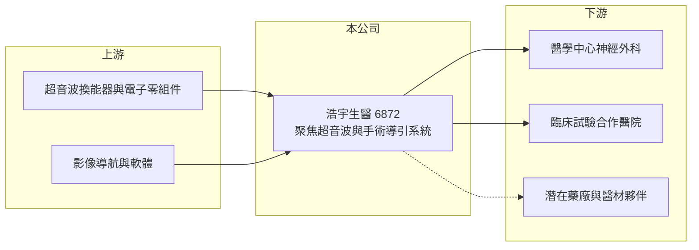

# 6872 浩宇生醫

> 上櫃｜[[產業索引-生技醫療業|生技醫療業]]｜上市（櫃）日期 2025/03/07

# 第一章：企業模式與商業藍圖

> [!info] 撰寫說明
> 精簡版，由 Claude 依公開資料整理，架構比照 [[2330台積電]]，資料截至 2026-10-08。來源：櫃買中心開放資料快照（基本資料、2026 年第二季財報、2026 年 8 月營收）、Goodinfo 經營績效頁、nStock 公司簡介。公開資料有限，產品技術細節部分憑記憶整理，已標「待校對」。#待校對

浩宇生醫是一家仍在臨床與商業化初期的醫療器材開發公司，理解它的關鍵在於「一套高階設備從臨床試驗走到取證與銷售」的長路，而不是目前很小的營收數字。

- **核心業務：** 依公司登記的營業項目，浩宇生醫從事超音波與手術導引高階複合性醫療產品的開發、製造與租售。公司的核心技術是利用[[聚焦超音波]]短暫打開[[血腦屏障]]，讓化療藥物更容易進入腦部腫瘤，主要瞄準惡性腦瘤[[膠質母細胞瘤]]（技術描述憑記憶，待校對）。這類產品屬於「設備加藥物」的組合療法，一旦證明有效，可以改變現有腦瘤治療的給藥方式，因此是高風險、高潛在價值的研發型事業。
- **營收結構：** 公司尚未有穩定的產品銷售，營收主要來自少量醫療器材銷售與勞務收入，2025 年全年營收約 0.1 億元。2026 年 1 至 8 月累計營收約 0.23 億元，公司說明增加主要來自醫療器材銷售，但規模仍不足以支撐研發與營運費用。
- **營運據點：** 公司於 2015 年 3 月設立，2022 年登錄興櫃，2025 年 3 月 7 日轉上櫃。研發與臨床合作以台灣為主，實收資本額約 7.08 億元。
- **長期方向：** 依 2023 年 8 月的新聞，公司規劃為膠質母細胞瘤超音波系統展開三期臨床試驗。長期能否成功，取決於三期臨床結果、取得台灣與海外醫材許可，以及能否與藥廠或大型醫材公司合作推廣。

# 第二章：護城河深度與競爭優勢

浩宇生醫的護城河目前主要來自技術與臨床資料的累積，還沒有經過市場銷售的驗證，本章說明它可能的優勢與要面對的競爭。

- **競爭優勢：** 腦部聚焦超音波需要精準定位、能量控制與即時監測，技術門檻高，臨床資料也要多年累積，後進者不容易短期追上。若公司完成三期臨床並取得許可，臨床數據與醫院端的操作經驗會成為主要壁壘。
- **主要對手：** 國際上以以色列 Insightec 的 Exablate 系統與法國 Carthera 的植入式超音波為代表，兩者在血腦屏障開啟的研究上起步較早（憑記憶，待校對）。這些對手資源較多，浩宇生醫需要靠特定適應症的臨床成果與價格做出差異。
- **觀察重點：** 三期臨床的收案進度與結果、醫材許可的取得時間，以及是否找到國際授權或銷售夥伴。對研發型公司來說，現金能支撐幾年的研發，也是比營收更重要的指標。

# 第三章：財務體質與盈利規模

資料日期：2026-10-08，表格是撰寫當時的快照；最新月營收、毛利率、累計 EPS 由自動排程寫在本筆記的屬性欄位（月營收、毛利率、累計EPS 等）。#待校對

研發型醫材公司在取證前通常長期虧損，財務分析的重點是虧損規模、資金存量與每年燒錢速度，而不是獲利率。

| 年度 | 營收（億元） | [[毛利率]] | [[營業利益率]] | EPS（元） | [[ROE]] |
|---|---|---|---|---|---|
| 2021 | 約 0 | 未查得 | 未查得 | -1.80 | -18.2% |
| 2022 | 0.20 | 84.5% | -390% | -1.13 | -11.9% |
| 2023 | 0.22 | 52.6% | -340% | -1.17 | -14.8% |
| 2024 | 0.28 | 35.2% | -403% | -1.56 | -21.1% |
| 2025 | 0.10 | -26.6% | -1523% | -2.14 | -28.3% |
| 2026 上半年 | 0.22 | 48.7% | -371% | -1.02 | 未查得 |

- **營收規模：** 營收長年在 0.1 至 0.3 億元之間，對一家資本額 7 億元的公司來說非常小，代表產品仍在臨床與早期推廣階段。營收波動大多來自零星設備銷售與勞務案，不能拿來推估長期趨勢。
- **獲利：** 公司每年虧損 1 至 2 元 EPS，2026 年上半年營業損失約 0.80 億元、稅後淨損約 0.72 億元。虧損主要來自臨床試驗與研發費用，屬於研發型公司的正常結構，但也代表股東權益會持續被消耗。
- **財務特色：** 2026 年第二季底股東權益約 4.96 億元、負債約 0.75 億元，幾乎沒有財務槓桿。以上半年的虧損速度推算，每年約消耗 1.5 億元左右（推算），未來仍可能需要增資或引進策略投資人。
- **[[ROIC]] 與 [[WACC]]：** 以 2026 年上半年營業損失 0.80 億元年化為 1.59 億元，除以股東權益 4.96 億元（有息負債視為接近零），ROIC 約為 -32%（推算）。WACC 以 CAPM 推估：無風險利率 1.75%、市場風險溢酬 6%、β 取研發型生技常見的 1.3（假設值），股權成本約 9.6%，因幾乎沒有負債，WACC 約 9.5% 至 10%（推算）。ROIC 遠低於 WACC，代表公司目前仍在消耗資本，價值完全取決於未來臨床與取證能否成功。
- **長期指標：** 近 5 年 ROE 平均約 -19%（依表中 2021 至 2025 年推算），未曾配發現金股利，自由現金流長期為負。

# 第四章：總體風險與地緣政治

研發型醫材公司的風險集中在臨床、法規與資金三個面向，本章分別說明。

- **產業週期：** 醫材研發不太受景氣循環影響，但生技類股的募資環境會隨資金行情變化。市場資金緊縮時，研發型公司增資不易，可能被迫放慢臨床進度。
- **營運風險：** 三期臨床若未達主要療效指標，或收案速度太慢，公司價值會大幅受影響。即使取證，醫院採購高階設備的決策期長，健保或自費定價也會影響實際銷售量。
- **其他風險：** 產品需要同時符合台灣與海外的醫材法規，國際取證的時間與成本難以預估。公司規模小，關鍵研發人員流動與股本稀釋也是長期風險。

# 專有名詞解析

## 產業

- **[[聚焦超音波]]**：把多束超音波能量集中到體內一個小點，用來加熱組織或短暫打開血管屏障的非侵入性技術。
- **[[血腦屏障]]**：腦部血管壁的保護機制，可阻擋有害物質，但也讓大多數藥物難以進入腦部。
- **[[膠質母細胞瘤]]**：最常見也最惡性的原發性腦瘤，標準治療為手術、放療加化療，存活期短。
- **[[醫材許可]]**：醫療器材上市前須取得的主管機關核准，例如台灣 TFDA 許可證、美國 FDA 510(k) 或 PMA。

# 核心供應鏈

- 上游：超音波換能器、電子零組件與影像導航軟體供應商，多為國際零組件廠，個別名稱未查得。
- 下游／客戶：醫學中心神經外科與臨床試驗合作醫院；取證後的潛在客戶為醫院與國際醫材通路。
- 同業：國際的 Insightec、Carthera（待校對）；台股醫材同業可參考 [[6796晉弘]]、[[4164承業醫]]，但產品領域不同。

## 最新新聞
<!-- news:start -->
<!-- news:end -->

## 相關連結
- [公開資訊觀測站](https://mopsov.twse.com.tw/mops/web/t05st03?step=1&firstin=1&co_id=6872)
- [Goodinfo](https://goodinfo.tw/tw/StockDetail.asp?STOCK_ID=6872)
- [Yahoo 股市](https://tw.stock.yahoo.com/quote/6872)
- [鉅亨網新聞](https://www.cnyes.com/twstock/6872/news)
