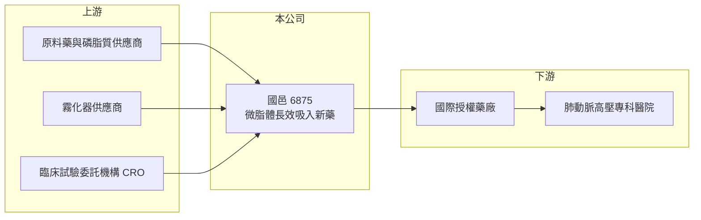

# 6875 國邑

> 上櫃｜[[產業索引-生技醫療業|生技醫療業]]｜上市（櫃）日期 2024/03/26

# 第一章：企業模式與商業藍圖

> [!info] 撰寫說明
> 精簡版，由 Claude 依公開資料整理，架構比照 [[2330台積電]]，資料截至 2026-10-08。來源：櫃買中心開放資料快照（基本資料、2026 年第二季財報、2026 年 8 月營收）、Goodinfo 經營績效頁、優分析 2026 年 3 月報導。授權對象等部分憑記憶整理，已標「待校對」。#待校對

國邑是一家以「改良劑型」做新藥的公司，理解它的方式是看它如何把既有藥物做成長效吸入劑，再用授權金與里程碑金換取開發資金。

- **核心業務：** 國邑專注長效型吸入藥物的開發，核心技術是把藥物包進[[微脂體]]，再以霧化吸入的方式送到肺部，讓藥效更持久、給藥次數更少。這種做法屬於[[505(b)(2)]] 改良型新藥路線，成分是已知藥物，開發風險與時間通常低於全新分子。這個策略的意義在於，用相對可控的臨床成本，切入肺動脈高壓這類高單價的罕見疾病市場。
- **營收結構：** 公司目前沒有穩定的產品銷售，營收主要來自授權相關收入，年度間波動很大。2023 年營收 3.14 億元、毛利率 100%，推估來自授權里程碑金；2025 年營收僅約 0.67 億元。官方月營收說明，自 2026 年 7 月起新增子公司的銷售收入，未來營收組成可能出現變化。
- **營運據點：** 公司設立於 2000 年 5 月，2024 年 3 月 26 日上櫃，實收資本額約 6.46 億元，研發總部在台灣，臨床試驗在歐美等地進行。
- **長期方向：** 主力產品 L606 鎖定[[肺動脈高壓]]與肺高壓併發間質性肺病，已在歐美啟動全球三期臨床；L608 鎖定硬皮症的指端潰瘍與雷諾氏現象，已進入美國二期臨床，並取得美國與歐洲孤兒藥資格（依 2026 年 3 月報導）。公司採多適應症策略，同一個平台可以延伸到更多肺部與血管疾病。

# 第二章：護城河深度與競爭優勢

國邑的護城河來自劑型技術與臨床資料，本章說明這些優勢的來源與限制。

- **競爭優勢：** 微脂體吸入劑型需要處理藥物包覆率、霧化粒徑與肺部釋放速度，配方與製程技術門檻高，並可申請專利保護。改良型新藥若成功上市，可以在原成分藥物的基礎上取得較長的市場獨占期與較高的定價。L606 與北美藥廠 Liquidia 有授權合作（憑記憶，待校對），代表技術已獲國際藥廠肯定。
- **主要對手：** 肺動脈高壓吸入治療的主要對手為聯合治療（United Therapeutics）的 Tyvaso 系列，以及 Liquidia 自身的乾粉吸入劑型。台股同業中，[[6446藥華藥]]、[[4162智擎]] 也走國際授權模式，但疾病領域不同。
- **觀察重點：** L606 三期臨床結果與上市申請時程、L608 能否在二期期中結果前完成授權，以及授權金是否能逐步轉為長期的權利金收入。

# 第三章：財務體質與盈利規模

資料日期：2026-10-08，表格是撰寫當時的快照；最新月營收、毛利率、累計 EPS 由自動排程寫在本筆記的屬性欄位（月營收、毛利率、累計EPS 等）。#待校對

新藥公司在產品上市前，財務數字主要反映研發投入與授權收入的時間點，本章用多年度數據說明國邑的資金消耗模式。

| 年度 | 營收（億元） | [[毛利率]] | [[營業利益率]] | EPS（元） | [[ROE]] |
|---|---|---|---|---|---|
| 2021 | 未查得（接近零） | 未查得 | 未查得 | -3.02 | -54.7% |
| 2022 | 約 0 | 未查得 | 未查得 | -2.70 | -41.2% |
| 2023 | 3.14 | 100% | -0.9% | 0.07 | 0.89% |
| 2024 | 1.68 | 75.7% | -130% | -1.32 | -10.8% |
| 2025 | 0.67 | 19.4% | -599% | -2.97 | -22.0% |
| 2026 上半年 | 0.02 | 18.4% | 未具意義 | -1.50 | 未查得 |

- **營收規模：** 營收完全取決於授權里程碑何時入帳，2023 年因里程碑金接近損益兩平，其他年度則明顯虧損。這種收入沒有延續性，不能以單一年度的營收推估長期規模。
- **獲利：** 2026 年上半年營業損失約 2.05 億元、稅後淨損約 1.94 億元，EPS -1.50 元。三期臨床費用很高，未來幾年虧損可能維持甚至擴大，直到產品上市或取得更大的授權收入。
- **財務特色：** 2026 年第二季底股東權益約 13.66 億元、負債約 4.17 億元（非流動負債約 3.35 億元，內容未查得）。以上半年虧損速度推算，每年約消耗 4 億元（推算），資金能支撐的年數是觀察重點。
- **[[ROIC]] 與 [[WACC]]：** 以 2026 年上半年營業損失 2.05 億元年化為 4.1 億元，除以投入資本約 13.66 至 17.0 億元（股東權益加上最多 3.35 億元非流動負債），ROIC 約 -24% 至 -30%（推算）。WACC 以 CAPM 推估：無風險利率 1.75%、市場風險溢酬 6%、β 取研發型生技常見的 1.3（假設值）、稅率 20%，因負債比重低，WACC 約 9.5% 至 10%（推算）。ROIC 遠低於 WACC，代表公司仍在投入期，能否創造價值取決於產品上市後的權利金與銷售分潤。
- **長期指標：** 近 5 年（2021 至 2025 年）ROE 平均約 -26%（推算），未配發現金股利，自由現金流長期為負。

# 第四章：總體風險與地緣政治

新藥公司的風險集中在臨床、授權與資金，本章分別說明。

- **產業週期：** 新藥開發不受景氣循環直接影響，但生技資本市場的資金行情會影響增資難易。國際藥廠的授權意願也會隨利率與產業併購氣氛變化。
- **營運風險：** 三期臨床若未達標，或美國 FDA 審查要求補件，產品上市時間會延後數年。授權收入集中在少數合作夥伴，合作方策略改變會直接影響國邑的收入。
- **其他風險：** 肺動脈高壓市場的主要藥廠可能推出新劑型或新機轉藥物，壓縮改良劑型的定價空間。美元計價的授權收入與海外臨床費用也帶來匯率影響。

# 專有名詞解析

## 產業

- **[[微脂體]]**：以磷脂質做成的微小囊泡，可以包覆藥物，延長藥物在體內釋放的時間。
- **[[505(b)(2)]]**：美國 FDA 的新藥申請路徑之一，可引用已上市成分的既有資料，常用於改良劑型或新給藥途徑。
- **[[肺動脈高壓]]**：肺部血管阻力升高、使右心負擔過重的罕見疾病，治療藥物單價高。
- **[[孤兒藥資格]]**：主管機關給罕見疾病藥物的認定，可享有審查優惠與上市後市場獨占期。
- **[[授權里程碑金]]**：新藥授權後，被授權方在臨床或上市達到約定階段時支付給授權方的款項。

# 核心供應鏈

- 上游：原料藥與磷脂質供應商、霧化給藥裝置供應商，以及執行歐美臨床試驗的 CRO；台股霧化器廠 [[6934心誠鎂]] 為相關產業鏈公司（是否為國邑供應商未查得）。
- 下游／客戶：國際授權夥伴（L606 為 Liquidia，待校對），最終使用者為肺動脈高壓與硬皮症專科醫師與病患。
- 同業：走國際授權模式的 [[6446藥華藥]]、[[4162智擎]]、[[6576逸達]]；國際對手為聯合治療。

## 最新新聞
<!-- news:start -->
<!-- news:end -->

## 相關連結
- [公開資訊觀測站](https://mopsov.twse.com.tw/mops/web/t05st03?step=1&firstin=1&co_id=6875)
- [Goodinfo](https://goodinfo.tw/tw/StockDetail.asp?STOCK_ID=6875)
- [Yahoo 股市](https://tw.stock.yahoo.com/quote/6875)
- [鉅亨網新聞](https://www.cnyes.com/twstock/6875/news)
