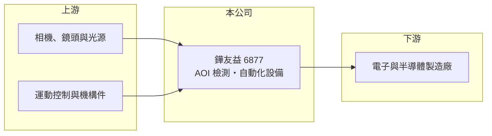

# 6877 鏵友益

> 上櫃｜[[產業索引-其他電子業|其他電子業]]｜上市（櫃）日期 2023/06/16

# 第一章：企業模式與商業藍圖

> [!info] 撰寫說明
> 精簡版，由 Claude 依公開資料整理，架構比照 [[2330台積電]]，資料截至 2026-10-07。來源：winvest 營收快訊（2026 年 6 至 8 月）、nStock 鏵友益公司概況。公開資料有限，產品別營收比重、客戶與應用產業未查到。#待校對

鏵友益是 [[AOI]] 檢測與自動化設備廠，營收規模小、出貨起伏大，2026 年上半年虧損。

- **核心業務：** 公司 2014 年成立，2023 年 6 月上櫃，產品包括 AOI 檢測設備、智能[[自動化設備]]與 OEM 設備。
- **營收結構：** 本次未查到產品別或客戶產業比重。
- **營運據點：** 生產與研發據點本次未查到，以台灣為主（推估）。
- **長期方向：** 2026 年 7、8 月出貨增加使營收回升，後續看訂單能否延續並帶動轉盈。

# 第二章：護城河深度與競爭優勢

設備廠的競爭力在於客製化開發能力與客戶驗證，但營收規模小、訂單集中。

- **競爭優勢：** 2026 年第二季[[毛利率]] 49.56%，設備本身的毛利水準不低，虧損主要來自營收規模不足以攤提費用（推估）。
- **主要對手：** 國內 AOI 與自動化設備廠眾多，例如 [[3563牧德]]、[[6640均華]] 等（推估，依產品性質列舉）。
- **觀察重點：** 下半年出貨回升能否讓單季轉盈，以及新客戶與新應用的接單情況。

# 第三章：財務體質與盈利規模

資料日期：2026-10-07，以下數字是撰寫當時的快照；最新月營收、毛利率、累計 EPS 由自動排程寫在本筆記的屬性欄位（月營收、毛利率、累計EPS 等）。#待校對

鏵友益上半年營收衰退並虧損，7 月起出貨回升。

- **營收規模：** 2026 年 6 月營收 1,630 萬元、年減 65.41%；7 月 5,598 萬元；8 月 5,515 萬元、年增 140.18%；依 nStock，9 月約 0.55 億元，1 至 9 月累計約 2.69 億元。
- **獲利：** 2025 年全年 EPS 0.59 元；2026 年第一季 EPS 約 -0.65 元（推算），第二季 -0.44 元，上半年累計 -1.09 元。
- **財務特色：** 資本額約 4.7 億元；最近一次配發現金股利 0.5 元，近五年平均 0.33 元。

# 第四章：總體風險與地緣政治

鏵友益的風險在於訂單波動大與尚未轉盈。

- **產業週期：** 設備需求跟隨客戶擴產與資本支出，景氣轉弱時訂單可能延後，單月營收落差可達數倍。
- **營運風險：** 營收規模小，少數大單的出貨時點就決定單季盈虧；客戶集中度本次未查到。
- **其他風險：** 市值相對營收與獲利偏高，股價對訂單消息敏感。

# 專有名詞解析

## 半導體

- **[[AOI]]**：自動光學檢測，以攝影機與影像演算法自動檢查外觀瑕疵。

## 金融

- **[[毛利率]]**：營收扣除銷貨成本後的毛利占營收比例，反映產品本身的獲利能力。

## 產業

- **[[自動化設備]]**：以機械、控制系統與軟體取代人工作業的生產設備，常為客戶客製化開發。

# 核心供應鏈

- 上游：工業相機、鏡頭、光源、運動控制與機構件供應商（推估）
- 下游／客戶：電子與半導體製造廠（推估，名稱未查到）
- 同業：[[3563牧德]]、[[6640均華]] 等國內設備廠（推估）

## 最新新聞
<!-- news:start -->
<!-- news:end -->

## 相關連結
- [公開資訊觀測站](https://mopsov.twse.com.tw/mops/web/t05st03?step=1&firstin=1&co_id=6877)
- [Goodinfo](https://goodinfo.tw/tw/StockDetail.asp?STOCK_ID=6877)
- [Yahoo 股市](https://tw.stock.yahoo.com/quote/6877)
- [鉅亨網新聞](https://www.cnyes.com/twstock/6877/news)
