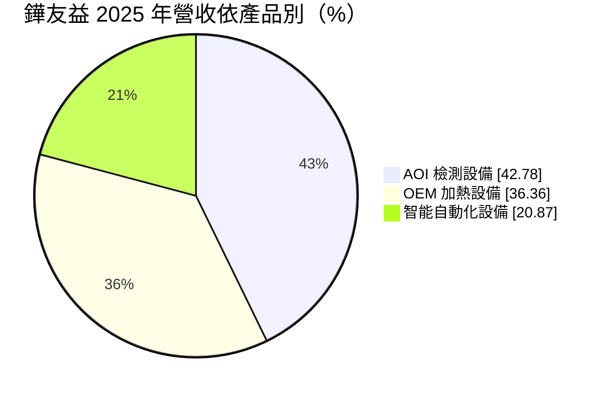
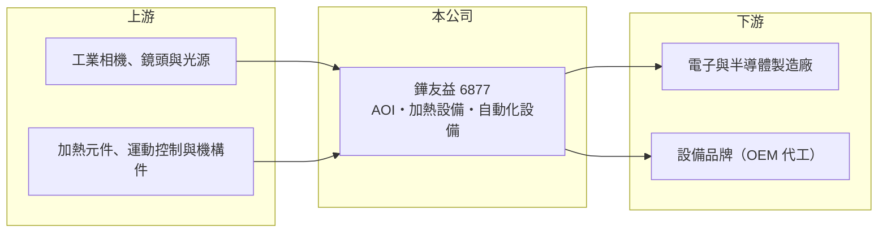

# 6877 鏵友益

> 上櫃｜[[產業索引-其他電子業|其他電子業]]｜上市（櫃）日期 2023/06/16

# 第一章：企業模式與商業藍圖

> [!info] 撰寫說明
> 精簡版，由 Claude 依公開資料整理，架構比照 [[2330台積電]]，資料截至 2026-10-08。來源：MoneyDJ 理財網（富邦證券站）鏵友益年度損益表、財務比率與基本資料；nStock 公司概況；winvest 公司簡介；櫃買中心 2026 年第二季資產負債資料。公開資料有限，主要客戶與應用產業未查到。#待校對

鏵友益是高雄路竹的客製化設備商，產品包括 [[AOI]] 檢測設備、代工型加熱設備與自動化設備，營收規模約五億元，獲利隨接單起伏很大。

- **核心業務：** 公司 2014 年成立，2023 年 6 月上櫃，總部位於高雄路竹。業務是依客戶需求設計並製造產線設備：AOI 檢測設備用影像辨識取代人工目檢，加熱設備用於製程中的烘烤與熱處理，智能[[自動化設備]]則負責搬運與組裝等工序。
- **營收結構：** 依 MoneyDJ 2025 年資料，AOI 檢測設備占 42.78%、OEM 加熱設備 36.36%、智能自動化設備 20.87%。OEM 加熱設備是替其他設備品牌代工，自有技術的 AOI 與自動化設備合計約六成。
- **營運據點：** 生產與研發在高雄路竹，鄰近南部科學園區與高雄半導體、電子產業聚落（推估）。設備需要到客戶現場安裝與調校，地理上接近客戶有助於服務。
- **長期方向：** 設備廠的成長來自客戶擴產與製程升級。鏵友益若能把 AOI 技術導入更多產業，或與大型設備品牌建立長期代工關係，營收就能從「一案一案接」轉為較穩定的成長。

# 第二章：護城河深度與競爭優勢

鏵友益的優勢在於客製化開發與毛利率尚佳的產品，但營收規模小，護城河仍在建立中。

- **競爭優勢：** 2021 至 2025 年[[毛利率]]多在 40% 至 55% 之間，代表設備本身有一定技術含量，不是單純的機構組裝。客製化設備需要和客戶製程工程師反覆調整，一旦通過驗證，後續追加訂單有機會延續（推估）。
- **主要對手：** 國內 AOI 與自動化設備廠眾多，例如 [[3563牧德]]、[[6640均華]] 等（推估，依產品性質列舉）。設備業競爭的重點是技術規格、交期與售後服務，小廠在大客戶面前議價力有限。
- **觀察重點：** 毛利率不差但營業利益率偏低，問題出在營收規模不足以攤提研發與管理費用。長期要看營收能否穩定站上新台幣五億元以上，讓營業利益率回到 2021 年約兩成的水準。

# 第三章：財務體質與盈利規模

資料日期：2026-10-08，表格是撰寫當時的快照；最新月營收、毛利率、累計 EPS 由自動排程寫在本筆記的屬性欄位（月營收、毛利率、累計EPS 等）。#待校對

鏵友益營收從 2020 年的 2.5 億元成長到 2025 年的 4.8 億元，但獲利高峰停在 2021 年，之後營業利益率多在個位數。

| 年度 | 營收（億元） | [[毛利率]] | [[營業利益率]] | EPS（元） | [[ROE]] |
|---|---|---|---|---|---|
| 2021 | 3.62 | 52.05% | 21.62% | 4.05 | 23.75% |
| 2022 | 4.29 | 40.79% | 6.94% | 0.83 | 5.76% |
| 2023 | 3.32 | 46.78% | -5.17% | -0.52 | -3.23% |
| 2024 | 4.81 | 47.81% | 5.57% | 1.25 | 6.60% |
| 2025 | 4.81 | 45.41% | 0.73% | 0.59 | 3.08% |

註：2021 至 2023 年為個別報表，2024 年起為合併報表。

- **營收與獲利趨勢：** 2020 至 2025 年營收年複合成長率約 13.6%（推算），但近五年平均 ROE 僅約 7.2%（推算），2025 年 ROE 中又有部分來自業外收益。毛利率維持高檔、營業利益率卻偏低，是費用結構的問題，而不是產品沒有競爭力。
- **財務特色：** 負債比率由 2020 年約 64% 一路降到 2025 年約 28%，上櫃後財務結構明顯改善。股利政策以股票股利為主：2021 年度配股 3.05 元、2022 與 2023 年度各配股約 1 元，2025 年度改配現金 0.5 元，股本因此擴大，稀釋了 EPS。
- **[[ROIC]] 與 [[WACC]]：** 以 2025 年營業利益約 0.03 億元乘以（1－20%）得稅後營業利益約 0.02 億元，除以 2026 年第二季股東權益約 8.35 億元加非流動負債約 1.56 億元，ROIC 接近 0%（推算）。WACC 以 CAPM 推估：無風險利率 1.75%、市場風險溢酬 6%、β 未查得，取設備同業常見值 1.2，股權成本約 9%；負債比重低，WACC 約 8% 至 8.5%（推算）。目前 ROIC 遠低於 WACC，公司尚未替股東創造超額價值，關鍵在於擴大營收以發揮營運槓桿。

# 第四章：總體風險與地緣政治

鏵友益的風險在於接單波動大、規模小與獲利尚未穩定。

- **產業週期：** 設備需求跟著客戶擴產與資本支出走，景氣轉弱時訂單常被延後，單月營收可能差到好幾倍。這種波動對營收只有數億元的公司影響特別大。
- **營運風險：** 少數大案的出貨與驗收時點，往往決定單季是賺是賠。OEM 加熱設備依賴代工客戶的訂單，若客戶轉移產能或自製，這部分營收可能快速流失。
- **其他風險：** 客製化設備需要長期的工程人力，人才流動會影響交期與品質。客戶若轉往海外設廠，鏵友益需要具備海外安裝與維修能力，才能跟上訂單。

# 專有名詞解析

## 半導體

- **[[AOI]]**：自動光學檢測，以攝影機與影像演算法自動檢查外觀瑕疵。

## 金融

- **[[毛利率]]**：營收扣除銷貨成本後的毛利占營收比例，反映產品本身的獲利能力。

## 產業

- **[[自動化設備]]**：以機械、控制系統與軟體取代人工作業的生產設備，常為客戶客製化開發。

# 核心供應鏈

- 上游：工業相機、鏡頭、光源、加熱元件、運動控制與機構件供應商（推估）
- 下游／客戶：電子與半導體製造廠、委託代工的設備品牌（名稱未查到）
- 同業：[[3563牧德]]、[[6640均華]] 等國內設備廠（推估）

## 最新新聞
<!-- news:start -->
<!-- news:end -->

## 相關連結
- [公開資訊觀測站](https://mopsov.twse.com.tw/mops/web/t05st03?step=1&firstin=1&co_id=6877)
- [Goodinfo](https://goodinfo.tw/tw/StockDetail.asp?STOCK_ID=6877)
- [Yahoo 股市](https://tw.stock.yahoo.com/quote/6877)
- [鉅亨網新聞](https://www.cnyes.com/twstock/6877/news)
