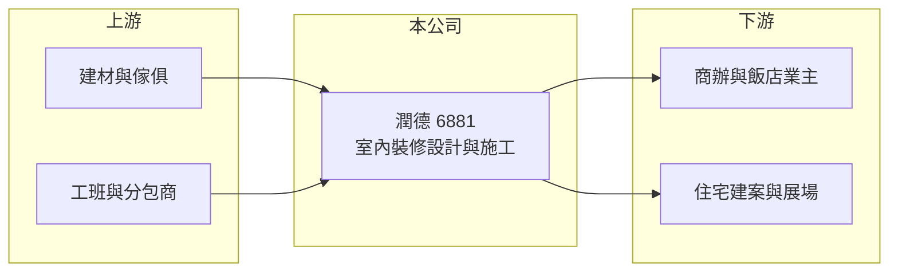

# 6881 潤德

> 上櫃｜[[產業索引-其他業|其他業]]｜上市（櫃）日期 2024/05/21

# 第一章：企業模式與商業藍圖

> [!info] 撰寫說明
> 精簡版，由 Claude 依公開資料整理，架構比照 [[2330台積電]]，資料截至 2026-10-07。來源：nstock.tw 潤德公司概況、優分析 2026 年上半年法說報導。業務別營收比重、主要客戶與營運據點本次未查到。#待校對

潤德是以室內裝修設計與施工為主的工程公司，2024 年 5 月上櫃。

- **核心業務：** 潤德承作室內裝潢設計與施工，另有庭園綠化設計、展示會場佈置與傢俱銷售進出口等業務。
- **營收結構：** 本次未查到各業務比重；2025 年全年營收 24.65 億元，2026 年上半年營收 11.82 億元，與去年同期持平。
- **營運據點：** 營運據點本次未查到，本文不推測。
- **長期方向：** 截至 2026 年上半年在手工程總金額約 59 億元，尚未認列約 23 億元，2026 年新增 28 筆訂單、約 21 億元，[[在手訂單]]支撐後續營收。

# 第二章：護城河深度與競爭優勢

潤德的優勢在於整合設計與施工的統包能力。

- **競爭優勢：** 室內裝修統包需要設計、工程管理與工班調度能力，累積的大型案場經驗有助取得新案（推估）。
- **主要對手：** 國內室內裝修統包與設計公司，本次未查到具體上市同業。
- **觀察重點：** 新增訂單是否持續、[[毛利率]]能否守住兩成以上，以及工程進度帶動的營收認列節奏。

# 第三章：財務體質與盈利規模

資料日期：2026-10-07，以下數字是撰寫當時的快照；最新月營收、毛利率、累計 EPS 由自動排程寫在本筆記的屬性欄位（月營收、毛利率、累計EPS 等）。#待校對

潤德股本小、毛利率提升，EPS 表現亮眼。

- **營收規模：** 2026 年上半年營收 11.82 億元；8 月營收 1.8 億元、年減 15.61%，1 至 8 月累計 15.26 億元。2025 年全年營收 24.65 億元。
- **獲利：** 2026 年上半年 EPS 9.51 元（去年同期 8.51 元），稅後純益 1.43 億元、年增 11.8%，毛利率約 21%（去年同期 19%）；第二季 EPS 4.28 元，[[營業利益率]] 14.64%。
- **財務特色：** 資本額僅約 1.5 億元，股本極小使 EPS 偏高；2025 年度配發現金股利 18.5 元，配息大方。

# 第四章：總體風險與地緣政治

潤德的風險來自工程認列與景氣循環。

- **產業週期：** 室內裝修需求跟隨商辦、飯店與住宅建案景氣，房市或企業投資轉弱時新案減少。
- **營運風險：** 營收依[[完工比例法]]隨工程進度認列，單月波動大；工程延誤、追加成本或缺工會侵蝕毛利。
- **其他風險：** 建材與人力成本上漲、工安事故，以及營建相關法規變動。

# 專有名詞解析

## 金融

- **[[完工比例法]]**：工程依完工進度比例認列營收與成本的會計方法。
- **[[毛利率]]**：毛利占營收的比例，反映產品定價能力與成本控制。

## 產業

- **[[在手訂單]]**：已簽約但尚未完工認列營收的工程金額，可用來預估未來營收。
- **[[室內裝修統包]]**：由單一廠商負責設計、施工與工程管理的室內裝修承攬方式。

# 核心供應鏈

- 上游：建材、傢俱供應商與工程分包商（推估）
- 下游／客戶：商辦、飯店、住宅建案與展場業主，客戶名稱未揭露
- 同業：國內室內裝修統包與設計公司

## 最新新聞
<!-- news:start -->
<!-- news:end -->

## 相關連結
- [公開資訊觀測站](https://mopsov.twse.com.tw/mops/web/t05st03?step=1&firstin=1&co_id=6881)
- [Goodinfo](https://goodinfo.tw/tw/StockDetail.asp?STOCK_ID=6881)
- [Yahoo 股市](https://tw.stock.yahoo.com/quote/6881)
- [鉅亨網新聞](https://www.cnyes.com/twstock/6881/news)
