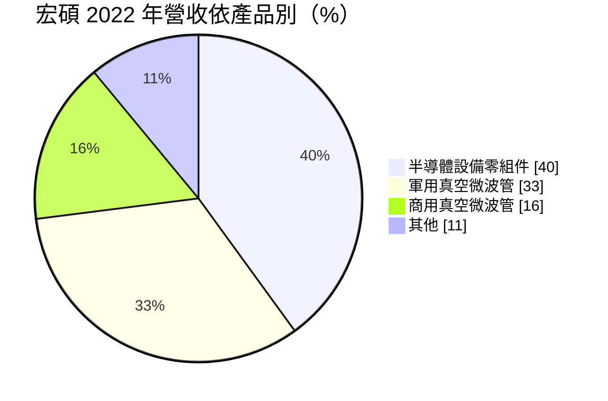
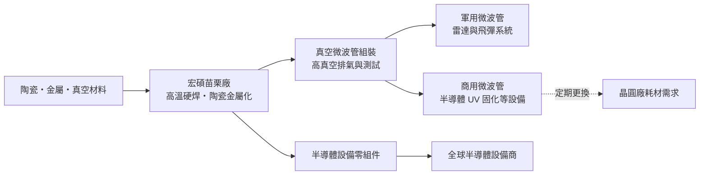
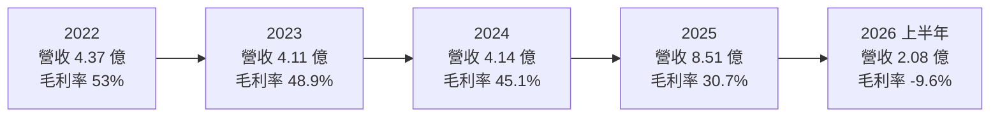
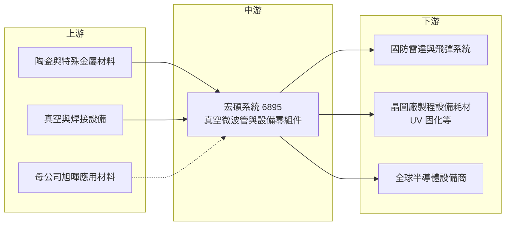

# 6895 宏碩系統

> 上櫃｜[[產業索引-半導體業|半導體業]]｜上市（櫃）日期 2023/08/22

# 第一章：企業模式與商業藍圖

> [!info] 撰寫說明
> 本文由 Claude 依公開資料整理，架構比照 [[2330台積電]] 的四章研究，資料截至 2026-10-08。財務數字來源：櫃買中心開放資料（基本資料、2026 年第二季綜合損益與資產負債、本益比殖利率）、HiStock 嗨投資歷年季度損益表與每股盈餘、工商時報 2023 年 7 月報導、中央社 2026 年 8 月報導、nStock 公司資料；產業描述為整理性內容，尚未逐條比對原始文件。#待校對

微波不只用來加熱便當，雷達、飛彈導引與半導體製程設備都需要高功率、高頻率的微波源。本章針對宏碩系統股份有限公司（股票代號：6895，以下簡稱宏碩）的商業模式進行定性分析，說明一家台灣少見的高功率真空微波管製造商，如何同時服務國防與半導體兩個看似無關的市場。

## 一、核心定位：國內唯一的高功率真空微波管製造商

宏碩成立於 2002 年，位於苗栗，2022 年 9 月登錄興櫃、2023 年 8 月在櫃買中心上櫃，實收資本額約 3.41 億元。依 nStock 整理，旭暉應用材料持股約 36.7%，是最終母公司。公司主要營業項目為高真空系統與高功率微波、毫米波真空器件，核心製程能力包括精密機械設計、[[高溫硬焊]]、[[陶瓷金屬化]]與焊接。

依工商時報 2023 年 7 月報導，宏碩是國內唯一的高功率 [[真空微波管]] 製造商。真空微波管是在真空中用電子束產生或放大微波的元件，用途包括軍用雷達與飛彈系統，以及半導體製程中的微波加熱與 [[UV 固化]]設備。報導指出，全球能製造軍用高功率真空微波管的國家約只有六、七個，高功率微波管單價從數萬元到上百萬元不等，遠高於一般家用微波爐的[[磁控管]]。

這個定位的意義在於「技術稀缺」：高真空、高電壓、高功率與高頻率的整合製造能力，需要長年累積的材料、焊接與真空工藝。宏碩把這套能力同時用在兩個市場：國防需要的是自主供應，半導體需要的是可以替代原廠、壽命更長的耗材與零組件。

## 二、終端應用／產品板塊：半導體零組件、軍用與商用微波管

依工商時報 2023 年 7 月報導，宏碩 2022 年的營收結構如下（較新的比重未查得）：

* **半導體設備零組件（約四成）：** 以全球半導體設備大廠為主要客戶，提供真空、焊接與陶瓷金屬化相關的零組件。這塊業務跟著設備大廠的出貨走，量大但毛利率通常低於自有的微波管產品（推估）。
* **軍用真空微波管（約三成）：** 用於飛彈與雷達系統，屬於國防自主供應鏈的一環。國防產品需求受預算與專案時程影響，但一旦進入系統，替換週期長、客戶不易更換。
* **商用真空微波管（約一成半）：** 主要供應國內半導體龍頭的製程設備，例如 UV 固化設備。依報導，宏碩的商用微波管屬於耗材，壽命可達原廠產品的 2 倍以上，可降低晶圓廠因更換零件停機的損失。這是典型的「副廠替代」模式：用更好的壽命與在地服務，取代原廠耗材。

## 三、資本轉化邏輯（營運模式）：稀缺工藝、耗材與專案並存

* **耗材收入的穩定性：** 商用微波管是晶圓廠設備的消耗性零件，只要設備持續運轉，就會定期更換。管理層在 2023 年表示目標是隨晶圓廠擴廠成為主要替換零件供應商，這部分屬於經常性收入。
* **國防專案的波動性：** 軍用微波管依專案交貨，營收認列時點集中，容易造成季度與年度營收的大起大落。
* **零組件代工的規模性：** 半導體設備零組件提供營收規模，但價格由大客戶主導，毛利率較低。2025 年營收倍增至 8.51 億元，毛利率卻由 45% 降到 30.7%，推估與低毛利的零組件或專案比重上升有關（公司說明未查得）。
* **存貨風險：** 宏碩的產品多為客製化、少量多樣，材料與在製品存貨金額相對高。2026 年第二季依會計準則認列約 6,922 萬元的[[存貨報廢]]損失（依中央社報導），使單季由盈轉虧，顯示這種模式在需求改變時，存貨可能失去使用價值。

## 四、企業長期藍圖：國防自主與半導體在地化

* **國防自主的長期需求：** 台灣推動國防自主，雷達與飛彈系統的關鍵元件國產化是長期政策方向。作為國內唯一的高功率真空微波管製造商，宏碩在這個方向上有結構性的位置，但需求節奏取決於國防預算與專案。
* **半導體耗材替代：** 隨著台灣晶圓廠持續擴廠，製程設備的耗材需求增加。宏碩以更長壽命的商用微波管切入，若能擴大到更多設備型號與客戶，耗材收入可以成為穩定的獲利來源。
* **集團資源：** 母公司旭暉應用材料是材料與設備相關企業（細節未查得），未來可能在材料與客戶資源上提供協助，但具體綜效尚待觀察。

# 第二章：護城河深度與競爭優勢

護城河指的是一家公司能長期擋住對手、維持超額利潤的結構性優勢。本章分析宏碩的護城河組成、可能的競爭對手，以及這些優勢在營收大幅波動下的實際效果。

## 一、護城河的核心組成要素

* **1. 稀缺的真空微波製造能力：** 高功率真空微波管需要整合真空、陶瓷金屬化、高溫硬焊與電子束設計，全球能製造軍用級產品的國家只有少數。這類技術的學習曲線很長，新進者很難在短期內追上。
* **2. 國防供應的資格與信任：** 國防產品需要長期的驗證與保密要求，一旦成為系統的指定供應商，後續的維修與替換需求都會延續。這種資格是宏碩最難被取代的資產。
* **3. 耗材壽命的差異化：** 商用微波管壽命可達原廠 2 倍以上（依工商時報），對晶圓廠來說，降低停機次數比單價更重要，這讓宏碩可以用價值而非低價爭取訂單。
* **4. 在地服務：** 相較於國外原廠，本土供應商能更快回應晶圓廠的維修與交期需求。

## 二、全球主要競爭對手格局

| 對手 | 定位 | 對宏碩的影響 |
|---|---|---|
| 國際真空電子元件大廠（如美國 L3Harris、CPI 等） | 軍用與商用微波管、行波管的全球主要供應商 | 技術與產品線完整，是宏碩在國際市場的主要對手 |
| 半導體設備原廠的原廠耗材 | 設備商自行供應的微波源與零件 | 宏碩商用微波管要取代的對象，原廠有保固與綁定優勢 |
| 台灣半導體設備零組件代工廠 | 精密加工、焊接與真空零件 | 在零組件業務上直接競爭，價格壓力大 |

註：上表國際對手依產業常見的真空電子元件廠整理，宏碩未公開具體競爭對手，屬整理性內容。

## 三、優勢轉化：守得住／守不住／觀察重點

* **守得住：** 國防微波管與已通過驗證的商用耗材。這兩塊需要長期驗證、替代者少，毛利率較高，是宏碩 2021 至 2024 年毛利率維持在 45% 至 53% 的主因。
* **守不住：** 半導體設備零組件的價格與訂單穩定度。這塊業務規模大，但客戶議價能力強；營收若過度依賴零組件，整體毛利率就會被稀釋，2025 年毛利率降到 30.7% 就是例子。
* **觀察重點：** 第一是 2026 年存貨報廢後，毛利率能否回到 40% 以上的正常水準；第二是國防專案的出貨節奏與新的國防預算；第三是商用微波管能否擴大到更多半導體設備與客戶；第四是母公司旭暉的策略方向是否改變公司的業務重心。

# 第三章：財務體質與盈利規模

資料日期：2026-10-08。數字取自櫃買中心開放資料、HiStock 嗨投資歷年季度損益表（年度數字由四季加總推算）與工商時報，表格是撰寫當時的快照；最新月營收、毛利率、累計 EPS 由自動排程寫在本筆記的屬性欄位（月營收、毛利率、累計EPS 等）。#待校對

財務報表是檢驗護城河是否真實存在的最終標準。本章用三率、[[ROE]]、股利與資本報酬，檢視宏碩在國防與半導體雙市場下的獲利品質。

## 一、獲利能力的基石：三率

| 年度 | 營收（億元） | [[毛利率]] | [[營業利益率]] | EPS（元） | [[ROE]] |
|---|---|---|---|---|---|
| 2021 | 3.62 | 51.8% | 30.9% | 2.92 | 未查得 |
| 2022 | 4.37 | 53% | 未查得 | 3.67 | 約 18%（期末權益推算） |
| 2023 | 4.11 | 48.9% | 24.3% | 2.70 | 10.6%（推算） |
| 2024 | 4.14 | 45.1% | 22.9% | 2.55 | 8.6%（推算） |
| 2025 | 8.51 | 30.7% | 16.6% | 3.61 | 11.8%（推算） |
| 2026 上半年 | 2.08 | -9.6% | -35.3% | -2.07 | 年化約 -14%（推算） |

註：2021 年數字取自 HiStock 年度資料（該年僅有全年報表）；2022 年營收、毛利率、EPS 取自工商時報 2023 年 7 月報導，2022 年 ROE 以稅後純益 1.13 億元除以年底權益 6.32 億元推算；2023 年起由 HiStock 季度損益表加總；2026 上半年與櫃買中心開放資料一致。2023 年股東權益因上櫃前後增資而大幅增加。

* **[[毛利率]]逐年下滑：** 從 2022 年的 53% 一路降到 2025 年的 30.7%，2026 年上半年更因存貨報廢轉為負值。前段下滑可能與產品組合有關，2025 年營收倍增但毛利率大降，推估是低毛利的零組件或專案比重提高（公司說明未查得）。
* **[[營業利益率]]隨毛利率下降：** 由 2021 年的 30.9% 降到 2025 年的 16.6%。營業費用規模不大，營業利益率的變化主要來自毛利率。
* **一次性存貨報廢：** 2026 年第二季認列約 6,922 萬元存貨報廢損失，單季稅後淨損 7,049 萬元、每股虧損 2.07 元（依中央社）。這屬於一次性損失，但也提醒投資人：少量多樣的客製化產品，存貨評價風險不低。

## 二、[[ROE]]：資本效率

宏碩上櫃前 ROE 約 18%（2022 年，推算），上櫃增資後股東權益由 6.32 億元增加到約 10 億元，ROE 降到 8% 至 12%（2023 至 2025 年，推算）。以 2022 至 2025 年計算，平均 ROE 約 12%（推算）。增資後資金尚未完全轉化為獲利，是 ROE 下降的主因；2026 年存貨報廢則讓 ROE 轉負。

## 三、資本支出與[[自由現金流]]

* **[[CapEx]]：** 宏碩屬於精密製造，需要真空爐、焊接與測試設備，但規模不大（具體資本支出金額未查得）。2026 年第二季末非流動資產約 5.40 億元、流動資產約 5.21 億元，負債總計只有約 1.66 億元（櫃買中心資料），財務結構保守。
* **股利：** 依 nStock 整理，2024 年度現金股利 2.3 元，2025 年度現金股利 2.9 元；以各年 EPS 計算，配息率約 80% 至 90%（推算）。高配息顯示公司不需要大量資本支出，但 2026 年虧損後能否維持，有待觀察。
* **營收年複合成長率：** 2021 至 2025 年營收由 3.62 億元成長到 8.51 億元，年複合成長率約 24%（推算），但成長主要集中在 2025 年單一年度，2026 年前九月營收又年減約 35%（依 nStock 整理），波動很大。
* **自由現金流：** 低負債與高配息推估多數年度自由現金流為正（推估，具體數字未查得）。

## 四、[[ROIC]] 與 [[WACC]]：價值創造利差

* **ROIC（推算）：** 2025 年營業利益 1.41 億元，以 20% 稅率計算稅後營業利益約 1.13 億元；投入資本以 2025 年底權益 10.65 億元加上非流動負債 0.21 億元（作為有息負債的近似值）計算，約 10.86 億元。ROIC 約 10.4%。2026 年上半年營業虧損 0.73 億元，年化 ROIC 約 -13%（推算），主要受一次性存貨報廢影響。
* **WACC（推算）：** 無風險利率取台灣 10 年期公債約 1.75%，市場風險溢酬 6%，β 值取半導體與國防零組件小型股常見的 1.2（假設值），股東權益成本約 8.95%。宏碩幾乎沒有有息負債，WACC 約等於股東權益成本，約 9%。
* **價值創造判斷：** 2025 年 ROIC 約 10% 略高於 WACC 約 9%，利差很小；2022 年以前毛利率 50% 以上時，ROIC 應明顯高於 WACC（推估）。宏碩能否長期創造價值，取決於毛利率能否回到 40% 以上，以及增資取得的資金能否投入高報酬的國防與耗材業務。

# 第四章：總體風險與地緣政治

任何企業都無法脫離宏觀環境獨立存在。本章分析宏碩在地緣政治、產業週期、營運執行與技術法規上面臨的長期風險。

## 一、地緣政治

* **國防自主的政策支撐：** 台海情勢與國防預算增加，有利於關鍵國防元件國產化，宏碩作為國內唯一的高功率真空微波管製造商，可能受惠。但國防採購有其政策與預算節奏，需求並非線性成長。
* **出口與技術管制：** 軍用微波元件屬於敏感技術，對外銷售受出口管制，海外市場擴張空間有限。
* **台灣集中風險：** 生產基地與主要客戶都在台灣，地緣政治風險無法分散。

## 二、產業週期與市場結構

* **半導體設備週期：** 半導體零組件與商用耗材跟著晶圓廠資本支出與產能利用率走，設備週期下行時，零組件訂單會先縮減。
* **國防專案的不連續性：** 軍用微波管依專案交貨，單一年度的營收可能因專案集中或延後而大起大落，2025 年營收倍增、2026 年又大幅下滑，就是這種特性的體現（推估）。
* **市場規模小：** 高功率真空微波管是高度利基的市場，總需求有限，成長空間取決於能否開發新的應用。

## 三、營運環境的隱性風險

* **存貨評價：** 少量多樣、客製化程度高的產品，材料與在製品一旦因專案取消或規格改變而失去用途，就必須報廢。2026 年第二季的大額存貨報廢，顯示這項風險確實存在。
* **毛利率結構變化：** 營收擴張若主要來自低毛利零組件，整體獲利品質會下降。
* **經營層與大股東：** 2023 年報導中的董事長為趙勤孝，目前證交所開放資料顯示董事長為酈唯誠，經營團隊與母公司策略的變化值得追蹤。
* **技術人才傳承：** 真空微波管製造高度依賴資深技術人員的經驗，人才流失會直接影響良率與交期。

## 四、科技或法規演進

* **固態元件的替代：** 在部分雷達與通訊應用中，氮化鎵等[[固態功率放大器]]正逐步取代真空管。真空微波管在超高功率領域仍有優勢，但中低功率市場可能被固態元件侵蝕，這是宏碩長期最重要的技術風險。
* **半導體新製程的機會：** 先進製程與先進封裝對 UV 固化、微波退火等製程的需求，可能帶來新的商用微波管應用。
* **國防規範與保密要求：** 國防供應鏈的資安與品質規範愈來愈嚴格，合規成本上升，但也提高新進者門檻。

# 專有名詞解析

## 金融

- **[[毛利率]]**：營業毛利占營收的比例，反映產品定價能力與成本結構。
- **[[營業利益率]]**：營業利益占營收的比例，扣除研發與管銷費用後的本業獲利能力。
- **[[ROE]]**：股東權益報酬率，稅後淨利除以股東權益，衡量股東資金的使用效率。
- **[[ROIC]]**：投入資本報酬率，稅後營業利益除以股東權益加有息負債，衡量本業創造報酬的能力。
- **[[WACC]]**：加權平均資金成本，股東權益成本與負債成本依資本結構加權，ROIC 高於它才代表創造價值。
- **[[存貨報廢]]**：存貨因過時、損壞或失去用途而無法出售時，依會計準則認列損失，會直接壓低當期毛利。

## 產業

- **[[真空微波管]]**：在真空中以電子束產生或放大微波的元件，用於雷達、飛彈導引與半導體加熱設備。
- **[[磁控管]]**：最常見的微波產生元件，家用微波爐使用的是低功率版本，高功率版本用於工業與半導體設備。
- **[[陶瓷金屬化]]**：在陶瓷表面形成可焊接的金屬層，讓陶瓷能與金屬零件氣密接合，是真空元件的關鍵工藝。
- **[[高溫硬焊]]**：在高溫下以填充金屬接合零件，接點強度高且氣密，常用於真空與航太元件。
- **[[UV 固化]]**：以紫外光使材料快速硬化的製程，半導體與封裝製程用於光阻與膠材處理。
- **[[固態功率放大器]]**：以氮化鎵等半導體元件放大射頻訊號的裝置，正逐步取代部分真空管應用。

# 核心供應鏈

## 1. 上游：材料、設備與母公司
- 母公司：旭暉應用材料（持股約 36.7%，依 nStock 整理）
- 陶瓷、特殊金屬與真空設備供應商（具體廠商未查得）

## 2. 中游：真空與微波元件同業
- 國際真空電子元件廠：L3Harris、CPI 等
- 台灣半導體設備零組件代工同業

## 3. 下游：國防與半導體
- 國防：國軍雷達與飛彈系統（依工商時報報導，未具名專案）
- 半導體：國內半導體龍頭的製程設備耗材（依工商時報報導，未具名）
- 全球半導體設備大廠的零組件訂單（未具名）

## 最新新聞
<!-- news:start -->
<!-- news:end -->

## 相關連結
- [公開資訊觀測站](https://mopsov.twse.com.tw/mops/web/t05st03?step=1&firstin=1&co_id=6895)
- [Goodinfo](https://goodinfo.tw/tw/StockDetail.asp?STOCK_ID=6895)
- [Yahoo 股市](https://tw.stock.yahoo.com/quote/6895)
- [鉅亨網新聞](https://www.cnyes.com/twstock/6895/news)
