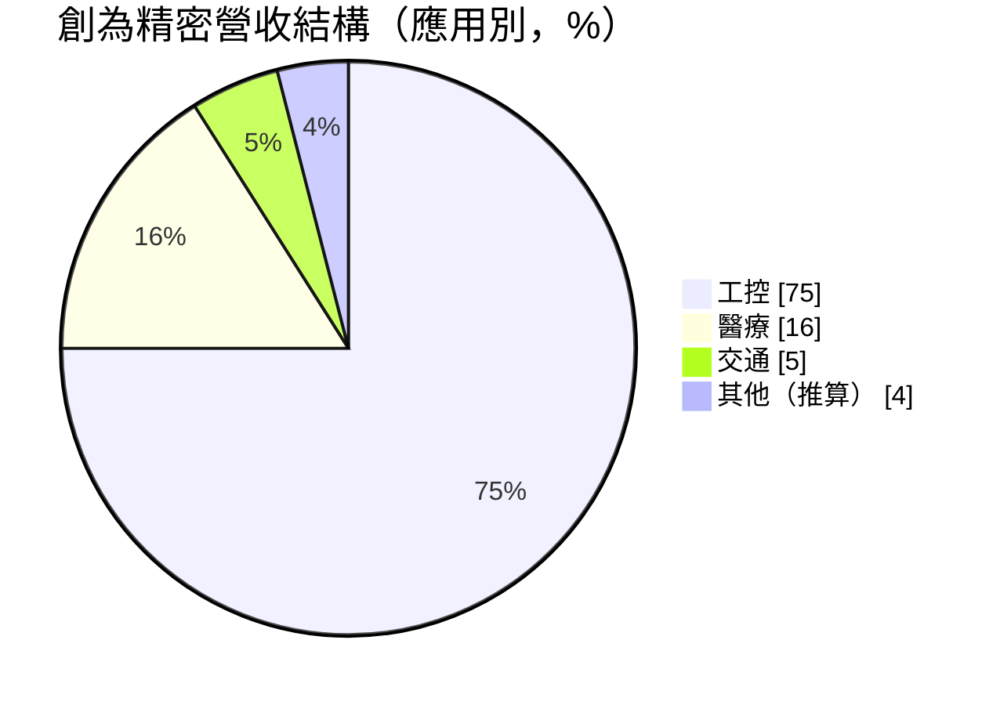
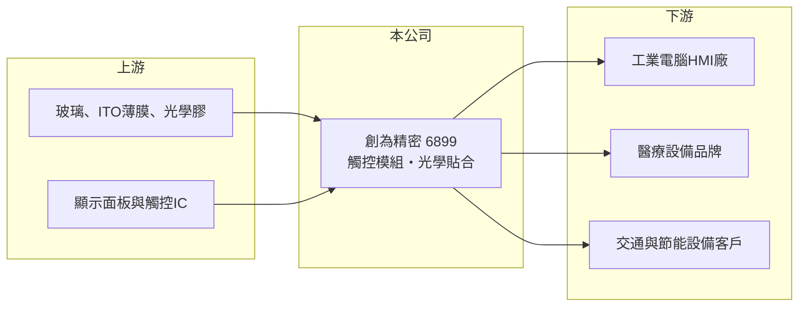

# 6899 創為精密

> 上櫃｜[[產業索引-光電業|光電業]]｜上市（櫃）日期 2024/04/08

# 第一章：企業模式與商業藍圖

> [!info] 撰寫說明
> 精簡版，由 Claude 依公開資料整理，架構比照 [[2330台積電]]，資料截至 2026-10-07。來源：Yahoo 股市新聞「雙引擎點火 創為精密2026業績正向」。#待校對

創為精密專做工控、醫療與交通用的觸控模組與光學貼合，避開消費電子的價格戰。

- **核心業務：** 產品涵蓋觸控模組、[[光學貼合]]服務與軟板整合方案，以[[電容式觸控]]為主（推估），應用在工業電腦的 [[HMI]] 操作介面與醫療設備。
- **營收結構：** 依應用別，工控約占 75%、醫療約 16%、交通約 5%，其餘為其他應用。
- **營運據點：** 生產據點本次未查到明細；客戶分布於美國、歐洲、台灣與日本。
- **長期方向：** 以工控回溫與醫療出貨成長為「雙引擎」，並加強開發美國市場與醫療新品。

# 第二章：護城河深度與競爭優勢

創為精密的優勢在於少量多樣的利基市場，客戶認證期長、轉換成本高。

- **競爭優勢：** 工控與醫療產品生命週期長，觸控模組需通過客戶的可靠度與法規驗證，一旦導入通常長期供貨；公司目標毛利率維持 40% 以上。
- **主要對手：** 觸控模組同業 [[3673TPK-KY]]、[[6456GIS-KY]] 以消費電子為主，與創為的利基市場重疊有限；直接競爭者推估為國內外中小型工控觸控廠。
- **觀察重點：** 醫療新品出貨進度、美國市場開發成果，以及工控景氣是否持續回溫。

# 第三章：財務體質與盈利規模

資料日期：2026-10-07，以下數字是撰寫當時的快照；最新月營收、毛利率、累計 EPS 由自動排程寫在本筆記的屬性欄位（月營收、毛利率、累計EPS 等）。#待校對

創為精密營收穩定成長，毛利率維持在高檔。

- **營收規模：** 推估為 2025 年前三季合併營收約 8.83 億元，年增 24.7%；第三季營收 3.11 億元，季增 5%、年增 20.9%。
- **獲利：** 同期前三季 EPS 2.65 元，第三季 EPS 1.26 元，第三季[[毛利率]] 37.3%。
- **財務特色：** 利基型產品毛利率接近 4 成，遠高於消費電子觸控模組廠；營收成長時具[[營運槓桿]]。

# 第四章：總體風險與地緣政治

創為精密的風險在於工控景氣循環與客戶集中。

- **產業週期：** 工控約占營收四分之三，工業電腦與自動化設備的庫存調整會直接影響出貨。
- **營運風險：** 客戶包括美國十大醫療品牌供應鏈、歐洲節能客戶與日本重化工業廠，大客戶訂單變化影響明顯（推估）。
- **其他風險：** 美國關稅政策、歐美匯率變動，以及面板與玻璃等原料價格。

# 專有名詞解析

## 半導體

- **[[電容式觸控]]**：利用手指改變電極間電容來偵測位置的觸控技術，是平板與筆電觸控的主流。

## 應用

- **[[光學貼合]]**：把觸控感測層與顯示面板以光學膠貼合，減少反光並提升可視性。
- **[[HMI]]**：人機介面，操作人員與機器設備溝通的螢幕與控制面板。

## 金融

- **[[毛利率]]**：營業毛利占營收的比例，反映產品的定價能力與成本控制。
- **[[營運槓桿]]**：固定成本占比高時，營收變動會放大為更大幅度的獲利變動。

# 核心供應鏈

- 上游：玻璃、ITO 薄膜、光學膠、顯示面板與觸控 IC 供應商（推估）
- 下游／客戶：歐洲與台灣工業電腦 HMI 廠商、美國醫療品牌供應鏈、歐洲節能客戶、日本重化工業製造商
- 同業：[[3673TPK-KY]]、[[6456GIS-KY]]（應用市場不同）

## 最新新聞
<!-- news:start -->
<!-- news:end -->

## 相關連結
- [公開資訊觀測站](https://mopsov.twse.com.tw/mops/web/t05st03?step=1&firstin=1&co_id=6899)
- [Goodinfo](https://goodinfo.tw/tw/StockDetail.asp?STOCK_ID=6899)
- [Yahoo 股市](https://tw.stock.yahoo.com/quote/6899)
- [鉅亨網新聞](https://www.cnyes.com/twstock/6899/news)
