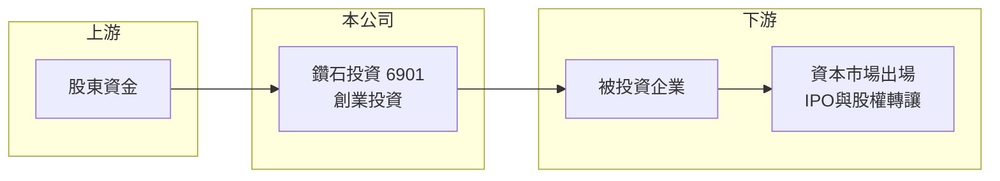

# 6901 鑽石投資

> 上市｜[[產業索引-其他業|其他業]]｜上市（櫃）日期 2023/09/19

# 第一章：企業模式與商業藍圖

> [!info] 撰寫說明
> 精簡版，由 Claude 依公開資料整理，架構比照 [[2330台積電]]，資料截至 2026-10-07。來源：nstock.tw 鑽石投資公司概況、winvest.tw 營收快訊。公開資料有限，主要投資標的與持股比重本次未查到。#待校對

鑽石投資是以[[創業投資]]為本業的上市公司，2023 年 9 月起在證交所掛牌。

- **核心業務：** 鑽石投資從事創業投資，營收來自投資標的的處分利益、股利與評價損益，而非銷售產品。
- **營收結構：** 本次未查到投資組合的產業與標的比重；營收隨持股市價變動劇烈，2026 年 6 月營收 22.07 億元，7 月卻是負 9.27 億元，8 月僅 137.6 萬元。
- **營運據點：** 以台灣為主要營運地，投資標的地區分布本次未查到。
- **長期方向：** 公司以永續經營為宗旨，長期價值取決於投資組合能否持續產出成功出場的案子。

# 第二章：護城河深度與競爭優勢

創投公司的護城河在於選案能力與投資網絡，外部投資人不易驗證。

- **競爭優勢：** 長期經營累積的產業人脈與案源是創投的核心資源，本次未查到具體投資紀錄（推估）。
- **主要對手：** 國內其他創投與投資控股公司，例如 [[9945潤泰新]] 等具投資色彩的上市公司僅屬部分可比。
- **觀察重點：** 主要持股的股價表現、[[淨值]]變化，以及是否恢復穩定配息。

# 第三章：財務體質與盈利規模

資料日期：2026-10-07，以下數字是撰寫當時的快照；最新月營收、毛利率、累計 EPS 由自動排程寫在本筆記的屬性欄位（月營收、毛利率、累計EPS 等）。#待校對

鑽石投資的「營收」本質上是投資損益，可能出現負值，不適合用一般公司的營收成長來解讀。

- **營收規模：** 2026 年 1 至 7 月累計營收 22.02 億元，2025 年全年營收為負 10.73 億元；單月營收在正負之間大幅擺盪。
- **獲利：** 2026 年第一季 EPS 負 0.42 元，[[ROE]] 負 3.94%；2025 年全年 EPS 負 1.38 元。
- **財務特色：** 資本額約 85.29 億元，市值約 153.18 億元；近年幾乎不配息，近五年平均現金股利僅 0.1 元，評價應以投資組合[[淨值]]為主（推估）。

# 第四章：總體風險與地緣政治

鑽石投資的風險幾乎完全來自投資組合的市價波動。

- **產業週期：** 創投獲利受股市多空與 IPO 市場熱度影響，資本市場轉弱時評價損失與出場困難會同時發生。
- **營運風險：** 若持股集中在少數標的，單一公司股價下跌就可能讓單月營收轉負；本次未查到持股集中度。
- **其他風險：** [[公允價值]]評價使財報波動大；投資標的所屬產業的法規與匯率風險也會間接影響。

# 專有名詞解析

## 金融

- **[[創業投資]]**：投資未上市或成長期企業股權，靠企業成長後出場賺取資本利得。
- **[[公允價值]]**：以市場價格或評價模型衡量資產價值，價格變動直接反映在損益或權益中。
- **[[淨值]]**：資產減去負債後屬於股東的部分，是評價投資公司的主要基準。
- **[[ROE]]**：股東權益報酬率，稅後淨利除以股東權益，衡量股東資金的獲利效率。

# 核心供應鏈

- 上游：股東權益與自有資金
- 下游／客戶：被投資的新創與成長期企業，標的名稱本次未查到
- 同業：國內創投與投資控股公司

## 最新新聞
<!-- news:start -->
<!-- news:end -->

## 相關連結
- [公開資訊觀測站](https://mopsov.twse.com.tw/mops/web/t05st03?step=1&firstin=1&co_id=6901)
- [Goodinfo](https://goodinfo.tw/tw/StockDetail.asp?STOCK_ID=6901)
- [Yahoo 股市](https://tw.stock.yahoo.com/quote/6901)
- [鉅亨網新聞](https://www.cnyes.com/twstock/6901/news)
