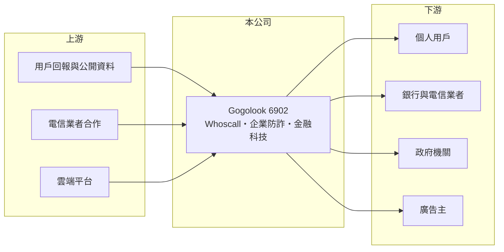

# 6902 GOGOLOOK

> 上市｜[[產業索引-數位雲端|數位雲端]]｜上市（櫃）日期 2025/05/16

# 第一章：企業模式與商業藍圖

> [!info] 撰寫說明
> 精簡版，由 Claude 依公開資料整理，架構比照 [[2330台積電]]，資料截至 2026-10-08。來源：證交所開放資料（基本資料、營益分析、資產負債、綜合損益、股利、本益比殖利率）、Goodinfo 年度經營績效、MoneyDJ 公司基本資料（營收比重）、富果研究 2025 年 11 月法說會摘要。2020 至 2021 年財務數字未查得。#待校對

本章說明 Gogolook（6902）以防詐 App 為核心的[[信任科技]]商業模式。

- **核心業務：** Gogolook 成立於 2012 年，2023 年 7 月在證交所上市，總經理郭建甫，總部在台北大安區。旗下最知名的產品是來電辨識與防詐 App Whoscall，能辨識陌生來電、簡訊與網址是否為詐騙。公司以此為基礎延伸到企業與政府的防詐服務，以及金融科技業務。
- **營收結構：** 依 MoneyDJ 2025 年資料，信任雲服務占 41.6%、數位廣告服務占 31.7%、商業服務占 26.7%，顯示收入同時來自 App 訂閱、免費版廣告與企業服務。依富果整理的法說會內容，消費者防詐（Whoscall）占營收六成以上，訂閱收入超過三成。
- **市場分布：** Whoscall 在台灣之外，泰國約有 700 萬用戶、滲透率約 10%，菲律賓約 60 萬用戶。企業防詐業務以併購的 Scamadviser 為核心，主攻歐美市場。金融科技業務 Roo.cash 在泰國經營小額信貸，2025 年董事會已通過分拆並尋求策略投資人。
- **長期方向：** 詐騙手法隨 AI 進化，各國政府與金融機構對防詐工具的需求持續上升。Gogolook 的長期策略是把用戶回報累積的詐騙資料庫，轉化為對企業與政府收費的資料服務，從單一 App 走向防詐基礎設施。

# 第二章：護城河深度與競爭優勢

本章分析 Gogolook 的護城河。

- **競爭優勢：** 防詐服務的核心是資料庫的規模與即時性。Whoscall 用戶越多，回報的詐騙號碼與網址越多，辨識越準確，又吸引更多用戶，形成[[網路效應]]。這個資料資產讓 Gogolook 能把同一套能力賣給電信業者、銀行與政府，新進者很難在短時間內累積同等規模的資料。
- **主要對手：** 國際上有 Truecaller、Hiya 等來電辨識 App，手機作業系統（如 [[GOOGL谷歌]] 的 Android、[[AAPL蘋果]] 的 iOS）也陸續內建陌生來電過濾；電信業者與銀行則可能自建防詐系統。
- **觀察重點：** 第一是 2025 年轉虧為盈後，獲利能否穩定成長。第二是東南亞用戶的付費轉換率。第三是 Roo.cash 分拆後的財務影響，以及企業防詐在歐美的進展。

# 第三章：財務體質與盈利規模

資料日期：2026-10-08，表格是撰寫當時的快照；最新月營收、毛利率、累計 EPS 由自動排程寫在本筆記的屬性欄位（月營收、毛利率、累計EPS 等）。#待校對

本章用多年度數字檢視 Gogolook 從虧損走向獲利的過程。

| 年度 | 營收（新台幣） | [[毛利率]] | [[營業利益率]] | EPS（元） | [[ROE]] |
|---|---|---|---|---|---|
| 2021 | 未查得 | 未查得 | 未查得 | 未查得 | 未查得 |
| 2022 | 4.20 億 | 85.5% | -18.0% | -1.90 | -24.4% |
| 2023 | 7.74 億 | 91.4% | 1.52% | 0.16 | 1.48% |
| 2024 | 8.67 億 | 90.6% | -6.16% | -1.24 | -9.22% |
| 2025 | 10.5 億 | 88.3% | 6.04% | 1.58 | 9.72% |

- **營收規模：** 2022 至 2025 年營收年複合成長率約 35.7%，是高成長的軟體公司。依證交所資料，2026 年上半年營收約 6.13 億元，營業利益率 19.4%、EPS 3.33 元，獲利能力明顯跳升。
- **獲利：** 毛利率接近 90%，典型的軟體與資料服務結構；過去虧損主因是行銷與海外擴張費用。2022 至 2025 年平均 ROE 約 -5.6%，2025 年才轉為正值，長期 ROE 水準尚未建立。
- **財務特色：** 2026 年第二季歸屬母公司權益約 8.1 億元，每股淨值 22.93 元；非流動負債約 1.0 億元。依證交所股利資料，2025 年度稅後淨利約 0.54 億元，但仍有累積虧損待彌補，因此未配發股利。
- **[[ROIC]] 與 [[WACC]]：** 2025 年營業利益約 0.63 億元（10.5 億 × 6.04%），稅後約 0.51 億元；投入資本以股東權益 8.1 億元加上以非流動負債 1.0 億元近似的有息負債，約 9.2 億元，ROIC 約 5.5%（推算）；若以 2026 年上半年營業利益 1.19 億元年化，ROIC 約 20%（推算）。WACC 以 CAPM 推估：無風險利率 1.75%、市場風險溢酬 6%、β 用成長型軟體股常見值 1.2，股東權益成本約 8.95%；負債成本 2.5%、稅後 2.0%；股權權重約 89%，WACC 約 8.2%（推算）。2025 年 ROIC 仍低於 WACC，但 2026 年的獲利水準若能延續，將轉為創造價值。

# 第四章：總體風險與地緣政治

本章整理 Gogolook 長期必須面對的風險。

- **產業週期：** 防詐需求與詐騙犯罪的猖獗程度相關，屬於結構性需求，受景氣影響較小；但數位廣告收入會隨廣告市場景氣波動。
- **營運風險：** 手機作業系統與電信業者內建防詐功能，可能降低用戶下載第三方 App 的意願。海外擴張需要大量行銷投入，費用時點會影響季度獲利；金融科技的小額信貸則有信用風險與壞帳風險。
- **其他風險：** 來電與簡訊資料涉及個資與隱私法規，各國規範不同；泰國、菲律賓等市場的匯率與政策變化，也會影響營收與獲利。

# 專有名詞解析

## 應用

- **[[信任科技]]**：以資料與 AI 辨識詐騙、驗證身分與交易真偽的技術與服務。

## 金融

- **[[ROIC]]**：投入資本報酬率，稅後營業利益除以投入資本，衡量本業運用資金創造報酬的能力。
- **[[WACC]]**：加權平均資金成本，股東與債權人要求報酬率的加權平均，ROIC 高於 WACC 才代表創造價值。

## 產業

- **[[網路效應]]**：使用者越多、產品對每位使用者越有價值的現象，是平台型企業的重要護城河。

# 核心供應鏈

- 上游：用戶回報的詐騙資料、公開資料來源、電信業者合作，以及雲端運算平台（實際合作對象未查得）。
- 下游／客戶：台灣、泰國、菲律賓等地的個人用戶，銀行、電信業者與政府機關，以及數位廣告主。
- 同業：Truecaller、Hiya 等國際來電辨識業者，以及 Scamadviser 所在的歐美防詐服務市場。

## 最新新聞
<!-- news:start -->
<!-- news:end -->

## 相關連結
- [公開資訊觀測站](https://mopsov.twse.com.tw/mops/web/t05st03?step=1&firstin=1&co_id=6902)
- [Goodinfo](https://goodinfo.tw/tw/StockDetail.asp?STOCK_ID=6902)
- [Yahoo 股市](https://tw.stock.yahoo.com/quote/6902)
- [鉅亨網新聞](https://www.cnyes.com/twstock/6902/news)
