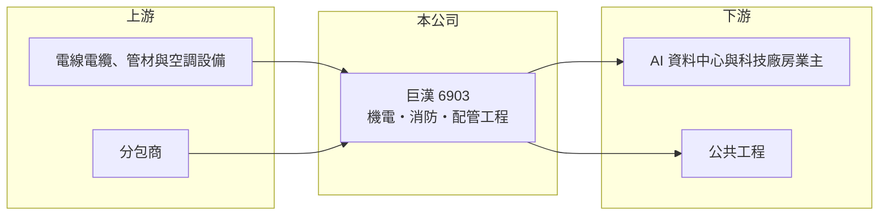

# 6903 巨漢

> 上櫃｜[[產業索引-其他電子業|其他電子業]]｜上市（櫃）日期 2024/06/12

# 第一章：企業模式與商業藍圖

> [!info] 撰寫說明
> 精簡版，由 Claude 依公開資料整理，架構比照 [[2330台積電]]，資料截至 2026-10-07。來源：經濟日報 2026 年 5 月巨漢首季財報報導、nStock 巨漢公司概況。業主名稱與工程類別營收比重未查到。#待校對

巨漢是承攬水電空調、消防與配管工程的[[機電工程]]公司，受惠 AI 基礎建設工程，2026 年營收與獲利倍數成長。

- **核心業務：** 主要營業項目為水電空調、消防安全設備安裝、配管與儀器儀表安裝工程，經濟日報形容其為專注 AI 基礎建設與公共工程的工程系統整合商。
- **營收結構：** 本次未查到工程類別或業主別比重；AI 基礎建設相關工程是近期成長主力。
- **營運據點：** 2024 年 6 月上櫃，以台灣工程案為主，海外布局本次未查到。
- **長期方向：** 截至 2026 年 5 月[[在手訂單]] 104 億元、能見度 2 至 3 年，公司目標 2030 年前年營收達 100 億元。

# 第二章：護城河深度與競爭優勢

工程承攬的競爭力在於施工品質、工期掌握與分包商管理。

- **競爭優勢：** 公司以 [[BIM]] 與 AI 數位化系統規劃施工，強調「零重工」；並以較佳付款條件維持穩定的分包商網絡，對外標榜零重大工安、零壞帳、零工程訴訟。
- **主要對手：** 機電與廠務工程同業如 [[2404漢唐]]、[[6139亞翔]]、[[5536聖暉]]、[[6196帆宣]]。
- **觀察重點：** 在手訂單轉為營收的速度、毛利率能否維持在三成左右，以及高配息政策能否延續。

# 第三章：財務體質與盈利規模

資料日期：2026-10-07，以下數字是撰寫當時的快照；最新月營收、毛利率、累計 EPS 由自動排程寫在本筆記的屬性欄位（月營收、毛利率、累計EPS 等）。#待校對

巨漢 2026 年前 8 月營收是去年同期的三倍以上，單季 EPS 超過 6 元。

- **營收規模：** 2026 年第一季營收 19.26 億元、年增 358.7%；8 月營收 6.24 億元、年增 122.7%；1 至 8 月累計 52.29 億元，年增 231.1%。
- **獲利：** 2026 年第一季毛利 6.05 億元（[[毛利率]]約 31%，推算）、淨利 4.43 億元、EPS 6.72 元；第二季 EPS 7.42 元，上半年合計約 14.14 元（推算）。
- **財務特色：** 資本額約 6.67 億元、市值約 219 億元；公司承諾股利發放率維持 75% 以上，2025 年配發現金股利 8.5 元。

# 第四章：總體風險與地緣政治

巨漢的風險在於工程案集中與營收認列的波動。

- **產業週期：** 營收來自業主擴建廠房與資料中心，AI 與半導體資本支出放緩時，新接訂單會減少。
- **營運風險：** 工程按進度認列，大案集中時單季營收與獲利起伏大；工期延誤、材料與人力成本上升會壓縮毛利。
- **其他風險：** 營建缺工、工安事故，以及大型業主集中帶來的議價壓力（推估）。

# 專有名詞解析

## 金融

- **[[在手訂單]]**：已簽約但尚未認列營收的訂單金額，用來判斷未來營收能見度。
- **[[毛利率]]**：營收扣除銷貨成本後的毛利占營收比例，反映產品本身的獲利能力。

## 產業

- **[[機電工程]]**：廠房與建築的電力、空調、給排水、消防與管線系統工程。
- **[[BIM]]**：建築資訊模型，以 3D 模型整合建築、結構與機電資料，可在施工前找出管線衝突。

# 核心供應鏈

- 上游：電線電纜、管材、空調與消防設備供應商，以及施工分包商（推估）
- 下游／客戶：AI 基礎建設與科技廠房業主、公共工程（業主名稱未查到）
- 同業：[[2404漢唐]]、[[6139亞翔]]、[[5536聖暉]]、[[6196帆宣]]

## 最新新聞
<!-- news:start -->
<!-- news:end -->

## 相關連結
- [公開資訊觀測站](https://mopsov.twse.com.tw/mops/web/t05st03?step=1&firstin=1&co_id=6903)
- [Goodinfo](https://goodinfo.tw/tw/StockDetail.asp?STOCK_ID=6903)
- [Yahoo 股市](https://tw.stock.yahoo.com/quote/6903)
- [鉅亨網新聞](https://www.cnyes.com/twstock/6903/news)
