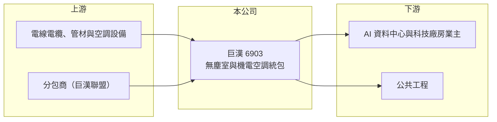

# 6903 巨漢

> 上櫃｜[[產業索引-其他電子業|其他電子業]]｜上市（櫃）日期 2024/06/12

# 第一章：企業模式與商業藍圖

> [!info] 撰寫說明
> 精簡版，由 Claude 依公開資料整理，架構比照 [[2330台積電]]，資料截至 2026-10-08。來源：MoneyDJ 理財網（富邦證券站）巨漢年度損益表、財務比率與基本資料；經濟日報 2026 年 5 月巨漢財報報導；nStock 公司概況；櫃買中心 2026 年第二季資產負債資料。業主名稱未公開。#待校對

巨漢是新竹的無塵室與[[機電工程]]統包商，承接科技廠房的水電、空調、消防與配管工程，近年轉向 AI 基礎建設與資料中心相關工程。

- **核心業務：** 公司 1989 年成立，2024 年 6 月上櫃，總部在新竹市。依 MoneyDJ 2025 年資料，營收 100% 來自[[無塵室]]及機電空調統包工程，營業項目包括水電空調、消防安全設備、配管與儀器儀表安裝。統包代表巨漢從設計整合到施工一手負責，對業主而言責任單一、溝通成本低。
- **營收結構：** 工程依完工進度認列營收，單一大案就可能占全年營收很高比重，因此營收曲線並不平滑。經濟日報形容巨漢專注 AI 基礎建設與公共工程，科技廠房與資料中心是主要業主類型。
- **營運據點：** 以新竹為中心，服務台灣科技產業聚落；海外工程布局本次未查到。工程業高度依賴在地分包商網絡與工班調度，據點擴張速度通常比製造業慢。
- **長期方向：** 公司在 2026 年 5 月揭露在手訂單約 104 億元，並以 2030 年前年營收達 100 億元為目標。這代表巨漢正從中型工程商邁向大型統包商，能否在規模放大時維持施工品質與毛利，是長期最大的課題。

# 第二章：護城河深度與競爭優勢

工程統包的護城河在於施工品質紀錄、業主信任與穩定的分包商網絡，巨漢在這幾點上有清楚的經營主張。

- **競爭優勢：** 公司以 [[BIM]] 與 AI 數位化系統在施工前模擬管線配置，強調「零重工」，減少返工就是保住毛利。它也以較佳付款條件維持「巨漢聯盟」分包商網絡，在缺工時期能優先取得人力，並對外標榜零重大工安、零壞帳、零工程訴訟。
- **主要對手：** 機電與廠務工程同業如 [[2404漢唐]]、[[6139亞翔]]、[[5536聖暉]]、[[6196帆宣]]。這些對手規模更大、承接晶圓廠整廠工程的經驗更多，巨漢目前以中型工程與資料中心機電為主要切入點（推估）。
- **觀察重點：** 巨漢 2021 至 2025 年營業利益率在 21% 至 36% 之間，在工程業中屬於偏高水準。長期要看承接更大型工程時，這樣的獲利率能否維持，以及高配息政策能否與擴張所需的營運資金並存。

# 第三章：財務體質與盈利規模

資料日期：2026-10-08，表格是撰寫當時的快照；最新月營收、毛利率、累計 EPS 由自動排程寫在本筆記的屬性欄位（月營收、毛利率、累計EPS 等）。#待校對

巨漢的營收隨大案進出起伏，但營業利益率長期維持兩成以上，資本效率在工程業中相當突出。

| 年度 | 營收（億元） | [[毛利率]] | [[營業利益率]] | EPS（元） | [[ROE]] |
|---|---|---|---|---|---|
| 2021 | 26.47 | 34.62% | 28.20% | 26.45 | 61.91% |
| 2022 | 47.17 | 38.67% | 33.46% | 34.24 | 82.80% |
| 2023 | 28.68 | 40.57% | 35.84% | 13.54 | 39.24% |
| 2024 | 28.86 | 30.29% | 25.22% | 9.28 | 22.06% |
| 2025 | 36.04 | 27.65% | 23.66% | 10.62 | 21.78% |

註：2024、2025 年為個別報表，其餘為合併報表；上櫃前股本較小，早期 EPS 與 ROE 偏高。

- **營收與獲利趨勢：** 2020 至 2025 年營收年複合成長率約 11%（推算），近五年平均 ROE 約 45.6%（推算），但上櫃後淨值擴大，ROE 已回到兩成上下。2022 年營收衝上 47 億元後隔年減少約四成，正是工程業「大案年、空窗年」的典型樣貌。
- **財務特色：** 工程業常見業主預付款與應付分包款，負債多屬營運性質，2026 年第二季非流動負債幾乎為零。公司承諾股利發放率維持 75% 以上，2022 至 2025 年度現金股利依序為 18、9.27、8、8.5 元。每股營業現金流量除 2024 年外皆為正。
- **[[ROIC]] 與 [[WACC]]：** 以 2025 年營業利益 8.53 億元乘以（1－20%）得稅後營業利益約 6.82 億元，除以 2026 年第二季股東權益約 36.41 億元（幾乎無長期負債），ROIC 約 19%（推算）。WACC 以 CAPM 推估：無風險利率 1.75%、市場風險溢酬 6%、β 取 MoneyDJ 的 0.98，股權成本約 7.6%，無有息負債，WACC 約 7.5%（推算）。ROIC 明顯高於 WACC，顯示巨漢以輕資產的統包模式持續創造價值。

# 第四章：總體風險與地緣政治

巨漢的風險來自業主資本支出週期、工程執行與規模擴張的管理挑戰。

- **產業週期：** 營收取決於科技廠房與資料中心業主的擴建計畫，AI 與半導體投資放緩時，新接訂單會減少。工程從得標到完工通常需要一到兩年，景氣反轉的影響會延後顯現在營收上。
- **營運風險：** 工程按進度認列，大案集中時單季營收與獲利起伏很大。工期延誤、材料漲價與缺工都會壓縮毛利，統包商也必須承擔分包商施工品質的最終責任。
- **其他風險：** 營建業長期缺工、工安事故的法律與商譽風險，以及少數大型業主集中帶來的議價壓力（推估）。規模快速擴大時，專案管理人才是否足夠也是隱性風險。

# 專有名詞解析

## 金融

- **[[毛利率]]**：營收扣除銷貨成本後的毛利占營收比例，反映產品本身的獲利能力。

## 產業

- **[[機電工程]]**：廠房與建築的電力、空調、給排水、消防與管線系統工程。
- **[[無塵室]]**：控制空氣中微粒、溫濕度與壓力的密閉空間，半導體製程必須在其中進行。
- **[[BIM]]**：建築資訊模型，以 3D 模型整合建築、結構與機電資料，可在施工前找出管線衝突。

# 核心供應鏈

- 上游：電線電纜、管材、空調與消防設備供應商，以及施工分包商（推估）
- 下游／客戶：AI 基礎建設與科技廠房業主、公共工程（業主名稱未公開）
- 同業：[[2404漢唐]]、[[6139亞翔]]、[[5536聖暉]]、[[6196帆宣]]

## 最新新聞
<!-- news:start（自動產生，請勿手動編輯此範圍） -->
- 2026-10-08 📰 媒體 19:51｜營收速報 - 巨漢(6903)9月營收8.14億元年增率高達108.95％｜[鉅亨網](https://news.cnyes.com/news/id/6625906)

完整紀錄：[[6903巨漢 新聞]]
<!-- news:end -->

## 相關連結
- [公開資訊觀測站](https://mopsov.twse.com.tw/mops/web/t05st03?step=1&firstin=1&co_id=6903)
- [Goodinfo](https://goodinfo.tw/tw/StockDetail.asp?STOCK_ID=6903)
- [Yahoo 股市](https://tw.stock.yahoo.com/quote/6903)
- [鉅亨網新聞](https://www.cnyes.com/twstock/6903/news)
