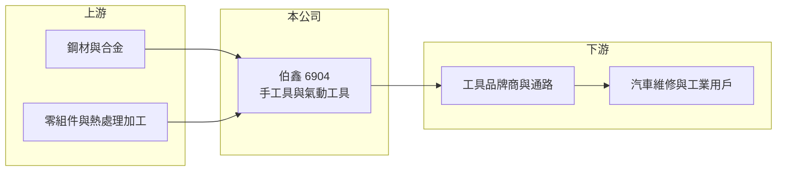

# 6904 伯鑫

> 上櫃｜[[產業索引-其他業|其他業]]｜上市（櫃）日期 2023/12/05

# 第一章：企業模式與商業藍圖

> [!info] 撰寫說明
> 精簡版，由 Claude 依公開資料整理，架構比照 [[2330台積電]]，資料截至 2026-10-07。來源：nstock.tw 伯鑫公司概況、winvest.tw 營收快訊。公開資料有限，產品與地區別比重、主要客戶本次未查到。#待校對

伯鑫是製造手工具與[[氣動工具]]的中小型工具廠，2023 年 12 月上櫃。

- **核心業務：** 伯鑫製造與銷售手工具、氣動工具及相關零件，產品用於汽車維修與工業組裝（推估）。
- **營收結構：** 本次未查到產品或地區別比重；2025 年全年營收 8.63 億元，2026 年 1 至 8 月累計 6.4 億元，年增 4.32%。
- **營運據點：** 生產據點本次未查到，本文不推測。
- **長期方向：** 台灣工具業以外銷歐美為主，伯鑫應屬此類型（推估），長期成長取決於海外通路與產品線擴充。

# 第二章：護城河深度與競爭優勢

伯鑫規模不大，優勢在於工具產品的品質與交期。

- **競爭優勢：** 台灣工具產業聚落完整，零件取得快、可彈性接單，有利中小型廠商以 [[OEM]] 或自有品牌外銷（推估）。
- **主要對手：** [[1527鑽全]] 等台灣氣動工具廠，以及中國低價工具廠。
- **觀察重點：** 外銷訂單動能、[[毛利率]]能否維持兩成五以上，以及關稅對美國訂單的影響。

# 第三章：財務體質與盈利規模

資料日期：2026-10-07，以下數字是撰寫當時的快照；最新月營收、毛利率、累計 EPS 由自動排程寫在本筆記的屬性欄位（月營收、毛利率、累計EPS 等）。#待校對

伯鑫股本小、獲利穩定，配息率高。

- **營收規模：** 2026 年 6 月營收 9,243.5 萬元、年增 78.75%；8 月 0.77 億元、年減 4.29%；1 至 8 月累計 6.4 億元。2025 年全年營收 8.63 億元。
- **獲利：** 2026 年第二季 EPS 1.65 元，上半年累計 3.48 元；第二季毛利率 26.68%、[[營業利益率]] 12.08%、淨利率 12.35%。2025 年全年 EPS 5.44 元。
- **財務特色：** 資本額約 1.85 億元；2025 年度配發現金股利 5 元，2024 年度配發 9 元、配發率約 86%。

# 第四章：總體風險與地緣政治

伯鑫的風險來自外銷景氣與匯率。

- **產業週期：** 工具需求跟隨歐美汽車售後維修與工業投資景氣，通路庫存調整會放大訂單波動。
- **營運風險：** 規模小，單月營收波動大；客戶集中度本次未查到。
- **其他風險：** 新台幣升值與美國關稅會壓縮外銷獲利，鋼材價格波動影響成本（推估）。

# 專有名詞解析

## 金融

- **[[毛利率]]**：毛利占營收的比例，反映產品定價能力與成本控制。

## 產業

- **[[氣動工具]]**：以壓縮空氣驅動的工具，如氣動扳手、氣動起子，常用於汽車維修與組裝產線。
- **[[手工具]]**：不需動力、以人力操作的工具，如扳手、套筒與起子。
- **[[OEM]]**：代工生產，依客戶設計與品牌製造產品。

# 核心供應鏈

- 上游：鋼材、合金與零件加工廠（推估）
- 下游／客戶：海外工具品牌商、通路商與汽修、工業用戶，客戶名稱未揭露
- 同業：[[1527鑽全]] 與台灣、中國工具廠

## 最新新聞
<!-- news:start -->
<!-- news:end -->

## 相關連結
- [公開資訊觀測站](https://mopsov.twse.com.tw/mops/web/t05st03?step=1&firstin=1&co_id=6904)
- [Goodinfo](https://goodinfo.tw/tw/StockDetail.asp?STOCK_ID=6904)
- [Yahoo 股市](https://tw.stock.yahoo.com/quote/6904)
- [鉅亨網新聞](https://www.cnyes.com/twstock/6904/news)
