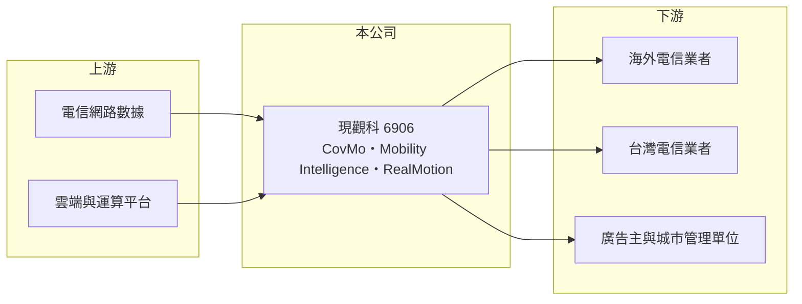

# 6906 現觀科

> 上市｜[[產業索引-數位雲端|數位雲端]]｜上市（櫃）日期 2024/01/15

# 第一章：企業模式與商業藍圖

> [!info] 撰寫說明
> 精簡版，由 Claude 依公開資料整理，架構比照 [[2330台積電]]，資料截至 2026-10-08。來源：證交所開放資料（基本資料、營益分析、資產負債、綜合損益、股利、本益比殖利率）、現觀科技 2024 年 11 月法說會簡報、MoneyDJ 年度財務比率。2024 與 2025 年營收由年增率推算，2021 年以前營收未查得。#待校對

本章說明現觀科（6906）以電信大數據分析服務全球電信業者的商業模式。

- **核心業務：** 現觀集團成立於 2001 年，現觀科技股份有限公司於 2019 年設立，2024 年 1 月在證交所上市，董事長兼總經理邱大剛，總部與研發中心在台北。公司同時分析超過 8 億支手機的行動網路數據，替電信業者找出訊號不佳的區域、優化網路並改善用戶體驗，全球專利約 40 件。
- **產品結構：** 依 2024 年法說會簡報，主力產品 CovMo 用於[[網路優化]]與客戶體驗管理，依網路容量授權計價；Mobility Intelligence 是結合電信數據、受眾分析與[[程序化廣告]]投放的新產品線；RealMotion 則用於智慧城市與公共安全的人流分析。各產品營收比重未查得。
- **市場分布：** 台灣營收占比不到一成，主要市場在海外。2024 年前三季營收中，沙烏地阿拉伯約占 35%、印尼 18%、印度 16%、台灣 8%、澳洲 6%。重點客戶包括 Saudi Telecom、Bharti Airtel、Ooredoo、Telkomsel、Singtel、樂天行動與 [[4904遠傳]] 等，舊客戶回頭訂單約占營收七至八成。
- **長期方向：** 5G 網路更複雜、基地台更密集，電信業者需要更精細的數據工具來分配投資，這是 CovMo 的長期需求來源。公司也嘗試把電信數據延伸到廣告與智慧城市，降低對電信資本支出循環的依賴。

# 第二章：護城河深度與競爭優勢

本章分析現觀科的護城河。

- **競爭優勢：** 電信網路分析軟體需要和各家設備商的資料格式對接，並經過電信業者長時間驗證才會上線，一旦部署到全國網路，更換成本很高，這反映在七至八成的回頭訂單比例。累積二十多年的演算法與專利，也讓公司能以台灣團隊服務五大洲的大型電信業者。[[毛利率]]長期在 80% 以上，是典型的軟體授權結構。
- **主要對手：** 網路分析與優化市場的對手包括電信設備大廠（如 Ericsson、Nokia、華為）內建的分析工具，以及國際專業網路分析軟體公司。大型設備商可以把分析工具搭配設備一起銷售，是主要競爭壓力。
- **觀察重點：** 第一是營收能否擺脫 2025 年衰退約 12% 的低點。第二是營業利益率由 2023 年的 34% 降到 2025 年的 17%、2026 年上半年的 9%，是否反映新產品投資期或價格壓力。第三是中東與印度等大客戶的續約情況。

# 第三章：財務體質與盈利規模

資料日期：2026-10-08，表格是撰寫當時的快照；最新月營收、毛利率、累計 EPS 由自動排程寫在本筆記的屬性欄位（月營收、毛利率、累計EPS 等）。#待校對

本章用多年度數字檢視現觀科的獲利能力與波動。

| 年度 | 營收（新台幣） | [[毛利率]] | [[營業利益率]] | EPS（元） | [[ROE]] |
|---|---|---|---|---|---|
| 2021 | 未查得 | 80.7% | 28.1% | 1.52 | 10.2% |
| 2022 | 3.13 億 | 81.5% | 26.4% | 3.80 | 25.0% |
| 2023 | 3.71 億 | 82.2% | 33.7% | 3.60 | 21.2% |
| 2024 | 約 3.94 億（推算） | 84.4% | 30.9% | 3.56 | 16.2% |
| 2025 | 約 3.48 億（推算） | 86.8% | 16.5% | 1.87 | 7.28% |

- **營收規模：** 2022 至 2025 年營收年複合成長率約 3.6%（推算），成長有限，且年度間波動明顯，2020 年營收曾衰退 35%。依證交所資料，2026 年上半年營收約 1.50 億元、EPS 0.76 元。
- **獲利：** 毛利率逐年提升到 87%，但營業利益率在 2025 年大幅下滑，代表費用增加而營收未同步成長。近五年平均 ROE 約 16.0%，2024 年上市增資後 ROE 下降。2026 年上半年稅前純益率 18.6%、高於營業利益率 9%，有一部分來自業外收入。
- **財務特色：** 2026 年第二季歸屬母公司權益約 6.9 億元，每股淨值 21.55 元；非流動負債僅約 0.09 億元，幾乎沒有負債。依證交所股利資料，2025 年度稅後淨利約 0.61 億元，每股配發現金股利 1.8 元，幾乎把全部可分配盈餘發給股東。
- **[[ROIC]] 與 [[WACC]]：** 2025 年營業利益約 0.57 億元（3.48 億 × 16.5%），稅後約 0.46 億元；投入資本以股東權益 6.9 億元加上非流動負債 0.09 億元，約 7.0 億元，ROIC 約 6.5%（推算）；2023 年營業利益 1.25 億元時，ROIC 推估在 20% 以上。WACC 以 CAPM 推估：無風險利率 1.75%、市場風險溢酬 6%、β 用軟體業常見值 1.0，股東權益成本約 7.75%；幾乎無負債，WACC 約 7.7%（推算）。2025 年 ROIC 略低於 WACC，公司是否長期創造價值，取決於營業利益率能否回到 25% 以上。

# 第四章：總體風險與地緣政治

本章整理現觀科長期必須面對的風險。

- **產業週期：** 客戶是電信業者，訂單跟著電信資本支出走。5G 建設高峰過後，各國電信業者普遍縮減投資，網路分析軟體的新案與擴充也會放緩。
- **營運風險：** 營收集中在少數國家與大型電信客戶，沙烏地阿拉伯單一市場就占三成以上，大客戶延後或取消訂單，會明顯影響全年營收。公司規模小，新產品線（廣告、智慧城市）的投資會壓縮短期獲利。
- **其他風險：** 中東、印度、印尼等市場有匯率、政治與付款條件風險；各國對電信數據與個資的法規日趨嚴格，可能限制數據的應用範圍；設備大廠內建分析工具，也可能壓縮第三方軟體的空間。

# 專有名詞解析

## 應用

- **[[網路優化]]**：電信業者分析訊號、流量與用戶體驗數據，調整基地台參數與投資位置以提升網路品質的工作。
- **[[程序化廣告]]**：透過系統自動競價與投放的數位廣告，可依受眾特徵即時決定要不要買某個廣告曝光。

## 金融

- **[[ROIC]]**：投入資本報酬率，稅後營業利益除以投入資本，衡量本業運用資金創造報酬的能力。
- **[[WACC]]**：加權平均資金成本，股東與債權人要求報酬率的加權平均，ROIC 高於 WACC 才代表創造價值。

# 核心供應鏈

- 上游：電信業者網路與設備產生的數據，以及雲端與運算平台（實際合作對象未查得）。
- 下游／客戶：Saudi Telecom、Bharti Airtel、Ooredoo、Telkomsel、Singtel、樂天行動等海外電信業者，台灣的 [[4904遠傳]]，以及廣告主與城市管理單位。
- 同業：Ericsson、Nokia、華為等設備大廠的網路分析工具，以及國際網路分析軟體公司。

## 最新新聞
<!-- news:start -->
<!-- news:end -->

## 相關連結
- [公開資訊觀測站](https://mopsov.twse.com.tw/mops/web/t05st03?step=1&firstin=1&co_id=6906)
- [Goodinfo](https://goodinfo.tw/tw/StockDetail.asp?STOCK_ID=6906)
- [Yahoo 股市](https://tw.stock.yahoo.com/quote/6906)
- [鉅亨網新聞](https://www.cnyes.com/twstock/6906/news)
