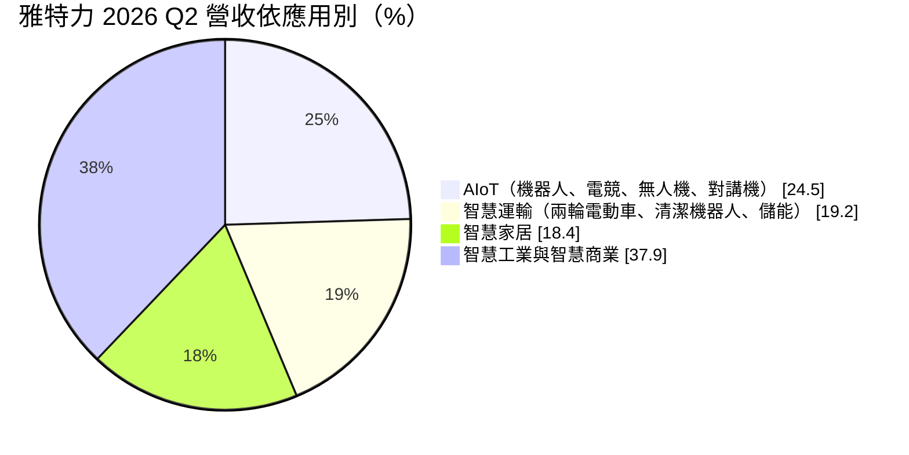
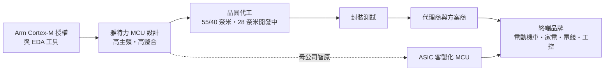
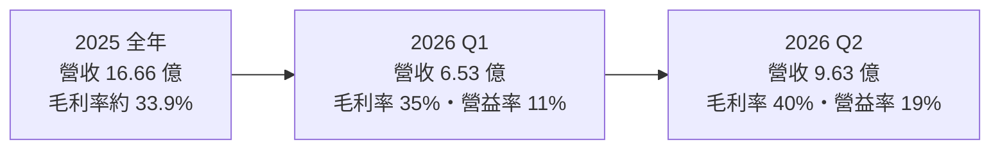
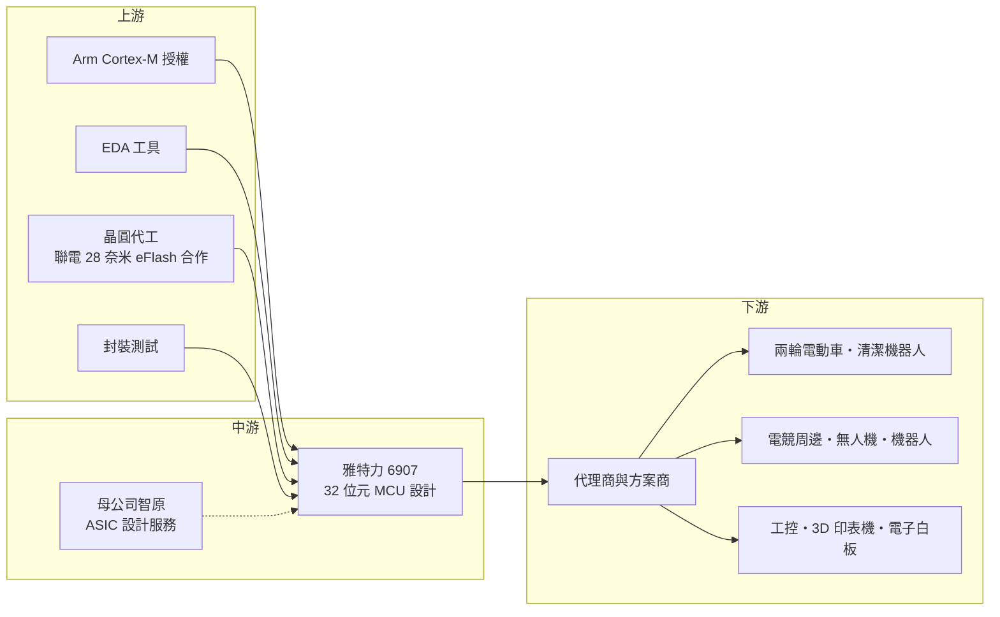

# 6907 雅特力-KY

> 上櫃｜[[產業索引-半導體業|半導體業]]｜上市（櫃）日期 2026/01/29

# 第一章：企業模式與商業藍圖

> [!info] 撰寫說明
> 本文由 Claude 依公開資料整理，架構比照 [[2330台積電]] 的四章研究，資料截至 2026-10-08。財務數字來源：櫃買中心開放資料（基本資料、2026 年第二季綜合損益與資產負債、本益比殖利率）、HiStock 嗨投資季度損益表、科技新報 2025 年 12 月報導、優分析 2026 年 1 月與 4 月報導、經濟日報 2026 年 7 月報導；產業描述為整理性內容，尚未逐條比對原始文件。#待校對

微控制器是電子產品的「小腦」，從電動機車、掃地機器人到電競滑鼠都需要它。本章針對雅特力科技（開曼）股份有限公司（股票代號：6907，以下簡稱雅特力）的商業模式進行定性分析，說明一家智原旗下的 MCU 設計公司，如何在意法半導體主導的市場中，用高效能與性價比打開空間。

## 一、核心定位：高效能 32 位元 MCU 的挑戰者

雅特力於 2016 年在開曼群島註冊成立，2026 年 1 月 29 日在櫃買中心上櫃，實收資本額約 6.26 億元。依科技新報 2025 年 12 月報導，[[3035智原]] 持股超過六成，雅特力是智原旗下的子公司；智原本身則是聯電集團的 [[ASIC]] 設計服務公司。

雅特力是 [[Fabless]] 的 [[MCU]] 設計公司，專攻高階 32 位元 MCU，核心採用 [[ARM安謀]] 授權的 [[Cortex-M]] 處理器架構。產品應用涵蓋工業與馬達控制、消費性電子、醫療、[[IoT]]、通訊與車用。依科技新報報導，其 Cortex-M4 產品主頻達 288MHz，公司稱為業界最高；目前量產製程為 55 奈米與 40 奈米，28 奈米開發中，[[邊緣 AI]] 推論平台將與 [[2303聯電]]、智原合作，採用嵌入式快閃記憶體（[[eNVM]]）的 28 奈米製程。

雅特力的定位可以用一句話概括：用與國際大廠相容的 Arm 架構，提供更高主頻、更高整合度、更有價格競爭力的 MCU。報導指出主要競爭對手是意法半導體（ST）等國際 [[IDM]] 大廠，而雅特力在中國市場具有在地化的技術支援優勢。MCU 客戶換晶片時要重寫韌體、重新驗證整個產品，因此「與既有生態系相容」與「在地技術支援」，是挑戰者能否搶下設計案的關鍵。

## 二、終端應用／產品板塊：五大應用分散布局

依經濟日報 2026 年 7 月報導，雅特力 2026 年第二季的應用別營收結構如下（依報導金額換算）：

* **AIoT：** 約占四分之一，是 2026 年成長最快的板塊，涵蓋機器人、電競鍵鼠、無人機與數位對講機。電競周邊對反應速度要求高，正好發揮高主頻 MCU 的優勢。
* **智慧運輸：** 以兩輪電動車為主要成長引擎，另包括清潔機器人與儲能系統。馬達控制是 MCU 的經典應用，需要高運算效能與即時控制能力。
* **智慧家居：** 掃地機器人、洗地機出貨穩步攀升，擦窗機器人、泳池清潔機器人是開拓中的利基市場（依優分析整理）。
* **智慧工業與智慧商業：** 包括工業控制、3D 印表機、電子白板與微型印表機。工業應用的特點是產品生命週期長、出貨穩定，一旦導入可以延續多年。

這種多應用分散的結構，讓雅特力不會過度依賴單一終端市場；但多數應用屬於消費性與中國市場，景氣與價格競爭的影響仍然明顯。

## 三、資本轉化邏輯（營運模式）：Arm 生態系加上客製化

* **輕資產、高研發：** 雅特力不擁有晶圓廠，主要支出是研發人員、[[EDA]] 工具與 Arm 權利金。依優分析整理，公司預估 2026 年營業費用年增 40% 至 50%，主因是員工獎金、研發投入、EDA 工具與研發設備，以及支付 Arm 的權利金提高。這說明 MCU 公司的成長，需要持續投入大量固定費用。
* **全系列產品線：** 公司策略是建構從 M0 到 M85 的全系列 MCU，讓客戶能在同一個生態系內從低階升級到高階，降低轉換成本，這也是意法半導體成功的模式。
* **ASIC 客製化 MCU：** 結合母公司智原的設計服務能力，為大客戶開發專用 MCU。客製化晶片綁定程度高，一旦量產，客戶幾乎不會更換。
* **毛利率改善靠產品組合：** 依 HiStock 季度損益表推算，毛利率由 2024 年約 29.6% 提升到 2025 年約 33.9%，2026 年第二季達 40%（依經濟日報）。高階產品與新應用比重提升，是毛利率改善的主因。

## 四、企業長期藍圖：邊緣 AI 與全系列生態系

* **邊緣 AI：** 與聯電、智原合作開發 28 奈米嵌入式快閃記憶體的智慧推論平台，讓 MCU 能在裝置端執行簡單的 AI 推論。邊緣 AI 若成為 MCU 的標準功能，將是產品升級與單價提升的重要機會。
* **從 M0 到 M85：** 補齊低階到高階的產品線，目標是形成高相容性的生態系，讓客戶在不同產品之間共用開發工具與程式碼。
* **集團綜效：** 智原的 ASIC 能力與聯電的特殊製程，讓雅特力在製程取得與客製化設計上，比一般獨立 MCU 新創更有資源。長期來看，這種集團結構是雅特力和其他小型 MCU 設計公司最大的差別。

# 第二章：護城河深度與競爭優勢

護城河指的是一家公司能長期擋住對手、維持超額利潤的結構性優勢。本章分析雅特力的護城河組成、全球 MCU 競爭格局，以及它的優勢能否擋住國際大廠與中國同業的夾擊。

## 一、護城河的核心組成要素

* **1. MCU 設計導入的轉換成本：** MCU 是產品的控制核心，客戶一旦選定，就會在上面寫大量韌體並完成整機驗證。除非有很大的成本或效能誘因，客戶很少在產品生命週期內更換 MCU。雅特力已打入國際一線品牌供應鏈（依科技新報），這些設計案在量產期間有相當的黏著度。
* **2. 相容 Arm 生態系的高效能產品：** 使用業界標準的 Cortex-M 架構，讓客戶可以沿用熟悉的開發工具；288MHz 的高主頻則提供效能差異化，在馬達控制、電競周邊等需要即時運算的應用有優勢。
* **3. 母公司與集團資源：** 智原的 ASIC 設計能力與聯電的製程支援，讓雅特力能提供客製化 MCU 並取得特殊製程產能，這是獨立小型設計公司較難具備的資源。
* **4. 中國市場的在地支援：** MCU 客戶需要大量現場技術支援，雅特力在中國市場的在地化團隊，能比國際大廠更快回應中小型客戶。

## 二、全球主要競爭對手格局

| 對手 | 定位 | 對雅特力的影響 |
|---|---|---|
| 意法半導體（ST） | 32 位元 Arm MCU 全球龍頭，生態系最完整 | 雅特力主要的對標對象，客戶基礎與品牌遠勝 |
| 恩智浦（NXP）、瑞薩（Renesas）、微芯（Microchip） | 國際 IDM 大廠，車用與工控 MCU 強 | 主導車用與高可靠度市場，雅特力難以短期切入 |
| 兆易創新（GigaDevice）等中國 MCU 廠 | 相容 ST 的 Arm MCU，價格低、政策支持 | 在中國市場直接競爭，價格壓力最大 |
| [[4919新唐]]、[[6202盛群]] | 台灣 MCU 設計公司 | 在消費性與工控 MCU 互有競爭 |

註：除意法半導體為科技新報報導點名外，其他對手依 MCU 產業常見廠商整理，屬整理性內容。

## 三、優勢轉化：守得住／守不住／觀察重點

* **守得住：** 已導入量產的高效能應用，例如兩輪電動車馬達控制、電競周邊、機器人。這些應用重視效能與即時性，客戶在產品生命週期內不易更換，雅特力可以維持較好的毛利率。
* **守不住：** 規格一般、以價格決勝的消費性 MCU。中國 MCU 廠在本地市場殺價，國際大廠在景氣下行時也會降價清庫存，雅特力在這類產品上沒有成本優勢。2024 年營業利益率只有約 4.8%（推算），顯示在規模不夠大時，研發費用會吃掉大部分毛利。
* **觀察重點：** 第一是毛利率能否穩定在 35% 以上；第二是 2026 年費用大增後，營收成長能否持續跟上；第三是 28 奈米邊緣 AI 平台的量產時程與客戶採用；第四是 2026 年上半年客戶因漲價風險提前拉貨後，下半年與 2027 年的需求是否回落。

# 第三章：財務體質與盈利規模

資料日期：2026-10-08。數字取自櫃買中心開放資料、HiStock 嗨投資季度損益表（年度數字由季度加總推算）與財經媒體報導，表格是撰寫當時的快照；最新月營收、毛利率、累計 EPS 由自動排程寫在本筆記的屬性欄位（月營收、毛利率、累計EPS 等）。#待校對

財務報表是檢驗護城河是否真實存在的最終標準。本章用三率、[[ROE]]、現金流與資本報酬，檢視雅特力從低獲利走向規模經濟的過程。雅特力 2026 年才上櫃，可取得的年度資料有限。

## 一、獲利能力的基石：三率

| 年度 | 營收（億元） | [[毛利率]] | [[營業利益率]] | EPS（元） | [[ROE]] |
|---|---|---|---|---|---|
| 2023 | 約 10（依 2024 年增逾六成推算） | 未查得 | 未查得 | 未查得 | 未查得 |
| 2024 | 16.35 | 約 29.6%（推算） | 約 4.8%（推算） | 1.67 | 約 9.3%（期末權益推算） |
| 2025 | 16.66 | 約 33.9%（推算） | 約 6.9%（推算） | 約 2.1（推算） | 約 10.8%（推算） |
| 2026 上半年 | 16.16 | 38.0% | 15.8% | 4.00 | 年化約 36%（推算） |

註：2024 年營收與 EPS 取自科技新報；2025 年營收與優分析報導的 16.7 億元相符；2024 至 2025 年毛利率與營業利益率由 HiStock 季度損益表加總推算（該網站部分季度資料有異常，僅供參考），2025 年前三季毛利率 33.84% 與科技新報一致；2025 年 EPS 以稅後淨利約 1.07 億元除以上櫃前股數推算；2026 上半年與櫃買中心開放資料一致。2026 年 ROE 以年化淨利除以 2025 年底與 2026 年第二季末權益平均推算，期間含上櫃現金增資。

* **[[毛利率]]持續改善：** 從 2024 年約 29.6%，提升到 2026 年第二季的 40%。產品組合往高階應用移動，加上價格機制調整，是毛利率提升的主因。
* **[[營業利益率]]展現營運槓桿：** MCU 公司的研發與管理費用相對固定，營收在 16 億元附近時，營業利益率只有 5% 至 7%；2026 年第二季單季營收衝到 9.63 億元，營業利益率就跳到 19%。這說明雅特力的獲利對營收規模非常敏感。
* **費用將明顯上升：** 公司預估 2026 年營業費用年增 40% 至 50%，包括員工獎金、研發與 Arm 權利金。若營收成長在下半年放緩，營業利益率可能回落。

## 二、[[ROE]]：資本效率

雅特力上櫃前的 ROE 約 9% 至 11%（2024 至 2025 年，推算），屬於一般水準。2026 年上半年因獲利大增，年化 ROE 約 36%（推算），但這包含客戶提前拉貨的效果，加上上櫃增資使股東權益由 2025 年底的 10.6 億元增加到 2026 年第二季末的 16.2 億元，未來 ROE 可能回落到較正常的水準。由於年度資料不足五年，近五年平均 ROE 未查得。

## 三、資本支出與[[自由現金流]]

* **[[CapEx]] 低：** 作為 Fabless 設計公司，主要投資是研發設備與 EDA 工具，金額不大（具體數字未查得）。依櫃買中心資料，2026 年第二季末非流動資產只有約 0.76 億元，流動資產約 24.5 億元，資產結構非常輕。
* **營運資金需求：** MCU 公司需要備貨，存貨與應收帳款會隨營收擴大而增加，這是現金的主要佔用來源（推估）。
* **股利：** 依櫃買中心資料，最近一次現金股利每股約 0.99 元。若以 2025 年 EPS 約 2.1 元（推算）計算，配息率約 47%（推算）。
* **營收年複合成長率：** 2023 至 2025 年營收約由 10 億元成長到 16.66 億元（2023 年為推算值），年增率主要集中在 2024 年；2026 年公司預估全年營收年增約 60%（依優分析）。

## 四、[[ROIC]] 與 [[WACC]]：價值創造利差

* **ROIC（推算）：** 2025 年營業利益約 1.15 億元，以 20% 稅率計算稅後營業利益約 0.92 億元；投入資本以 2025 年底權益 10.60 億元加上非流動負債 0.16 億元（作為有息負債的近似值）計算，約 10.76 億元。ROIC 約 8.5%。以 2026 年上半年營業利益 2.55 億元年化，投入資本以 2026 年第二季末權益 16.17 億元加非流動負債 1.05 億元計算，ROIC 約 25%（推算）。
* **WACC（推算）：** 無風險利率取台灣 10 年期公債約 1.75%，市場風險溢酬 6%，β 值取 IC 設計股常見的 1.2（假設值，雅特力上櫃時間短，尚無可靠的歷史 β），股東權益成本約 8.95%。雅特力幾乎沒有有息負債，WACC 約 9%。
* **價值創造判斷：** 2025 年 ROIC 約 8.5%，略低於 WACC，代表當時的規模還不足以創造超額報酬；2026 年上半年年化 ROIC 約 25%，明顯高於 WACC。關鍵在於這是否只是提前拉貨造成的短期高峰。若營收能穩定在 25 億元以上、毛利率維持 35% 以上，雅特力才能長期維持正的價值創造利差（推估）。

# 第四章：總體風險與地緣政治

任何企業都無法脫離宏觀環境獨立存在。本章分析雅特力在地緣政治、產業週期、營運執行與技術演進上面臨的長期風險。

## 一、地緣政治

* **中國市場的雙面刃：** 雅特力在中國市場具在地化優勢，但中國政府推動晶片國產化，本土品牌可能優先採用中國 MCU 廠的產品；若美中科技戰擴大，雅特力的中國業務也可能面臨更多不確定性。
* **開曼控股架構：** 作為 KY 股，雅特力的營運主體可能分布在不同國家，跨境的稅務、法規與資金調度，都比純本土公司複雜（具體營運據點未查得）。
* **晶圓產能集中在台灣：** 主要製程依賴台灣的晶圓代工，台海風險與供應鏈分散要求都會影響客戶的採購決策。

## 二、產業週期與市場結構

* **MCU 庫存週期：** MCU 是典型受庫存週期影響的產品，2023 至 2024 年全球 MCU 經歷大規模庫存調整，價格與出貨同步下滑。依優分析報導，2026 年上半年客戶為因應供應鏈漲價風險而提前拉貨，下半年態度轉趨謹慎，這種提前拉貨往往會在之後造成需求回落。
* **[[長鞭效應]]：** 終端家電、電動機車的需求變化，會經由方案商與代理商層層放大到 MCU 設計公司。
* **價格競爭：** 中國 MCU 廠大量投入相容 Arm 的產品，消費性 MCU 的價格長期承壓。

## 三、營運環境的隱性風險

* **成本上漲：** 依優分析報導，晶圓代工、封測與記憶體全面漲價，部分整合 Flash 的產品成本受影響較大，公司需要透過成本優化與價格轉嫁抵銷。
* **費用快速增加：** 員工獎金、研發投入與 Arm 權利金同時增加，若營收成長不如預期，獲利會明顯受壓。
* **對 Arm 授權的依賴：** 核心架構來自 Arm 授權，權利金調整與授權條件變化，都會影響成本結構。
* **母公司策略：** 智原持股超過六成，母公司的策略方向與資源分配，會直接影響雅特力的發展。

## 四、科技或法規演進

* **RISC-V 的挑戰與機會：** 開放架構的 [[RISC-V]] 正在 MCU 領域快速發展，可降低權利金成本，中國廠商尤其積極。若市場大幅轉向 RISC-V，以 Arm 為核心的雅特力需要調整產品策略。
* **邊緣 AI：** MCU 加入 AI 推論功能是明確的技術方向，雅特力的 28 奈米邊緣 AI 平台若能如期量產，將是重要的升級；若落後，可能錯過這一輪產品換代。
* **製程微縮：** MCU 從 40 奈米走向 28 奈米甚至更先進的製程，嵌入式快閃記憶體的取得與成本，是 MCU 設計公司的長期挑戰。

# 專有名詞解析

## 半導體

- **[[MCU]]**：微控制器，把處理器、記憶體與周邊介面整合在一顆晶片上，負責家電、馬達與各種裝置的控制。
- **[[Cortex-M]]**：Arm 專為微控制器設計的處理器系列，從低功耗的 M0 到高效能的 M85，是 32 位元 MCU 的主流架構。
- **[[Fabless]]**：只做晶片設計、把製造交給晶圓代工廠的商業模式，資產輕、研發占成本大宗。
- **[[IDM]]**：從設計、製造到封測都自己完成的整合元件製造商，例如意法半導體、恩智浦。
- **[[ASIC]]**：特定應用積體電路，為單一客戶或用途客製化設計的晶片。
- **[[eNVM]]**：嵌入式非揮發性記憶體，把斷電後仍能保存資料的記憶體做進同一顆晶片，常見於 MCU 與智慧卡。
- **[[EDA]]**：電子設計自動化軟體，晶片設計必備的工具，授權費用是 IC 設計公司的重要成本。
- **[[RISC-V]]**：開放原始碼的處理器指令集架構，不需支付授權權利金，正被大量用於 MCU 與 IoT 晶片。

## 應用

- **[[邊緣 AI]]**：在終端裝置上直接執行 AI 推論，而非把資料傳回雲端處理，可降低延遲與耗電。
- **[[IoT]]**：物聯網，把感測器與連網功能放進家電、電表、工業設備等各種裝置。

## 金融

- **[[毛利率]]**：營業毛利占營收的比例，反映產品定價能力與成本結構。
- **[[營業利益率]]**：營業利益占營收的比例，扣除研發與管銷費用後的本業獲利能力。
- **[[ROE]]**：股東權益報酬率，稅後淨利除以股東權益，衡量股東資金的使用效率。
- **[[ROIC]]**：投入資本報酬率，稅後營業利益除以股東權益加有息負債，衡量本業創造報酬的能力。
- **[[WACC]]**：加權平均資金成本，股東權益成本與負債成本依資本結構加權，ROIC 高於它才代表創造價值。
- **[[長鞭效應]]**：終端需求的小幅變動，沿供應鏈往上游傳遞時被逐級放大，造成上游庫存與訂單劇烈波動。

# 核心供應鏈

## 1. 上游：IP、工具與製造
- 處理器 IP：[[ARM安謀]]（Cortex-M 架構授權）
- EDA 工具：[[SNPS新思科技]]、[[CDNS益華電腦]]（產業常見供應商，雅特力實際採用未查得）
- 晶圓代工：[[2303聯電]]（28 奈米嵌入式快閃記憶體邊緣 AI 平台合作）

## 2. 中游：母公司與 MCU 同業
- 母公司：[[3035智原]]（持股超過六成）
- 台灣同業：[[4919新唐]]、[[6202盛群]]
- 國際與中國同業：意法半導體、恩智浦、瑞薩、微芯、兆易創新

## 3. 下游：終端應用
- 智慧運輸：兩輪電動車、儲能系統
- 智慧家居：掃地機器人、洗地機、擦窗與泳池清潔機器人
- AIoT：電競鍵鼠、無人機、機器人、數位對講機
- 智慧工業與商業：工業控制、3D 印表機、電子白板、微型印表機

## 最新新聞
<!-- news:start（自動產生，請勿手動編輯此範圍） -->
- 2026-10-07 📰 媒體 18:53｜營收速報 - 雅特力-KY(6907)9月營收3.47億元年增率高達175.3％｜[鉅亨網](https://news.cnyes.com/news/id/6623875)

完整紀錄：[[6907雅特力-KY 新聞]]
<!-- news:end -->

## 相關連結
- [公開資訊觀測站](https://mopsov.twse.com.tw/mops/web/t05st03?step=1&firstin=1&co_id=6907)
- [Goodinfo](https://goodinfo.tw/tw/StockDetail.asp?STOCK_ID=6907)
- [Yahoo 股市](https://tw.stock.yahoo.com/quote/6907)
- [鉅亨網新聞](https://www.cnyes.com/twstock/6907/news)
