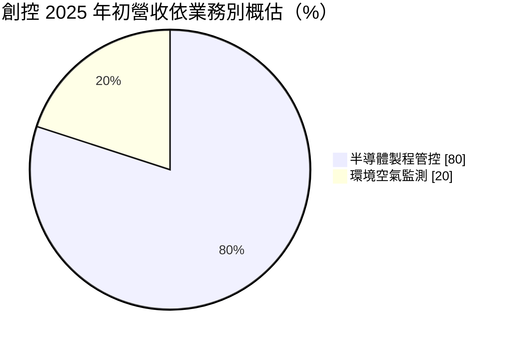
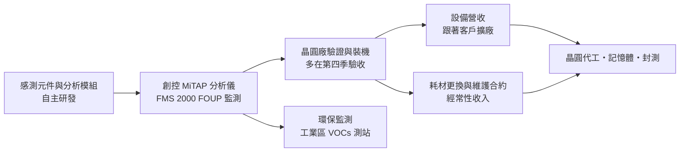
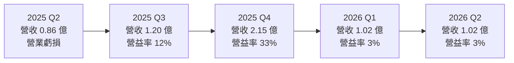
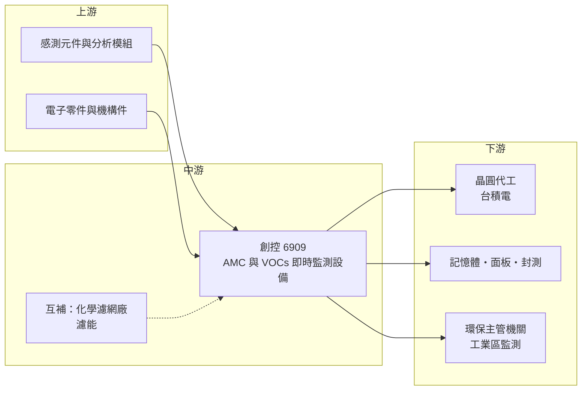

# 6909 創控

> 上市｜[[產業索引-半導體業|半導體業]]｜上市（櫃）日期 2025/05/21

# 第一章：企業模式與商業藍圖

> [!info] 撰寫說明
> 本文由 Claude 依公開資料整理，架構比照 [[2330台積電]] 的四章研究，資料截至 2026-10-08。財務數字來源：證交所開放資料（基本資料、2026 年第二季綜合損益與資產負債、股利）、HiStock 嗨投資歷年季度損益表與每股盈餘、科技新報 2025 年 4 月報導、工商時報 2026 年 1 月報導、nStock 2023 年報導、自由時報 2024 年報導標題；產業描述為整理性內容，尚未逐條比對原始文件。#待校對

在先進製程裡，只要幾個氣體分子落在錯誤的位置，就可能讓一片晶圓報廢。本章針對創控科技股份有限公司（股票代號：6909，以下簡稱創控）的商業模式進行定性分析，說明一家自有品牌的 AMC 監測設備公司，如何打進先進製程晶圓廠，並把「賣設備」延伸成「賣耗材與維護」的經常性收入。

## 一、核心定位：晶圓廠的化學污染「偵測器」

創控成立於 2010 年，總部位於新北市中和，2025 年 5 月在證交所上市，實收資本額約 6.75 億元，董事長兼總經理為王禮鵬。依 nStock 2023 年報導，創控以感測技術起家，團隊來自 [[INTC英特爾]]。

創控的業務是 [[AMC]]（氣體分子污染物）與揮發性有機物（[[VOCs]]）的即時監測設備，屬於自主研發的台灣自有品牌。傳統做法是「採樣後送實驗室分析」，從採樣到拿到結果往往需要數小時到數天；創控的設備則能在晶圓廠現場即時分析氣體狀況，讓廠務人員在污染發生時立刻找到源頭。報導中以一個數字說明這件事的重要性：約 5 至 17 個氣體分子就可以占滿 5 奈米的線寬，客戶推進到 3 奈米、2 奈米後，對監測密度的要求只會更高。

依 nStock 報導，創控主力產品已導入 [[2330台積電]]；報導也指出，過去台廠在這類設備多扮演第二供應來源（second source）的角色，創控則是直接進入供應鏈。這是創控最重要的定位：在一個由國際分析儀器廠主導的市場中，以本土自有品牌取得先進製程龍頭的採用。

## 二、終端應用／產品板塊：半導體八成、環境監測兩成

依科技新報 2025 年 4 月報導，創控的業務結構如下：

* **半導體製程管控（約八成）：** 主力是 [[MiTAP]] 系列氣體分析儀，可客製化監測低濃度 AMC，偵測極限與大型實驗室標準一致；以及 2025 年推出的 FMS 2000，針對 [[FOUP]]（前開式晶圓傳送盒）內部[[微環境]]做即時監測。監控範圍正從整個廠務環境，延伸到微環境與設備環境（依工商時報）。客戶涵蓋晶圓代工、光電面板、記憶體、封測，以及化學濾網等泛半導體廠商。
* **環境空氣監測（約兩成）：** 依 nStock 報導，創控與行政院環保署合作，在台灣工業區周邊設置監測設備，監控 VOCs 污染；應用場景還包括土壤地下水監測、手提式緊急應變、車載移動監測與戶外微型測站。這塊業務讓創控的技術不只依賴半導體景氣。

地區上，創控的銷售範圍涵蓋台灣、北美、中國、日本、新加坡與馬來西亞，台灣、北美與日本合計占營收超過七成（依科技新報）。北美與日本的比重，與台灣晶圓廠海外設廠和國際客戶導入有關。

## 三、資本轉化邏輯（營運模式）：設備帶動耗材與維護

* **設備銷售跟著擴廠走：** 每座新晶圓廠都需要建置 AMC 監測網，設備營收的高低取決於客戶的擴廠與驗收時程。創控的營收有明顯的季節性，第四季常是全年最旺季（2024 與 2025 年第四季營收都是全年最高），因為客戶多在年底完成驗收。
* **耗材與維護的經常性收入：** 設備裝機後，客戶需要定期更換耗材並簽訂維護合約，依 nStock 報導，這是創控刻意經營的穩定收入來源。設備裝機量愈大，後續的經常性收入就愈多，這是典型的「刮鬍刀與刀片」模式（具體比重未查得）。
* **高毛利的自有技術：** 依 HiStock 季度損益表推算，創控 2023 至 2025 年毛利率都在 59% 至 63% 之間，反映自有品牌與軟硬體整合的技術價值。但營業費用（研發、業務與驗證支援）也高，營業利益率只有約 15%。
* **移動式監測：** 公司把監測設備裝在無人搬運車（[[AGV]]）上，在廠內巡迴偵測，以更快找到污染源（依 nStock）。這種創新讓同一台設備可以覆蓋更大範圍。

## 四、企業長期藍圖：從廠務監測走向微環境與海外

* **微環境監測：** FMS 2000 把監測從無塵室空間推進到晶圓盒內部。晶圓在製程之間大部分時間都待在 FOUP 裡，微環境污染直接影響[[良率]]，這是比廠務環境更貼近製程的市場，也是創控 2025 年起的主要新產品動能。
* **國際客戶：** 工商時報報導新產品已導入國際客戶，並持續開拓新客戶。隨著台灣晶圓廠在美國、日本設廠，以及國際半導體廠重視 AMC 控制，海外市場是長期成長的方向。
* **環保監測：** 各國對工業區空氣品質的監管日益嚴格，環境監測業務可以分散半導體週期的風險。

# 第二章：護城河深度與競爭優勢

護城河指的是一家公司能長期擋住對手、維持超額利潤的結構性優勢。本章分析創控的護城河組成、可能的競爭對手，以及這些優勢在客戶驗收遞延時的實際效果。

## 一、護城河的核心組成要素

* **1. 先進製程龍頭的驗證：** 主力產品已導入台積電，並直接進入供應鏈。晶圓廠對量測設備的驗證非常嚴格，通過後通常會在新廠沿用同一套系統，這種「被龍頭採用」的資格是創控最重要的護城河。
* **2. 即時監測的技術差異：** 能在現場即時偵測極低濃度的 AMC，偵測極限與大型實驗室一致，是取代傳統採樣送檢的關鍵。這需要感測、分析軟體與平台整合的長期累積。
* **3. 裝機量帶來的經常性收入：** 每一台裝機的設備都會帶來後續的耗材與維護需求，裝機量愈大，經常性收入愈穩定，也讓客戶更換供應商的成本愈高。
* **4. 在地服務：** 監測設備需要持續校正、維修與資料分析支援，本土供應商能比國外儀器商更快反應。

## 二、全球主要競爭對手格局

| 對手 | 定位 | 對創控的影響 |
|---|---|---|
| 國際分析儀器大廠 | 提供氣相層析、質譜等實驗室與線上分析設備 | 品牌與產品線完整，是晶圓廠傳統的監測方案 |
| 專業 AMC 監測設備商（歐美與日本） | 專做半導體廠的即時 AMC 監測 | 在國際晶圓廠有既有客戶基礎 |
| 第三方分析實驗室 | 提供採樣送檢服務 | 創控即時監測要取代的傳統模式 |

註：創控未公開具體競爭對手與市占，上表依產業常見的供應商類型整理，屬整理性內容。

## 三、優勢轉化：守得住／守不住／觀察重點

* **守得住：** 已建置創控監測系統的晶圓廠，在擴建新廠與更換耗材時，延續使用的可能性高。這塊需求讓創控的毛利率長期維持在 60% 左右。
* **守不住：** 營收時點與營業利益率。設備營收集中在客戶驗收時，2025 年第二季因驗收時程遞延出現營業虧損，2026 年上半年營業利益率只有 3%。研發與業務費用相對固定，營收一延後，獲利就大幅波動。
* **觀察重點：** 第一是 FMS 2000 等微環境監測產品能否在更多客戶量產導入；第二是國際客戶與海外營收比重能否持續提升；第三是耗材與維護的經常性收入能否成長到足以支撐固定費用，讓獲利不再過度依賴第四季驗收。

# 第三章：財務體質與盈利規模

資料日期：2026-10-08。數字取自證交所開放資料與 HiStock 嗨投資歷年季度損益表（年度數字由四季加總推算），表格是撰寫當時的快照；最新月營收、毛利率、累計 EPS 由自動排程寫在本筆記的屬性欄位（月營收、毛利率、累計EPS 等）。#待校對

財務報表是檢驗護城河是否真實存在的最終標準。本章用三率、[[ROE]]、股利與資本報酬，檢視創控「高毛利、高費用」模式的獲利品質。

## 一、獲利能力的基石：三率

| 年度 | 營收（億元） | [[毛利率]] | [[營業利益率]] | EPS（元） | [[ROE]] |
|---|---|---|---|---|---|
| 2022 | 未查得 | 未查得 | 未查得 | 未查得 | 未查得 |
| 2023 | 4.07 | 62.5% | 14.0% | 1.55 | 未查得 |
| 2024 | 4.96 | 61.6% | 15.9% | 1.55 | 約 11%（期末權益推算） |
| 2025 | 5.51 | 59.6% | 15.2% | 1.01 | 6.8%（推算） |
| 2026 上半年 | 2.03 | 57.1% | 3.0% | 0.17 | 年化約 2%（推算） |

註：2023 年數字取自 HiStock 年度資料（該年僅有全年報表），營收與自由時報「去年營收破 4 億元」的報導相符；2024 年起由季度損益表加總；2025 年營收 5.51 億元與工商時報報導一致；2026 上半年與證交所開放資料一致。

* **[[毛利率]]高且穩定：** 2023 至 2025 年都在 59% 至 63%，代表自有技術的定價能力。2026 年上半年降到 57.1%，仍屬高水準。
* **[[營業利益率]]受季節性主導：** 季度圖清楚顯示，第四季驗收集中時營業利益率可達 33%，其他季度則在零附近。全年營業利益率約 14% 至 16%，代表費用吃掉了大部分的高毛利。
* **獲利成長落後營收：** 2023 至 2025 年營收成長約 35%，但 2025 年 EPS 反而從 1.55 元降到 1.01 元，部分原因是上市前後股本增加，部分是費用成長（推估）。

## 二、[[ROE]]：資本效率

創控的 ROE 在 2024 年約 11%（推算，期末權益），2025 年降到約 6.8%（推算），2026 年上半年年化只有約 2%。上市增資使股東權益由 2024 年底的 8.44 億元增加到 2025 年底的 10.73 億元，而獲利沒有同步成長，資本效率因此下降。依證交所資料，2026 年第二季末流動資產約 10.31 億元，占總資產近九成，大部分是現金與營運資金，代表募得的資金尚未投入高報酬的用途。

## 三、資本支出與[[自由現金流]]

* **[[CapEx]] 很低：** 2026 年第二季末非流動資產只有約 1.30 億元，負債總計約 1.39 億元（證交所資料），是典型的輕資產設備設計公司。
* **股利：** 依證交所股利資料，最近一次現金股利為每股 1.0 元；以 2025 年 EPS 1.01 元計算，配息率接近 100%（推算）。
* **自由現金流：** 低資本支出加上高毛利，推估多數年度自由現金流為正，但會受客戶驗收與收款時點影響（推估，具體數字未查得）。
* **營收年複合成長率：** 2023 至 2025 年營收由 4.07 億元成長到 5.51 億元，年複合成長率約 16%（推算）。

## 四、[[ROIC]] 與 [[WACC]]：價值創造利差

* **ROIC（推算）：** 2025 年營業利益約 0.84 億元，以 20% 稅率計算稅後營業利益約 0.67 億元；投入資本以 2025 年底權益 10.73 億元加上非流動負債 0.11 億元（作為有息負債的近似值）計算，約 10.85 億元。ROIC 約 6.2%。以 2026 年上半年年化計算，ROIC 只有約 1%（推算）。由於帳上現金占比很高，扣除現金後的營運資產報酬率會明顯更高。
* **WACC（推算）：** 無風險利率取台灣 10 年期公債約 1.75%，市場風險溢酬 6%，β 值取半導體設備小型股常見的 1.2（假設值，創控上市時間短，尚無可靠的歷史 β），股東權益成本約 8.95%。創控幾乎沒有有息負債，WACC 約 9%。
* **價值創造判斷：** 2025 年 ROIC 約 6% 低於 WACC 約 9%，代表以目前的資本規模，創控尚未創造足夠的超額報酬。要扭轉這個情況，需要營收規模擴大到能覆蓋固定費用，或讓耗材與維護收入成長，降低獲利對單季驗收的依賴。

# 第四章：總體風險與地緣政治

任何企業都無法脫離宏觀環境獨立存在。本章分析創控在地緣政治、產業週期、營運執行與技術法規上面臨的長期風險。

## 一、地緣政治

* **跟隨客戶出海：** 台灣晶圓廠在美國、日本設廠，對創控是擴大海外營收的機會；但海外服務需要在地團隊與備品，增加營運成本，也要面對當地監測設備商的競爭。
* **中國市場：** 創控的銷售地區包括中國，美中科技戰下，中國客戶可能偏好本土設備，美國出口管制也可能限制部分設備或零件的銷售。
* **台灣集中：** 主要客戶與研發都在台灣，兩岸風險無法完全分散。

## 二、產業週期與市場結構

* **晶圓廠資本支出週期：** 設備營收跟著客戶擴廠走，資本支出遞延時，驗收與營收就會延後。2025 年第二季與 2026 年上半年的低獲利，都與客戶時程有關。
* **客戶集中：** 先進製程龍頭是最重要的客戶，單一客戶的擴廠節奏就會影響全年營收。
* **市場規模有限：** AMC 監測是半導體廠務中的利基市場，總需求取決於晶圓廠數量與監測密度的提升。

## 三、營運環境的隱性風險

* **營收季節性與驗收遞延：** 營收集中在第四季，若年底驗收延到隔年，全年獲利會明顯下滑。
* **費用剛性：** 研發與業務支援費用相對固定，在營收波動時會放大獲利的起伏。
* **新產品導入速度：** FMS 2000 等新產品需要客戶長時間驗證，導入速度不如預期時，成長會延後。

## 四、科技或法規演進

* **製程微縮推升監測需求：** 從 3 奈米到 2 奈米及更先進節點，AMC 控制的要求愈來愈嚴格，監測點位與頻率都會增加，這是創控長期需求的根本支撐。
* **設備端整合：** 若半導體設備商或晶圓傳送系統廠把 AMC 監測直接整合進設備，獨立監測設備商的角色可能被壓縮。
* **環保法規趨嚴：** 各國對工業區 VOCs 排放的管制愈來愈嚴，有利於創控的環境監測業務，但也需要取得各地法規認證。

# 專有名詞解析

## 半導體

- **[[FOUP]]**：前開式晶圓傳送盒，晶圓在不同製程設備之間搬運與暫存時使用的密閉容器。
- **[[微環境]]**：晶圓傳送盒、設備內部等貼近晶圓的小空間，污染控制要求比整體無塵室更嚴格。
- **[[良率]]**：合格產品占總生產量的比例，微量污染就可能造成先進製程良率下降。

## 金融

- **[[毛利率]]**：營業毛利占營收的比例，反映產品定價能力與成本結構。
- **[[營業利益率]]**：營業利益占營收的比例，扣除研發與管銷費用後的本業獲利能力。
- **[[ROE]]**：股東權益報酬率，稅後淨利除以股東權益，衡量股東資金的使用效率。
- **[[ROIC]]**：投入資本報酬率，稅後營業利益除以股東權益加有息負債，衡量本業創造報酬的能力。
- **[[WACC]]**：加權平均資金成本，股東權益成本與負債成本依資本結構加權，ROIC 高於它才代表創造價值。
- **[[自由現金流]]**：營業活動現金流減去資本支出，代表企業可自由用於配息、還債或併購的現金。

## 產業

- **[[AMC]]**：氣體分子污染物，指無塵室中的酸、鹼、有機物等微量化學分子，會造成晶圓缺陷或腐蝕。
- **[[VOCs]]**：揮發性有機物，會在空氣中揮發的有機化合物，是工業區空氣污染與半導體廠污染監控的重點。
- **[[MiTAP]]**：創控的氣體分析儀系列，可在現場即時監測低濃度 AMC，取代傳統採樣送檢。
- **[[AGV]]**：無人搬運車，可依路線自動行駛，在工廠內搬運物料或搭載監測設備巡檢。

# 核心供應鏈

## 1. 上游：感測與零組件
- 感測元件、分析模組與電子零件供應商（具體廠商未查得）

## 2. 中游：AMC 控制相關同業
- 互補關係的化學濾網廠：[[6823濾能]]（創控監測污染，濾能負責去除污染；化學濾網廠也是創控的客戶類型之一）
- 國際分析儀器與 AMC 監測設備商（未具名）

## 3. 下游：半導體與環保客戶
- 晶圓代工：[[2330台積電]]（依 nStock 報導，主力產品已導入）
- 記憶體、光電面板、封測廠（未具名）
- 環保監測：行政院環保署（現為環境部）工業區周邊監測合作

延伸閱讀：[[台積電供應鏈]]

## 最新新聞
<!-- news:start（自動產生，請勿手動編輯此範圍） -->
- 2026-10-08 📰 媒體 17:24｜營收速報 - 創控(6909)9月營收9,467萬元年增率高達150.94％｜[鉅亨網](https://news.cnyes.com/news/id/6625039)

完整紀錄：[[6909創控 新聞]]
<!-- news:end -->

## 相關連結
- [公開資訊觀測站](https://mopsov.twse.com.tw/mops/web/t05st03?step=1&firstin=1&co_id=6909)
- [Goodinfo](https://goodinfo.tw/tw/StockDetail.asp?STOCK_ID=6909)
- [Yahoo 股市](https://tw.stock.yahoo.com/quote/6909)
- [鉅亨網新聞](https://www.cnyes.com/twstock/6909/news)
