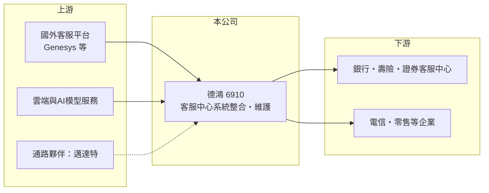

# 6910 德鴻

> 上櫃｜[[產業索引-數位雲端|數位雲端]]｜上市（櫃）日期 2025/12/11

# 第一章：企業模式與商業藍圖

> [!info] 撰寫說明
> 精簡版，由 Claude 依公開資料整理，架構比照 [[2330台積電]]，資料截至 2026-10-08。來源：櫃買中心開放資料（基本資料、2026 年上半年綜合損益與資產負債、每月營收）、MoneyDJ 理財網季度財務比率（2024 年第三季至 2026 年第二季）、INSIDE 與經濟日報等媒體報導標題。公司 2025 年 12 月才上櫃，年度財報與營收結構的公開資料有限，2024 年以前的年度數字多為未查得或推算。#待校對

德鴻科技成立於 1992 年，是專注在企業[[客服中心]]（Contact Center）系統的[[系統整合]]商，替金融業等大型企業建置電話、線上文字與 AI 語音等多管道客服平台，2025 年 12 月掛牌上櫃。

- **核心業務：** 德鴻的工作是把國外客服平台與自有軟體，整合成符合台灣企業需求的客服系統，並提供導入、客製開發與長期維護。依媒體報導，德鴻是 Genesys 雲端客服平台在台灣的主要合作夥伴之一，並與 [[6112邁達特]] 等通路商合作推廣 Genesys Cloud。客服系統一旦上線就牽涉企業的電話、CRM 與資安架構，因此導入後通常會延續多年的維護與擴充合約。
- **營收結構：** 公司沒有在本次查得的來源中公布產品別比重。從毛利率長期維持在 52% 至 63% 之間來看，營收中軟體授權、顧問與維護服務的比重應該不低（推估），硬體轉售占比有限。營收以國內為主，季節性明顯，第一季通常是全年低點，第四季與第二季較高，反映企業採購與驗收的時間點。
- **營運據點：** 總部位於台北市大同區，客戶以國內金融業為代表，包括銀行、壽險與證券的客服中心；媒體也以「金融業打造雲端客服的夥伴」形容德鴻。金融業對資安與法遵要求高，願意為穩定與在地服務付費，這是德鴻毛利率能維持在五成以上的背景。
- **長期方向：** 長期方向是從地端客服系統轉向[[雲端客服]]訂閱，以及把生成式 AI 用在語音機器人、通話摘要與品質監控。上櫃前後的報導提到 AI 相關產品訂單增加；若雲端與 AI 模組能轉為按月或按年計費，營收的可預測性會比一次性專案更高。

# 第二章：護城河深度與競爭優勢

德鴻的護城河來自金融業客戶的導入門檻與長期維護關係，屬於窄護城河，規模上仍是小型系統整合商。

- **競爭優勢：** 客服系統要串接電話交換、CRM、身分驗證與錄音保存，金融業還有主管機關的稽核要求，更換供應商的成本與風險都很高。德鴻深耕超過三十年，累積了金融業的導入經驗與案例，這種在地知識是外商原廠難以直接取代的。
- **主要對手：** 國內同類型的客服系統業者包括 [[6865偉康科技]]，以及大型系統整合商如 [[6214精誠]]；國際平台方面，NICE、Avaya、Five9 與各大雲端業者的客服服務都是潛在競爭者。原廠若直接對大型客戶銷售雲端方案，整合商的角色會被壓縮。
- **觀察重點：** 長期要看三件事：一是雲端與訂閱收入的比重能否提高，讓營收從專案型轉向經常性；二是 AI 語音與文字機器人能否成為自有產品，而不只是代理國外平台；三是客戶能否從金融業擴展到電信、零售與政府。

# 第三章：財務體質與盈利規模

資料日期：2026-10-08，表格是撰寫當時的快照；最新月營收、毛利率、累計 EPS 由自動排程寫在本筆記的屬性欄位（月營收、毛利率、累計EPS 等）。#待校對

德鴻的財務特徵是高毛利、低負債、規模小，獲利會隨季度驗收時點明顯波動。

| 年度 | 營收（億元） | [[毛利率]] | [[營業利益率]] | EPS（元） | [[ROE]] |
|---|---|---|---|---|---|
| 2021 | 未查得 | 未查得 | 未查得 | 未查得 | 未查得 |
| 2022 | 未查得 | 未查得 | 未查得 | 未查得 | 未查得 |
| 2023 | 未查得 | 未查得 | 未查得 | 未查得 | 未查得 |
| 2024 | 約 2.9（推算） | 未查得 | 未查得 | 未查得 | 未查得 |
| 2025 | 約 3.7（推算） | 約 55%（推算） | 約 17.6%（推算） | 2.01 | 約 16%（推算） |
| 2026 上半年 | 1.87 | 54.7% | 17.9% | 0.90 | 未查得 |

註：2025 年數字由 MoneyDJ 四季資料加總或加權推算（EPS 為四季 0.32、0.61、0.69、0.39 元相加，ROE 為四季單季 ROE 相加）；2024 年營收依 2025 年各季營收成長率回推。2026 年上半年取自櫃買中心開放資料。

- **長期指標：** 2025 年營收年增約 28%（推算），2026 年 1 至 8 月累計營收年增約 2%，成長速度明顯放緩。依本益比資料，最近一次現金股利為每股 1.75 元，以 2025 年 EPS 2.01 元計算配息率約 87%，屬於高配息政策；但上市櫃時間太短，股利穩定度還無法判斷。
- **[[ROIC]] 與 [[WACC]]：** 2025 年營業利益約 0.66 億元（營收約 3.7 億元 × 營業利益率約 17.6%），稅後營業利益約 0.53 億元；2026 年 6 月底股東權益 4.51 億元，負債 1.36 億元多為應付與合約負債，有息負債視為接近零，ROIC 約 12%（推算）。上櫃增資後帳上現金增加，若扣除超額現金，本業的資本報酬會更高。WACC 約 7.2%（推算：無風險利率 1.75%、市場風險溢酬 6%、β 取軟體與系統整合同業常見值 0.9，權益成本約 7.2%，幾乎無負債）。ROIC 高於 WACC 約 5 個百分點，代表本業有創造價值，但利差會隨專案驗收的年度波動。
- **財務特色：** 2026 年 6 月底負債比率約 23%，每股淨值 14.78 元；資產以現金與應收帳款為主，沒有大型廠房或設備，屬輕資產模式。

# 第四章：總體風險與地緣政治

德鴻的風險集中在客戶產業單一、原廠依賴與技術世代轉換。

- **產業週期：** 客服系統屬企業 IT 支出，金融業景氣好、法規要求升級時會加碼投資，景氣轉弱時容易延後。專案驗收時點不固定，季度營收與獲利起伏大，不宜用單季數字判斷長期趨勢。
- **營運風險：** 營收高度依賴金融業與少數國外平台。若主要原廠調整台灣通路政策、改為直接銷售，或客戶轉向原廠的標準雲端方案，德鴻的整合與維護價值會被壓縮。
- **其他風險：** 生成式 AI 正在改變客服產業，語音機器人可能減少客服座席數量，按座席計價的傳統模式將受影響；另外，小型公司對關鍵工程師的依賴高，人才流失會直接影響交付能力。

# 專有名詞解析

## 應用

- **[[客服中心]]**：企業集中處理客戶電話、訊息與線上諮詢的單位與系統，常整合 CRM、錄音與排班功能。
- **[[雲端客服]]**：把客服中心系統放在雲端、按座席或用量訂閱計費，企業不必自建機房與交換機。
- **[[系統整合]]**：把不同廠商的軟硬體依客戶需求組合、客製並導入上線，常附帶長期維護合約。

## 金融

- **[[ROIC]]**：投入資本報酬率，稅後營業利益除以股東權益加有息負債，衡量本業運用資本的效率。
- **[[WACC]]**：加權平均資金成本，股東與債權人要求報酬率的加權平均，是 ROIC 要超越的門檻。

# 核心供應鏈

- 上游：國外客服平台原廠（如 Genesys）、雲端與 AI 模型服務供應商，以及合作通路 [[6112邁達特]]。
- 下游／客戶：以國內金融業客服中心為主（個別客戶名單未查得），其次為其他需要多管道客服的企業。
- 同業：[[6865偉康科技]]、[[6214精誠]]，以及 NICE、Avaya、Five9 等國際客服平台。

## 最新新聞
<!-- news:start -->
<!-- news:end -->

## 相關連結
- [公開資訊觀測站](https://mopsov.twse.com.tw/mops/web/t05st03?step=1&firstin=1&co_id=6910)
- [Goodinfo](https://goodinfo.tw/tw/StockDetail.asp?STOCK_ID=6910)
- [Yahoo 股市](https://tw.stock.yahoo.com/quote/6910)
- [鉅亨網新聞](https://www.cnyes.com/twstock/6910/news)
