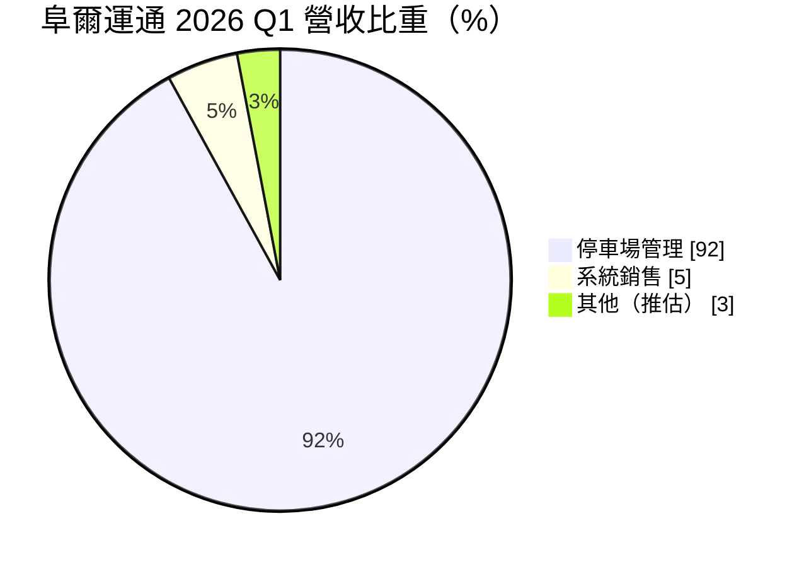
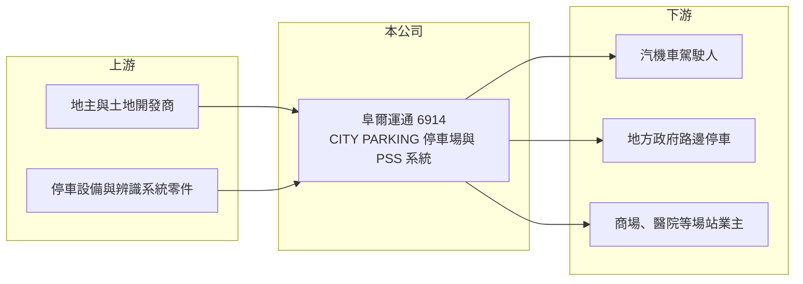

# 6914 阜爾運通

> 上市｜[[產業索引-其他業|其他業]]｜上市（櫃）日期 2024/05/03

# 第一章：企業模式與商業藍圖

> [!info] 撰寫說明
> 精簡版，由 Claude 依公開資料整理，架構比照 [[2330台積電]]，資料截至 2026-10-07。來源：富果研究 2026 年 5 月法說會整理、winvest.tw 營收快訊。#待校對

阜爾運通是以 CITY PARKING 品牌經營停車場的公司，另外銷售停車場管理系統。

- **核心業務：** 公司有兩大事業：停車場管理事業（CITY PARKING）經營自營與代管停車場；系統銷售事業（PSS）銷售停車場設備與[[智慧停車]]系統。
- **營收結構：** 2026 年第一季停車場管理事業占營收 92%，系統銷售約 5%，其餘約 3%（推估為其他收入）。

- **營運據點：** 2026 年 4 月停車場總數突破 1,400 場，管理車位超過 15.1 萬格，智慧路邊停車管理規模突破 2.4 萬格；海外已在日本設立分公司，並加速泰國擴張。
- **長期方向：** 2026 年目標營收挑戰 60 億元、停車場數 1,450 場以上，近五年營收年複合成長率 20.61%，持續以展店推動成長。

# 第二章：護城河深度與競爭優勢

阜爾運通的優勢在於停車場規模與系統自製能力。

- **競爭優勢：** 場站數量多，可攤提管理系統與人力成本，並結合自家 PSS 系統提高營運效率（推估）。
- **主要對手：** 台灣聯通停車、俥亨等停車場經營業者，以及地方政府路邊停車委外標案的競標者。
- **觀察重點：** 新場站開發速度、場站租金成本變化，以及日本與泰國海外布局的成效。

# 第三章：財務體質與盈利規模

資料日期：2026-10-07，以下數字是撰寫當時的快照；最新月營收、毛利率、累計 EPS 由自動排程寫在本筆記的屬性欄位（月營收、毛利率、累計EPS 等）。#待校對

阜爾運通營收穩定成長，屬於現金流穩定的通路型生意。

- **營收規模：** 2026 年第一季營收 14.36 億元、年增 9.24%；6 月營收 5.17 億元、年增 11.19%；8 月營收 5.33 億元、年增 7.03%。
- **獲利：** 2026 年第一季 EPS 2.34 元，[[毛利率]] 21.98%、[[營業利益率]] 15.55%、稅後淨利率 10.81%。
- **財務特色：** 停車費多為現金或電子支付即時收款，營業現金流穩定；租用場地屬長期租約，帳上有大量[[租賃負債]]（推估）。

# 第四章：總體風險與地緣政治

阜爾運通的風險來自租金成本與場站續約。

- **產業週期：** 停車需求跟隨經濟活動與人流，景氣變化影響相對溫和；電動車普及則帶來充電樁加值服務機會。
- **營運風險：** 場地多為承租，地主調漲租金或不續約會影響獲利；新場站初期使用率不足會拖累毛利。
- **其他風險：** 路邊停車標案受地方政府政策影響；日本與泰國擴張涉及匯率與當地法規風險。

# 專有名詞解析

## 應用

- **[[智慧停車]]**：以車牌辨識、感測器與行動支付管理停車場，減少人力並提高周轉率。

## 金融

- **[[租賃負債]]**：承租場地或設備依會計準則認列的未來租金現值負債。
- **[[營業利益率]]**：營業利益占營收的比例，反映本業扣除費用後的獲利能力。

## 產業

- **[[停車場代管]]**：業者替地主或機關經營停車場，收取管理費或與業主分潤。

# 核心供應鏈

- 上游：停車場地主、停車設備與車牌辨識系統零件供應商（推估）
- 下游／客戶：停車用戶、地方政府與委託代管的場站業主
- 同業：台灣聯通停車、俥亨等停車場經營業者

## 最新新聞
<!-- news:start -->
<!-- news:end -->

## 相關連結
- [公開資訊觀測站](https://mopsov.twse.com.tw/mops/web/t05st03?step=1&firstin=1&co_id=6914)
- [Goodinfo](https://goodinfo.tw/tw/StockDetail.asp?STOCK_ID=6914)
- [Yahoo 股市](https://tw.stock.yahoo.com/quote/6914)
- [鉅亨網新聞](https://www.cnyes.com/twstock/6914/news)
