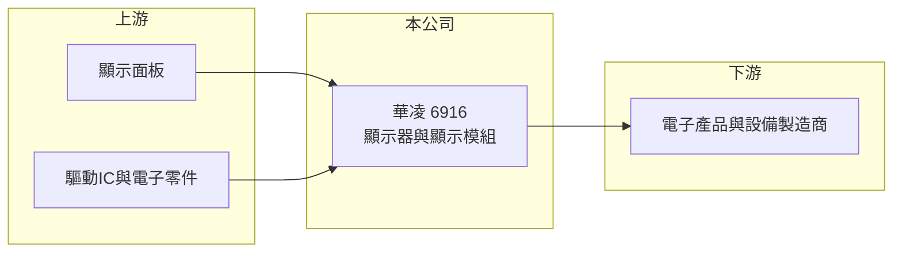

# 6916 華凌

> 上市｜[[產業索引-光電業|光電業]]｜上市（櫃）日期 2023/12/05

# 第一章：企業模式與商業藍圖

> [!info] 撰寫說明
> 精簡版，由 Claude 依公開資料整理，架構比照 [[2330台積電]]，資料截至 2026-10-07。來源：nstock.tw 華凌公司概況、winvest.tw 營收快訊。公開資料有限，產品別營收比重、主要客戶與營運據點未查到。#待校對

華凌是以顯示器與顯示模組製造、加工與買賣為主的小型光電公司，2023 年底掛牌。

- **核心業務：** 華凌成立於 1998 年，營業項目為各種顯示器及[[顯示模組]]的製造、加工與買賣，產品屬於[[LCM]]等中小尺寸顯示元件。
- **營收結構：** 本次未查到產品或應用別比重；2025 年全年營收 20.3 億元，規模在顯示模組廠中屬於中小型。
- **營運據點：** 生產與銷售據點本次未查到，本文不推測。
- **長期方向：** 2026 年下半年月營收年增明顯，公司能否把營收成長轉為獲利成長，是觀察重點。

# 第二章：護城河深度與競爭優勢

華凌規模不大，競爭優勢主要來自客製化與小量多樣的服務能力（推估）。

- **競爭優勢：** 顯示模組廠通常靠客製設計、快速打樣與長期供貨能力爭取工控、醫療等利基客戶，華凌應屬此類型（推估）。
- **主要對手：** 面板廠 [[3481群創]]、[[2409友達]]、[[6116彩晶]] 以及眾多中小型顯示模組廠。
- **觀察重點：** 營收成長能否延續、[[毛利率]]是否維持在兩成以上，以及營業利益率能否明顯提升。

# 第三章：財務體質與盈利規模

資料日期：2026-10-07，以下數字是撰寫當時的快照；最新月營收、毛利率、累計 EPS 由自動排程寫在本筆記的屬性欄位（月營收、毛利率、累計EPS 等）。#待校對

華凌 2026 年營收成長，但獲利率偏低。

- **營收規模：** 2026 年 7 月營收 2.54 億元、年增 47.22%；8 月營收 2.43 億元、年增 52.96%；1 至 8 月累計 16.38 億元。2025 年全年營收 20.3 億元。
- **獲利：** 2026 年第二季 EPS 0.12 元，[[毛利率]] 25.33%，[[營業利益率]] 2.77%，淨利率 1.26%，毛利率不差但費用吃掉大部分毛利。
- **財務特色：** 資本額約 6.75 億元，市值約 12.83 億元；2025 年度現金股利 0.28 元。營收放大後若費用控制得宜，[[營運槓桿]]有機會推升獲利（推估）。

# 第四章：總體風險與地緣政治

華凌的風險集中在獲利率偏低與顯示產業的價格競爭。

- **產業週期：** 顯示模組需求跟隨終端電子產品與工業設備景氣起伏，面板報價波動會直接影響成本與售價。
- **營運風險：** 營益率不到 3%，營收若回落或費用上升，容易轉為虧損；客戶集中度本次未查到。
- **其他風險：** 新台幣匯率、面板與驅動 IC 等關鍵零組件供應，以及中國模組廠的價格競爭。

# 專有名詞解析

## 應用

- **[[LCM]]**：液晶顯示模組，把面板、背光、驅動 IC 與外框組裝成可直接裝機的顯示單元。

## 金融

- **[[營運槓桿]]**：固定成本占比高時，營收小幅變動就會讓獲利大幅增減；營收萎縮時虧損也會被放大。

## 產業

- **[[顯示模組]]**：把顯示面板加上驅動電路、背光或觸控等元件組成，可直接裝入終端產品的顯示零件。

# 核心供應鏈

- 上游：顯示面板廠、驅動IC與電子零件供應商（推估）
- 下游／客戶：電子產品與設備製造商，客戶名稱未揭露
- 同業：[[3481群創]]、[[2409友達]]、[[6116彩晶]] 與其他顯示模組廠

## 最新新聞
<!-- news:start -->
<!-- news:end -->

## 相關連結
- [公開資訊觀測站](https://mopsov.twse.com.tw/mops/web/t05st03?step=1&firstin=1&co_id=6916)
- [Goodinfo](https://goodinfo.tw/tw/StockDetail.asp?STOCK_ID=6916)
- [Yahoo 股市](https://tw.stock.yahoo.com/quote/6916)
- [鉅亨網新聞](https://www.cnyes.com/twstock/6916/news)
