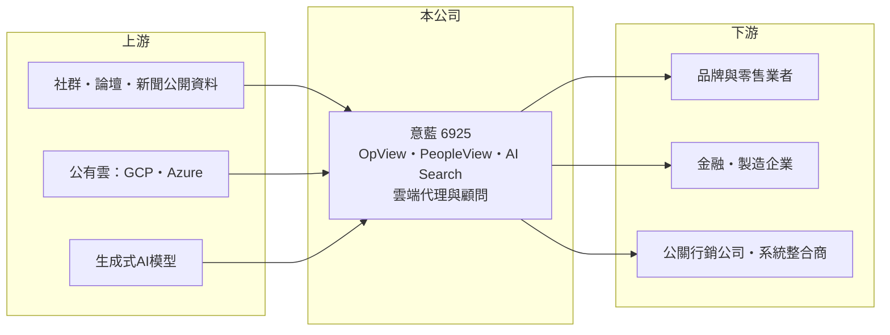

# 6925 意藍

> 上櫃｜[[產業索引-數位雲端|數位雲端]]｜上市（櫃）日期 2025/05/28

# 第一章：企業模式與商業藍圖

> [!info] 撰寫說明
> 精簡版，由 Claude 依公開資料整理，架構比照 [[2330台積電]]，資料截至 2026-10-08。來源：櫃買中心開放資料（基本資料、2026 年上半年綜合損益與資產負債、每月營收、本益比殖利率）、Goodinfo 年度經營績效（2020 至 2025 年）、富果研究法說會摘要（2025 年上半年）、Yahoo 股市與工商時報報導標題。產品別營收比重未公開，公開資料有限。#待校對

意藍資訊成立於 2007 年，是台灣少數以自有 AI 與大數據軟體為主業的上櫃公司，代表產品是社群輿情分析平台 OpView，近年再推出企業知識搜尋 AI Search，2025 年 5 月由興櫃轉上櫃。

- **核心業務：** 意藍的起點是中文文本探勘技術，把新聞、論壇、社群上的大量文字整理成品牌聲量、口碑與競品分析，產品就是 [[社群聆聽]]平台 OpView，依富果整理已有超過 500 家中大型企業客戶。另一條產品線 PeopleView 是[[DMP]]，協助企業整合第一方與第三方資料做客戶分群與行銷。
- **營收結構：** 公司把營運分成 AI 大數據軟體與雲端服務兩塊。前者是 OpView、PeopleView 與 AI Search 等自有產品，以 [[SaaS]] 訂閱為主、毛利率高；後者是 GCP、Azure 等[[公有雲]]的代理、顧問與技術支援，毛利率低但帶來穩定現金流與潛在 AI 客戶。公司未公布兩者比重，但 2025 年上半年毛利率下滑時，富果整理指出原因是低毛利雲端業務占比提高。
- **營運據點：** 總部在台北市中正區，客戶以國內品牌、零售、金融與公關行銷業者為主。海外方面，公司規劃先日本、再新加坡與香港，採取與當地系統整合商合作而非直接銷售的方式，依 2025 年的資料仍屬初期接洽階段。
- **長期方向：** 意藍正從「分析公開資料」延伸到「整理企業內部資料」。AI Search 以生成式 AI 把企業內部的文件與非結構化資料變成可以查詢的知識庫，依資料量與 API 呼叫次數按 SaaS 方式計價，2025 年已開始貢獻營收；2026 年參展時則以「Agent Ready 企業大腦」為訴求，鎖定[[代理式 AI]]的導入需求。

# 第二章：護城河深度與競爭優勢

意藍的護城河來自中文語料累積與長年的輿情資料庫，屬於窄護城河，規模小但技術與資料具有獨特性。

- **競爭優勢：** OpView 背後是多年累積的中文社群與新聞資料，以及針對繁體中文的斷詞與情緒判讀模型。客戶一旦把品牌監測流程、報表與歷史數據建立在平台上，換到其他工具就要重建比較基準，因此訂閱續約率通常較高（推估）。在生成式 AI 時代，這些標註過的中文資料也可以成為訓練與微調模型的素材。
- **主要對手：** 社群聆聽領域的對手包括國際平台如 Meltwater、Brandwatch，以及國內的中小型輿情分析公司；企業知識搜尋方面，[[MSFT微軟]]、[[GOOGL谷歌]] 等雲端大廠與各系統整合商都推出類似的生成式 AI 方案。大廠的平台優勢明顯，意藍必須靠中文在地化與垂直應用取勝。
- **觀察重點：** 長期觀察重點有三：一是 AI Search 能否複製 OpView 的訂閱模式並成為第二支柱；二是低毛利的雲端代理業務比重是否持續上升、稀釋整體毛利率；三是日本等海外市場能否透過合作夥伴帶來實際營收。

# 第三章：財務體質與盈利規模

資料日期：2026-10-08，表格是撰寫當時的快照；最新月營收、毛利率、累計 EPS 由自動排程寫在本筆記的屬性欄位（月營收、毛利率、累計EPS 等）。#待校對

意藍的財務特徵是毛利率八成上下的軟體公司結構，營收成長溫和、獲利穩定。

| 年度 | 營收（億元） | [[毛利率]] | [[營業利益率]] | EPS（元） | [[ROE]] |
|---|---|---|---|---|---|
| 2021 | 1.54 | 80.7% | 34.9% | 2.45 | 25.2% |
| 2022 | 1.69 | 83.2% | 37.4% | 2.95 | 24.8% |
| 2023 | 1.65 | 79.9% | 24.6% | 2.03 | 14.9% |
| 2024 | 1.83 | 81.3% | 28.9% | 2.74 | 18.9% |
| 2025 | 2.10 | 80.7% | 31.8% | 3.11 | 17.6% |
| 2026 上半年 | 0.98 | 76.2% | 23.0% | 1.08 | 未查得 |

註：2021 至 2025 年取自 Goodinfo，2026 年上半年取自櫃買中心開放資料（營業毛利 0.75 億元、營業利益 0.23 億元）。

- **長期指標：** 2020 至 2025 年營收從 1.37 億元成長到 2.10 億元，年複合成長率約 9%（推算）；2021 至 2025 年平均 ROE 約 20%（推算）。最近一次現金股利為每股 2 元，以 2025 年 EPS 3.11 元計算配息率約 64%。2026 年上半年毛利率降到約 76%，與雲端代理業務比重提高的方向一致。
- **[[ROIC]] 與 [[WACC]]：** 2025 年營業利益約 0.67 億元（營收 2.10 億元 × 31.8%），稅後營業利益約 0.53 億元；投入資本約 4.4 億元（2026 年 6 月底股東權益 3.89 億元，加上以非流動負債約 0.51 億元視為租賃等有息負債），ROIC 約 12%（推算）。帳上現金占資產比重高，若扣除超額現金，本業 ROIC 明顯更高。WACC 約 7.6%（推算：無風險利率 1.75%、市場風險溢酬 6%、β 取軟體同業常見值 1.0，權益成本 7.75%；負債成本 2.5%、稅率 20%、負債比重約 1 成）。ROIC 高於 WACC 約 4 個百分點以上，代表本業長期創造價值。
- **財務特色：** 2026 年 6 月底負債比率約 23%，每股淨值 19.45 元。軟體公司沒有大型資本支出，研發與人事是主要成本，營收每增加一塊，扣掉人力後大多能轉成利潤，這是營業利益率能維持在 25% 至 37% 的原因。

# 第四章：總體風險與地緣政治

意藍的風險主要來自生成式 AI 帶來的技術替代，以及小型軟體公司的規模限制。

- **產業週期：** 輿情分析與行銷數據屬於企業行銷預算，景氣轉弱時品牌主最先刪減的往往是行銷支出，OpView 的新客成長會受影響；不過訂閱制收入能緩衝短期波動。
- **營運風險：** 生成式 AI 讓文字分析的門檻大幅下降，大型雲端平台若推出內建的輿情摘要與企業搜尋功能，意藍的差異化會被壓縮。雲端代理業務則依賴原廠的通路政策與回饋，利潤空間由原廠決定。
- **其他風險：** 社群平台若限制資料存取或提高 API 費用，會直接影響 OpView 的資料來源與成本；個人資料保護法規趨嚴，也會影響 DMP 類產品的資料整合方式。

# 專有名詞解析

## 應用

- **[[社群聆聽]]**：持續蒐集社群、論壇與新聞上的公開討論，分析品牌聲量、情緒與議題走向的服務。
- **[[DMP]]**：資料管理平台，整合企業自有與外部的客戶資料，用於分群、受眾鎖定與行銷投放。
- **[[SaaS]]**：軟體即服務，客戶以訂閱方式透過網路使用軟體，不需自行安裝與維護。
- **[[公有雲]]**：由雲端業者建置、多家企業共用並按用量付費的運算與儲存服務，例如 AWS、Azure、GCP。
- **[[代理式 AI]]**：能依目標自行規劃步驟、呼叫工具並完成任務的 AI 系統，而不只是回答問題。

## 金融

- **[[ROIC]]**：投入資本報酬率，稅後營業利益除以股東權益加有息負債，衡量本業運用資本的效率。

# 核心供應鏈

- 上游：社群平台與新聞的公開資料來源，[[GOOGL谷歌]] GCP、[[MSFT微軟]] Azure 等公有雲，以及生成式 AI 模型供應商。
- 下游／客戶：超過 500 家使用 OpView 的中大型企業（名單未查得），以及推廣 AI Search 的系統整合商夥伴。
- 同業：Meltwater、Brandwatch 等國際社群聆聽平台；企業 AI 搜尋則與雲端大廠及系統整合商競爭。

## 最新新聞
<!-- news:start -->
<!-- news:end -->

## 相關連結
- [公開資訊觀測站](https://mopsov.twse.com.tw/mops/web/t05st03?step=1&firstin=1&co_id=6925)
- [Goodinfo](https://goodinfo.tw/tw/StockDetail.asp?STOCK_ID=6925)
- [Yahoo 股市](https://tw.stock.yahoo.com/quote/6925)
- [鉅亨網新聞](https://www.cnyes.com/twstock/6925/news)
