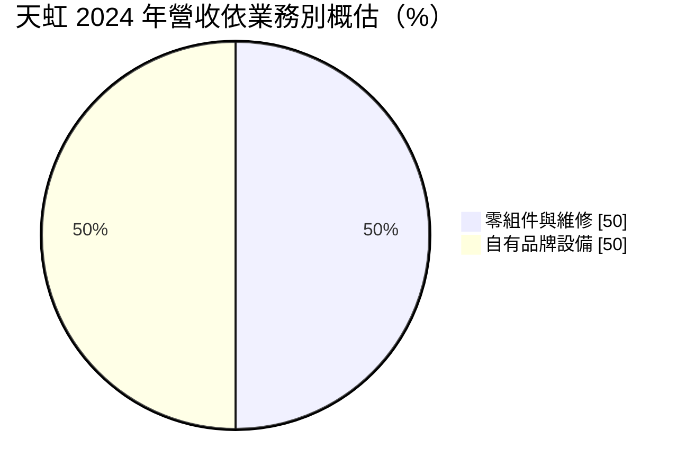
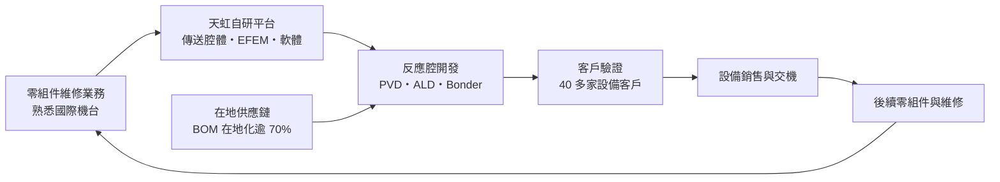
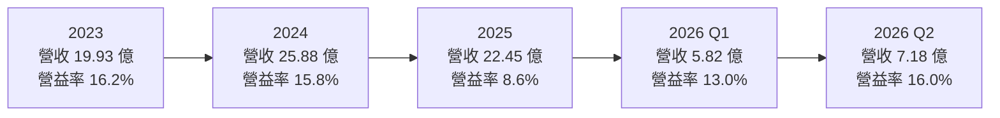
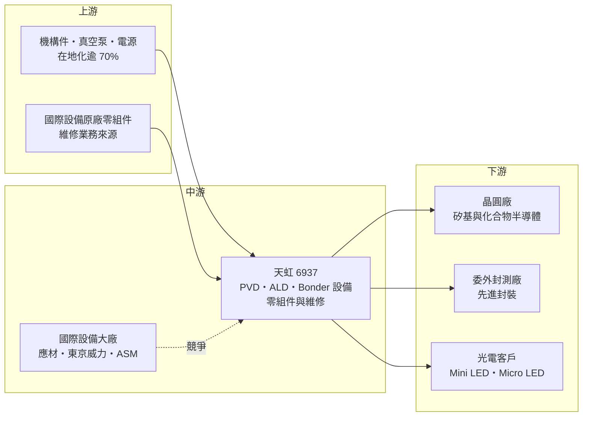

# 6937 天虹

> 上市｜[[產業索引-半導體業|半導體業]]｜上市（櫃）日期 2023/12/12

# 第一章：企業模式與商業藍圖

> [!info] 撰寫說明
> 本文由 Claude 依公開資料整理，架構比照 [[2330台積電]] 的四章研究，資料截至 2026-10-08。財務數字來源：證交所開放資料（基本資料、2026 年第二季綜合損益與資產負債、股利）、HiStock 嗨投資歷年季度損益表與每股盈餘、數位時代 2025 年 2 月報導、理財周刊 2025 年 7 月報導、工商時報 2026 年 2 月報導；產業描述為整理性內容，尚未逐條比對原始文件。#待校對

台灣是全球最大的晶圓代工基地，但前段製程設備長期由美、日、歐大廠供應。本章針對天虹科技股份有限公司（股票代號：6937，以下簡稱天虹）的商業模式進行定性分析，說明一家從零組件代理與維修起家的公司，如何走到自主研發薄膜沉積設備，並在先進封裝與化合物半導體市場取得訂單。

## 一、核心定位：從零組件維修走向自有品牌設備

天虹成立於 2002 年，2023 年 12 月在證交所上市，實收資本額約 6.77 億元，工廠位於新竹湖口工業區。依數位時代 2025 年 2 月報導，核心團隊包括創辦人羅偉瑞、董事長黃見駱與執行長易錦良，三人都出身 [[AMAT應用材料]]，易錦良在應材任職 21 年、曾任全球副總裁。

天虹的營運分為兩大塊：

* **半導體設備零組件與維修：** 這是公司起家的業務，從零組件代理、製造到維修。晶圓廠設備的關鍵零組件需要定期更換或翻新，這塊業務會隨客戶的[[產能利用率]]小幅增減，屬於相對穩定的經常性收入。
* **自有品牌設備：** 主要是 [[PVD]]（物理氣相沉積）與 [[ALD]]（原子層沉積）設備，技術再延伸到貼合機與分離機（[[Bonder]]／Debonder）及去殘膠（Descum）設備。依數位時代報導，天虹最早開發 PVD，2017 年轉進自研設備，約兩年後成為國內首家量產 ALD 設備的業者。

這種「先維修、後設備」的路徑，是天虹的核心特色。維修業務讓團隊長期接觸國際大廠的機台，了解客戶痛點與零組件供應鏈；這些知識再轉化為自研設備的設計能力。

## 二、終端應用／產品板塊：維修與設備各半，設備比重上升

依理財周刊 2025 年 7 月報導，天虹 2024 年兩大業務約各占五成，並預期 2025 年自製設備營收占比將超過零配件：

* **矽基半導體：** 前段晶圓廠的 ALD 與 PVD 設備，並支援 2 奈米以下製程的[[晶背供電]]技術（依數位時代）。這是門檻最高、國際大廠最強勢的市場，天虹的目標是在特定製程站點取得國產替代機會。
* **先進封裝：** PVD 與 Bonder 設備已有訂單（依理財周刊），2026 年首季新訂單主要來自委外封測（[[OSAT]]）與光電客戶（依工商時報）。[[先進封裝]]是天虹近年最重要的成長來源。
* **化合物半導體：** 碳化矽、氮化鎵等[[第三代半導體]]的製程設備。2025 年這類客戶遭遇逆風，部分延後交機或取消訂單；2026 年初開始出現需求回升跡象，應用包括電動車、自駕車與低軌衛星。
* **光電半導體：** 包括替蘋果 Mini LED 產品鍍膜（依數位時代）與 Micro LED，管理層把先進封裝與 Micro LED 視為主要成長來源。

依數位時代報導，天虹目前有 40 多家設備客戶，其中 20 多家處於驗證階段。客戶數量多但多數仍在驗證，代表未來成長潛力與不確定性並存。

## 三、資本轉化邏輯（營運模式）：平台化設計加上高在地化

* **平台化開發：** 依數位時代報導，因為 PVD 設備已具備傳送腔體、晶圓傳送設備（[[EFEM]]）與軟體等基礎，新產品主要只需針對反應腔開發。這讓天虹能以較低的研發成本，維持每年推出一個新產品的速度。
* **在地化成本控制：** 開案前先以物料清單評估，零組件在地化比率要有把握超過 70% 才開案，避免成本受制於進口零組件。這是天虹相對國際大廠的成本優勢來源，也讓供應鏈更貼近台灣客戶。
* **設備帶動後續服務：** 每台設備出貨後，都會帶來後續的零組件與維修需求，讓兩大業務形成循環。
* **設備業務的高波動：** 設備營收依交機與驗收時點認列，單季金額起伏很大。2024 年第四季單季營收達 10.19 億元，2025 年第一季則只有 4.61 億元，就是驗收集中的結果。

## 四、企業長期藍圖：國產設備的先進封裝路線

* **先進封裝為主軸：** AI 晶片帶動先進封裝產能快速擴張，PVD、Bonder 與 Debonder 都是先進封裝的關鍵設備。天虹選擇這個國際大廠相對沒那麼壟斷、客戶又在台灣的市場，是合理的切入點。
* **一年一個新產品：** 公司的策略核心是「快」，以平台化設計快速推出新設備，擴大可服務的製程站點。
* **國產替代：** 在供應鏈在地化與地緣政治的背景下，台灣晶圓廠與封測廠有分散設備來源的需求，這是天虹長期的結構性機會。

# 第二章：護城河深度與競爭優勢

護城河指的是一家公司能長期擋住對手、維持超額利潤的結構性優勢。本章分析天虹的護城河組成、全球設備競爭格局，以及它能否在國際大廠與中國同業之間站穩位置。

## 一、護城河的核心組成要素

* **1. 維修業務累積的機台知識：** 二十多年的零組件與維修經驗，讓天虹熟悉國際大廠機台的弱點與客戶的需求，也建立了與晶圓廠的長期關係。這是純新創設備商不具備的基礎。
* **2. 平台化與在地化的成本優勢：** 共用傳送平台與軟體，加上逾 70% 的零組件在地化，讓天虹能以較低成本開發與生產設備，在價格與交期上與國際大廠競爭。
* **3. 客戶驗證的累積：** 設備一旦通過客戶驗證並進入量產，後續的追加訂單與維修需求就會延續。40 多家設備客戶、其中 20 多家在驗證中，代表天虹正在累積這類資格。
* **4. 在地服務速度：** 設備的安裝、調機與維修需要工程師常駐，本土設備商的反應速度與溝通成本，都優於國際大廠。

## 二、全球主要競爭對手格局

| 對手 | 定位 | 對天虹的影響 |
|---|---|---|
| [[AMAT應用材料]] | 全球最大設備商，PVD 市場龍頭 | 在前段 PVD 幾乎壟斷，天虹難以正面競爭 |
| [[8035東京威力科創]]、ASM International | 沉積設備大廠，ASM 為 ALD 龍頭 | 在 ALD 與先進製程擁有深厚客戶基礎 |
| 北方華創等中國設備商 | 國家政策與資金支持，快速擴張 | 在中國市場與成熟製程設備形成價格壓力 |
| [[3131弘塑]]、[[3583辛耘]]、[[6187萬潤]] | 台灣先進封裝設備同業 | 在先進封裝濕製程、點膠與檢測等站點互有競爭 |

註：上表對手依產業常見設備商整理，數位時代報導僅描述歐美在前段占有率高、日韓有財團支持、中國有國家基金支持的市場結構，未點名具體對手。

## 三、優勢轉化：守得住／守不住／觀察重點

* **守得住：** 先進封裝、光電與化合物半導體這類國際大廠著墨較少、客戶又重視在地服務的市場，以及長期的零組件維修業務。這些領域讓天虹的毛利率維持在 40% 以上。
* **守不住：** 前段先進製程的主流設備市場。應材、東京威力與 ASM 在這些市場有絕對優勢，天虹在此只能爭取特定站點或第二供應來源。此外，化合物半導體客戶在 2025 年的逆風，顯示新興市場的需求不穩定。
* **觀察重點：** 第一是自有設備營收占比能否持續提升且毛利率不降；第二是 20 多家驗證中客戶能有多少轉為量產訂單；第三是先進封裝設備能否進入更大型封測廠的主要產線；第四是營業利益率能否重回 15% 以上。

# 第三章：財務體質與盈利規模

資料日期：2026-10-08。數字取自證交所開放資料與 HiStock 嗨投資歷年季度損益表（年度數字由四季加總推算），表格是撰寫當時的快照；最新月營收、毛利率、累計 EPS 由自動排程寫在本筆記的屬性欄位（月營收、毛利率、累計EPS 等）。#待校對

財務報表是檢驗護城河是否真實存在的最終標準。本章用三率、[[ROE]]、資本支出與資本報酬，檢視天虹在設備交機週期中的獲利品質。

## 一、獲利能力的基石：三率

| 年度 | 營收（億元） | [[毛利率]] | [[營業利益率]] | EPS（元） | [[ROE]] |
|---|---|---|---|---|---|
| 2022 | 18.15 | 46.6% | 15.9% | 5.66 | 約 17%（期末權益推算） |
| 2023 | 19.93 | 44.0% | 16.2% | 5.02 | 12.3%（推算） |
| 2024 | 25.88 | 44.0% | 15.8% | 6.03 | 12.4%（推算） |
| 2025 | 22.45 | 40.1% | 8.6% | 3.01 | 5.8%（推算） |
| 2026 上半年 | 13.01 | 41.7% | 14.7% | 2.54 | 年化約 9.4%（推算） |

註：2022 年取自 HiStock 年度資料（該年僅有全年報表），2023 年起由季度損益表加總；2024 年營收 25.88 億元與數位時代報導一致，2025 年營收與工商時報報導的 22.44 億元一致；2026 上半年與證交所開放資料一致。ROE 以稅後淨利除以期初與期末權益（含非控制權益）平均推算；2023 年上市增資使權益大增。

* **[[毛利率]]維持 40% 以上：** 2022 至 2026 年上半年毛利率在 40% 至 47% 之間，對設備商而言屬於健康水準，反映自研設備與維修業務的技術價值。
* **[[營業利益率]]受營收規模影響：** 研發與工程人員是固定成本，2025 年營收下滑約 13%，營業利益率就從 15.8% 腰斬到 8.6%。2026 年上半年隨營收回升，營業利益率回到 14.7%。
* **季度波動大：** 設備依驗收認列，2024 年第四季單季營收 10.19 億元，2025 年第一季只有 4.61 億元。看天虹的獲利要以年度為單位，不宜用單季推估全年。

## 二、[[ROE]]：資本效率

天虹 2022 年 ROE 約 17%（推算，期末權益），2023 年上市增資後股東權益由 18.5 億元增加到 31.3 億元，ROE 降到約 12%，2025 年再因獲利下滑降到約 5.8%（推算）。以 2022 至 2025 年計算，平均 ROE 約 12%（推算）。對一家仍在擴大自研設備、累積客戶驗證的公司而言，這個水準中規中矩；ROE 要回到 15% 以上，需要營收規模突破 2024 年的高點。

## 三、資本支出與[[自由現金流]]

* **[[CapEx]]：** 天虹的資本支出主要是湖口廠的無塵室、測試設備與研發機台（具體金額未查得）。依證交所資料，2026 年第二季末資產結構以流動資產為主，非流動負債約 2.31 億元。
* **預收款與營運資金：** 2026 年第二季末流動負債約 13.91 億元，較 2025 年底的 8.49 億元（HiStock 資料）大幅增加。設備商在接單時常收取預收款，流動負債上升可能反映訂單增加帶來的合約負債（推估，負債細項未查得）。
* **股利：** 依證交所股利資料，最近一次現金股利為每股 1.4 元；以 2025 年 EPS 3.01 元計算，配息率約 47%（推算）。保留約一半盈餘，用於研發與營運資金。
* **營收年複合成長率：** 2022 至 2025 年營收由 18.15 億元成長到 22.45 億元，年複合成長率約 7.3%（推算）。

## 四、[[ROIC]] 與 [[WACC]]：價值創造利差

* **ROIC（推算）：** 2025 年營業利益 1.94 億元，以 20% 稅率計算稅後營業利益約 1.55 億元；投入資本以 2025 年底權益 34.98 億元加上非流動負債 2.30 億元（作為有息負債的近似值，實際借款金額未查得）計算，約 37.28 億元。ROIC 約 4.2%。以 2026 年上半年營業利益 1.91 億元年化計算，ROIC 約 8%（推算）。2024 年營業利益約 4.09 億元時，ROIC 約 9% 左右（推算）。
* **WACC（推算）：** 無風險利率取台灣 10 年期公債約 1.75%，市場風險溢酬 6%，β 值取半導體設備股常見的 1.2（假設值），股東權益成本約 8.95%。負債成本假設 2.5%，稅後約 2.0%；以權益約 94%、負債約 6% 的資本結構計算，WACC 約 8.5%。
* **價值創造判斷：** 2025 年 ROIC 約 4% 明顯低於 WACC 約 8.5%，即使在 2024 年的高峰，ROIC 也只與 WACC 大致持平（推算）。這代表天虹上市募得的大量資本，尚未轉化為足夠的超額報酬。天虹要長期創造價值，需要自研設備放量到營收 30 億元以上，並讓營業利益率回到 15% 以上（推估）。

# 第四章：總體風險與地緣政治

任何企業都無法脫離宏觀環境獨立存在。本章分析天虹在地緣政治、設備週期、營運執行與技術演進上面臨的長期風險。

## 一、地緣政治

* **國產替代的政策順風：** 美中科技戰與供應鏈在地化，讓台灣晶圓廠與封測廠有分散設備來源的需求，政府也鼓勵設備國產化，這是天虹長期的結構性機會。
* **美國投資與關稅：** 依理財周刊報導，美國可能提高半導體建廠的投資稅收抵免，對建廠設備供應鏈有利；但美國若對進口設備課徵關稅，或要求在地生產，天虹要服務海外客戶的成本會上升。
* **中國設備商的崛起：** 中國以國家基金支持設備國產化，中國設備商規模快速擴大，未來可能在成熟製程與化合物半導體設備上與天虹在第三地市場競爭。

## 二、產業週期與市場結構

* **設備週期的放大效果：** 設備需求取決於客戶的資本支出，景氣下行時客戶最先削減的就是設備採購，設備商營收波動遠大於晶圓廠。2025 年營收年減約 13%，就與化合物半導體客戶延後交機有關。
* **新興市場的不確定性：** 化合物半導體、Micro LED 等新興應用的成長時程不穩定，天虹在這些領域的布局，可能因終端市場延後而無法如期貢獻。
* **[[長鞭效應]]：** 終端電動車或消費性需求的變化，經過晶圓廠與封測廠的資本支出調整後，會放大反映在設備訂單上。

## 三、營運環境的隱性風險

* **客戶驗證失敗或延後：** 20 多家驗證中的客戶若轉換率不如預期，研發投入就難以回收。
* **營收認列集中：** 設備依驗收認列，單季營收大起大落，獲利預測困難。
* **人才競爭：** 設備研發需要資深的製程與機構工程師，和國際設備大廠在台據點競爭人才。
* **核心經營團隊：** 公司的技術與客戶關係高度依賴出身應材的核心團隊，經營層傳承是長期需要觀察的治理議題。

## 四、科技或法規演進

* **先進封裝技術快速演進：** 從 CoWoS 到面板級封裝、混合鍵合，先進封裝的技術路線變化很快，設備商必須持續跟上，否則已開發的機台可能很快過時。
* **晶背供電與新材料：** 2 奈米以下製程導入晶背供電與新材料，帶來新的沉積製程需求，是天虹前段設備的潛在機會，但也需要更高的技術門檻。
* **智慧財產權：** 薄膜沉積是國際大廠專利密集的領域，自研設備商需要謹慎處理專利風險。

# 專有名詞解析

## 半導體

- **[[PVD]]**：物理氣相沉積，以濺鍍等物理方式把金屬薄膜鍍到晶圓上，是金屬導線與阻障層的主要製程。
- **[[ALD]]**：原子層沉積，一次只長一層原子厚度的薄膜，可在極細微的結構上形成均勻鍍膜，是先進製程關鍵技術。
- **[[Bonder]]**：貼合機，把晶圓與承載片或兩片晶圓精準貼合的設備，先進封裝與薄晶圓製程都需要。
- **[[EFEM]]**：設備前端模組，負責把晶圓從晶圓盒取出並送入製程腔體的自動化傳送系統。
- **[[先進封裝]]**：把多顆晶片以中介層、混合鍵合等方式高密度整合的封裝技術，例如 CoWoS、SoIC。
- **[[OSAT]]**：委外封裝測試廠，專門替晶片公司提供封裝與測試服務，例如日月光、矽品。
- **[[第三代半導體]]**：以碳化矽、氮化鎵等寬能隙材料製作的功率與射頻元件，耐高壓、高溫，用於電動車與快充。
- **[[晶背供電]]**：把電源線路移到晶圓背面，讓正面專門走訊號線，可提升 2 奈米以下製程的效能與密度。
- **[[產能利用率]]**：實際投片量占總產能的比例，影響晶圓廠對零組件更換與維修的需求。

## 金融

- **[[毛利率]]**：營業毛利占營收的比例，反映產品定價能力與成本結構。
- **[[營業利益率]]**：營業利益占營收的比例，扣除研發與管銷費用後的本業獲利能力。
- **[[ROE]]**：股東權益報酬率，稅後淨利除以股東權益，衡量股東資金的使用效率。
- **[[ROIC]]**：投入資本報酬率，稅後營業利益除以股東權益加有息負債，衡量本業創造報酬的能力。
- **[[WACC]]**：加權平均資金成本，股東權益成本與負債成本依資本結構加權，ROIC 高於它才代表創造價值。
- **[[長鞭效應]]**：終端需求的小幅變動，沿供應鏈往上游傳遞時被逐級放大，造成上游庫存與訂單劇烈波動。

# 核心供應鏈

## 1. 上游：零組件與供應鏈
- 台灣在地機構件、真空與電源零組件供應商（具體廠商未查得）
- 國際設備原廠零組件（維修與代理業務）

## 2. 中游：設備同業與競爭者
- 國際：[[AMAT應用材料]]、[[8035東京威力科創]]、[[LRCX科林研發]]、ASM International、北方華創
- 台灣先進封裝設備：[[3131弘塑]]、[[3583辛耘]]、[[6187萬潤]]

## 3. 下游：設備客戶
- 晶圓廠：矽基前段與化合物半導體客戶（未具名）
- 委外封測廠：先進封裝 PVD 與 Bonder 客戶（未具名）
- 光電：替蘋果 Mini LED 產品鍍膜的供應鏈客戶（依數位時代報導）

## 供應鏈關係
- 供應給 [[2330台積電]]：ALD 與 PVD 設備自研（台積電供應鏈 › 上游：在地設備零組件與代工）

## 最新新聞
<!-- news:start（自動產生，請勿手動編輯此範圍） -->
- 2026-10-05 📰 媒體 14:52｜營收：天虹(6937)9月營收3億9016萬元，月增率47.07%，年增率29.06%｜[富聯網](https://news.google.com/rss/articles/CBMiiAFBVV95cUxNSlZFV0V2cnlQQjZrU0E3aUt5N0RDMGZYSUVSZTRmRmJHYUFncnBCaTdVNTh5UG1vOXJMVDdFNHVjaDdHTEpJMVV3amI0TkIzVHVGRThhT2F1T2p0a0JhQko2MjRyQTZaYlFjaVJVUzlTTUdiMEI2UUEtaDd3S1VmWnpvam55WHV4?oc=5)
- 2026-10-05 📰 媒體 14:52｜《業績-半導體》天虹9月營收為3.90億元，年增29.06%｜[富聯網](https://news.google.com/rss/articles/CBMiiAFBVV95cUxPbV9GX2RIMjRRMl9MMTlQdXotM3VvVElFWTBsb0xzYXZUWUoyTTVweEwyVEE2ZURhUWlfN04zWWtGQlF4aFpEYnF5VTB2ZFdHb1JtNFQwaGR4R0pkRk5hTkRSNGJnQllUbV9FZGwtS1ZtR2VkemtiVzFQN2dTQ2tkemJ1Z1haLTZD?oc=5)

完整紀錄：[[6937天虹 新聞]]
<!-- news:end -->

## 相關連結
- [公開資訊觀測站](https://mopsov.twse.com.tw/mops/web/t05st03?step=1&firstin=1&co_id=6937)
- [Goodinfo](https://goodinfo.tw/tw/StockDetail.asp?STOCK_ID=6937)
- [Yahoo 股市](https://tw.stock.yahoo.com/quote/6937)
- [鉅亨網新聞](https://www.cnyes.com/twstock/6937/news)
