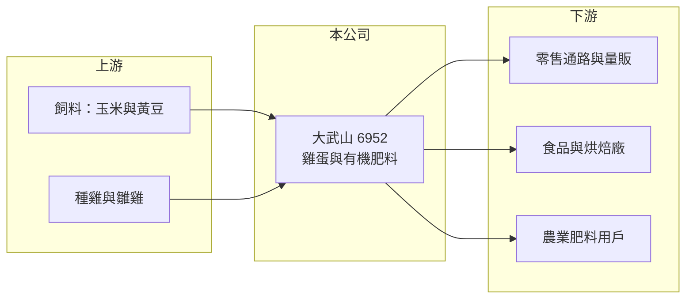

# 6952 大武山

> 上市｜[[產業索引-其他業|其他業]]｜上市（櫃）日期 2024/06/13

# 第一章：企業模式與商業藍圖

> [!info] 撰寫說明
> 精簡版，由 Claude 依公開資料整理，架構比照 [[2330台積電]]，資料截至 2026-10-07。來源：nstock.tw 大武山公司概況、winvest.tw 營收快訊。公開資料有限，產品與通路別比重、牧場據點本次未查到。#待校對

大武山是生產雞蛋並製造有機肥料的蛋品公司，2024 年 6 月上市。

- **核心業務：** 大武山從事各種家禽蛋類的生產與批發，並將雞糞等副產品製成有機肥料銷售，屬於[[循環農業]]型態（推估）。
- **營收結構：** 本次未查到雞蛋與有機肥料的比重；2025 年全年營收 19.44 億元，2026 年 1 至 8 月累計 15.62 億元，年增 29.09%。
- **營運據點：** 牧場與加工據點本次未查到，本文不推測。
- **長期方向：** 擴大蛋雞飼養規模與洗選蛋、液蛋等加工品，提高附加價值（推估）。

# 第二章：護城河深度與競爭優勢

大武山的優勢在於自有牧場規模，但蛋價受市場供需主導。

- **競爭優勢：** 規模化的[[蛋雞]]飼養與自動化設備，可降低單位成本並穩定供貨給通路與食品廠（推估）。
- **主要對手：** [[1215卜蜂]] 等具蛋品業務的畜產公司，以及眾多中小型蛋農。
- **觀察重點：** 蛋價與飼料價格的價差、禽流感疫情，以及營收成長能否轉為穩定獲利。

# 第三章：財務體質與盈利規模

資料日期：2026-10-07，以下數字是撰寫當時的快照；最新月營收、毛利率、累計 EPS 由自動排程寫在本筆記的屬性欄位（月營收、毛利率、累計EPS 等）。#待校對

大武山 2026 年營收成長，但本業獲利仍薄。

- **營收規模：** 2026 年 7 月營收 2.03 億元、年增 17.38%；8 月 2.19 億元、年增 17.1%；1 至 8 月累計 15.62 億元。2025 年全年營收 19.44 億元。
- **獲利：** 2026 年第二季 EPS 0.22 元，[[毛利率]] 15.97%、[[營業利益率]] 0.03%、淨利率 3.05%，本業幾乎損益兩平；2025 年全年 EPS 負 1.08 元。
- **財務特色：** 資本額約 6.83 億元；2025 年度配發現金股利 2 元，在全年虧損下仍配息，顯示動用保留盈餘或資本公積（推估）。

# 第四章：總體風險與地緣政治

大武山的風險集中在疫病與原料成本。

- **產業週期：** 雞蛋價格隨供需大幅波動，產能擴張過快時蛋價下跌，缺蛋時則價格飆升。
- **營運風險：** [[禽流感]]疫情可能導致撲殺與停產；本業利潤率很低，蛋價小幅下滑就可能轉為虧損。
- **其他風險：** 飼料玉米與黃豆多仰賴進口，國際穀物價格與匯率影響成本；政府蛋價與進口蛋政策也會影響市場價格。

# 專有名詞解析

## 金融

- **[[營業利益率]]**：營業利益占營收的比例，反映本業扣除費用後的獲利能力。

## 產業

- **[[蛋雞]]**：專門飼養來生產雞蛋的母雞，產蛋期約一年半至兩年。
- **[[禽流感]]**：禽類傳染病，爆發時須撲殺染疫禽隻，影響蛋雞產能與蛋價。
- **[[循環農業]]**：把畜牧副產品如雞糞再製成有機肥料，降低廢棄物並增加收入來源。

# 核心供應鏈

- 上游：飼料原料進口商與飼料廠、種雞與雛雞供應商（推估）
- 下游／客戶：零售通路、食品廠與肥料用戶，客戶名稱未揭露
- 同業：[[1215卜蜂]] 與中小型蛋農

## 最新新聞
<!-- news:start -->
<!-- news:end -->

## 相關連結
- [公開資訊觀測站](https://mopsov.twse.com.tw/mops/web/t05st03?step=1&firstin=1&co_id=6952)
- [Goodinfo](https://goodinfo.tw/tw/StockDetail.asp?STOCK_ID=6952)
- [Yahoo 股市](https://tw.stock.yahoo.com/quote/6952)
- [鉅亨網新聞](https://www.cnyes.com/twstock/6952/news)
