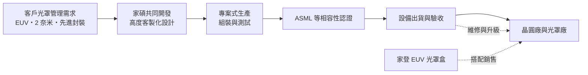
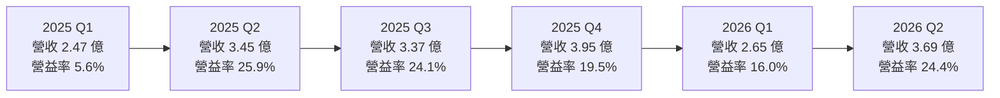
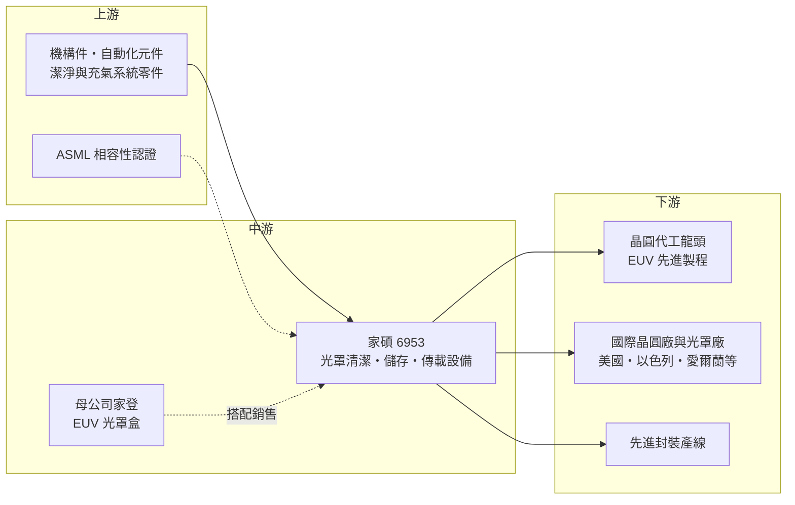

# 6953 家碩

> 上櫃｜[[產業索引-半導體業|半導體業]]｜上市（櫃）日期 2024/05/13

# 第一章：企業模式與商業藍圖

> [!info] 撰寫說明
> 本文由 Claude 依公開資料整理，架構比照 [[2330台積電]] 的四章研究，資料截至 2026-10-08。財務數字來源：櫃買中心開放資料（基本資料、2026 年第二季綜合損益與資產負債、本益比殖利率）、HiStock 嗨投資歷年季度損益表與每股盈餘、中央社 2024 年 4 月報導、工商時報 2026 年 3 月報導、聯合新聞網 2025 年 12 月報導、nStock 公司資料；產業描述為整理性內容，尚未逐條比對原始文件。#待校對

在 [[EUV]] 微影時代，一片[[光罩]]動輒數十萬美元，上面只要多一顆微粒，就可能讓整批晶圓出現缺陷。本章針對家碩科技股份有限公司（股票代號：6953，以下簡稱家碩）的商業模式進行定性分析，說明一家從家登分割出來的設備公司，如何在光罩的清潔、儲存與傳送這個利基環節，建立高毛利的設備事業。

## 一、核心定位：光罩傳載自動化的專業設備商

依中央社 2024 年 4 月報導，家碩是 [[3680家登]] 的子公司，2016 年 7 月由家登的精密機械部門分割成立。分割的原因是內部人員管理衝突與員工流失，希望以更有吸引力的獎酬打造精實團隊。公司原名「家登自動化」，2023 年更名為家碩科技，2023 年 6 月登錄興櫃、2024 年 5 月在櫃買中心上櫃，實收資本額約 3.00 億元。董事長邱銘乾同時是家登的董事長。

家碩的業務是半導體微影製程的光罩傳載自動化解決方案，包括光罩潔淨、交換、檢測，以及微環境儲存與智慧倉儲管理（依中央社）。簡單說，家登做的是保護光罩的「盒子」（[[光罩盒]]），家碩做的則是清潔光罩與光罩盒、在充氣環境下保存光罩、在不同設備之間自動交換與檢測的「機台」。

這個定位的意義在於「綁定」：家碩的產品常與家登的 EUV 光罩傳送盒搭配銷售，且需要通過 [[ASML艾司摩爾]] 的認證（依中央社）。客戶買了家登的光罩盒，就需要相容的清洗、儲存與傳送設備；集團的產品組合讓家碩比單獨的設備商更容易進入客戶的光罩管理流程。

## 二、終端應用／產品板塊：光罩清潔、儲存與自動化

家碩未公開各產品的營收比重（未查得），因此不繪製營收結構圓餅圖。依中央社、工商時報與聯合新聞網報導，產品可分為以下幾類：

* **光罩與光罩盒清洗設備：** 採用針式風刀設計搭配微潤式清洗，處理光罩與光罩盒的微污染。EUV 光罩沒有傳統的保護膜或保護膜較脆弱，對清潔的要求遠高於傳統光罩，這是家碩技術價值最高的產品之一。
* **光罩儲存與充氣設備：** 採用獨立儲位與[[充氣]]盤面，降低微污染與交叉污染風險。依聯合新聞網報導，公司預期 EUV 光罩充氣儲存的需求會隨新廠產能與長期儲存需求成長；新的自動化流量量測充氣方法正與客戶確認規格與驗證，預計 2026 年導入產線。
* **光罩交換與檢測：** 與關鍵客戶合作光罩自動化與自動光學檢測（[[AOI]]）應用，並規劃發展 EUV 光罩相關檢驗設備。
* **新產品：** 依工商時報報導，包括自動化光罩盒包裝與傳載設備（用於光罩廠出貨包裝管理）、與客戶共同研發的自動化吸盤清洗設備（整合 AI 辨識檢測），以及規劃中的 [[FOUP]] 充氣製程技術。

## 三、資本轉化邏輯（營運模式）：高度客製化的專案式設備

* **與客戶長期共同開發：** 依中央社報導，家碩與客戶長期共同開發技術，客戶不易更換供應商。每台設備都依客戶的光罩規格、廠房動線與自動化系統客製，這讓家碩的設備具有高度的不可替代性，也支撐了 44% 至 50% 的毛利率。
* **專案式生產：** 公司透過專案式生產管理提高產能效率（依工商時報）。設備依專案交機與驗收認列營收，因此單季營收會有起伏，2023 年第四季與 2025 年第一季都曾出現明顯的低點。
* **與家登的集團綜效：** 家登的光罩盒是消耗性產品，家碩的設備是資本財，兩者搭配可以涵蓋客戶光罩管理的完整流程。對客戶而言，同一集團提供相容的盒子與機台，可以減少整合風險。
* **擴廠：** 依中央社 2024 年報導，家碩將在台南科學園區興建第三期工廠，占地逾 5,000 坪，預計 2 至 2.5 年後量產；工商時報 2026 年報導也提到公司已提前規劃產能以支應出貨。

## 四、企業長期藍圖：EUV 普及與海外擴張

* **EUV 與先進製程的長期需求：** 依工商時報報導，客戶 2 奈米與[[先進封裝]]製程的擴展，帶動 EUV 光罩充氣與自動化設備需求。EUV 光罩層數隨製程微縮持續增加，加上 [[High-NA EUV]] 的導入，每座先進製程晶圓廠需要保存與管理的 EUV 光罩數量只會更多。
* **海外市場：** 2024 年銷售地區已包括台灣、美國、以色列、愛爾蘭與中國（依中央社）；2026 年持續拓展美國、日本、韓國與歐洲市場（依工商時報）。國際晶圓廠與光罩廠的擴產，是家碩分散客戶集中度的方向。
* **從光罩延伸到晶圓與設備維護：** FOUP 充氣、吸盤清洗等新產品，讓家碩的技術從光罩環節延伸到晶圓傳送與設備保養，擴大可服務的市場。

# 第二章：護城河深度與競爭優勢

護城河指的是一家公司能長期擋住對手、維持超額利潤的結構性優勢。本章分析家碩的護城河組成、可能的競爭對手，以及這些優勢在客戶集中下能守住多少。

## 一、護城河的核心組成要素

* **1. 與家登光罩盒的生態系綁定：** 家登是全球 EUV 光罩盒的主要供應商之一，家碩的設備與家登光罩盒搭配銷售，並需通過 ASML 認證。這種「盒子加機台」的組合，是其他設備商難以複製的集團優勢。
* **2. 高度客製化與共同開發：** 設備依客戶的製程與廠房客製，開發過程與客戶深度合作，客戶若要換供應商，必須重新開發與驗證，轉換成本很高。
* **3. 技術專利與潔淨能力：** 針式風刀、微潤式清洗、獨立儲位充氣等技術都有專利保護（依中央社），EUV 光罩的潔淨要求極高，經驗與專利累積形成門檻。
* **4. 先進製程客戶的驗證：** 依聯合新聞網報導，家碩已通過多家國際大廠認證，並在全球晶圓龍頭的供應鏈中。被先進製程龍頭採用，是爭取其他客戶的重要背書。

## 二、全球主要競爭對手格局

| 對手 | 定位 | 對家碩的影響 |
|---|---|---|
| 日本自動化倉儲與搬運設備大廠 | 半導體廠自動化物料搬運與儲存系統的主要供應商 | 在大型自動化倉儲系統上具規模優勢 |
| 光罩清洗與檢測設備商（歐美日） | 光罩清潔、檢測的專業設備商 | 在光罩廠端有既有客戶基礎 |
| 晶圓廠自行開發或其他本土設備商 | 依客戶需求客製的自動化設備 | 在一般自動化設備上形成價格競爭 |

註：家碩未公開具體競爭對手，上表依光罩管理與自動化設備的常見供應商類型整理，屬整理性內容。

## 三、優勢轉化：守得住／守不住／觀察重點

* **守得住：** EUV 光罩的清潔、充氣儲存與交換設備。這些設備技術門檻高、需要 ASML 相容認證，又與家登光罩盒形成生態系，競爭者很少，家碩的毛利率因此長期維持在 44% 以上。
* **守不住：** 一般性的自動化與倉儲設備。這類產品規格相對標準，大型自動化設備商有規模與價格優勢。此外，營收高度依賴少數先進製程客戶的擴廠節奏，家碩無法自行掌握。
* **觀察重點：** 第一是海外市場（美、日、韓、歐）營收占比能否持續提升；第二是新的充氣方法、吸盤清洗與 FOUP 充氣等新產品能否量產；第三是南科新廠投產後的產能利用率；第四是 High-NA EUV 導入後，是否帶來新一代設備的換機需求。

# 第三章：財務體質與盈利規模

資料日期：2026-10-08。數字取自櫃買中心開放資料與 HiStock 嗨投資歷年季度損益表（年度數字由四季加總推算），表格是撰寫當時的快照；最新月營收、毛利率、累計 EPS 由自動排程寫在本筆記的屬性欄位（月營收、毛利率、累計EPS 等）。#待校對

財務報表是檢驗護城河是否真實存在的最終標準。本章用三率、[[ROE]]、股利與資本報酬，檢視家碩利基設備事業的獲利品質。

## 一、獲利能力的基石：三率

| 年度 | 營收（億元） | [[毛利率]] | [[營業利益率]] | EPS（元） | [[ROE]] |
|---|---|---|---|---|---|
| 2022 | 10.48 | 43.0% | 23.1% | 9.84 | 未查得 |
| 2023 | 12.07 | 48.5% | 21.5% | 8.36 | 約 31%（期末權益推算） |
| 2024 | 13.02 | 44.1% | 21.0% | 8.25 | 20.8%（推算） |
| 2025 | 13.24 | 46.0% | 19.8% | 7.99 | 15.1%（推算） |
| 2026 上半年 | 6.35 | 50.0% | 20.9% | 4.92 | 年化約 18%（推算） |

註：2022 年取自 HiStock 年度資料（該年僅有全年報表），2023 年起由季度損益表加總；2025 年營收與 EPS 與 nStock 整理一致；2026 上半年與櫃買中心開放資料一致。2024 年上櫃前後增資使股東權益由 7.33 億元增加到 15.70 億元，2023 年 ROE 不具可比性。

* **[[毛利率]]長期在 43% 至 50%：** 對設備商而言屬於高水準，反映客製化設計與專利技術的價值。2026 年上半年毛利率達 50.0%，是近年高點。
* **[[營業利益率]]穩定在 20% 左右：** 2022 至 2025 年都在 19.8% 至 23.1% 之間，代表費用控制良好，營運模式成熟。季度之間會因交機與驗收時點波動，例如 2025 年第一季營業利益率只有 5.6%。
* **業外收益：** 2026 年上半年業外收入約 0.38 億元，使稅後淨利高於營業利益（櫃買中心資料）。評估本業應以營業利益為準。

## 二、[[ROE]]：資本效率

家碩上櫃前 ROE 約 31%（2023 年，推算，期末權益），上櫃增資使股東權益倍增後，ROE 降到 2024 年的約 21% 與 2025 年的約 15%（推算）。以 2023 至 2025 年計算，平均 ROE 約 22%（推算）。即使在增資後，家碩仍能維持 15% 以上的 ROE，2026 年上半年年化約 18%，顯示本業的資本報酬率相當高。由於年度資料不足五年，近五年平均 ROE 未查得。

## 三、資本支出與[[自由現金流]]

* **[[CapEx]]：** 南科第三期工廠是上櫃後的主要投資。依櫃買中心資料，2026 年第二季末非流動資產約 7.26 億元，非流動負債約 3.48 億元，較 2024 年底的 1.33 億元（HiStock 資料）增加，推估與新廠建置的長期資金有關（細項未查得）。
* **預收款與營運資金：** 2026 年第二季末流動負債約 11.91 億元，設備商常見的客戶預收款可能是主要組成（推估，負債細項未查得）。
* **股利：** 依 nStock 整理與櫃買中心資料，2024 與 2025 年度現金股利都是每股 6 元，配息率約 73% 至 75%（推算），符合公司上櫃時「配發率超過五成」的承諾（依中央社）。
* **營收年複合成長率：** 2022 至 2025 年營收由 10.48 億元成長到 13.24 億元，年複合成長率約 8.1%（推算）。
* **自由現金流：** 高毛利、高配息與預收款模式，推估多數年度自由現金流為正，但新廠建置期間可能短暫轉弱（推估，具體數字未查得）。

## 四、[[ROIC]] 與 [[WACC]]：價值創造利差

* **ROIC（推算）：** 2025 年營業利益 2.62 億元，以 20% 稅率計算稅後營業利益約 2.10 億元；投入資本以 2025 年底權益 16.12 億元加上非流動負債 2.71 億元（作為有息負債的近似值，實際借款金額未查得）計算，約 18.83 億元。ROIC 約 11.1%。以 2026 年上半年年化計算，ROIC 同樣約 11%（推算）。若扣除帳上現金與預收款只看營運資產，實際報酬率會更高。
* **WACC（推算）：** 無風險利率取台灣 10 年期公債約 1.75%，市場風險溢酬 6%，β 值取半導體設備股常見的 1.2（假設值），股東權益成本約 8.95%。負債成本假設 2.5%，稅後約 2.0%；以權益約 86%、負債約 14% 的資本結構計算，WACC 約 0.86 × 8.95% + 0.14 × 2.0% ≈ 8.0%。
* **價值創造判斷：** ROIC 約 11% 高於 WACC 約 8%，利差約 3 個百分點，代表家碩長期在創造股東價值。若南科新廠投產後營收能放大，而毛利率維持在 45% 以上，利差有機會進一步擴大；反之，新廠折舊若在營收成長前先到位，ROIC 會暫時下滑。

# 第四章：總體風險與地緣政治

任何企業都無法脫離宏觀環境獨立存在。本章分析家碩在地緣政治、產業週期、營運執行與技術演進上面臨的長期風險。

## 一、地緣政治

* **客戶海外設廠：** 先進製程晶圓廠在美國、日本、歐洲設廠，帶來海外設備需求，是家碩拓展國際市場的機會；但公司在 2024 年表示目前沒有赴美設廠計畫（依中央社），海外服務需要在地團隊與備品支援。
* **中國市場：** 2024 年銷售地區包括中國，公司也曾表示要積極拓展中國市場；但美國對中國先進製程設備的出口管制，可能限制 EUV 相關設備在中國的銷售空間。
* **台灣集中：** 生產基地與主要客戶都在台灣，兩岸風險無法完全分散。

## 二、產業週期與市場結構

* **先進製程擴廠週期：** 家碩的設備需求跟著先進製程晶圓廠的擴建走，客戶資本支出放緩時，設備訂單會先受影響。
* **客戶高度集中：** 營收高度依賴全球晶圓代工龍頭與少數國際大廠，單一客戶的擴廠節奏就會決定家碩的年度營收。
* **EUV 市場規模：** EUV 光罩管理是利基市場，總需求取決於 EUV 機台的數量與光罩層數，成長雖然穩定，但天花板相對明確。

## 三、營運環境的隱性風險

* **專案式營收的波動：** 設備依交機與驗收認列，單季營收與營業利益率波動大。
* **新廠執行：** 南科第三期工廠若完工時程延後，或投產後訂單不足，會影響產能規劃與折舊負擔。
* **集團依存：** 家碩與家登在產品與客戶上高度連動，家登的策略變化、或客戶對光罩盒供應商的調整，都可能影響家碩。
* **人才：** 客製化設備需要資深的機構、自動化與製程工程師，與其他半導體設備商競爭人才。

## 四、科技或法規演進

* **High-NA EUV：** 新一代高數值孔徑 EUV 機台帶來新的光罩規格與管理需求，可能創造換機需求，但也需要家碩投入研發以通過新的相容性認證。
* **光罩保護技術變化：** 若 EUV 光罩保護膜（pellicle）技術大幅成熟，光罩清潔需求的頻率與型態可能改變，影響清洗設備的需求。
* **智慧製造：** 光罩與晶圓管理愈來愈仰賴 AI 辨識與自動化，家碩已在吸盤清洗設備導入 AI 辨識檢測；能否持續把 AI 整合進產品，是維持技術領先的關鍵。

# 專有名詞解析

## 半導體

- **[[EUV]]**：極紫外光微影，以 13.5 奈米波長光源曝光，是 7 奈米以下先進製程的關鍵技術，由 ASML 獨家供應機台。
- **[[光罩]]**：刻有電路圖案的石英板，微影時讓光線把圖案投影到晶圓上，EUV 光罩單價極高。
- **[[光罩盒]]**：保護光罩在儲存與搬運時不受微粒與化學污染的專用容器，EUV 光罩盒需通過 ASML 認證。
- **[[充氣]]**：在光罩盒或晶圓盒內灌入氮氣等潔淨氣體，排除水氣與污染物，延長光罩與晶圓的保存品質。
- **[[FOUP]]**：前開式晶圓傳送盒，晶圓在不同製程設備之間搬運與暫存時使用的密閉容器。
- **[[AOI]]**：自動光學檢測，以影像與演算法自動找出缺陷，取代人工目檢。
- **[[High-NA EUV]]**：高數值孔徑 EUV 機台，可印出更細的線路，用於 2 奈米之後的先進製程。
- **[[先進封裝]]**：把多顆晶片以中介層、混合鍵合等方式高密度整合的封裝技術，例如 CoWoS、SoIC。

## 金融

- **[[毛利率]]**：營業毛利占營收的比例，反映產品定價能力與成本結構。
- **[[營業利益率]]**：營業利益占營收的比例，扣除研發與管銷費用後的本業獲利能力。
- **[[ROE]]**：股東權益報酬率，稅後淨利除以股東權益，衡量股東資金的使用效率。
- **[[ROIC]]**：投入資本報酬率，稅後營業利益除以股東權益加有息負債，衡量本業創造報酬的能力。
- **[[WACC]]**：加權平均資金成本，股東權益成本與負債成本依資本結構加權，ROIC 高於它才代表創造價值。
- **[[CapEx]]**：資本支出，用於購置廠房與設備的投資，會在未來數年以折舊方式轉為成本。
- **[[自由現金流]]**：營業活動現金流減去資本支出，代表企業可自由用於配息、還債或併購的現金。

# 核心供應鏈

## 1. 上游：零組件與認證
- 機構件、自動化元件與潔淨系統零件供應商（具體廠商未查得）
- 相容性認證：[[ASML艾司摩爾]]

## 2. 中游：集團與同業
- 母公司：[[3680家登]]（光罩盒與晶圓傳載載具）
- 同業：國際自動化倉儲與光罩清洗、檢測設備商（未具名）

## 3. 下游：設備客戶
- 全球晶圓代工龍頭的 EUV 先進製程（依聯合新聞網報導，未具名）
- 國際晶圓廠與光罩廠：2024 年銷售地區包括台灣、美國、以色列、愛爾蘭與中國（依中央社）
- 先進封裝製程客戶（依工商時報）

## 最新新聞
<!-- news:start -->
<!-- news:end -->

## 相關連結
- [公開資訊觀測站](https://mopsov.twse.com.tw/mops/web/t05st03?step=1&firstin=1&co_id=6953)
- [Goodinfo](https://goodinfo.tw/tw/StockDetail.asp?STOCK_ID=6953)
- [Yahoo 股市](https://tw.stock.yahoo.com/quote/6953)
- [鉅亨網新聞](https://www.cnyes.com/twstock/6953/news)
