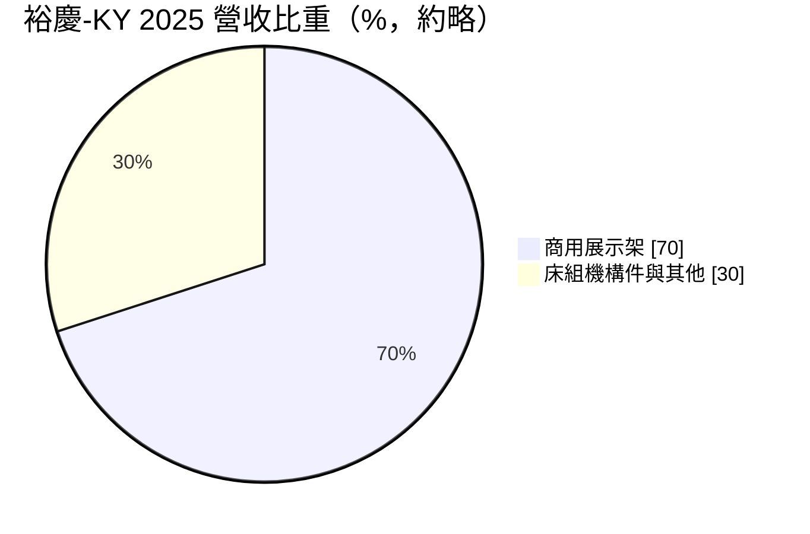
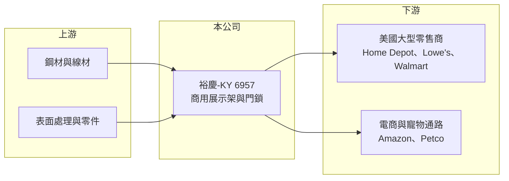

# 6957 裕慶-KY

> 上市｜[[產業索引-其他業|其他業]]｜上市（櫃）日期 2024/06/25

# 第一章：企業模式與商業藍圖

> [!info] 撰寫說明
> 精簡版，由 Claude 依公開資料整理，架構比照 [[2330台積電]]，資料截至 2026-10-07。來源：富果研究 2026 年 3 月法說會整理、優分析自結損益報導。2026 年上半年財報數字本次未查到。#待校對

裕慶-KY 是替美國大型零售商生產商用展示架的金屬製品廠，正擴展門鎖與板金加工新業務。

- **核心業務：** 以 [[ODM]] 與 OEM 方式生產商用展示架，另有床組機構件、家用門鎖（2026 年第二季開始貢獻）與板金加工（預計 2026 年第四季貢獻）。
- **營收結構：** 商用展示架占營收近七成；床組機構件 2025 年營收 1,271 萬美元，較 2021 年的 5,600 萬美元大幅萎縮。

- **營運據點：** 生產基地在中國與台灣，印尼廠投資約 280 萬美元，2026 年 4 月已接受客戶驗廠。
- **長期方向：** 公司預期 2026 年營收與 EPS 均有雙位數成長，家用門鎖目標市場規模約 150 億美元，並以印尼廠分散生產地。

# 第二章：護城河深度與競爭優勢

裕慶-KY 的優勢在於與美國大型零售商的長期合作。

- **競爭優勢：** 主要客戶包括 Home Depot、Lowe's、Walmart、Target、Petco 與 [[AMZN亞馬遜]]，打入大型零售商供應鏈需通過驗廠與長期品質紀錄。
- **主要對手：** 中國與東南亞的金屬展示架與商店陳列設備製造商。
- **觀察重點：** 印尼廠量產進度、門鎖新業務放量，以及美國關稅對中國生產產品的影響。

# 第三章：財務體質與盈利規模

資料日期：2026-10-07，以下數字是撰寫當時的快照；最新月營收、毛利率、累計 EPS 由自動排程寫在本筆記的屬性欄位（月營收、毛利率、累計EPS 等）。#待校對

裕慶-KY 毛利率約四成，配息率高。

- **營收規模：** 2025 年營收新台幣 38.2 億元，年減 4.1%。
- **獲利：** 2025 年[[毛利率]] 40.2%、[[營業利益率]] 17.2%，稅後淨利 5.55 億元，EPS 10.18 元；依優分析報導，自結 8 月稅後純益 1,568 萬元、EPS 0.28 元（年份依報導標題，推估為 2026 年）。
- **財務特色：** 2025 年度擬配現金股利每股 9 元，配息率 88.4%，屬於高配息公司。

# 第四章：總體風險與地緣政治

裕慶-KY 的風險集中在美國零售景氣與貿易政策。

- **產業週期：** 展示架需求跟隨美國零售商展店與改裝計畫，零售景氣轉弱時訂單減少。
- **營運風險：** 客戶集中在少數美國大型零售商；床組機構件業務已大幅萎縮，新業務尚在起步。
- **其他風險：** 美中關稅與[[供應鏈移轉]]壓力、鋼材價格波動，以及美元兌新台幣匯率；KY 公司盈餘匯回也受中國外匯規範影響。

# 專有名詞解析

## 金融

- **[[毛利率]]**：毛利占營收的比例，反映產品定價能力與成本控制。

## 產業

- **[[ODM]]**：原廠委託設計製造，由代工廠負責設計與生產，客戶貼牌銷售。
- **[[商用展示架]]**：零售賣場用來陳列商品的金屬或木製貨架與展示設備。
- **[[供應鏈移轉]]**：為避開關稅或分散風險，把生產基地從中國移往東南亞等地。

# 核心供應鏈

- 上游：鋼材、線材與表面處理加工廠（推估）
- 下游／客戶：Home Depot、Lowe's、Walmart、Target、Petco、[[AMZN亞馬遜]]
- 同業：中國與東南亞金屬展示架製造商

## 最新新聞
<!-- news:start -->
<!-- news:end -->

## 相關連結
- [公開資訊觀測站](https://mopsov.twse.com.tw/mops/web/t05st03?step=1&firstin=1&co_id=6957)
- [Goodinfo](https://goodinfo.tw/tw/StockDetail.asp?STOCK_ID=6957)
- [Yahoo 股市](https://tw.stock.yahoo.com/quote/6957)
- [鉅亨網新聞](https://www.cnyes.com/twstock/6957/news)
