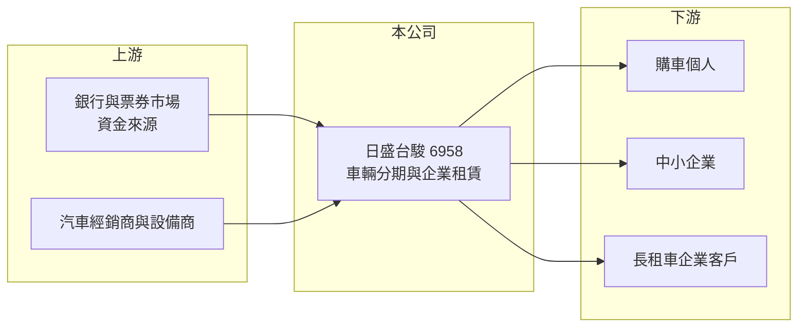

# 6958 日盛台駿

> 上市｜[[產業索引-其他業|其他業]]｜上市（櫃）日期 2024/08/20

# 第一章：企業模式與商業藍圖

> [!info] 撰寫說明
> 精簡版，由 Claude 依公開資料整理，架構比照 [[2330台積電]]，資料截至 2026-10-07。來源：nstock.tw 日盛台駿公司概況、winvest.tw 營收快訊。公開資料有限，業務別比重、股東結構與海外據點本次未查到。#待校對

日盛台駿是經營車輛分期與企業[[融資租賃]]的租賃公司，2024 年 8 月上市。

- **核心業務：** 公司提供車輛[[分期付款]]、企業融資租賃與企業長期租車服務。
- **營收結構：** 本次未查到各業務比重；2025 年全年營收 108.5 億元，2026 年 1 至 8 月累計 67.58 億元，年減 9.1%。
- **營運據點：** 營運據點與海外業務本次未查到，本文不推測。
- **長期方向：** 2025 年出現虧損後，2026 年上半年轉為小幅獲利，重點在調整資產品質與放款結構（推估）。

# 第二章：護城河深度與競爭優勢

日盛台駿在車貸與租賃市場規模中等，競爭壓力大。

- **競爭優勢：** 同時經營個人車貸與企業租賃，客群較分散；具體競爭優勢本次未查到（推估）。
- **主要對手：** [[5871中租-KY]]、[[9941裕融]]、[[6592和潤企業]] 以及銀行車貸與租賃部門。
- **觀察重點：** 呆帳費用是否回落、獲利能否持續回升，以及營收年減是否代表主動緊縮放款。

# 第三章：財務體質與盈利規模

資料日期：2026-10-07，以下數字是撰寫當時的快照；最新月營收、毛利率、累計 EPS 由自動排程寫在本筆記的屬性欄位（月營收、毛利率、累計EPS 等）。#待校對

日盛台駿 2026 年轉虧為盈，但獲利率仍低。

- **營收規模：** 2026 年 8 月營收 8.22 億元、年減 4.48%；1 至 8 月累計 67.58 億元。2025 年全年營收 108.5 億元。
- **獲利：** 2026 年第二季 EPS 0.26 元，上半年累計 0.46 元；第二季[[毛利率]] 27.99%、[[營業利益率]] 6.36%、淨利率 4.11%。2025 年全年 EPS 負 2.38 元。
- **財務特色：** 資本額約 46.15 億元，第二季單季 [[ROE]] 0.97%、ROA 0.14%；2025 年度配發現金股利 0.2 元與股票股利 0.8 元。

# 第四章：總體風險與地緣政治

日盛台駿的風險集中在信用品質與資金成本。

- **產業週期：** 車市與中小企業景氣轉弱時，新承作案件減少且違約率上升。
- **營運風險：** 2025 年虧損顯示資產品質曾承壓，若呆帳持續發生，獲利恢復將延後；高財務槓桿放大信用損失的影響。
- **其他風險：** 利率上升壓縮[[利差]]；金融監理規範變動與二手車殘值波動。

# 專有名詞解析

## 金融

- **[[分期付款]]**：購買者分期支付價款，業者賺取利息收入，是車貸公司的核心業務。
- **[[融資租賃]]**：出租人購入設備或車輛租給承租人，承租人分期支付租金，實質上是一種融資。
- **[[利差]]**：放款利率與資金成本之間的差距，是租賃與融資公司的主要獲利來源。
- **[[ROE]]**：股東權益報酬率，稅後淨利除以股東權益，衡量股東資金的獲利效率。

# 核心供應鏈

- 上游：銀行借款與票券等資金來源、汽車經銷商與設備供應商（推估）
- 下游／客戶：購車個人、中小企業與長租車企業客戶，客戶名稱未揭露
- 同業：[[5871中租-KY]]、[[9941裕融]]、[[6592和潤企業]]

## 最新新聞
<!-- news:start -->
<!-- news:end -->

## 相關連結
- [公開資訊觀測站](https://mopsov.twse.com.tw/mops/web/t05st03?step=1&firstin=1&co_id=6958)
- [Goodinfo](https://goodinfo.tw/tw/StockDetail.asp?STOCK_ID=6958)
- [Yahoo 股市](https://tw.stock.yahoo.com/quote/6958)
- [鉅亨網新聞](https://www.cnyes.com/twstock/6958/news)
