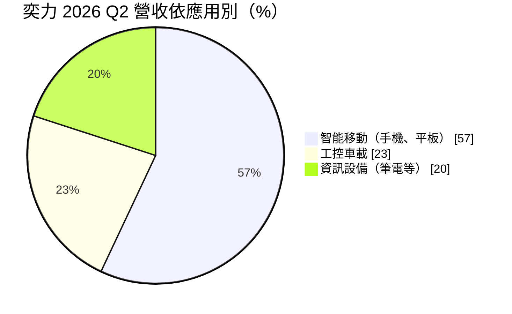
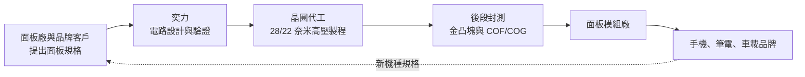
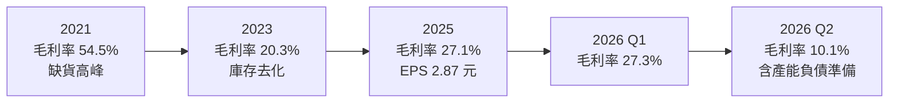
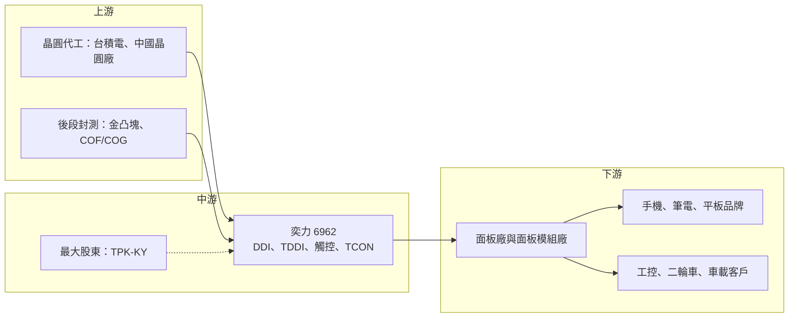

# 6962 奕力-KY

> 上市｜[[產業索引-半導體業|半導體業]]｜上市（櫃）日期 2024/11/26

# 第一章：企業模式與商業藍圖

> [!info] 撰寫說明
> 本文由 Claude 依公開資料整理，架構比照 [[2330台積電]] 的四章研究，資料截至 2026-10-08。財務數字來源：證交所與櫃買中心開放資料快照（基本資料、2026 年第二季資產負債與綜合損益、股利）、Goodinfo 年度經營績效、富果法說會備忘錄（2026 年 5 月、8 月）、聯合新聞網、科技新報、優分析、nStock、永豐金證券；產業描述為整理性內容，尚未逐條比對原始文件。#待校對

在評估一家 IC 設計公司的長期價值時，首要步驟是看懂它賣的是什麼、賣給誰，以及獲利從哪裡來。本章針對奕力-KY（股票代號：6962，以下簡稱奕力）的商業模式進行定性分析，說明它如何從一家被併購下市的手機驅動 IC 廠，重組成為橫跨手機、筆電、平板、工控與車載的顯示驅動與觸控晶片供應商。

## 一、核心定位：顯示驅動與觸控整合的 IC 設計公司

奕力是一家 [[Fabless]] IC 設計公司，本身不擁有晶圓廠，產品涵蓋顯示驅動 IC（[[DDI]]）、觸控 IC、觸控與顯示驅動整合晶片（[[TDDI]]），以及時序控制晶片（[[TCON]]）。面板上每一個像素何時亮、亮多少，都由驅動 IC 控制；觸控 IC 則負責偵測手指位置。把兩者整合成一顆 TDDI，可以讓手機面板更薄、成本更低，是中低階 LCD 手機的主流方案。

奕力的歷史可以分成三段。依科技新報整理，原本的奕力成立於 2004 年，在 2009 至 2012 年中國 3G 手機熱潮中快速成長，營收由 39 億元增加到 105 億元。2015 年它與 [[2454聯發科]] 旗下公司合併後下市，主因是市場轉向 TDDI，而當時的奕力缺乏觸控技術。合併後，聯發科把奕力與晨星、聯發科的觸控 IC 團隊整合，成為日後發展 TDDI 的基礎。2019 年在開曼群島設立的控股公司（即現在的上市主體），在 2020 年由聯發科將大部分股權出售給私募基金東博資本，2021 年更名為 ITH Corporation，2024 年 11 月在台灣證券交易所上市，2025 年更名為奕力-KY。

2026 年 1 月，[[3673TPK-KY]] 依 2025 年 11 月董事會決議，以約新台幣 58.07 億元取得東博資本與仲方資本旗下境外公司股權，間接持有奕力約 23.83%，成為最大股東並取得三席董事。這筆交易改變了奕力的股東結構：過去由財務投資人主導，現在則由一家想藉奕力轉型進入半導體的觸控面板集團主導。董事長梁公偉（晨星創辦人）與總經理陳泰元的經營團隊依優分析報導維持不變。

## 二、終端應用板塊：手機為主、工控車載為次

依富果整理的 2026 年 8 月法說會備忘錄，2026 年第二季營收依應用別的比重如下：

* **智能移動：** 這是奕力最大的板塊，包含手機 LCD 的 TDDI 與 [[OLED]] 驅動 IC。中國手機品牌是主要終端客戶，2018 年起經聯發科牽線，奕力開始直接與中國手機原廠合作，不再只透過面板模組廠間接出貨。這個板塊量大但價格競爭激烈，獲利高低取決於新機種的導入數量與晶圓成本。
* **工控車載：** 包含觸控 IC、工控用 DDI/TDDI 與車用顯示方案，應用於電動二輪車、三輪車、POS 收銀機與車載螢幕。這類產品生命週期長、客戶分散，價格較穩定，是奕力用來平衡手機景氣波動的板塊。公司自 2023 年推出車用產品，並在 2026 年中開始量產車用搭售方案。
* **資訊設備：** 筆電與平板的 OLED 驅動 IC、TDDI 與 TCON。奕力在收購 TCON 業務後，可以把 DDI 與 TCON 搭配銷售，對面板廠來說等於一次解決兩顆晶片的整合問題。

## 三、資本轉化邏輯：輕資產設計、重晶圓產能

驅動 IC 的商業模式看似輕資產，實際上高度依賴晶圓產能。奕力把資金主要花在研發人力與光罩，真正的製造交給晶圓代工廠，因此固定資產不多；但驅動 IC 用的高壓製程產能有限，誰能拿到產能、拿到多少、價格多少，直接決定營收與毛利率。科技新報提到，疫情期間奕力透過經營層人脈取得 [[2330台積電]] 產能，早期也投片中國的晶合集成，以取得成本較低的產能，而「產能拿得愈多，獲利愈多」正是它業績回升的關鍵之一。

依富果整理，奕力目前在 28 奈米及更先進製程已與晶圓廠簽訂長期合約（[[LTA]]），高技術產品以台灣晶圓廠為主，成本導向產品則與中國晶圓廠合作。這種雙軌布局可以兼顧技術與成本，但長約也帶來義務：2026 年第二季，奕力因 28 奈米轉 22 奈米的交替期，依合約估列供應商產能負債準備，使單季毛利率降到 10.1%，這是長約模式的代價。

## 四、企業長期藍圖

奕力的長期方向可以歸納為三條主線：

* **製程升級到 22 奈米：** OLED 驅動 IC 需要更小的線寬來容納更多電路並降低功耗。奕力的 22 奈米 OLED DDI 在 2026 年下半年量產，代表它開始進入過去由韓系與 [[3034聯詠]] 主導的高階 OLED 市場。
* **從單顆晶片走向搭售方案：** DDI 加 TCON、車用 DDI 加觸控的組合，讓奕力能以整體方案爭取面板廠設計，提高客戶轉換成本。
* **借助新大股東擴大版圖：** 宸鴻入主後，雙方在觸控與面板模組上有天然的上下游關係。公司在法說會表示會持續評估併購機會，長期是否透過併購補齊產品線，是觀察經營層資本配置習慣的重點。

# 第二章：護城河深度與競爭優勢

本章分析奕力在驅動 IC 這個高度競爭的市場中，憑什麼留住客戶，以及哪些環節仍然容易被對手侵蝕。

## 一、護城河的核心組成要素

* **觸控與驅動的整合能力：** 奕力承接了聯發科與晨星的觸控團隊，具備 TDDI 所需的類比、觸控演算法與顯示時序技術。TDDI 必須同時處理顯示與觸控訊號，設計難度高於單純的 DDI，這是它能在手機市場維持市占的技術基礎。
* **晶圓產能的取得能力：** 驅動 IC 的競爭常常不是比設計，而是比產能。奕力與台灣及中國晶圓廠都有長期合作，2026 年法說會中公司也表示，在成熟製程產能緊張時「供應穩定」成為客戶優先考量，可以降低中國同業低價搶單的衝擊。
* **客戶與產品組合的廣度：** 手機、筆電、平板、工控、車載五條產品線同時存在，讓奕力不會完全被手機景氣綁住。工控車載的長生命週期產品雖然量小，但價格穩定，有助於撐住整體毛利率。

## 二、全球主要競爭對手格局

| 對手 | 定位 | 對奕力的威脅 |
|---|---|---|
| [[3034聯詠]] | 全球最大驅動 IC 設計公司之一，OLED 與大尺寸皆強 | 在高階 OLED 與筆電驅動 IC 直接競爭 |
| [[4961天鈺]]、[[3545敦泰]] | 台灣中小尺寸 TDDI 與觸控 IC 廠 | 在手機 TDDI 與觸控 IC 搶同一批中國品牌 |
| 奇景光電（Himax） | 車用與筆電驅動 IC、TCON | 在車載顯示與 TCON 搭售方案競爭 |
| 中國驅動 IC 廠（如集創北方等） | 受中國在地化政策支持，報價積極 | 以低價搶中國手機品牌訂單，壓低整體報價 |
| 韓系（三星 LSI、LX Semicon） | 綁定韓系 OLED 面板 | 主導高階 OLED 驅動 IC，進入門檻高 |

## 三、優勢轉化：哪些市場守得住、哪些守不住

* **守得住：** 工控與車載。這類客戶重視長期供貨與穩定品質，產品一旦導入通常會用好幾年，價格壓力相對小。奕力的車用新品在 2026 年第三季預計占車用營收 60% 以上，若能持續放量，這塊業務會成為較穩定的獲利來源。
* **守不住：** 手機 LCD TDDI 的價格。這個市場產品同質性高，中國同業的報價壓力長期存在，奕力的毛利率由 2021 年的 54.5% 降到 2023 年的 20.3%，主要就是產業從缺貨轉為供過於求後的價格回落。
* **觀察重點：** 22 奈米 OLED DDI 能否在多個品牌持續放量；DDI 與 TCON 搭售能否在筆電建立固定客戶；以及宸鴻入主後，雙方在觸控與面板模組的合作是否帶來實質訂單。這三點決定奕力能否擺脫「成熟製程驅動 IC 價格戰」的定位。

# 第三章：財務體質與盈利規模

資料日期：2026-10-08。數字取自證交所開放資料、Goodinfo 年度經營績效與富果法說會備忘錄，表格是撰寫當時的快照；最新月營收、毛利率、累計 EPS 由自動排程寫在本筆記的屬性欄位（月營收、毛利率、累計EPS 等）。#待校對

財務報表是檢驗護城河是否真實存在的最終標準。本章用多年度三率、ROE、現金流與資本報酬，檢視奕力在驅動 IC 景氣循環中的獲利品質。

## 一、獲利能力的基石：三率

| 年度 | 營收（新台幣） | [[毛利率]] | [[營業利益率]] | EPS（元） | [[ROE]] |
|---|---|---|---|---|---|
| 2021 | 310 億 | 54.5% | 38.1% | 74.21 | 70.9% |
| 2022 | 222 億 | 27.8% | 11.0% | 11.57 | 32.1% |
| 2023 | 224 億 | 20.3% | 5.5% | 3.50 | 7.8% |
| 2024 | 225 億 | 26.8% | 9.8% | 5.61 | 12.8% |
| 2025 | 191 億 | 27.1% | 9.0% | 2.87 | 6.9% |
| 2026 上半年 | 87.2 億 | 17.9% | -1.6% | 0.61 | 未查得 |

註：2021 年 EPS 以上市前較小的股本計算，與上市後不可直接比較。2026 上半年取自證交所開放資料。

* **[[毛利率]]：** 奕力的毛利率波動極大，從 2021 年的 54.5% 到 2023 年的 20.3%，反映驅動 IC 是典型的景氣循環產品：缺貨時報價跟著晶圓成本一起上漲，供過於求時價格先跌。正常年度大約落在 20% 到 28% 之間。
* **[[營業利益率]]：** 研發費用高且相對固定，毛利率每下跌幾個百分點，營業利益率就會被放大壓縮。2026 年上半年營業利益率轉為 -1.6%，主因是第二季的一次性產能負債準備。
* **長期指標：** 2021 至 2025 年營收年複合成長率約 -11.4%（推算），近 5 年平均 ROE 約 26.1%，但這個平均被 2021 年的異常高峰拉高；2023 至 2025 年平均只有約 9.2%（推算），較能代表正常水準。

## 二、[[ROE]]：資本效率

奕力上市後股東權益大幅增加，2026 年第二季底股東權益約 199 億元，每股淨值約 40.42 元。資產總額約 256.5 億元、負債約 57.5 億元，負債多為應付帳款等營運性負債，財務槓桿低。ROE 因此主要由淨利率決定，景氣好時可達兩位數，景氣差時落到個位數。依富果整理，第二季淨利主要靠所得稅利益（回轉過去高估的所得稅費用）支撐，本業仍為虧損，評估時應以營業利益為準。

## 三、資本支出與自由現金流

* **[[CapEx]]：** 身為 IC 設計公司，奕力不需要蓋晶圓廠，資本支出以研發設備、光罩與辦公空間為主，金額遠低於營收規模（具體數字未查得）。
* **[[自由現金流]]：** 驅動 IC 公司的現金流主要受存貨影響。2026 年 6 月底存貨約 39.3 億元、存貨天數約 100 天，現金約 38.07 億元（富果）。景氣下行時若存貨堆積，營業現金流會明顯轉弱，長期自由現金流是否持續為正，未查得完整多年度資料。
* **股利：** 2024 年度配發現金股利 2 元（nStock），2025 年度配發 1 元（證交所開放資料），配發率約為當年 EPS 的三成多（推算）。公司章程寫明處於成長階段，股利政策會依資金需求調整，股利穩定度不高。

## 四、[[ROIC]] 與 [[WACC]]：價值創造利差

* **ROIC（推算）：** 以 2025 年營業利益約 17.1 億元（營收 191 億 × 營業利益率 8.95%）× (1 − 20%) ≈ 13.7 億元作為稅後營業利益；投入資本以 2026 年第二季股東權益 199.0 億元加非流動負債 6.2 億元（作為有息負債的上限近似，有息負債細項未查得）≈ 205.2 億元。ROIC ≈ 6.7%。若以 2026 年上半年營業虧損年化，ROIC 則為負值（約 -1.1%）。
* **WACC（推算）：** 無風險利率取台灣 10 年期公債約 1.75%，市場風險溢酬 6%，β 取 IC 設計同業常見值 1.2（未查得奕力本身的 β），股東權益成本約 1.75% + 1.2 × 6% ≈ 9.0%。奕力有息負債極低，負債權重可忽略，WACC 約 9%。
* **解讀：** 2025 年 ROIC 約 6.7%，低於約 9% 的 WACC，代表在目前的產品組合與價格環境下，奕力的本業報酬尚未超過資金成本。只有在 2021 至 2022 年缺貨期間，ROIC 才明顯高於 WACC。長期能否創造價值，取決於 22 奈米 OLED、TCON 搭售與車用等較高毛利產品能否把正常年度的營業利益率拉回兩位數。

# 第四章：總體風險與地緣政治

任何企業都無法脫離宏觀環境獨立存在。本章分析奕力長期必須面對的地緣政治、產業週期與營運風險。

## 一、地緣政治

* **中國客戶與中國晶圓廠的雙重依賴：** 奕力的主要手機客戶是中國品牌，成本導向產品也在中國晶圓廠投片。若美中科技管制擴大到成熟製程或中國推動驅動 IC 在地化採購，奕力可能同時在客戶端與供應端受到影響。
* **開曼註冊與股東結構：** 奕力以開曼控股公司在台上市，主要營運據點在新竹。2026 年由宸鴻成為最大股東後，經營決策與資本配置是否會改變，是長期治理面的觀察點。

## 二、產業週期與市場結構

* **驅動 IC 的長鞭效應：** 驅動 IC 位於面板供應鏈上游，手機與筆電需求的小幅變化，會經過品牌、面板模組廠一路放大成驅動 IC 訂單的大起大落（[[長鞭效應]]）。2021 年營收 310 億元、2025 年 191 億元的落差，就是這種週期的結果。
* **終端市場成熟：** 公司在 2026 年法說會表示，全年手機與筆電市場總量預期下滑，成長主要靠新客戶與新案提升市占。在成熟市場中搶市占，代價往往是價格。

## 三、營運環境的隱性風險

* **晶圓長約的義務：** 長期合約可以確保產能，但在製程轉換或需求下滑時，可能需要賠償或提列負債準備。2026 年第二季的提列雖屬一次性、非現金流出，仍顯示長約會放大獲利波動。
* **成熟製程產能被 AI 排擠：** 依富果整理，公司提到 AI 應用排擠成熟製程產能、記憶體價格與後段封測成本變動，工控與消費性產品在產能分配上可能排在筆電之後。
* **存貨跌價：** 驅動 IC 規格隨面板快速更新，存貨若跟不上新規格，就需提列跌價損失，景氣反轉時影響更大。

## 四、科技或法規演進

手機面板由 LCD 走向 OLED 是確定的長期趨勢，而 OLED 驅動 IC 的設計門檻與製程需求都高於 LCD TDDI。若奕力無法在 OLED 驅動 IC 建立足夠市占，LCD TDDI 市場萎縮會直接壓縮它的基本盤。筆電與平板未來也可能導入 OLED 與更高更新率，驅動 IC 需要更先進的製程（22 奈米甚至更小），研發與光罩成本將持續墊高，對規模較小的設計公司是長期壓力。

# 專有名詞解析

## 半導體

- **[[DDI]]**：顯示驅動 IC，負責控制面板每個像素的電壓，需要高壓製程，聯詠、奇景為主要設計公司。
- **[[TDDI]]**：觸控與顯示驅動整合晶片，把觸控 IC 與驅動 IC 做成一顆，可降低手機面板成本與厚度。
- **[[TCON]]**：時序控制晶片，負責把影像訊號轉換成驅動 IC 能處理的時序，常見於筆電與電視面板。
- **[[Fabless]]**：無晶圓廠的 IC 設計公司，只負責設計，製造交給晶圓代工廠。
- **[[成熟製程]]**：一般指 28 奈米及更大線寬的製程，技術成熟、設備多已折舊，主要用於電源、驅動、車用與物聯網晶片。

## 應用

- **[[OLED]]**：有機發光二極體面板，每個像素自行發光，對比高、可做成可撓式，驅動 IC 設計難度高於 LCD。

## 金融

- **[[LTA]]**：長期供貨協議，買賣雙方約定一段期間的數量與價格，可確保產能但也帶來違約或補償義務。
- **[[長鞭效應]]**：終端需求的小幅變動，沿供應鏈往上游傳遞時被逐級放大，造成上游庫存與訂單劇烈波動。
- **[[ROIC]]**：投入資本報酬率，衡量公司每投入一元營運資本能產生多少稅後營業利益。
- **[[WACC]]**：加權平均資金成本，股東與債權人要求報酬的加權平均，是 ROIC 要超越的門檻。
- **[[自由現金流]]**：營業活動現金流減去資本支出，代表企業可自由用於配息、還債或併購的現金。

## 產業

- **[[COF]]**：薄膜覆晶封裝，把驅動 IC 封裝在可彎折的軟性薄膜上，是手機與電視驅動 IC 的主流封裝方式。

# 核心供應鏈

## 1. 上游：晶圓代工與封測
- 晶圓代工：[[2330台積電]]（科技新報提及疫情期間取得其產能），另與中國晶圓廠合作成本導向產品（早期投片晶合集成）
- 後段封測：驅動 IC 需要金凸塊與 COF/COG 封裝，產業常見合作對象包括 [[6147頎邦]]、[[8150南茂]]（推估，未查得奕力具體合作名單）

## 2. 中游：奕力本身與股東
- 最大股東：[[3673TPK-KY]]（2026 年 1 月起間接持股約 23.83%）
- 前母公司：[[2454聯發科]]（2020 年出售大部分股權）

## 3. 下游：面板與品牌客戶
- 面板廠與面板模組廠（具體名稱未查得）
- 中國手機品牌、筆電與平板品牌、工控與車載客戶

## 4. 同業
- [[3034聯詠]]、[[4961天鈺]]、[[3545敦泰]]、奇景光電、[[6996力領科技]]

延伸閱讀：[[聯發科供應鏈]]

## 最新新聞
<!-- news:start -->
<!-- news:end -->

## 相關連結
- [公開資訊觀測站](https://mopsov.twse.com.tw/mops/web/t05st03?step=1&firstin=1&co_id=6962)
- [Goodinfo](https://goodinfo.tw/tw/StockDetail.asp?STOCK_ID=6962)
- [Yahoo 股市](https://tw.stock.yahoo.com/quote/6962)
- [鉅亨網新聞](https://www.cnyes.com/twstock/6962/news)
