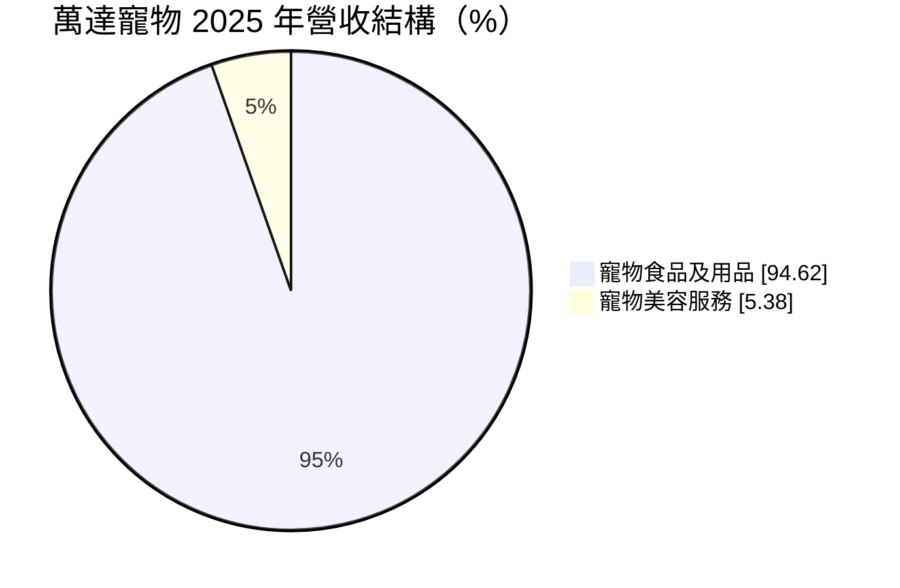
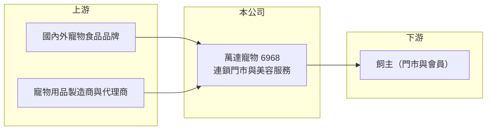

# 6968 萬達寵物

> 上櫃｜[[產業索引-居家生活|居家生活]]｜上市（櫃）日期 2024/08/14

# 第一章：企業模式與商業藍圖

> [!info] 撰寫說明
> 精簡版，由 Claude 依公開資料整理，架構比照 [[2330台積電]]，資料截至 2026-10-08。來源：MoneyDJ 理財網財務比率年表（2021 至 2025 年）與個股基本資料（2025 年營收比重）、櫃買中心公開資料彙整的 2026 年第二季財報與股利資料、工商時報與富果法說會備忘錄標題。公開資料有限，門市數與商品結構細節未逐條查證。#待校對

萬達寵物是台灣的寵物用品連鎖通路，以實體門市銷售寵物食品與用品，並提供寵物美容服務，2024 年 8 月上櫃。

- **核心業務：** 公司 2011 年成立，經營「萬達寵物」連鎖門市，販售飼料、零食、砂盆與生活用品，部分門市附設美容。寵物用品是高回購率的日常消耗品，飼主會固定回到同一家店補貨，因此這門生意的本質是靠門市密度與會員黏著度累積穩定客流的[[連鎖零售]]。
- **營收結構：** 依 MoneyDJ 資料，2025 年寵物食品及用品占 94.62%，寵物美容服務占 5.38%。商品銷售撐起營收規模，美容服務比重雖小，卻能把飼主定期帶進門市，順帶購買商品。

- **營運據點：** 總部位於台北市，門市分布在台灣各地，以租用街邊店面為主。門市租約依會計準則列為[[租賃負債]]，這是公司負債比率偏高的主要原因之一。
- **長期方向：** 台灣少子化與高齡化使寵物飼養數量持續增加，飼主也願意在食品、保健與服務上花更多錢，這股「毛小孩經濟」是萬達長期成長的基礎。公司策略是持續展店擴大規模，並提高自有品牌與服務的比重以改善獲利。

# 第二章：護城河深度與競爭優勢

萬達的優勢來自門市規模、採購議價與會員經營，但寵物用品同時面對電商與其他連鎖的價格競爭，護城河偏窄。

- **競爭優勢：** 門市數越多，向品牌商採購的量越大，進貨成本與物流效率就越好，這是連鎖通路典型的規模經濟。毛利率長期維持在 40% 以上，代表公司在商品組合與採購上具備一定的議價力。
- **主要對手：** 實體通路有東森寵物、寵物公園等連鎖，以及 [[5904寶雅]]、量販店的寵物專區；線上則有 [[8454富邦媒]]、蝦皮等電商。飼料這類標準品容易被線上比價，實體門市必須靠服務、即時取貨與專業諮詢留住客人。
- **觀察重點：** 營業利益率長期只有 3.5% 至 5.3%，高毛利大多被租金與人事費用吃掉。長期要看展店後的單店營收能否成長、[[同店銷售]]是否穩定，以及營業利益率能否隨規模擴大而提升。

# 第三章：財務體質與盈利規模

資料日期：2026-10-08，表格是撰寫當時的快照；最新月營收、毛利率、累計 EPS 由自動排程寫在本筆記的屬性欄位（月營收、毛利率、累計EPS 等）。#待校對

萬達近五年營收每年都成長，五年內約翻成兩倍，但營業利益率沒有同步改善。

| 年度 | 營收（億元） | [[毛利率]] | [[營業利益率]] | EPS（元） | [[ROE]] |
|---|---|---|---|---|---|
| 2021 | 約 15.4（推算） | 42.86% | 5.31% | 2.00 | 23.85% |
| 2022 | 約 20.6（推算） | 41.34% | 4.18% | 2.06 | 18.68% |
| 2023 | 約 26.0（推算） | 40.99% | 4.04% | 2.17 | 16.12% |
| 2024 | 約 29.4（推算） | 40.67% | 3.49% | 2.44 | 12.83% |
| 2025 | 約 32.8（推算） | 41.47% | 4.70% | 2.46 | 10.18% |

註：2025 年營收以每股營業額 64.95 元乘以約 5,044 萬股推算，其他年度依 MoneyDJ 營收成長率回推；上櫃前股本較小，早年 EPS 與 ROE 的比較基礎不同。

- **長期指標：** 2021 至 2025 年營收年複合成長率約 21%（推算），近 5 年平均 ROE 約 16.3%（推算），但 ROE 從 23.9% 逐年降到 10.2%，主要是上櫃增資讓股東權益擴大。最新一年度現金股利 1.5 元，約占 2025 年 EPS 的 61%。自由現金流資料本次未查得。
- **[[ROIC]] 與 [[WACC]]：** 2025 年稅後營業利益約 1.2 億元（營收約 32.8 億元 × 營業利益率 4.70% × 0.8），投入資本約 24.3 億元（2026 年第二季股東權益約 13.2 億元，加上以總負債約 22.1 億元的一半推估、含門市租賃負債的有息負債約 11.1 億元），ROIC 約 5.1%（推算）。WACC 約 4.5%（推算：無風險利率 1.75%、市場風險溢酬 6%、β 取民生零售同業常見值 0.8，股東權益成本 6.55%；稅前負債成本 2.5%、稅率 20%；權益比重約 54%）。ROIC 只略高於 WACC，代表快速展店目前帶來的是規模而非明顯的超額報酬，提升營業利益率是價值創造的關鍵。
- **財務特色：** 負債比率由 2021 年的 82% 降到 2025 年的 62%，每股淨值由 9.36 元升到 26.38 元，上櫃籌資明顯改善了財務結構。負債中有相當比重是門市租約形成的租賃負債，屬於營運必要的長期承諾，而不是一般銀行借款。

# 第四章：總體風險與地緣政治

萬達的風險在於零售業的競爭與成本結構，而不是需求本身。

- **產業週期：** 寵物食品屬於必需型消費，景氣衰退時需求下滑有限，週期性低於一般零售。真正的變數是寵物飼養數量的長期趨勢與飼主的消費升級速度。
- **營運風險：** 租金與基本工資逐年上漲，而營業利益率只有 4% 至 5%，成本每多 1 個百分點就會明顯侵蝕獲利。展店太快也可能出現新店虧損期拉長、店與店之間互相搶客的情況。
- **其他風險：** 進口寵物食品以美元、歐元或日圓計價，匯率波動會影響進貨成本；電商平台的低價促銷會持續壓抑標準品的售價；食品安全事件或品牌商改走直營，也會影響通路地位。

# 專有名詞解析

## 金融

- **[[租賃負債]]**：承租場地或設備依會計準則認列的未來租金現值負債。
- **[[ROIC]]**：投入資本報酬率，稅後營業利益除以股東權益加有息負債，衡量本業運用資本的效率。
- **[[WACC]]**：加權平均資金成本，股東與債權人要求報酬率的加權平均，是 ROIC 要超越的門檻。

## 產業

- **[[連鎖零售]]**：以統一品牌、集中採購與標準化營運開設多家門市的零售模式，靠規模經濟降低成本。
- **[[同店銷售]]**：只比較營業滿一定期間門市的營收變化，排除新開店的影響，用來判斷本業成長力。

# 核心供應鏈

- 上游：國內外寵物飼料、零食、保健品品牌與用品代理商（供應商名稱未查得）。
- 下游／客戶：台灣養狗、養貓的家庭飼主。
- 同業：東森寵物、寵物公園等寵物連鎖，[[5904寶雅]]、量販店寵物專區，以及 [[8454富邦媒]] 等電商平台。

## 最新新聞
<!-- news:start -->
<!-- news:end -->

## 相關連結
- [公開資訊觀測站](https://mopsov.twse.com.tw/mops/web/t05st03?step=1&firstin=1&co_id=6968)
- [Goodinfo](https://goodinfo.tw/tw/StockDetail.asp?STOCK_ID=6968)
- [Yahoo 股市](https://tw.stock.yahoo.com/quote/6968)
- [鉅亨網新聞](https://www.cnyes.com/twstock/6968/news)
