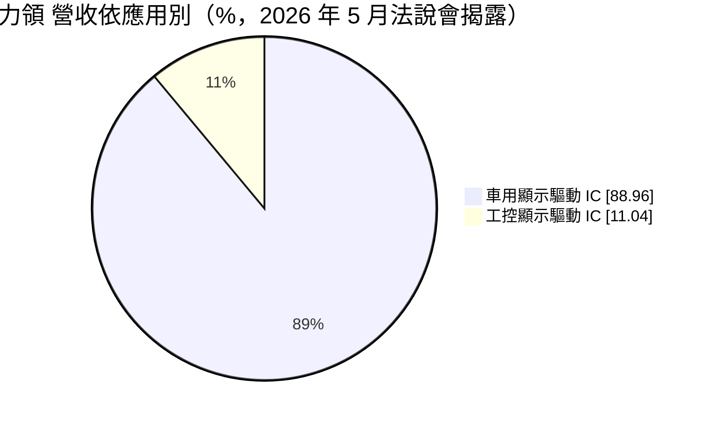
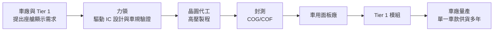
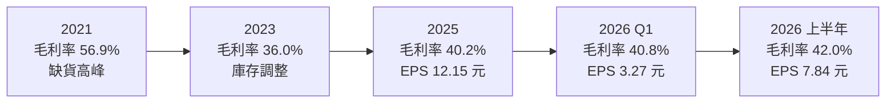
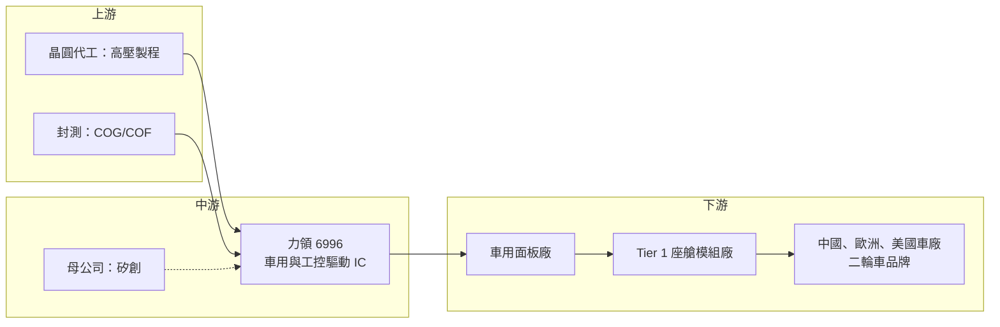

# 6996 力領科技

> 上櫃｜[[產業索引-半導體業|半導體業]]｜上市（櫃）日期 2024/12/10

# 第一章：企業模式與商業藍圖

> [!info] 撰寫說明
> 本文由 Claude 依公開資料整理，架構比照 [[2330台積電]] 的四章研究，資料截至 2026-10-08。財務數字來源：櫃買中心開放資料快照（基本資料、2026 年第二季資產負債與綜合損益）、Goodinfo 年度經營績效與股利政策、富果法說會備忘錄（2026 年 5 月）、聯合新聞網、工商時報；產業描述為整理性內容，尚未逐條比對原始文件。#待校對

在評估單一個股的長期投資價值時，首要步驟是拆解企業的底層獲利邏輯。本章針對力領科技（股票代號：6996，以下簡稱力領）的商業模式進行定性分析，說明一家規模不大的驅動 IC 設計公司，如何避開手機與電視的紅海，專注在車用中小尺寸顯示器建立利基。

## 一、核心定位：專攻車用顯示的驅動 IC 設計公司

力領成立於 2009 年，是驅動 IC 設計公司 [[8016矽創]] 集團旗下的子公司，依富果整理，矽創持股約 55.8%。2021 年力領合併矽創的車用部門，把集團的車用顯示研發集中到同一家公司，2024 年 12 月在櫃買中心上櫃。董事長為毛穎文。

力領是一家 [[Fabless]] 公司，產品是車用與工控面板所需的顯示驅動 IC（[[DDI]]）。和手機驅動 IC 相比，車用驅動 IC 的出貨量小得多，但有三個特點讓它成為好生意：第一，從設計導入到量產約需兩年，一旦被選用就很難被替換；第二，車用產品要通過 [[AEC-Q100]] 等可靠度測試，門檻高；第三，車款生命週期長，同一顆晶片可以賣好幾年。工商時報報導指出，力領自行設計類比與混合訊號電路，並與車用一階供應商（Tier 1）共同開發，累積台、美、日專利 52 項。

## 二、終端應用板塊：車用近九成

依富果整理的 2026 年 5 月法說會資料，力領營收的產品結構如下：

* **車用顯示驅動 IC：** 應用於儀表板、抬頭顯示器（[[HUD]]）、中控觸控螢幕、電子後視鏡、副駕駛與後座螢幕、三合一圓形旋鈕，以及二輪車儀表。力領的策略是：儀表板與中控這類主流規格以性價比競爭，HUD、圓形旋鈕、二輪車等利基規格則以自有規格建立差異化。聯合新聞網報導中，公司提到 HUD 的目標市占為 50%。
* **工控顯示驅動 IC：** 應用於工業設備、智慧家電與 AIoT 裝置，客戶較分散，但景氣敏感度高於車用。2025 年力領營收下滑，部分原因就是工控需求疲弱抵銷了車用成長。
* **客戶地區：** 依富果整理，客戶中中國車廠約占 50%、歐洲約 30%、美國約 20%。力領透過面板廠與 Tier 1 間接供應車廠，車廠名稱未公開。

## 三、資本轉化邏輯：小量多樣、長生命週期

力領的獲利模式是「前期投入、後期收割」。設計一顆車用驅動 IC 需要花費研發人力與兩年左右的驗證時間，這段期間幾乎沒有營收；一旦車款量產，晶片就會跟著車款賣上好幾年，期間不太需要再投入研發。這也是力領毛利率長期維持在四成上下的原因：它賣的不只是晶片，還有可靠度、供貨穩定與長期技術支援。公司在法說會中表示「競爭力不僅在於成本，更在於服務、產品穩定度與可靠性」。

由於不擁有晶圓廠，力領的資本需求主要是研發人力與流動資金。依 2026 年 5 月法說會資料，存貨天數約 100 天、應收帳款約 40 天、應付帳款約 70 天，存貨水位偏高，反映車用客戶要求長期穩定供貨，供應商需要備較多庫存。

## 四、企業長期藍圖

* **智慧座艙帶動的「螢幕數量成長」：** 一台車的螢幕從一塊儀表板，增加到中控、副駕、後座、HUD、電子後視鏡。富果引述 Omdia 預估，2026 年 HUD 出貨成長 21.1%、副駕螢幕 20.1%、電子後視鏡 15.0%。力領的長期成長主要來自每台車的驅動 IC 用量增加，而不是汽車總銷量。
* **車用 TDDI：** 中控觸控螢幕的 [[TDDI]] 已在售後市場開始出貨，前裝市場（車廠原廠配備）預計更晚才會發酵。若能打入前裝，將是力領下一個重要的產品世代。
* **二輪車與新興市場：** 電動機車與電動自行車的數位儀表替換是公司點名的長期市場，客戶包括出口東南亞與日本的中國品牌。

# 第二章：護城河深度與競爭優勢

本章分析力領在車用驅動 IC 市場的競爭地位，以及這些優勢能否抵擋更多新進者。

## 一、護城河的核心組成要素

* **車規驗證帶來的轉換成本：** 車用晶片從設計導入到量產約兩年，車廠換供應商就得重新驗證，因此量產中的車款很少更換驅動 IC。這是力領最重要的護城河，也是它能在規模不大的情況下維持四成毛利率的原因。
* **小尺寸、利基規格的專注：** 力領刻意避開手機、電視等大量但競爭激烈的市場，專攻 HUD、圓形旋鈕等需要客製化的小尺寸面板。這些市場對大型驅動 IC 廠來說量太小、不值得投入，反而成為力領的空間。
* **集團資源共享：** 力領與母公司矽創可共享工控與車用客戶資源，集團內的昇佳則主攻手機。這種分工讓力領不需要獨自承擔全部的客戶開發成本。

## 二、全球主要競爭對手格局

| 對手 | 定位 | 對力領的威脅 |
|---|---|---|
| [[3034聯詠]] | 大型驅動 IC 設計公司，車用為成長板塊 | 在中大尺寸中控與儀表板以規模與價格競爭 |
| 奇景光電（Himax） | 車用驅動 IC 與 TDDI 的主要供應商 | 在車用 TDDI 與中控螢幕直接競爭 |
| [[6962奕力-KY]]、[[4961天鈺]] | 台灣中小尺寸驅動 IC 廠，正擴展工控車載 | 以手機產品延伸進車用，可能壓低主流規格報價 |
| 中國驅動 IC 廠 | 受中國車廠在地化採購支持 | 中國車廠占力領客戶約一半，在地化是長期壓力 |

## 三、優勢轉化：哪些市場守得住、哪些守不住

* **守得住：** 已量產車款的長期供貨，以及 HUD、圓形旋鈕等利基規格。這些產品一旦導入，數年內的營收相對有保障，也是力領毛利率穩定的來源。
* **守不住：** 主流儀表板與中控螢幕的報價。公司自己也表示越來越多競爭者進入車用領域，主流規格的價格勢必下滑。
* **觀察重點：** 車用 TDDI 能否從售後市場打進前裝；中國車廠在地化採購是否加速；以及工控業務能否恢復成長。這三點決定力領的營收規模能否突破 2021 年的高點。

# 第三章：財務體質與盈利規模

資料日期：2026-10-08。數字取自櫃買中心開放資料、Goodinfo 年度經營績效與股利政策、富果法說會備忘錄，表格是撰寫當時的快照；最新月營收、毛利率、累計 EPS 由自動排程寫在本筆記的屬性欄位（月營收、毛利率、累計EPS 等）。#待校對

財務報表是檢驗護城河是否真實存在的最終標準。本章用多年度三率、ROE、現金流與資本報酬，檢視力領在車用驅動 IC 市場的獲利品質。

## 一、獲利能力的基石：三率

| 年度 | 營收（新台幣） | [[毛利率]] | [[營業利益率]] | EPS（元） | [[ROE]] |
|---|---|---|---|---|---|
| 2021 | 35.3 億 | 56.9% | 38.3% | 32.50 | 67.0% |
| 2022 | 28.1 億 | 41.1% | 24.8% | 18.20 | 35.5% |
| 2023 | 26.6 億 | 36.0% | 18.6% | 11.74 | 26.9% |
| 2024 | 29.7 億 | 40.3% | 21.7% | 15.37 | 26.8% |
| 2025 | 26.9 億 | 40.2% | 19.4% | 12.15 | 18.6% |
| 2026 上半年 | 15.8 億 | 42.0% | 22.2% | 7.84 | 未查得 |

註：2026 上半年取自櫃買中心開放資料，毛利率與營業利益率以其營業毛利、營業利益除以營收推算。

* **[[毛利率]]：** 除了 2021 年晶片缺貨的特殊年度，力領的毛利率穩定落在 36% 到 42% 之間。對驅動 IC 公司來說，這是相當穩定的水準，反映車用產品報價波動小。
* **[[營業利益率]]：** 長期約 19% 到 25%，研發費用率相對固定，營收成長時營業利益率會隨之上升。
* **長期指標：** 2021 至 2025 年營收年複合成長率約 -6.6%（推算），主要因為 2021 年基期偏高；近 5 年平均 ROE 約 35.0%（推算），扣除 2021 年後 2022 至 2025 年平均約 27%（推算）。

## 二、[[ROE]]：資本效率

力領 2026 年第二季底股東權益約 27.0 億元，負債總額僅約 7.6 億元，且幾乎都是流動負債，負債比約 22%。ROE 由 2021 年的 67% 降到 2025 年的 18.6%，一方面是獲利回落，另一方面是 2024 年上櫃後股本與資本公積增加，權益變大。這代表 ROE 的下降有一部分是「現金變多」造成的，而不完全是本業變差。

## 三、資本支出與自由現金流

* **[[CapEx]]：** IC 設計公司不需要廠房設備，資本支出主要是研發設備與光罩，金額相對營收很小（具體數字未查得）。
* **[[自由現金流]]：** 現金流主要受存貨與應收帳款影響。存貨天數約 100 天，若車用需求放緩，存貨可能積壓並拖累現金流。多年度自由現金流數字未查得，但從長期高配息推估，本業現金流大致足以支應股利。
* **股利：** 依 Goodinfo，2023、2024、2025 年度分別配發現金股利 10.32 元、12.65 元、10 元，對照當年 EPS 11.74 元、15.37 元、12.15 元，配發率約 80% 到 88%（推算）。這是高配息、少保留的資本配置習慣，和 IC 設計公司輕資產的特性一致。

## 四、[[ROIC]] 與 [[WACC]]：價值創造利差

* **ROIC（推算）：** 以 2025 年營業利益約 5.22 億元（營收 26.9 億 × 營業利益率 19.4%）× (1 − 20%) ≈ 4.17 億元作為稅後營業利益；投入資本以 2026 年第二季股東權益 27.0 億元加非流動負債 0.18 億元（作為有息負債的上限近似）≈ 27.2 億元。ROIC ≈ 15.3%。若以 2026 年上半年營業利益 3.52 億元年化計算，ROIC 約 20.7%。由於權益中含有大量現金，扣除現金後的營運 ROIC 會更高。
* **WACC（推算）：** 無風險利率取約 1.75%，市場風險溢酬 6%，β 取 IC 設計同業常見值 1.1（未查得力領本身的 β），股東權益成本約 1.75% + 1.1 × 6% ≈ 8.4%。力領幾乎沒有有息負債，WACC 約 8.4%。
* **解讀：** ROIC 約 15% 到 21%，明顯高於約 8.4% 的 WACC，代表力領長期是在創造價值。這個利差來自車用產品的高轉換成本與穩定毛利率，只要車規護城河不被打破，這種價值創造能力可以延續。

# 第四章：總體風險與地緣政治

任何企業都無法脫離宏觀環境獨立存在。本章分析力領長期必須面對的地緣政治、產業週期與營運風險。

## 一、地緣政治

* **中國車廠占比約一半：** 中國車廠是力領最大的客戶群，中國推動汽車晶片國產化，可能讓中國車廠優先採用本土驅動 IC。這是力領最需要長期追蹤的結構性風險。
* **貿易壁壘與關稅：** 中國車廠電動車出口到歐美面臨關稅，若影響中國車廠的出口量，也會間接影響力領的出貨。

## 二、產業週期與市場結構

* **汽車景氣：** 車用驅動 IC 的需求最終取決於新車銷售，但力領的成長更依賴每台車螢幕數量增加，因此受汽車總銷量影響較小。
* **工控需求波動：** 工控板塊景氣敏感度高，2025 年工控疲弱就曾抵銷車用成長，使營收出現下滑。
* **[[長鞭效應]]：** 2021 年車用晶片缺貨時，客戶超額下單，隨後兩年進入庫存去化，力領營收從 35.3 億元降到 26.6 億元，就是典型的長鞭效應。

## 三、營運環境的隱性風險

* **母公司關係與關係人交易：** 矽創持股約 55.8%，力領與矽創集團共享客戶資源，好處是降低開發成本，但也意味著集團內部的業務劃分會影響力領的成長空間。
* **規模偏小：** 年營收約 30 億元的規模，研發資源有限，若車用驅動 IC 走向更先進製程或需要整合更多功能，研發與光罩成本將拉高。
* **存貨水位：** 存貨天數約 100 天，景氣反轉時存在跌價風險。

## 四、科技或法規演進

車用顯示正朝更大尺寸、更高解析度、OLED 與 Mini LED 等方向發展，驅動 IC 的規格也跟著升級。若主流車用面板改採 OLED 或整合觸控的 TDDI，力領必須及時推出對應產品，否則可能失去下一個車款世代。另一方面，車用功能安全標準（如獨立備援控制電路 OSD）越來越嚴格，雖然提高門檻有利既有供應商，但也要求持續投入驗證成本。

# 專有名詞解析

## 半導體

- **[[DDI]]**：顯示驅動 IC，負責控制面板每個像素的電壓，需要高壓製程，聯詠、奇景為主要設計公司。
- **[[TDDI]]**：觸控與顯示驅動整合晶片，把觸控 IC 與驅動 IC 做成一顆，可降低手機面板成本與厚度。
- **[[Fabless]]**：無晶圓廠的 IC 設計公司，只負責設計，製造交給晶圓代工廠。

## 應用

- **[[HUD]]**：抬頭顯示器，把車速、導航等資訊投影在擋風玻璃上，讓駕駛不必低頭看儀表。
- **[[智慧座艙]]**：整合儀表、中控、娛樂與語音互動的車內電子系統，帶動每台車的螢幕與晶片用量增加。
- **[[AEC-Q100]]**：汽車電子協會制定的車用 IC 可靠度測試標準，是晶片進入車用市場的基本門檻。
- **[[車規驗證]]**：車用晶片須通過 AEC-Q100 等可靠度測試與車廠認證，流程常需 2 至 3 年，因此轉換成本高。
- **[[前裝與後裝]]**：前裝指車廠出廠時即配備的零件，後裝指車主購車後另外加裝的售後市場產品。

## 金融

- **[[長鞭效應]]**：終端需求的小幅變動，沿供應鏈往上游傳遞時被逐級放大，造成上游庫存與訂單劇烈波動。
- **[[ROIC]]**：投入資本報酬率，衡量公司每投入一元營運資本能產生多少稅後營業利益。
- **[[WACC]]**：加權平均資金成本，股東與債權人要求報酬的加權平均，是 ROIC 要超越的門檻。

## 產業

- **[[Tier 1]]**：一階供應商，直接供貨給車廠的系統模組廠，例如儀表板或座艙模組製造商。

# 核心供應鏈

## 1. 上游：晶圓代工與封測
- 晶圓代工：驅動 IC 使用高壓製程，具體代工廠名稱未查得
- 封測：驅動 IC 常見的金凸塊與 COG/COF 封裝廠（具體合作對象未查得）

## 2. 中游：力領本身與集團
- 母公司：[[8016矽創]]（持股約 55.8%）

## 3. 下游：面板廠、Tier 1 與車廠
- 車用面板廠與 Tier 1 座艙模組廠（具體名稱未查得）
- 終端：中國車廠約 50%、歐洲約 30%、美國約 20%，以及出口東南亞與日本的二輪車品牌

## 4. 同業
- [[3034聯詠]]、奇景光電、[[6962奕力-KY]]、[[4961天鈺]]

## 最新新聞
<!-- news:start -->
<!-- news:end -->

## 相關連結
- [公開資訊觀測站](https://mopsov.twse.com.tw/mops/web/t05st03?step=1&firstin=1&co_id=6996)
- [Goodinfo](https://goodinfo.tw/tw/StockDetail.asp?STOCK_ID=6996)
- [Yahoo 股市](https://tw.stock.yahoo.com/quote/6996)
- [鉅亨網新聞](https://www.cnyes.com/twstock/6996/news)
