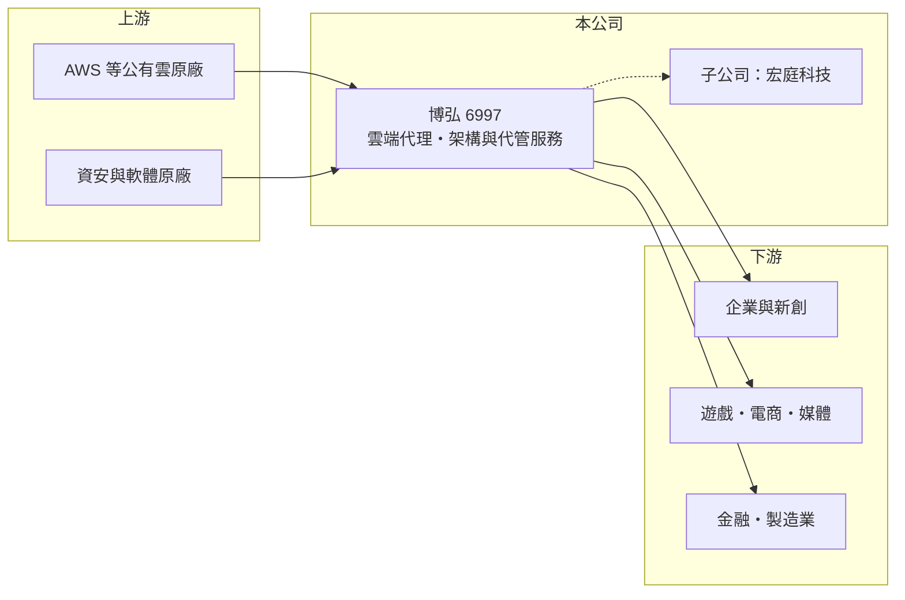

# 6997 博弘

> 上櫃｜[[產業索引-數位雲端|數位雲端]]｜上市（櫃）日期 2024/12/16

# 第一章：企業模式與商業藍圖

> [!info] 撰寫說明
> 精簡版，由 Claude 依公開資料整理，架構比照 [[2330台積電]]，資料截至 2026-10-08。來源：櫃買中心開放資料（基本資料、2026 年上半年綜合損益與資產負債、每月營收、本益比殖利率）、Goodinfo 年度經營績效（2020 至 2025 年）、旺得富 2026 年 2 月財報報導（2025 年稅後純益約 1.13 億元）、iThome 與工商時報報導標題。原廠別與業務別營收比重未查得，公開資料有限。#待校對

博弘雲端成立於 2006 年，是台灣主要的[[公有雲]]代理與[[雲端代管服務商]]之一，替企業採購、建置與維運 AWS 等雲端服務，重要子公司為宏庭科技，2024 年 12 月上櫃。

- **核心業務：** 博弘的商業模式是「轉售雲端用量加上技術服務」。企業透過博弘購買雲端資源，博弘再提供架構設計、搬遷上雲、帳務整合、資安與 24 小時維運。轉售部分營收大、毛利薄，技術服務與自有工具才是利潤來源，這也是整體毛利率長期只有 8% 至 12% 的原因。
- **營收結構：** 本次查得的來源沒有公布原廠別或服務別比重。依搜尋結果，博弘以 [[AMZN亞馬遜]] 的 AWS 合作為主軸，子公司宏庭科技則經營另一條雲端原廠的業務（原廠別待校對）。營收規模從 2020 年的 20.7 億元擴大到 2025 年的 44.5 億元，主要來自客戶雲端用量的增加。
- **營運據點：** 總部位於台北市中山區，客戶涵蓋國內企業、遊戲、電商與新創等用雲量大的產業（產業比重未查得）。雲端費用以美元計價，博弘的營收與成本多數同幣別，匯率主要影響換算後的營收規模。
- **長期方向：** 長期方向是從單純轉售走向高附加價值服務，例如雲端成本最佳化（[[FinOps]]）、資安代管、資料平台與生成式 AI 導入。AI 應用需要大量 GPU 雲端資源與資料整理，對代管服務商是新的需求來源，但也伴隨人力與技術投入。

# 第二章：護城河深度與競爭優勢

博弘的護城河來自原廠的高階合作夥伴資格與客戶的轉換成本，但轉售業務本身同質性高，屬窄護城河。

- **競爭優勢：** 雲端原廠會依合作夥伴的認證人數、銷售量與服務能力分級，等級越高拿到的折扣、回饋與商機越多，形成「越大越有利」的規模效應。客戶的系統一旦由博弘架設與維運，帳務、權限與監控都綁在一起，更換服務商需要重新盤點與移轉，轉換成本不低。
- **主要對手：** 國內同業包括 [[6689伊雲谷]]、[[7747昕奇雲端]]、[[6214精誠]] 旗下雲端團隊，以及各大電信業者的雲端服務；國際上則有 Accenture、各大雲端原廠的直接銷售團隊。原廠若對大型客戶直接簽約，代理商只剩服務收入。
- **觀察重點：** 長期要看毛利率能否穩定在一成以上，代表技術服務與自有產品的比重有提升；也要看大型客戶的集中度，以及原廠回饋制度的變化，因為原廠政策往往直接決定代理商的利潤空間。

# 第三章：財務體質與盈利規模

資料日期：2026-10-08，表格是撰寫當時的快照；最新月營收、毛利率、累計 EPS 由自動排程寫在本筆記的屬性欄位（月營收、毛利率、累計EPS 等）。#待校對

博弘的財務特徵是「高營收、低毛利、高周轉」，ROE 曾經很高，但上櫃後股本擴大、2026 年上半年轉為虧損。

| 年度 | 營收（億元） | [[毛利率]] | [[營業利益率]] | EPS（元） | [[ROE]] |
|---|---|---|---|---|---|
| 2021 | 35.1 | 9.11% | 2.67% | 3.78 | 44.8% |
| 2022 | 50.6 | 7.67% | 1.87% | 3.80 | 30.9% |
| 2023 | 47.5 | 8.88% | 2.41% | 4.60 | 32.0% |
| 2024 | 40.0 | 12.3% | 3.88% | 6.11 | 25.5% |
| 2025 | 44.5 | 9.99% | 3.15% | 5.11 | 18.0% |
| 2026 上半年 | 27.0 | 8.66% | -1.21% | -0.86 | 未查得 |

註：2021 至 2025 年取自 Goodinfo，2026 年上半年取自櫃買中心開放資料（營業毛利 2.34 億元、營業損失 0.33 億元、稅後淨損 0.19 億元）。上半年虧損的原因本次未查得。

- **長期指標：** 2020 至 2025 年營收年複合成長率約 17%（推算），2021 至 2025 年平均 ROE 約 30%（推算），但 ROE 逐年下滑，反映上櫃增資後權益擴大與毛利率波動。最近一次現金股利每股 4.6 元，以 2025 年 EPS 5.11 元計算配息率約 90%。2026 年 1 至 8 月累計營收年增約 30%，營收成長但上半年本業虧損，代表新增營收的利潤很薄或費用先行投入。
- **[[ROIC]] 與 [[WACC]]：** 2025 年營業利益約 1.40 億元（44.5 億元 × 3.15%），稅後營業利益約 1.12 億元；投入資本約 6.1 億元（2026 年 6 月底股東權益 5.06 億元，加上有息負債推估約 1 億元，流動負債 16.8 億元多為應付原廠款項），ROIC 約 18%（推算）。WACC 約 7.4%（推算：無風險利率 1.75%、市場風險溢酬 6%、β 取資訊服務同業常見值 1.0，權益成本 7.75%；負債成本 2.5%、稅率 20%、負債比重約 15%）。2025 年 ROIC 明顯高於 WACC，但 2026 年上半年營業虧損，若持續將使利差轉負，這是判斷模式是否仍創造價值的關鍵。
- **財務特色：** 2026 年 6 月底總資產 23.2 億元、負債 18.1 億元，負債比率約 78%，主要是應付原廠的帳款，屬營運性負債而非借款（推估）。這種模式先向客戶收款、再付款給原廠，現金周轉快，但淨值薄，對單一原廠的付款條件很敏感。

# 第四章：總體風險與地緣政治

博弘的風險集中在原廠政策、低毛利結構與客戶用量的波動。

- **產業週期：** 企業上雲是長期趨勢，但雲端用量會隨客戶景氣調整，遊戲、電商等客戶在景氣轉弱時常大幅縮減用量。2022 至 2023 年的營收起伏就顯示這種用量型營收並不穩定。
- **營運風險：** 獲利高度依賴原廠的折扣與回饋制度，原廠只要調整分級門檻或回饋比率，代理商毛利率就會明顯變動；毛利只有一成上下，一旦費用增加或出現壞帳，就容易轉為虧損，2026 年上半年即是例子。
- **其他風險：** 雲端費用以美元計價，匯率會影響營收與應付帳款；資安事件若發生在代管的客戶環境，可能帶來責任與商譽風險；AI 與資安人才競爭激烈，人力成本持續上升。

# 專有名詞解析

## 應用

- **[[公有雲]]**：由雲端業者建置、多家企業共用並按用量付費的運算與儲存服務，例如 AWS、Azure、GCP。
- **[[雲端代管服務商]]**：替企業轉售雲端資源並負責架構設計、搬遷、帳務與維運的服務商，英文常稱 MSP。
- **[[FinOps]]**：雲端財務營運，持續監控與調整雲端用量與計價方案，讓企業的雲端支出最有效率。

## 金融

- **[[ROIC]]**：投入資本報酬率，稅後營業利益除以股東權益加有息負債，衡量本業運用資本的效率。
- **[[WACC]]**：加權平均資金成本，股東與債權人要求報酬率的加權平均，是 ROIC 要超越的門檻。

## 產業

- **[[代理商]]**：取得原廠授權在特定市場銷售產品或服務的業者，利潤來自價差、回饋與加值服務。

# 核心供應鏈

- 上游：[[AMZN亞馬遜]] AWS 等公有雲原廠，以及資安、監控軟體原廠（實際原廠組合以公司揭露為準）。
- 下游／客戶：用雲量大的國內企業、遊戲、電商、媒體與新創公司（客戶名單未查得）。
- 同業：[[6689伊雲谷]]、[[7747昕奇雲端]]、[[6214精誠]]，以及雲端原廠的直接銷售團隊。

## 最新新聞
<!-- news:start -->
<!-- news:end -->

## 相關連結
- [公開資訊觀測站](https://mopsov.twse.com.tw/mops/web/t05st03?step=1&firstin=1&co_id=6997)
- [Goodinfo](https://goodinfo.tw/tw/StockDetail.asp?STOCK_ID=6997)
- [Yahoo 股市](https://tw.stock.yahoo.com/quote/6997)
- [鉅亨網新聞](https://www.cnyes.com/twstock/6997/news)
